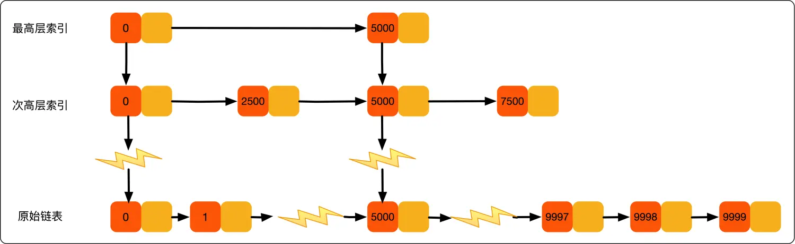
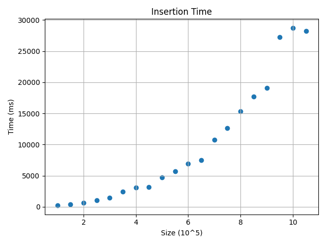
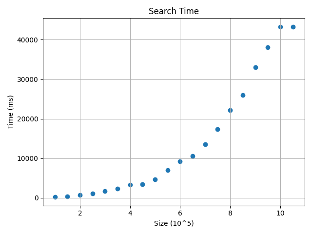
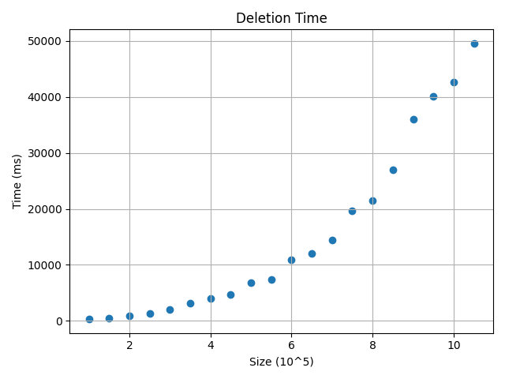
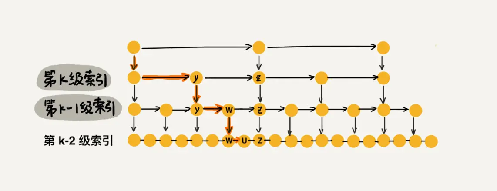

# Project 7: Skip List

[TOC]

---

## Chapter 1: Introduction

Skip list is a data structure that supports both searching and insertion in $O(\log N)$ expected time.

Thinking of the linked-list we have learnt in Fundamental Data Structure, the data structure supports searching, insertion and deletion in only $O(N)$ expected time because it does not support random access and must linearly scan each elements from the head to the tail to find the hit element.

Basic linked-list is too slow for big amount of data, so how to accelerate? The Skip List is here. Let's see.

---

## Chapter 2: Data Structure Specification

> All the cases illustrated below are in ascending order.

### 2.1 Background

We all know that if there exists a in-order sequence to be checked, binary search will be at $O(\log N)$ expected time, better than linear scan which costs $O(\log N)$ expected time.

The binary search uses binary search tree to search the target element. Starting from the root, if the target is less than the root, go left; otherwise, go right. And the next level we do the same, all the way to the leaf nodes.

```cpp
Procedure: BinarySearch(A, n, x)
    low = 0
    high = n - 1
    while low <= high:
        mid = (low + high) / 2
        if A[mid] == x:
            return mid
        else if A[mid] < x:
            low = mid + 1
        else:
            high = mid - 1
    return -1
```

**The non-leaf nodes act as an index**, which helps to decide your target value is either in the left or in the right bounds.

By constructing indices, the searching time will be reduced to $O(\log N)$.

That's how the SkipList comes.

### 2.2 Basic Idea

```plaintext
Node 0 -> Node 1 -> Node 2 -> Node 3 -> Node 4 -> ... -> Node n
```

The linked-list only supports linear scan and has no index, so how about we build some indices over linked-list to accelerate the access?

```plaintext
[1] Node 0      ->      Node 2     ->       Node 4 -> ...
     |                   |                   |
[0] Node 0 -> Node 1 -> Node 2 -> Node 3 -> Node 4 -> ... -> Node n
```

From above we roughly build a one-level index for the linked-list, and they can be used to accelerate the accessing time.

For searching, we start from the top index, `level[1]` and start search in this level.

* If the next element is smaller than this one, we move to the next;
* If the next element is larger than this one, move to the lower level and search;
* If the next element is equal to this one, find the element.

For example, if we want search `Node 5`:

1. `level[1], Node 0`, keep moving;
2. `level[1], Node 2`, keep moving;
3. `level[1], Node 4`, the next is `Node 6`, larger, so move to next level;
4. `level[0], Node 4`, the next is `Node 5`, find the target.

So the trace is `0 -> 2 -> 4 -> 5`, better than linear scan.

### 2.3 Advancing

From [Basic Idea](#22-basic-idea) we know how to build index on linked-list and accelerate the accessing efficiency.

The number of nodes above is not large, and the index level is only 1, so there seems not much difference. However, we can build the advancing version by adding up the level count.

```plaintext
[m] Node 0      ->          ...          -> Node t
               ...
[2] Node 0               ->                 Node 4     -> ...
     |                                       |
[1] Node 0      ->      Node 2     ->       Node 4 -> ...
     |                   |                   |
[0] Node 0 -> Node 1 -> Node 2 -> Node 3 -> Node 4 -> ... -> Node n
```



By doing so, we start search from the top level and step by step moving down, so much of the element in the list can be **Skiped** and only a few will be directly accessed, so the expected time will be reduced.

The skip list now comes to a prototype.

#### 2.3.1 Skip List Data Structure

Here is the data structure of the skip list.

It is very similar to simple linked-list, but a little different.

```cpp
struct LinkedListNode {
    ValueType value;
    LinkedListNode* next;
};
```

Thinking about the multiple level of indices, it will be included in the definition of the skip list node.

```cpp
struct SkipListNode {
    ValueType value;
    int level;
    SkipListNode** next;
};
```

That's how it works.

#### 2.3.2 Search Algorithm Pseudocode

Searching algorithm can be easily implemented from above, and the searching is the most important because other operation like `insert` and `delete`, they all need to first locate the target and then do their own operations.

```cpp
Procedure: SkipList_Search(target)
    for (i from top to 1):
        while (node.next != NULL and node.next.value < target):
            node = node.next
        if node.next == target return node.next
    return not found
```

#### 2.3.3 Insertion Algorithm Pseudocode

```cpp
Procedure: SkipList_Insert(target)
    locate = SkipList_Search(target)
    for (each level):
        insert_in_each_level(target, level)
    return
```

#### 2.3.4 Deletion Algorithm Pseudocode

```cpp
Procedure: SKipList_Delete(target)
    if (not SkipList_Insert(target)):
        return false;
    for (each level):
        delete_in_each_level(target)
    return true
```

---

## Chapter 3: Testing Results

We implemented 2 testing suites in folder `test`, the first is `SkipList_Test1.cpp`, which will test the validation of the skip list we implemented; the second is `SkipList_Test2.cpp`, which will test the performance.

> Details of testing suites can be seen in [Appendix](#skiplist_test1cpp)

### Validation Test

In this test suite, we use small amount of data to test if the skip list we implemented works correctly.

All data is generated using standard library `<random>` in random, and the test result is in `out.SkipList_Test1_output.log` file.

We use collector `std::map` to check if the insertion is correct, and search is correct, and deletion is correct.

Since this test suite is for validation, there won't be any time graph and tables. You can check the validation output in [SkipList_Test1_output](#skiplist_test1_outputlog)

### Performance Test

After validating the correctness, we can test the performance now.

In this test suite we use $10^6$ level random data to test the `insertion`, `searching` and `deletion` performance.

The testing result can be seen in [SKipList_Test2_output](#skiplist_test2_outputcsv)

We tested 20 cases, with amount of random data ranges from 100000 to 900000, and the time table is here:

|size|insertion_time|search_time|deletion_time|
| :---: | :---: | :---: | :---: |
|100000|222|212|300|
|150000|438|406|513|
|200000|691|742|945|
|250000|1028|1051|1338|
|300000|1490|1674|2003|
|350000|2419|2389|3186|
|400000|3094|3337|3955|
|450000|3158|3478|4721|
|500000|4727|4674|6769|
|550000|5707|7034|7413|
|600000|6941|9194|10898|
|650000|7514|10541|12032|
|700000|10739|13608|14375|
|750000|12629|17348|19698|
|800000|15357|22230|21453|
|850000|17711|26041|26982|
|900000|19119|32964|35945|
|950000|27285|38054|40077|
|1000000|28743|43270|42595|
|1050000|28218|43258|49569|

The plotting graph:







All the 3 graphs are plotted using [plot.py](#plotpy)

---

## Chapter 4: Analysis and Comments

### 4.1 Complexity and Proof

#### 4.1.1 Time Complexity

From above we build a skip list. In the list, we build one index every 2 nodes in each level.

If the bottom level, the original linked-list, has $N$ nodes, then the `level[1]` has $\dfrac{N}{2}$ nodes, then the `level[2]` has $\dfrac{N}{4}$ nodes, then ... And the top level has 2 nodes.

For `level[i]`, it has $\dfrac{N}{2^i}$ nodes.

The height of levels `top` is: $\log_2{N}$

1. Start searching from the top, we will skip half of the nodes;
2. In the next level, we will skip half of the remaining nodes;
3. Keep moving down...
4. If we hit the target in some level, then the search is completed;
5. Moving at the bottom, `level[0]`, find the target or the target is not in the skip list.

The time complexity will be:

$$\text{The height of the level}\times\text{Number of nodes in each level}$$

Thinking about find target `x`, whose value is larger than `y` but less than `z`

In `level[k]`, it finds that the next to `y`, `z`, is larger, so it moves to the next level, `level[k-1]`, and then the next is `w` and less than `x`, so move to the next;

But the next is `z`, larger than `x`, so moves to the next level;

In next level, it find `u` and the next is `z`, so the searching is halted, and totally 4 elements are accessed, `y` and `w` and `u` and `z`.

Actually in each level, the average element to access is the same.



So the complexity will be $\text{top}\times4$, which is $O(4\log_2N)$, so the time complexity is $O(\log N)$

So now the accessing is very close to binary search.

#### 4.1.2 Space Complexity

The skip list is *using space to change for time*.

Apperantly building indices in each level costs more space. From above we know `level[i]` has $\dfrac{N}{2^i}$ nodes.

So the space complexity will be

$$\sum_{i=1}^\text{top}\frac{N}{2^i}=\frac{N^2}{2(N-1)}=O(N)$$

### 4.2 Random Level

The cases we mentioned above is an ideal case, that is, we build 1 index every 2 nodes in each level.

However, in implemention, we use **Random Level** strategy to build the index to fit the binary case.

```cpp
int randomLevel()
{
    int level = 1;
    while (rand() % 2 && level < MAXLEVEL) {
        level++;
    }
    return level - 1;
}
```

By the above algorithm, we can make sure that the possibility will be cut to half if adding up the level count.

So when inserting a new node, its level count will be generated by the above function.

* `level=1`: $50\%$
* `level=2`: $25\%$
* `level=3`: $12.5\%$
* `level=4`: $6.25\%$
* ...

By doing so, we will make sure that the search will be binary-like.

## 4.3 Improvement and Comments

There still exists some defects that can be better, for example, the memory is not optimized, and out code may be not well written, and because the list uses pointers to connect each other, maybe some pointers are not well organized.

Anyway, it can be better, and we have learnt a lot in this project:

1. A brand new data structure with higher efficiency
2. Comparision between different algorithm(binary search and skip-list)
3. how to write better codes
4. team collaboration

And it is really worthy.

---

## Appendix: Source Code

ℹ️ We use c++ to implement the Skip List and after fully consideration, we upgrade it to Version 2.0 and convert it to a template.

### SkipList.hpp

```cpp
/**
 * @file SkipList.hpp
 * @author lqy
 * @brief SkipList template implementation
 * @version 2.0
 * @date 2024-06-15
 * @note Updated version of SkipList.h.
 */
#ifndef _SKIPLIST_HPP
#define _SKIPLIST_HPP

/* Include */
#include <iostream>
#include <stdlib.h>

/* Macro definition */
#define MAXLEVEL 10 // Maximum level of the skip list.

/* Class definition */

/**
 * @brief Node class of the SkipList.
 */
template <typename T>
class Node {
private:
    T value; // The value of the node.
    int maxNodeLevel; // The maximum level of the node.
    Node<T>** next; // Next nodes in each level.
public:
    Node(): maxNodeLevel(0) {
        next = new Node<T>*[MAXLEVEL];
        for (int i = 0; i < MAXLEVEL; i++) {
            next[i] = nullptr;
        }
    }

    Node(const Node<T>& other) = default;

    Node<T>& operator=(const Node<T>& other) = default;

    ~Node() { delete [] next; }

    /**
     * @brief Get the value of the node.
     * @return The value of the node.
     */
    T getValue() const { return value; }

    /**
     * @brief Get the maximum level of the node.
     * @return The maximum level of the node.
     */
    int getLevel() const { return maxNodeLevel; }

    /**
     * @brief Get the next node in the specified level.
     * @param level The level of the next node.
     * @return The next node in the specified level.
     */
    Node<T>* getNext(int level = 0) const { return next[level]; }

    /**
     * @brief Set the value of the node.
     * @param value The new value of the node.
     */
    void setValue(T value) { this->value = value; }

    /**
     * @brief Set the value of the node.
     * @param value The new value of the node.
     */
    void setLevel(int level) { maxNodeLevel = level; }

    /**
     * @brief Set the index of the node in the SkipList.
     * @param index The new index of the node in the SkipList.
     */
    void setNext(int level, Node<T>* nextNode) { next[level] = nextNode; }

};

/**
 * @brief SkipList class.
 * @note The skip-list is in ascending order.
 */
template <typename T>
class SkipList {
public:
    /**
     * @brief Constructor of the SkipList.
     */
    SkipList();

    /**
     * @brief Destructor of the SkipList.
     */
    ~SkipList();

    /**
     * @brief Find the index of the node with the given value.
     * @param value The value of the node to be found.
     * @return If the node is found, return the the node; otherwise, return nullptr.
     */
    Node<T>* find(T value);

    /**
     * @brief Insert a new node with the given value.
     * @param value The value of the new node.
     */
    void insert(T value);

    /**
     * @brief Remove the node with the given value.
     * @param value The value of the node to be removed.
     * @return If the node exists, return true; otherwise, return false.
     */
    bool remove(T value);

    /**
     * @brief Print the SkipList.
     */
    void print();

    /**
     * @brief Get the number of nodes in the SkipList.
     * @return The number of nodes in the SkipList.
     */
    int getSize() const { return size; }

    /**
     * @brief Clear the SkipList.
     */
    void clear();

    /**
     * @brief Get the head node of the SkipList.
     * @return The head node of the SkipList.
     */
    Node<T>* getHead() { return head; }

private:
    int size; // The number of nodes in the SkipList.
    Node<T>* head; // The 1st node of the SkipList.

    /* Private utility methods */

    /**
     * @brief Search the index of the node with the given value.
     * @param value The value of the node to be found.
     * @param level The level of the node to be found.
     * @return Return the last node with its value less than the given value.
     * @note The next node of the returned node has equal value, greater value or is nullptr.
     */
    Node<T>* searchIndex(T value, int level = 0);

    /**
     * @brief Randomly generate a level for the new node.
     * @return A randomly generated level for the new node.
     */
    int randomLevel();

    /**
     * @brief Insert a new node at given level.
     * @param newnode The new node to be inserted.
     * @param level The level of the new node.
     */
    void insertNode(Node<T>* node, int level);

    /**
     * @brief Remove the node at given level.
     * @param node The node to be removed.
     * @param level The level of the node to be removed.
     * @return The node previously next to the removed node.
     */
    Node<T>* removeNode(Node<T>* node, int level);

};

/* Implementation */

template <typename T>
SkipList<T>::SkipList(): size(0), head(nullptr) {}

template <typename T>
SkipList<T>::~SkipList() { delete head; }

template <typename T>
Node<T>* SkipList<T>::searchIndex(T value, int level)
{
    // Boundary cases.
    if (!head) return nullptr; // Empty list.
    if (value < head->getValue()) return nullptr; // Value smaller than the head.
    // Value equal to the head.
    if (value == head->getValue()) {
        Node<T>* prev = new Node<T>();
        prev->setNext(level, head);
        prev->setLevel(head->getLevel());
        return prev;
    }

    // Search in each level from the highest to the lowest.
    int currentLevel = head->getLevel();
    int l = currentLevel;
    Node<T>* current = head;
    for (; l >= level; l--) {
        Node<T>* next = current->getNext(l);
        while (next != nullptr && next->getValue() < value) {
            current = next;
            next = next->getNext(l);
        }
    }

    return current; // The next node will be the node with the value, or the position to insert.
}

template <typename T>
Node<T>* SkipList<T>::find(T value)
{
    Node<T>* node = searchIndex(value);
    if (!node) return nullptr; // Empty list.
    node = node->getNext(0);
    if (!node) return nullptr; // Value not found.
    return node->getValue() == value ? node : nullptr; // If not found, return an empty node.
}

template <typename T>
int SkipList<T>::randomLevel()
{
    int level = 1;
    while (rand() % 2 && level < MAXLEVEL) {
        level++;
    }
    return level - 1;
}

template <typename T>
void SkipList<T>::insertNode(Node<T>* node, int level)
{
    // Find the index of the value to insert.
    Node<T>* target = searchIndex(node->getValue(), level);
    // Insert the new node.
    if (target) {
        Node<T>* next = target->getNext(level);
        target->setNext(level, node);
        node->setNext(level, next);
    } else {
        // Insert at the head.
        node->setNext(level, head);
    }
    return ;
}

template <typename T>
void SkipList<T>::insert(T value)
{
    // Check if the value already exists.
    // if (find(value)) return false;

    // Create a new node to insert.
    Node<T>* newNode = new Node<T>();
    newNode->setValue(value);

    // Case1: Insert into the empty list.
    if (!head) {
        newNode->setNext(0, nullptr);
        newNode->setLevel(0);
        head = newNode;
        size++;
        return ;
    }

    // Random level for the new node.
    int level = randomLevel();

    // Case2: Insert into the head.
    if (value <= head->getValue()) {
        level = std::max(level, head->getLevel()); // Update the level if necessary.
        for (int i = 0; i <= head->getLevel(); i++) {
            newNode->setNext(i, head);
        }
        for (int i = head->getLevel() + 1; i <= level; i++) {
            newNode->setNext(i, nullptr);
        }
        newNode->setLevel(level);
        head = newNode;
        size++;
        return ;
    }

    // Case3: Insert into the middle or tail.
    newNode->setLevel(level);
    // Update the head's level if necessary.
    if (level > head->getLevel()) {
        for (int i = head->getLevel() + 1; i <= level; i++) {
            head->setNext(i, nullptr);
        }
        head->setLevel(level);
    }
    // Insert the new node and update each level.
    for (int i = 0; i <= level; i++) {
        insertNode(newNode, i);
    }
    size++;
    return ;
}

template <typename T>
Node<T>* SkipList<T>::removeNode(Node<T>* node, int level)
{
    // Find the previous node to the node to remove.
    Node<T>* prev = searchIndex(node->getValue(), level);
    // Remove the node.
    Node<T>* next = node->getNext(level);
    prev->setNext(level, next);
    node->setNext(level, nullptr);
    return prev;
}

template <typename T>
bool SkipList<T>::remove(T value)
{
    // Find the node to remove.
    Node<T>* prev = searchIndex(value);
    if (!prev) return false; // Empty list OR value smaller than the head.
    Node<T>* target = prev->getNext(0); // Move to the target node.
    if (!target || target->getValue() != value) return false; // Value not found.

    // Remove the head.
    if (value == head->getValue()) {
        Node<T>* newHead = head->getNext(0);
        for (int i = 0; i <= newHead->getLevel(); i++) head->setNext(i, nullptr);
        for (int i = newHead->getLevel() + 1; i <= head->getLevel(); i++) {
            newHead->setNext(i, head->getNext(i));
            head->setNext(i, nullptr);
        }
        newHead->setLevel(head->getLevel());
        head = newHead;
        size--;
        delete target;
        return true;
    }

    // Remove the node and update each level.
    for (int i = target->getLevel(); i >= 0; i--) {
        removeNode(target, i);
    }
    delete target;
    size--;
    return true;
}

template <typename T>
void SkipList<T>::print()
{
    if (!head) {
        std::cout << "Empty list." << std::endl;
        return ;
    }
    for (int i = head->getLevel(); i >= 0; i--) {
        std::cout << "Level [" << i << "]: ";
        Node<T>* current = head;
        while (current) {
            std::cout << current->getValue() << " -> ";
            current = current->getNext(i);
        }
        std::cout << std::endl;
    }
    return ;
}

template <typename T>
void SkipList<T>::clear()
{
    delete head;
    head = nullptr;
    size = 0;
    return ;
}

#endif // _SKIPLIST_HPP
```

### SkipList_Test1.cpp

```cpp
/**
 * @test SkipList_Test1.cpp
 * @author lqy
 * @brief Validation test for SkipList implementation.
 * @version 2.0
 * @date 2024-06-15
 */

#include "../src/SkipList.hpp"
#include <iostream>
#include <map>
#include <random>

#define TEST_MESSAGE(i, msg) std::cout << "---------- TEST " << i << ": " << msg << " ----------" << std::endl

int main()
{
    /* Tset0: Initialization */
    TEST_MESSAGE(0, "Initialization");
    bool isCorrect0 = true;
    SkipList<int> sl;
    sl.print(); // Check if the list is empty.
    // Check if the list is empty.
    if (sl.getSize() != 0 || sl.getHead() != nullptr) isCorrect0 = false;
    std::cout << std::endl << "[INFO] Initialization validation: " << (isCorrect0 ? "PASS" : "FAIL") << std::endl;

    /* Tset1: Insertion */
    TEST_MESSAGE(1, "Insertion");
    int num = 50; // Number of random numbers to generate.
    std::map<int, int> nums; // Map for checking if the list is correct.
    // Generate random numbers for insertion.
    std::random_device rd;
    std::mt19937 gen(rd());
    std::uniform_int_distribution<int> dis(0, num);
    for (int i = 0; i < num; i++) {
        int key = dis(gen);
        sl.insert(key);
        nums[key]++;
    }
    std::cout << "Generated " << num << " random numbers." << std::endl;
    std::cout << "Current size: " << sl.getSize() << std::endl;
    sl.print(); // Check if the list is correct.
    // Check the inserted elements.
    std::cout << "Expected elements:" << std::endl << "Level [0]: ";
    for (auto it: nums) {
        for (int i = 0; i < it.second; i++) {
            std::cout << it.first << " -> ";
        }
    }
    std::cout << std::endl;
    bool isCorrect1 = true;
    // Check if the list is correct.
    std::map<int, int> list = nums;
    Node<int> *head1 = sl.getHead();
    while (head1 != nullptr) {
        list[head1->getValue()]--;
        if (list[head1->getValue()] == 0) list.erase(head1->getValue());
        head1 = head1->getNext();
    }
    if (list.size() > 0) isCorrect1 = false;
    std::cout << std::endl << "[INFO] Insert validation: " << (isCorrect1 ? "PASS" : "FAIL") << std::endl;

    /* Tset2: Finding */
    TEST_MESSAGE(2, "Finding");
    int findNum = 20;
    // Generate random numbers for finding.
    bool isCorrect2 = true;
    for (int i = 0; i < findNum; i++) {
        int key = dis(gen);
        bool isFound = sl.find(key);
        if (isFound) {
            std::cout << "Find key " << key << std::endl;
        } else {
            std::cout << "Cannot find key " << key << std::endl;
        }
        if (isFound ^ (nums.count(key) > 0)) isCorrect2 = false;
    }
    std::cout << std::endl << "[INFO] Find validation: " << (isCorrect2 ? "PASS" : "FAIL") << std::endl;

    /* Tset3: Deletion */
    TEST_MESSAGE(3, "Deletion");
    int deleteNum = 20;
    bool isCorrect3 = true;
    // Generate random numbers for deletion.
    for (int i = 0; i < deleteNum; i++) {
        int key = dis(gen);
        bool isDeleted = sl.remove(key);
        if (isDeleted) {
            std::cout << "Remove key " << key << std::endl;
            if (nums.count(key) > 0) {
                nums[key]--;
                if (nums[key] == 0) nums.erase(key);
            } else {
                isCorrect3 = false;
            }
        } else {
            std::cout << "Cannot find key " << key << std::endl;
            if (nums.count(key) > 0) isCorrect3 = false;
        }
    }
    std::cout << "Current size: " << sl.getSize() << std::endl;
    sl.print(); // Check if the list is correct.
    // Check the remaining elements.
    Node<int> *head2 = sl.getHead();
    while (head2 != nullptr) {
        nums[head2->getValue()]--;
        if (nums[head2->getValue()] == 0) nums.erase(head2->getValue());
        head2 = head2->getNext();
    }
    if (nums.size() > 0) isCorrect3 = false;
    std::cout << std::endl << "[INFO] Delete validation: " << (isCorrect3 ? "PASS" : "FAIL") << std::endl;

    /* Tset4: Clear */
    TEST_MESSAGE(4, "Clear");
    bool isCorrect4 = true;
    sl.clear();
    std::cout << "Current size: " << sl.getSize() << std::endl;
    sl.print(); // Check if the list is empty.
    if (sl.getSize() != 0 || sl.getHead() != nullptr) isCorrect4 = false;
    std::cout << std::endl << "[INFO] Clear validation: " << (isCorrect4 ? "PASS" : "FAIL") << std::endl;

    /* SkipList_Test1 result */
    std::cout << std::endl << "---------- SkipList_Test1 result ----------" << std::endl;
    std::cout << "[INFO] SkipList_Test1 result: " << (isCorrect0 && isCorrect1 && isCorrect2 && isCorrect3 && isCorrect4 ? "PASS" : "FAIL") << std::endl;

    return 0;
}
```

### SkipList_Test2.cpp

```cpp
/**
 * @test SkipList_Test2.cpp
 * @author lqy
 * @brief Performance test for SkipList implementation.
 * @version 2.0
 * @date 2024-06-15
 */

#include "../src/SkipList.hpp"
#include <iostream>
#include <chrono>
#include <random>

void test(int num)
{
    SkipList<int> sl;
    std::random_device rd;
    std::mt19937 gen(rd());
    std::uniform_int_distribution<int> dis(1, num);
    // Insertion.
    auto start = std::chrono::high_resolution_clock::now();
    for (int i = 0; i < num; i++) {
        sl.insert(dis(gen));
    }
    auto end = std::chrono::high_resolution_clock::now();
    auto duration1 = std::chrono::duration_cast<std::chrono::milliseconds>(end - start).count();
    // Search.
    start = std::chrono::high_resolution_clock::now();
    for (int i = 0; i < num; i++)
    {
        sl.find(dis(gen));
    }
    end = std::chrono::high_resolution_clock::now();
    auto duration2 = std::chrono::duration_cast<std::chrono::milliseconds>(end - start).count();
    // Deletion.
    start = std::chrono::high_resolution_clock::now();
    for (int i = 0; i < num; i++)
    {
        sl.remove(dis(gen));
    }
    end = std::chrono::high_resolution_clock::now();
    auto duration3 = std::chrono::duration_cast<std::chrono::milliseconds>(end - start).count();
    // Print results.
    std::cout << num << "," << duration1 << "," << duration2 << "," << duration3 << std::endl;
    sl.clear();
}

int main()
{
    int num = 100000;
    int point = 20;
    std::cout << "size,insertion_time,search_time,deletion_time" << std::endl;
    for (int i = 0; i < point; i++) {
        test(num);
        num += 50000;
    }
    return 0;
}
```

### plot.py

```python
#!/usr/bin/python3
# -*- coding: utf-8 -*-
'''
@file: plot.py
@brief: Plot the data
@author: lqy
Created on 2024/06/16
'''

import matplotlib.pyplot as plt
import numpy as np
import csv
import sys

def read_data(filename):
    size = []
    insertion = []
    search = []
    deletion = []
    with open(filename, 'r') as f:
        reader = csv.reader(f)
        first_row = False
        for row in reader:
            if not first_row:
                first_row = True
                continue
            size.append(int(row[0]) / 100000)
            insertion.append(int(row[1]))
            search.append(int(row[2]))
            deletion.append(int(row[3]))
    return size, insertion, search, deletion

def plot_data(x, y, title, xlabel, ylabel, save_fig):
    plt.scatter(x, y)
    plt.title(title)
    plt.xlabel(xlabel)
    plt.ylabel(ylabel)
    plt.grid(True)
    plt.tight_layout()
    plt.savefig(save_fig)
    plt.close()
    # plt.show()

if __name__ == '__main__':
    filename = str(sys.argv[1])
    out1 = str(sys.argv[2])
    out2 = (sys.argv[3])
    out3 = (sys.argv[4])
    size, insertion, search, deletion = read_data(filename)
    plot_data(size, insertion, 'Insertion Time', 'Size (10^5)', 'Time (ms)', out1)
    plot_data(size, search, 'Search Time', 'Size (10^5)', 'Time (ms)', out2)
    plot_data(size, deletion, 'Deletion Time', 'Size (10^5)', 'Time (ms)', out3)
```

### Makefile

```makefile
# This file is used to compile the SkipList_Test1 and SkipList_Test2 files.

CC = g++
CFLAGS = -std=c++11 -g
TEST1 =./test/SkipList_Test1.cpp
TEST2 = ./test/SkipList_Test2.cpp
TARGET1 = SkipList_Test1
TARGET2 = SkipList_Test2
RM = rm -f

all: $(TARGET1) $(TARGET2)

$(TARGET1): $(TEST1)
    $(CC) $(CFLAGS) $^ -o $@

$(TARGET2): $(TEST2)
    $(CC) $(CFLAGS) $^ -o $@

clean:
    $(RM) $(TARGET1) $(TARGET2) out/*
```

### main.sh

```bash
#!/usr/bin/fish
# This is the main script for running the SkipList tests.

make clean
make all
./SkipList_Test1 > out/SkipList_Test1_output.log
./SkipList_Test2 > out/SkipList_Test2_output.csv
cd src/
python3 plot.py ../out/SkipList_Test2_output.csv ../out/SkipList_Test2_output_insertions.png ../out/SkipList_Test2_output_searchings.png ../out/SkipList_Test2_output_deletions.png
```

### SkipList_Test1_output.log

```log
---------- TEST 0: Initialization ----------
Empty list.

[INFO] Initialization validation: PASS
---------- TEST 1: Insertion ----------
Generated 50 random numbers.
Current size: 50
Level [4]: 0 -> 0 -> 0 -> 7 -> 12 -> 
Level [3]: 0 -> 0 -> 0 -> 7 -> 12 -> 18 -> 19 -> 39 -> 
Level [2]: 0 -> 0 -> 0 -> 5 -> 7 -> 12 -> 14 -> 18 -> 19 -> 31 -> 39 -> 47 -> 
Level [1]: 0 -> 0 -> 0 -> 2 -> 2 -> 5 -> 6 -> 7 -> 7 -> 7 -> 7 -> 10 -> 12 -> 14 -> 14 -> 18 -> 18 -> 18 -> 19 -> 28 -> 28 -> 31 -> 36 -> 39 -> 41 -> 42 -> 43 -> 47 -> 
Level [0]: 0 -> 0 -> 0 -> 2 -> 2 -> 2 -> 3 -> 4 -> 5 -> 5 -> 6 -> 7 -> 7 -> 7 -> 7 -> 7 -> 7 -> 9 -> 10 -> 12 -> 14 -> 14 -> 17 -> 18 -> 18 -> 18 -> 19 -> 19 -> 24 -> 24 -> 24 -> 26 -> 28 -> 28 -> 28 -> 31 -> 31 -> 35 -> 36 -> 38 -> 39 -> 41 -> 42 -> 43 -> 45 -> 46 -> 47 -> 47 -> 48 -> 50 -> 
Expected elements:
Level [0]: 0 -> 0 -> 0 -> 2 -> 2 -> 2 -> 3 -> 4 -> 5 -> 5 -> 6 -> 7 -> 7 -> 7 -> 7 -> 7 -> 7 -> 9 -> 10 -> 12 -> 14 -> 14 -> 17 -> 18 -> 18 -> 18 -> 19 -> 19 -> 24 -> 24 -> 24 -> 26 -> 28 -> 28 -> 28 -> 31 -> 31 -> 35 -> 36 -> 38 -> 39 -> 41 -> 42 -> 43 -> 45 -> 46 -> 47 -> 47 -> 48 -> 50 -> 

[INFO] Insert validation: PASS
---------- TEST 2: Finding ----------
Find key 4
Find key 28
Find key 3
Find key 48
Cannot find key 33
Find key 18
Cannot find key 25
Find key 17
Cannot find key 29
Find key 36
Cannot find key 44
Find key 48
Cannot find key 34
Cannot find key 49
Cannot find key 22
Cannot find key 29
Find key 7
Find key 14
Cannot find key 29
Cannot find key 13

[INFO] Find validation: PASS
---------- TEST 3: Deletion ----------
Remove key 45
Remove key 47
Remove key 41
Cannot find key 45
Remove key 43
Remove key 3
Remove key 48
Remove key 19
Cannot find key 45
Remove key 9
Cannot find key 45
Cannot find key 11
Cannot find key 43
Cannot find key 40
Remove key 18
Cannot find key 44
Cannot find key 22
Cannot find key 32
Remove key 35
Remove key 38
Current size: 39
Level [4]: 0 -> 0 -> 0 -> 7 -> 12 -> 
Level [3]: 0 -> 0 -> 0 -> 7 -> 12 -> 18 -> 19 -> 39 -> 
Level [2]: 0 -> 0 -> 0 -> 5 -> 7 -> 12 -> 14 -> 18 -> 19 -> 31 -> 39 -> 47 -> 
Level [1]: 0 -> 0 -> 0 -> 2 -> 2 -> 5 -> 6 -> 7 -> 7 -> 7 -> 7 -> 10 -> 12 -> 14 -> 14 -> 18 -> 18 -> 19 -> 28 -> 28 -> 31 -> 36 -> 39 -> 42 -> 47 -> 
Level [0]: 0 -> 0 -> 0 -> 2 -> 2 -> 2 -> 4 -> 5 -> 5 -> 6 -> 7 -> 7 -> 7 -> 7 -> 7 -> 7 -> 10 -> 12 -> 14 -> 14 -> 17 -> 18 -> 18 -> 19 -> 24 -> 24 -> 24 -> 26 -> 28 -> 28 -> 28 -> 31 -> 31 -> 36 -> 39 -> 42 -> 46 -> 47 -> 50 -> 

[INFO] Delete validation: PASS
---------- TEST 4: Clear ----------
Current size: 0
Empty list.

[INFO] Clear validation: PASS

---------- SkipList_Test1 result ----------
[INFO] SkipList_Test1 result: PASS

```

### SkipList_Test2_output.csv

```cs
size,insertion_time,search_time,deletion_time
100000,222,212,300
150000,438,406,513
200000,691,742,945
250000,1028,1051,1338
300000,1490,1674,2003
350000,2419,2389,3186
400000,3094,3337,3955
450000,3158,3478,4721
500000,4727,4674,6769
550000,5707,7034,7413
600000,6941,9194,10898
650000,7514,10541,12032
700000,10739,13608,14375
750000,12629,17348,19698
800000,15357,22230,21453
850000,17711,26041,26982
900000,19119,32964,35945
950000,27285,38054,40077
1000000,28743,43270,42595
1050000,28218,43258,49569

```

---

## References

[1] *hello-java-maker*, "Skip List--跳表（全网最详细的跳表文章没有之一）", [CSDN Blog](https://blog.csdn.net/sihai12345/article/details/138419109)

---

## Author List

**Li Qiuyu, Li Jingxiong Sun Ruoyv : Complete code and report writing together.**

* **Li Qiuyv**: search algorithm implement, test2 writing and testing, debugging, template converting, overall checking and formatting, report writing
* **Li Jingxiong**: delete algorithm implement, data structure definition, debugging, basic testing, plotting, report writing
* **Sun Ruoyv**: insert algorithm implement, test1 writing and testing, debugging, header file and source file writing, report writing

---

## Declaration

*We hereby declare that all the work done in this project titled Skip List is of our independent effort as a group.*
