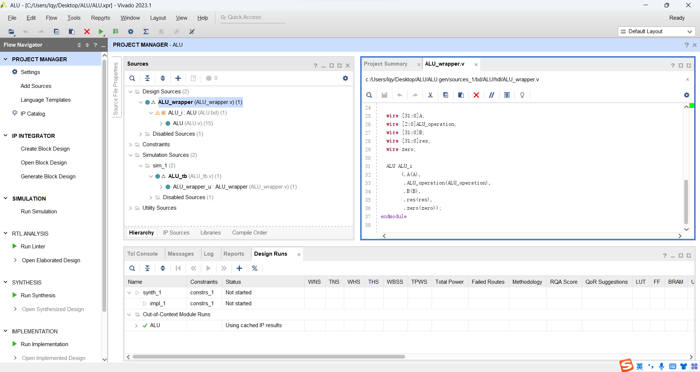
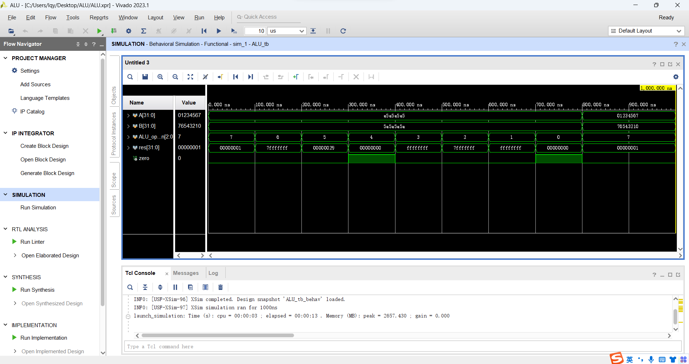
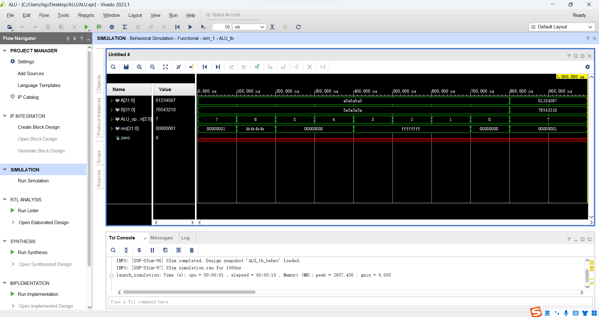
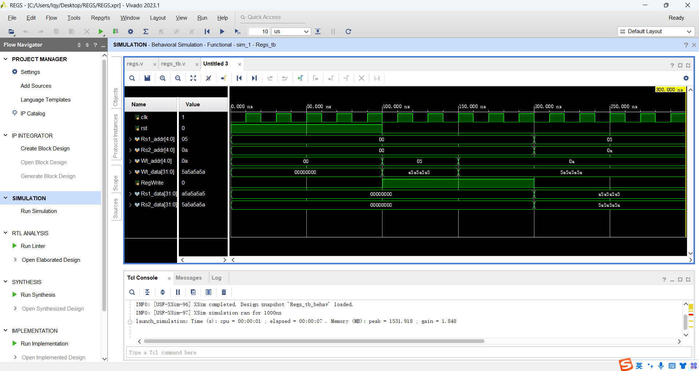
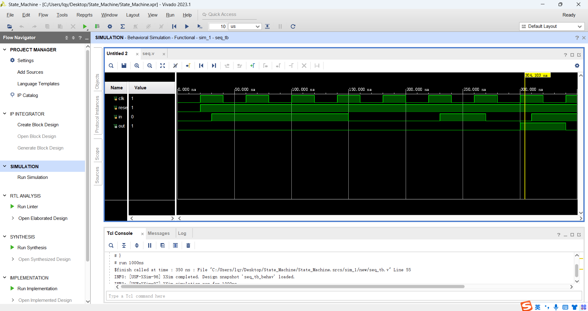
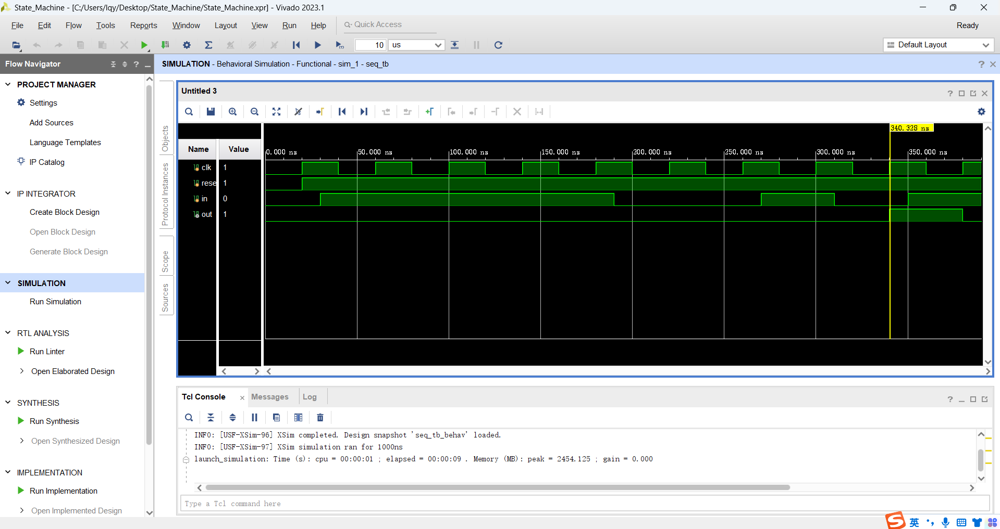

# lab1

[toc]

## ALU

### 任务一：设计实现数据通路部件ALU

#### 模块设计

##### 结构化描述

1. 导入相关子模块IP核

2. 依据原理图进行ALU构建

	

3. 生成IP核wrapper文件设为Top文件

	

> :thinking:一些思考
>
> 1. <a id="add_and_sub">根据原理图，实际上结构化描述时，`ALU_operation = 3'b010`和`ALU_operation = 3'b110`的结果是一样的，都使用`xslice_0`的`Dout`端口作为输入，减法并未完全实现</a>
> 2. <a id="srl">`ALU_operation = 3'b111`部分其实是取A+B的加法结果的末位进行位扩展到32位:grey_question:猜测可能是验证A+B是否非零</a>

##### <a id="function">功能性描述</a>

```verilog
`timescale 1 ps / 1 ps

module ALU_wrapper
   (A,
    ALU_operation,
    B,
    res,
    zero);
    input [31:0]A;
    input [2:0]ALU_operation;
    input [31:0]B;
    output [31:0]res;
    output zero;

    wire [31:0]A;
    wire [2:0]ALU_operation;
    wire [31:0]B;
    wire [31:0]res;
    wire zero;

    /* Logical Functions Here */
    always @(*)
    begin
        case(ALU_operation)
            3'b000: res = A & B; // 1. And
            3'b001: res = A | B; // 2. Or
            3'b010: res = A + B; // 3. Add
            3'b011: res = A ^ B; // 4. Xor
            3'b100: res = ~(A | B); // 5. Nor
            3'b101: res = A >> B; // 6. Srl
            3'b110: res = A - B; // 7. Sub
            3'b111: res = (A + B) ? 1'b1 : 1'b0; // 8. Set on less than
        endcase
    end
endmodule
```

依据ALU的功能逻辑进行上述代码的撰写

> :question:<a id="extend">不太清楚根据原理图的位扩展`ALU_operation = 3'b110`应该具体怎么做，此处撰写可能有误</a>

#### 仿真结果

使用课件提供的仿真代码进行仿真

##### 结构化描述



仿真结果说明：

1. [加法与减法结果一致](#add_and_sub)
2. 加法结果最高位为0x7而不是理论值0xf
3. [位扩展结果为0x29](#srl)

##### 功能性描述



仿真结果说明：

1. [位扩展功能代码可能有误](#extend)
2. 如[代码](#function)所示，未对zero进行赋值

---

### 任务二：设计实现数据通路部件Register Files

#### 模块设计

参考课件提供代码并进行修改后进行模块`regs`构建

```verilog
module regs(
    input clk, rst, RegWrite, 
    input [4:0] Rs1_addr, Rs2_addr, Wt_addr, 
    input [31:0] Wt_data,
    output [31:0] Rs1_data, Rs2_data
    );
    reg [31:0] register [1:31]; // r1 - r31
    integer i;
    assign Rs1_data = (Rs1_addr== 0) ? 0 : register[Rs1_addr]; // read
    assign Rs2_data = (Rs2_addr== 0) ? 0 : register[Rs2_addr]; // read
    always @(posedge clk or posedge rst) 
    begin
        if (rst==1) for (i=1; i<32; i=i+1)
            register[i] <= 0; // reset
        else if ((Wt_addr != 0) && (RegWrite == 1)) 
            register[Wt_addr] <= Wt_data; // write
    end
endmodule
```

#### 仿真结果

利用课件提供仿真代码进行仿真，结果如下：



与课件上的仿真结果一致

### 思考题

#### 如何给ALU增加溢出功能？

分析运算结果的符号

* `A[31] && B[31] == 1`即AB最高位分别为1&1，此时必然产生溢出
* `(A[31] ^ B[31]) && ~res[31] == 1`即AB最高位分别为1&0且加法结果最高位为0，则产生溢出

* AB最高位分别为0&0：必然不产生溢出

基于上述，overflow的功能可以用以下方法简单实现：

```verilog
output overflow;
overflow = (A[31] && B[31] || (A[31] ^ B[31]) && ~res[31]) ? 1'b1 : 1'b0;
```

#### Registers Files实验做了哪些优化？

对代码进行简单优化

```verilog
module regs(
    input clk, rst, RegWrite, 
    input [4:0] Rs1_addr, Rs2_addr, Wt_addr, 
    input [31:0] Wt_data,
    output [31:0] Rs1_data, Rs2_data
    );
    reg [31:0] register [0:31]; // 修改寄存器使用范围
    integer rst_addr; // 代码可读性
    always @(posedge clk or posedge rst) // 完整复位逻辑
    begin
        if (rst) for (rst_addr = 1; rst_addr < 32; rst_addr = rst_addr + 1)
            register[rst_addr] <= 0; // reset
        else if (Wt_addr > 0 && Wt_addr <= 31 && RegWrite) 
            register[Wt_addr] <= Wt_data; // write
    end
    assign Rs1_data = (Rs1_addr== 0) ? 0 : register[Rs1_addr]; // 读取操作放在最后
    assign Rs2_data = (Rs2_addr== 0) ? 0 : register[Rs2_addr]; // read
endmodule
```

#### Registers Files直接使用会有哪些问题？

1. 原文件使用的是同步复位的方式，如果需要异步复位则无法实现
2. 声明了[31:0]的寄存器但是实际仅仅使用了[1:31]而没有使用第1个，造成浪费
3. 如果`(Wt_addr != 0) && (RegWrite == 1)`将进行数据的写入，但是没有考虑如果写入地址`Wt_addr`超过定义的范围[31:0]时的处理方法，如`Wt_addr=0`时的处理方法
4. 复位信号`rst`仅在上升沿工作，复位逻辑不完整
5. 寄存器的写入和复位采用非阻塞赋值，考虑到非阻塞赋值是并行执行的，可能会导致在同一个周期内对同一个寄存器进行读写操作，则最后读出结果可能有误

---

## 有限状态机

### 任务：设计有限状态机完成序列检测器并测试

#### 模块设计

采用三段式状态机的设计方式，依据课件提供状态图进行实现

本次状态机设计用于检测输入序列是否为`1110010`

```verilog
`timescale 1ns / 1ps

module seq(
    clk,
	reset,
	in,
	out
);
 
    input clk;
    input reset;
    input in;
    output out;

    //define state
    parameter [2:0]
        S0 = 3'b000,
        S1 = 3'b001,
        S2 = 3'b010,
        S3 = 3'b011,
        S4 = 3'b100,
        S5 = 3'b101,
        S6 = 3'b110,
        S7 = 3'b111;
 
    //internal variable
    reg [2:0] current_state;
    reg [2:0] next_state;
    wire out;
 
    //first segment:state transfer
    always @ (posedge clk or negedge reset)
        begin
            if (!reset)
                current_state <= S0;
            else
                current_state <= next_state;
        end
    
    //second segment:transfer condition
    always @ (current_state or in)
        begin
            case(current_state)
                S0: begin
                    if (!in) next_state = S0;
                    else next_state = S1;
                end
                S1: begin
                    if (!in) next_state = S0;
                    else next_state = S2;
                end
                S2: begin
                    if (!in) next_state = S0;
                    else next_state = S3;
                end
                S3: begin
                    if (!in) next_state = S4;
                    else next_state = S3;
                end
                S4: begin
                    if (!in) next_state = S5;
                    else next_state = S1;
                end
                S5: begin
                    if (!in) next_state = S0;
                    else next_state = S6;
                end
                S6: begin
                    if (!in) next_state = S7;
                    else next_state = S2;
                end
                S7: begin
                    if (!in) next_state = S0;
                    else next_state = S1;
                end
                default: next_state = S0;
            endcase
        end
                    
    //three segment: state output
    //moore type fsm
    assign out = (current_state == S7) ? 1 : 0;
 
endmodule
```

#### 仿真结果

依据模块代码，在时钟信号`clk`上升沿进行数据读入，复位信号`rst == 0`时恢复状态到`S0`

参照课件提供仿真代码进行仿真

1. 输入序列`1110010`

	

	可以看到在第300ns时读入的全部序列被检测到，结果输出1

2. 输入序列`11110010`

	

	输入的序列在起始部位多输入一次1，在状态`S3`时被记住，完成后续状态检测，在第340ns检测完成，输出1
