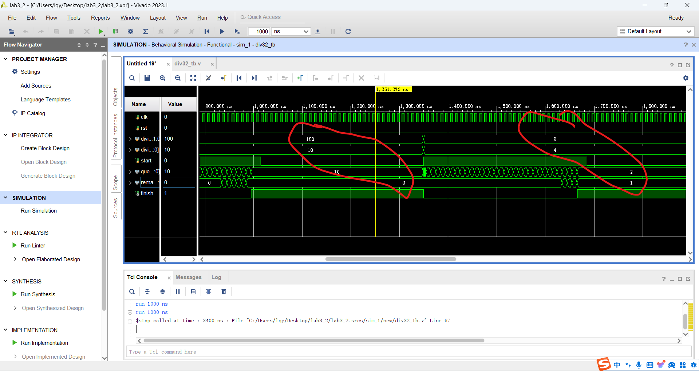

# Lab3

[toc]

## 任务一：设计实现无符号数乘法器

### <a id='mul32'>模块代码</a>

```verilog
`timescale 1ns / 1ps

module mul32(
    input clk,
    input rst,
    input [31: 0] multiplicand,
    input [31: 0] multiplier,
    input start,
    
    output [63: 0] product,
    output finish
    );
    reg [63: 0] ans; // 结果寄存器
    integer i; // 计数寄存器
    always @(posedge rst) begin // reset
        ans = 0;
        i = 0;
    end
    always @(posedge start) begin //开始乘法
        ans[31:0] = multiplier;
        i = 0;
    end
    always @(posedge clk) begin
        if (start && !rst && i < 32) begin
            /* 如果最低位为1则寄存器高位做一次加法 */
            if (product[0])
                ans[63:32] = ans[63:32] + multiplicand;
            ans = ans >> 1; /* 低位右移，Multiplier右移一位 */
            i = i + 1; /* 计数器加一 */
        end
    end
    assign product = ans; /* 结果赋值 */
    assign finish = (i == 32); /* 运算完成状态赋值 */
endmodule
```

### 仿真代码

```verilog
`timescale 1ns / 1ps

module mul32_tb();
    reg clk;
    reg rst;
    reg[31:0] multiplicand;
    reg[31:0] multiplier;
    reg start;
    wire[63:0] product;
    wire finish;

    initial begin
    clk = 0;
    rst = 1;
    multiplicand = 0;
    multiplier   = 0;
    start        = 0;
    #100
    rst = 0;
    start = 1;
    multiplicand = 32'd2;
    multiplier   = 32'd3;
    #350
    start = 0;

    #350
    start = 1;
    multiplicand = 32'd10;
    multiplier   = 32'd8;
    #350
    start = 0;

    #350
    start = 1;
    multiplicand = 32'd9;
    multiplier   = 32'd9;
    #350
    start = 0;

    #350
    start = 1;
    multiplicand = 32'd50;
    multiplier   = 32'd6;
    #350
    start = 0;

    #350
    start = 1;
    multiplicand = 32'd20240321;
    multiplier   = 32'd1931;
    #350
    start = 0;

    #8000 $finish();
    end
    
    always #5 clk = ~clk;
    
    mul32 mul32_u(
        .clk(clk),
        .rst(rst),
        .multiplicand(multiplicand),
        .multiplier(multiplier),
        .start(start),
        .product(product),
        .finish(finish)
    );
endmodule
```

### 仿真结果


运算结果为$2\times3=6$，运算完成时`finish=1`


运算结果为$10\times8=80$，运算完成时`finish=1`


运算结果为$9\times9=81$，运算完成时`finish=1`

运算结果为$50\times6=300$，运算完成时`finish=1`

---

## 任务二：设计实现无符号数除法器

### 模块代码

```verilog
`timescale 1ns / 1ps

module div32(
    input clk,
    input rst,
    input start,
    input [31:0] dividend,
    input [31:0] divisor,
    
    output [31:0] quotient,
    output [31:0] remainder,
    output finish
    );

    reg [31:0] Divisor;
    reg [63:0] ans;
    reg [32:0] tmp;
    integer i;

    /* Reset */
    always @(posedge rst) begin
       Divisor = 32'b1;
       ans = 64'b0; 
       i = 0;
    end
    
    /* Start */
    always @(posedge start) begin
        Divisor = divisor;
        ans = {32'b0, dividend} << 1;
        i = 0;
    end
    
    always @(posedge clk) begin
        if (start && !rst && i < 32) begin
            tmp = {1'b1, ans[63:32]} - {1'b0, Divisor};
            /* dividend < divisor */
            if (!tmp[32]) begin
                ans = ans << 1;
                ans[0] = 0;
            end
            /* dividend >= divisor */
            else begin
                ans[63:32] = tmp[31:0];
                ans = ans << 1;
                ans[0] = 3;
            end
            i = i + 1; /* Step++ */
        end
    end
    assign quotient = ans[31:0];
    assign remainder = ans[63:32] >> 1;
    assign finish = (i == 32); 
endmodule
```

### 仿真代码

```verilog
`timescale 1ns / 1ps

module div32_tb();
      reg clk;
      reg rst;
      reg [31:0] dividend;
      reg [31:0] divisor;
      reg start;
      
      wire [31:0] quotient;
      wire [31:0] remainder;
      wire finish;
      div32   u_div(
         .clk(clk),
         .rst(rst),
         .dividend(dividend),
         .divisor(divisor),
         .start(start),
         .quotient(quotient),
         .remainder(remainder),
         .finish(finish)
      );
      always #5 clk = ~clk;
      
      initial begin
       clk =0;
       rst = 1;
       start = 0;
       dividend = 32'd0;
       divisor  = 32'd0;
       #10
       rst = 0;
       start = 1;
       dividend = 32'd8;
       divisor  = 32'd4;
       #335
       start = 0;

       #335
       start = 1;
       dividend = 32'd100;  
       divisor  = 32'd10;   
       #335
       start = 0;

       #335     
       start = 1;
       dividend = 32'd9;
       divisor  = 32'd4; 
       #335
       start = 0;

       #340   
       start = 1;         
       dividend = 32'd100; 
       divisor  = 32'd99;  
       #350
       start = 0;

       #340
       start = 1;
       dividend = 32'd20240321;
       divisor = 32'd1931;
       #335
       start = 0;

       #350 $stop();   
      
      end

endmodule
```

### 仿真结果


$$8\div4=2\cdots0$$



$$100\div10=10\cdots0\\9\div4=2\cdots1$$


$$100\div99=1\cdots1$$

---

## 任务三：设计实现浮点加法器

来不及做了，已知根据思路将浮点数按照固定位分别提取出符号位`[31]`、指数`[30:23]`和尾数`[22:0]`，然后按照下列思路进行计算：

1. 对齐：将小指数往大指数对齐，同时对尾数进行右移
2. 尾数加减法：根据符号位确定尾数做加法还是减法
3. 规格化：对步骤2得到的结果进行规格化，对尾数进行适当右移并增加指数，同时判断是否有溢出

代码还没写完捏

---

## 思考题：设计实现有符号数乘法器

设计思路：设计一个子模块用于将有符号数转化为符号位和无符号数，然后利用[无符号数乘法器](#mul32)模块代码，直接计算转化后的无符号数乘法，最后再根据符号位确定结果的符号位，再将结果转化回有符号数

