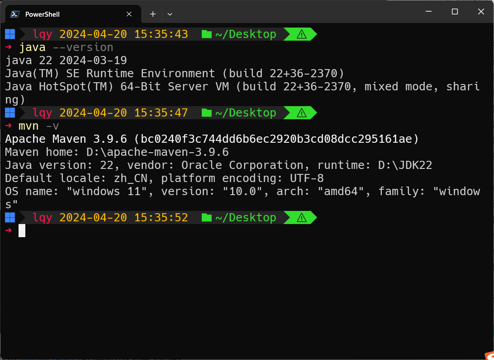
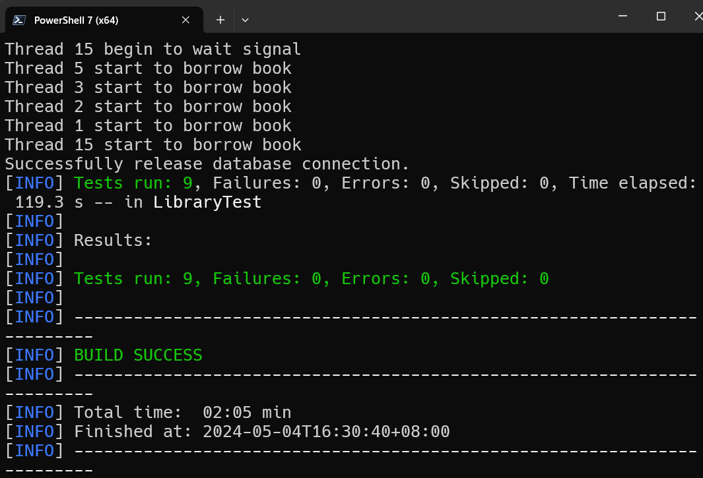

# Lab5: 图书管理系统

[TOC]

---

## 实验目的

设计并实现一个精简的图书管理程序，要求具有图书入库、查询、借书、还书、借书证管理等功能

---

## 实验需求

### 基本数据对象

所有的基本数据对象都被定义在`src/main/java/entities`包中，包括：

| 对象名称 | 类名 | 包含属性 |
| :---: | :---: | :---: |
| 书 | Book | 书号, 类别, 书名, 出版社, 年份, 作者, 价格, 剩余库存|
| 借书证 | Card | 卡号, 姓名, 单位, 身份(教师或学生) |
| 借书记录 | Borrow | 卡号, 书号, 借书日期, 还书日期 |

### 基本模块功能

* 接口`LibraryManagementSystem`中声明了图书管理系统的所有功能模块
* 类`LibraryManagementSystemImpl`中实现了接口`LibraryManagementSystem`的所有功能模块
* 主类`Main`实现了客户端的操作

### 数据库（表）设计

#### book表

```sql
create table `book` (
    `book_id` int not null auto_increment,
    `category` varchar(63) not null,
    `title` varchar(63) not null,
    `press` varchar(63) not null,
    `publish_year` int not null,
    `author` varchar(63) not null,
    `price` decimal(7, 2) not null default 0.00,
    `stock` int not null default 0,
    primary key (`book_id`),
    unique (`category`, `press`, `author`, `title`, `publish_year`)
);
```

#### card表

```sql
create table `card` (
    `card_id` int not null auto_increment,
    `name` varchar(63) not null,
    `department` varchar(63) not null,
    `type` char(1) not null,
    primary key (`card_id`),
    unique (`department`, `type`, `name`),
    check ( `type` in ('T', 'S') )
);
```

#### borrow表

```sql
create table `borrow` (
  `card_id` int not null,
  `book_id` int not null,
  `borrow_time` bigint not null,
  `return_time` bigint not null default 0,
  primary key (`card_id`, `book_id`, `borrow_time`),
  foreign key (`card_id`) references `card`(`card_id`) on delete cascade on update cascade,
  foreign key (`book_id`) references `book`(`book_id`) on delete cascade on update cascade
);
```

### 实现功能

| 功能 | 描述 |
| :---: | :--- |
| 图书入库 | 输入<书号, 类别, 书名, 出版社, 年份, 作者, 价格, 初始库存>，入库一本新书B |
| 增加库存 | 将书B的库存增加到X，然后减少到1 |
| 修改图书信息 | 随机抽取N个字段，修改图书B的图书信息 |
| 批量入库 | 输入图书导入文件的路径U，然后从文件U中批量导入图书 |
| 添加借书证 | 输入<姓名, 单位, 身份>，添加一张新的借书证C |
| 查询借书证 | 列出所有的借书证 |
| 借书 | 用借书证C借图书B，再借一次B，然后再借一本书K |
| 还书 | 用借书证C还掉刚刚借到的书B |
| 借书记录查询 | 查询C的借书记录 |
| 图书查询 | 从查询条件<类别点查(精确查询)，书名点查(模糊查询)，出版社点查(模糊查询)，年份范围查，作者点查(模糊查询)，价格范围差>中随机选取N个条件，并随机选取一个排序列和顺序 |

---

## 实验环境

本次实验环境采用的是VSCode + JDK + Maven



本次实验采用框架[ZJUGit](https://git.zju.edu.cn/zjucsdb/librarymanagementsystem)

---

## 各系统模块设计

所有的函数声明都在`librarymanagementsystem/src/main/java/LibraryManagementSystem.java`中

所有的函数实现都在`librarymanagementsystem/src/main/java/LibraryManagementSystemImpl.java`中

以下是每个**待实现**模块的具体内容

### `storeBook`

#### 基本功能

图书入库模块，实现对一本书的入库

#### 设计要点

1. 判断图书是否已经存在库中
2. 图书入库
3. 返回数据库的自增项`book_id`

#### 模块代码

```java
@Override
    public ApiResult storeBook(Book book) {
        Connection conn = connector.getConn();
        try {
            // Check if the book is already in the database.
            {
                String sqlString = "select * from `book` where `category` = ? and `title` = ? and `press` = ? and `publish_year` = ? and `author` = ?";
                PreparedStatement stmt = conn.prepareStatement(sqlString);
                stmt.setString(1, book.getCategory());
                stmt.setString(2, book.getTitle());
                stmt.setString(3, book.getPress());
                stmt.setInt(4, book.getPublishYear());
                stmt.setString(5, book.getAuthor());
                ResultSet rs = stmt.executeQuery();
                if (rs.next()) {
                    return new ApiResult(false, "Book already exists.\n");
                }
                rs.close();
                stmt.close();
            }
            // Insert the book into the database.
            String sqlString = "insert into `book` (`category`, `title`, `press`, `publish_year`, `author`, `price`, `stock`) values (?, ?, ?, ?, ?, ?, ?)";
            PreparedStatement stmt = conn.prepareStatement(sqlString);
            stmt.setString(1, book.getCategory());
            stmt.setString(2, book.getTitle());
            stmt.setString(3, book.getPress());
            stmt.setInt(4, book.getPublishYear());
            stmt.setString(5, book.getAuthor());
            stmt.setDouble(6, book.getPrice());
            stmt.setInt(7, book.getStock());
            stmt.executeUpdate();
            // Get the book id.
            sqlString = "select `book_id` from `book` where `category` = ? and `title` = ? and `press` = ? and `publish_year` = ? and `author` = ?";
            stmt = conn.prepareStatement(sqlString);
            stmt.setString(1, book.getCategory());
            stmt.setString(2, book.getTitle());
            stmt.setString(3, book.getPress());
            stmt.setInt(4, book.getPublishYear());
            stmt.setString(5, book.getAuthor());
            ResultSet rs = stmt.executeQuery();
            rs.next();
            book.setBookId(rs.getInt("book_id"));
            rs.close();
            commit(conn);
            rs.close();
            stmt.close();
            return new ApiResult(true, "Insert book successfully with book_id = " + book.getBookId() + "\n");
        } catch (Exception e) {
            rollback(conn);
            return new ApiResult(false, e.getMessage());
        }
    }
```

### `incBookStock`

#### 基本功能

增加或减少图书库存，保证最终图书库存非负

#### 设计要点

1. 判断图书是否在库中
2. 判断修改后`stock`是否非负
3. `update`

#### 模块代码

```java
@Override
    public ApiResult incBookStock(int bookId, int deltaStock) {
        Connection conn = connector.getConn();
        try {
            // Check if the book stock is larger than the deltaStock.
            {
                String sqlString = "SELECT `stock` FROM book WHERE book_id = ?";
                PreparedStatement stmt = conn.prepareStatement(sqlString);
                stmt.setInt(1, bookId);
                ResultSet rs = stmt.executeQuery();
                if (!rs.next()) {
                    return new ApiResult(false, "Book with book_id = " + bookId + " not found in the database.\n");
                }
                if (rs.getInt("stock") + deltaStock < 0) {
                    return new ApiResult(false, "Book stock less than 0.\n");
                }
                rs.close();
                stmt.close();
            }
            // Update the book stock.
            String sqlString = "update `book` set `stock` = `stock` + ? where `book_id` = ?";
            PreparedStatement stmt = conn.prepareStatement(sqlString);
            stmt.setInt(1, deltaStock);
            stmt.setInt(2, bookId);
            stmt.executeUpdate();
            commit(conn);
            stmt.close();
            return new ApiResult(true, "Change book stock successfully.\n");
        } catch (Exception e) {
            rollback(conn);
            return new ApiResult(false, e.getMessage());
        }
    }
```

### `storeBook`

#### 基本功能

实现批量图书入库，如果一本入库失败则全部回滚

#### 设计要点

1. 对图书列表进行循环，分别判定每本书是否已经存在
2. 对每本书进行插入，如果一本失败则全部回滚

#### 模块代码

```java
@Override
    public ApiResult storeBook(List<Book> books) {
        Connection conn = connector.getConn();
        try {
            for (Book book : books) {
                // Check if the book is already in the database.
                String sqlString = "select * from `book` where `category` = ? and `title` = ? and `press` = ? and `publish_year` = ? and `author` = ?";
                PreparedStatement stmt = conn.prepareStatement(sqlString);
                stmt.setString(1, book.getCategory());
                stmt.setString(2, book.getTitle());
                stmt.setString(3, book.getPress());
                stmt.setInt(4, book.getPublishYear());
                stmt.setString(5, book.getAuthor());
                ResultSet rs = stmt.executeQuery();
                if (rs.next()) {
                    rollback(conn);
                    return new ApiResult(false, "Book already exists.\n");
                }
                // Insert the book into the database.
                sqlString = "insert into `book` (`category`, `title`, `press`, `publish_year`, `author`, `price`, `stock`) values (?, ?, ?, ?, ?, ?, ?)";
                stmt = conn.prepareStatement(sqlString);
                stmt.setString(1, book.getCategory());
                stmt.setString(2, book.getTitle());
                stmt.setString(3, book.getPress());
                stmt.setInt(4, book.getPublishYear());
                stmt.setString(5, book.getAuthor());
                stmt.setDouble(6, book.getPrice());
                stmt.setInt(7, book.getStock());
                stmt.executeUpdate();
                // Get the book id.
                sqlString = "select `book_id` from `book` where `category` = ? and `title` = ? and `press` = ? and `publish_year` = ? and `author` = ?";
                stmt = conn.prepareStatement(sqlString);
                stmt.setString(1, book.getCategory());
                stmt.setString(2, book.getTitle());
                stmt.setString(3, book.getPress());
                stmt.setInt(4, book.getPublishYear());
                stmt.setString(5, book.getAuthor());
                rs = stmt.executeQuery();
                rs.next();
                book.setBookId(rs.getInt("book_id"));
            }
            commit(conn);
            return new ApiResult(true, "Insert " + books.size() + " books successfully.\n");
        } catch (Exception e) {
            rollback(conn);
            return new ApiResult(false, e.getMessage());
        }
    }
```

### `removeBook`

#### 基本功能

移除书本，如果书被借走尚未归还则无法移除

#### 设计要点

1. 判定图书是否在库中
2. 判定图书是否被借走未还
3. 移除

#### 模块代码

```java
@Override
    public ApiResult removeBook(int bookId) {
        Connection conn = connector.getConn();
        try {
            // Check if the book is in the database.
            {
                String sqlString = "select * from `book` where `book_id` = ?";
                PreparedStatement stmt = conn.prepareStatement(sqlString);
                stmt.setInt(1, bookId);
                ResultSet rs = stmt.executeQuery();
                if (!rs.next()) {
                    return new ApiResult(false, "Book with book_id = " + bookId + " not found in the database.\n");
                }
                rs.close();
                stmt.close();
            }
            // Check if the book is borrowed.
            {
                String sqlString = "select * from `borrow` where `book_id` = ? and `return_time` = 0";
                PreparedStatement stmt = conn.prepareStatement(sqlString);
                stmt.setInt(1, bookId);
                ResultSet rs = stmt.executeQuery();
                if (rs.next()) {
                    return new ApiResult(false, "Cannot remove book with book_id = " + bookId + ", it is borrowed.\n");
                }
                rs.close();
                stmt.close();
            }
            // Delete the book from the database.
            String sqlString = "delete from `book` where book_id = ?";
            PreparedStatement stmt = conn.prepareStatement(sqlString);
            stmt.setInt(1, bookId);
            stmt.executeUpdate();
            commit(conn);
            stmt.close();
            return new ApiResult(true, "Successfully remove book with book_id = " + bookId + ".\n");
        } catch (Exception e) {
            rollback(conn);
            return new ApiResult(false, e.getMessage());
        }
    }
```

### `modifyBookInfo`

#### 基本功能

修改图书信息，`book_id`和`stock`除外

#### 设计要点

1. 判断图书是否在库中
2. 更新数据

#### 模块代码

```java
@Override
    public ApiResult modifyBookInfo(Book book) {
        Connection conn = connector.getConn();
        try {
            // Check if the book is in the database.
            {
                String sqlString = "select * from `book` where `book_id` = ?";
                PreparedStatement stmt = conn.prepareStatement(sqlString);
                stmt.setInt(1, book.getBookId());
                ResultSet rs = stmt.executeQuery();
                if (!rs.next()) {
                    return new ApiResult(false, "Book with book_id = " + book.getBookId() + " not found in the database.\n");
                }
                rs.close();
                stmt.close();
            }
            // Update the book information.
            String sqlString = "update `book` set `category` = ?, `title` = ?, `press` = ?, `publish_year` = ?, `author` = ?, `price` = ? where `book_id` = ?";
            PreparedStatement stmt = conn.prepareStatement(sqlString);
            stmt.setString(1, book.getCategory());
            stmt.setString(2, book.getTitle());
            stmt.setString(3, book.getPress());
            stmt.setInt(4, book.getPublishYear());
            stmt.setString(5, book.getAuthor());
            stmt.setDouble(6, book.getPrice());
            stmt.setInt(7, book.getBookId());
            stmt.executeUpdate();
            commit(conn);
            stmt.close();
            return new ApiResult(true, "Successfully modify book information with book_id = " + book.getBookId() + "\n");
        } catch (Exception e) {
            rollback(conn);
            return new ApiResult(false, e.getMessage());
        }
    }
```

### `queryBook`

#### 基本功能

查询图书信息，实现

1. 根据提供的查询条件查询符合条件的图书，并按照指定排序方式排序
2. 查询条件包括：类别点查(精确查询)，书名点查(模糊查询)，出版社点查(模糊查询)，年份范围查，作者点查(模糊查询)，价格范围差
3. 如果两条记录排序条件的值相等，则按book_id升序排序

#### 设计要点

1. 根据`BookQueryConditions`的条件获取查询条件
2. 根据设计需求对模糊查询、精确查询、范围查询进行SQL语句翻译
3. 转化为JDBC代码并执行查询
4. 将查询结果合并到`BookQueryResults`中并完成排序

#### 模块代码

```java
@Override
    public ApiResult queryBook(BookQueryConditions conditions) {
        Connection conn = connector.getConn();
        try {
            String sqlString = "select * from `book`";
            String queryString = "";
            boolean isQueryCondition = false;
            // Get query conditions.
            if (conditions.getCategory() != null) {
                isQueryCondition = true;
                queryString = "`category` = '" + conditions.getCategory() + "'";
            }
            if (conditions.getTitle() != null) {
                if (isQueryCondition)
                    queryString += " and ";
                else 
                    isQueryCondition = true;
                queryString += "`title` like '%" + conditions.getTitle() + "%'";
            }
            if (conditions.getPress() != null) {
                if (isQueryCondition)
                    queryString += " and ";
                else 
                    isQueryCondition = true;
                queryString += "`press` like '%" + conditions.getPress() + "%'";
            }
            if (conditions.getMinPublishYear() != null) {
                if (isQueryCondition)
                    queryString += " and ";
                else 
                    isQueryCondition = true;
                queryString += "`publish_year` >= " + Integer.toString(conditions.getMinPublishYear());
            }
            if (conditions.getMaxPublishYear() != null) {
                if (isQueryCondition)
                    queryString += " and ";
                else 
                    isQueryCondition = true;
                queryString += "`publish_year` <= " + Integer.toString(conditions.getMaxPublishYear());
            }
            if (conditions.getAuthor() != null) {
                if (isQueryCondition)
                    queryString += " and ";
                else 
                    isQueryCondition = true;
                queryString += "`author` like '%" + conditions.getAuthor() + "%'";
            }
            if (conditions.getMinPrice() != null) {
                if (isQueryCondition)
                    queryString += " and ";
                else 
                    isQueryCondition = true;
                queryString += "`price` >= " + Double.toString(conditions.getMinPrice());
            }
            if (conditions.getMaxPrice() != null) {
                if (isQueryCondition)
                    queryString += " and ";
                else 
                    isQueryCondition = true;
                queryString += "`price` <= " + Double.toString(conditions.getMaxPrice());
            }
            if (isQueryCondition)
                sqlString += " where " + queryString;
            Statement stmt = conn.createStatement();
            // Make query.
            ResultSet rs = stmt.executeQuery(sqlString);
            // Record results.
            List<Book> books = new ArrayList<>();
            while (rs.next()) {
                Book thisBook = new Book(
                    rs.getString("category"),
                    rs.getString("title"),
                    rs.getString("press"),
                    rs.getInt("publish_year"),
                    rs.getString("author"),
                    rs.getDouble("price"),
                    rs.getInt("stock"));
                thisBook.setBookId(rs.getInt("book_id"));
                books.add(thisBook);
            }
            String msg = "";
            if (!books.isEmpty()) {
                // Sort.
                if (conditions.getSortOrder() == SortOrder.DESC)
                    books.sort(conditions.getSortBy().getComparator().reversed().thenComparing(Book.SortColumn.BOOK_ID.getComparator()));
                else
                    books.sort(conditions.getSortBy().getComparator().thenComparing(Book.SortColumn.BOOK_ID.getComparator()));
                for (Book book : books)
                    msg += book.toString() + "\n";
            } else {
                msg = "No books founded for the given conditions.\n";
            }
            BookQueryResults results = new BookQueryResults(books);
            return new ApiResult(true, msg, results);
        } catch (Exception e) {
            return new ApiResult(false, e.getMessage());
        }
    }
```

### `borrowBook`

#### 基本功能

借书

1. 如果用户此前已经借过这本书尚未归还则无法借书
2. 并发控制

#### 设计要点

1. 判断书是否在库中
2. 判断书是否库存大于0
3. 判断卡是否在库中
4. 判断是否借过未还
5. 更新库存，添加借书记录

#### 模块设计

```java
@Override
    public ApiResult borrowBook(Borrow borrow) {
        Connection conn = connector.getConn();
        try {
            // Check if the book is in the database.
            {
                PreparedStatement stmt = conn.prepareStatement("select `stock` from `book` where `book_id` = ?");
                stmt.setInt(1, borrow.getBookId());
                ResultSet rs = stmt.executeQuery();
                if (!rs.next())
                    return new ApiResult(false, "Book with book_id = " + borrow.getBookId() + " not found in the database.\n");
                if (rs.getInt("stock") <= 0)
                    return new ApiResult(false, "Book with book_id = " + borrow.getBookId() + " is not available.\n");
                rs.close();
                stmt.close();
            }
            // Check if the card is in the database.
            {
                PreparedStatement stmt = conn.prepareStatement("select * from `card` where `card_id` = ?");
                stmt.setInt(1, borrow.getCardId());
                ResultSet rs = stmt.executeQuery();
                if (!rs.next())
                    return new ApiResult(false, "Card with card_id = " + borrow.getCardId() + " not found in the database.\n");
                rs.close();
                stmt.close();
            }
            // Check if the book is borrowed.
            {
                PreparedStatement stmt = conn.prepareStatement("select * from `borrow` where `book_id` = ? and `card_id` = ? and `return_time` = 0");
                stmt.setInt(1, borrow.getBookId());
                stmt.setInt(2, borrow.getCardId());
                ResultSet rs = stmt.executeQuery();
                if (rs.next())
                    return new ApiResult(false, "The book with book_id = " + borrow.getBookId() + " is borrowed and not returned yet.\n");
                rs.close();
                stmt.close();
            }
            // Insert the borrow record.
            Statement stmt = conn.createStatement();
            String sqlString = "insert into `borrow` (`card_id`, `book_id`, `borrow_time`) values (" +
                Integer.toString(borrow.getCardId()) + ", " +
                Integer.toString(borrow.getBookId()) + ", " +
                Long.toString(borrow.getBorrowTime()) + ")";
            stmt.addBatch(sqlString);
            // Update the book stock.
            sqlString = "update `book` set `stock` = `stock` - 1 where `book_id` = " + borrow.getBookId();
            stmt.addBatch(sqlString);
            stmt.executeBatch();
            //commit(conn);
            return new ApiResult(true, "Successfully borrow book with book_id = " + borrow.getBookId() + " by card_id = " + borrow.getCardId() + " at date: " + borrow.getBorrowTime() + ".\n");
        } catch (Exception e) {
            rollback(conn);
            return new ApiResult(false, e.getMessage());
        }
    }
```

### `returnBook`

#### 基本功能

还书

#### 设计要点

1. 判断书是否在库中
2. 判断卡是否在库中
3. 判断书是否被这张卡借了且未还

#### 模块代码

```java
@Override
    public ApiResult returnBook(Borrow borrow) {
        Connection conn = connector.getConn();
        try {
            // Check if the book is in the database.
            {
                String sqlString = "select * from `book` where `book_id` = ?";
                PreparedStatement stmt = conn.prepareStatement(sqlString);
                stmt.setInt(1, borrow.getBookId());
                ResultSet rs = stmt.executeQuery();
                if (!rs.next())
                    return new ApiResult(false, "Book not found in the database.\n");
                rs.close();
                stmt.close();
            }
            // Check if the card is in the database.
            {
                String sqlString = "select * from `card` where `card_id` = ?";
                PreparedStatement stmt = conn.prepareStatement(sqlString);
                stmt.setInt(1, borrow.getCardId());
                ResultSet rs = stmt.executeQuery();
                if (!rs.next())
                    return new ApiResult(false, "Card not found in the database.\n");
                rs.close();
                stmt.close();
            }
            // Check if the book is borrowed by the card.
            {
                String sqlString = "select `return_time` from `borrow` where `card_id` = ? and `book_id` = ? and `borrow_time` = ?";
                PreparedStatement stmt = conn.prepareStatement(sqlString);
                stmt.setInt(1, borrow.getCardId());
                stmt.setInt(2, borrow.getBookId());
                stmt.setLong(3, borrow.getBorrowTime());
                ResultSet rs = stmt.executeQuery();
                if (!rs.next()) {
                    // The book is not borrowed by the card.
                    return new ApiResult(false, "The book is not borrowed by the card.\n");
                }
                // The book is already returned.
                if (rs.getLong("return_time") != 0) {
                    return new ApiResult(false, "The book is already returned.\n");
                }
                rs.close();
                stmt.close();
            }
            // Update the book stock.
            Statement stmt = conn.createStatement();
            String sqlString = "update `book` set `stock` = `stock` + 1 where `book_id` = " + borrow.getBookId();
            stmt.addBatch(sqlString);
            // Update the borrow record.
            sqlString = "update `borrow` set `return_time` = " + Long.toString(borrow.getReturnTime()) + 
                " where `card_id` = " + Integer.toString(borrow.getCardId()) +
                " and `book_id` = " + Integer.toString(borrow.getBookId()) + 
                " and `borrow_time` = " + Long.toString(borrow.getBorrowTime());
            stmt.addBatch(sqlString);
            stmt.executeBatch();
            commit(conn);
            stmt.close();
            return new ApiResult(true, "Successfully return book with book_id = " + borrow.getBookId() + " by card_id = " + borrow.getCardId() + "at date: " + borrow.getReturnTime() + ".\n");
        } catch (Exception e) {
            rollback(conn);
            return new ApiResult(false, e.getMessage());
        }
    }
```

### `showBorrowHistory`

#### 基本功能

查询一张卡的所有借书记录，按照借书时间递减、书号递增的方式排序

#### 设计要点

1. 判断卡是否在库中
2. 查询对应借书记录
3. 连接查询每条借书记录的书号对应的书信息
4. 查询结果合并为`BorrowHistories`并返回

#### 模块代码

```java
@Override
    public ApiResult showBorrowHistory(int cardId) {
        Connection conn = connector.getConn();
        try {
            // Check if the card is in the database.
            {
                String sqlString = "select * from `card` where `card_id` = ?";
                PreparedStatement stmt = conn.prepareStatement(sqlString);
                stmt.setInt(1, cardId);
                ResultSet rs = stmt.executeQuery();
                if (!rs.next())
                    return new ApiResult(false, "Card not found in the database.\n");
                rs.close();
                stmt.close();
            }
            // Get the borrow history.
            String sqlString = "select `borrow`.`book_id`, " +
                    "`book`.`category`, `book`.`title`, `book`.`press`, `book`.`publish_year`, `book`.`author`, `book`.`price`, `book`.`stock`, " +
                    "`borrow`.`borrow_time`, `borrow`.`return_time` " +
                    "from `borrow` join `book` on `book`.`book_id` = `borrow`.`book_id` and `borrow`.`card_id` = ?";
            PreparedStatement stmt = conn.prepareStatement(sqlString);
            stmt.setInt(1, cardId);
            ResultSet rs = stmt.executeQuery();
            List<BorrowHistories.Item> items = new ArrayList<>();
            while (rs.next()) {
                Book thisBook = new Book(
                    rs.getString("category"),
                    rs.getString("title"),
                    rs.getString("press"),
                    rs.getInt("publish_year"),
                    rs.getString("author"),
                    rs.getDouble("price"),
                    rs.getInt("stock"));
                thisBook.setBookId(rs.getInt("book_id"));
                Borrow thisBorrow = new Borrow(cardId, rs.getInt("book_id"));
                thisBorrow.setBorrowTime(rs.getLong("borrow_time"));
                thisBorrow.setReturnTime(rs.getLong("return_time"));
                BorrowHistories.Item thisItem = new BorrowHistories.Item(cardId, thisBook, thisBorrow);
                items.add(thisItem);
            }
            rs.close();
            stmt.close();
            // Record results.
            String msg = "";
            if (!items.isEmpty()) {
                // Sort.
                items.sort(Comparator.comparingLong(BorrowHistories.Item::getBorrowTime).reversed().thenComparingInt(BorrowHistories.Item::getBookId));
                for (BorrowHistories.Item item : items)
                    msg += item.toString() + "\n";
            } else {
                msg = "No borrow history found for the card with card_id = " + cardId + ".\n";
            }
            BorrowHistories histories = new BorrowHistories(items);
            return new ApiResult(true, msg, histories);
        } catch (Exception e) {
            return new ApiResult(false, e.getMessage());
        }
    }
```

### `registerCard`

#### 基本功能

注册卡

#### 设计要点

1. 判断卡是否已经存在
2. 插入卡

#### 模块代码

```java
@Override
    public ApiResult registerCard(Card card) {
        Connection conn = connector.getConn();
        try {
            // Check if the card is already in the database.
            {
                String sqlString = "select * from `card` where `name` = ? and `department` = ? and `type` = ?";
                PreparedStatement stmt = conn.prepareStatement(sqlString);
                stmt.setString(1, card.getName());
                stmt.setString(2, card.getDepartment());
                stmt.setString(3, card.getType().getStr());
                ResultSet rs = stmt.executeQuery();
                if (rs.next())
                    return new ApiResult(false, "Card already exists.");
                rs.close();
                stmt.close();
            }
            // Insert the card into the database.
            String sqlString = "insert into `card` (`name`, `department`, `type`) values (?, ?, ?)";
            PreparedStatement stmt = conn.prepareStatement(sqlString);
            stmt.setString(1, card.getName());
            stmt.setString(2, card.getDepartment());
            stmt.setString(3, card.getType().getStr());
            stmt.executeUpdate();
            sqlString = "select `card_id` from `card` where `name` = ? and `department` = ? and `type` = ?";
            stmt = conn.prepareStatement(sqlString);
            stmt.setString(1, card.getName());
            stmt.setString(2, card.getDepartment());
            stmt.setString(3, card.getType().getStr());
            ResultSet rs = stmt.executeQuery();
            rs.next();
            card.setCardId(rs.getInt("card_id"));
            commit(conn);
            rs.close();
            stmt.close();
            return new ApiResult(true, "Successfully register card with card_id: " + card.getCardId() + ".\n", card);
        } catch (Exception e) {
            rollback(conn);
            return new ApiResult(false, e.getMessage());
        }
    }
```

### `removeCard`

#### 基本功能

移除卡，如果该借书证还有未归还的图书，那么删除操作将失败

#### 设计要点

1. 判断卡是否在库中
2. 判断是否有未还图书
3. 删除

#### 模块代码

```java
@Override
    public ApiResult removeCard(int cardId) {
        Connection conn = connector.getConn();
        try {
            // Check if the card is in the database.
            {
                String sqlString = "select * from `card` where `card_id` = ?";
                PreparedStatement stmt = conn.prepareStatement(sqlString);
                stmt.setInt(1, cardId);
                ResultSet rs = stmt.executeQuery();
                if (!rs.next())
                    return new ApiResult(false, "Card not exists.");
                rs.close();
                stmt.close();
            }
            // Check if the card is borrowed by any book.
            {
                String sqlString = "select * from `borrow` where `card_id` = ? and `return_time` = 0";
                PreparedStatement stmt = conn.prepareStatement(sqlString);
                stmt.setInt(1, cardId);
                ResultSet rs = stmt.executeQuery();
                if (rs.next())
                    return new ApiResult(false, "The card is borrowed by a book, cannot remove it.\n");
                rs.close();
                stmt.close();
            }
            // Delete the card from the database.
            String sqlString = "delete from `card` where `card_id` = ?";
            PreparedStatement stmt = conn.prepareStatement(sqlString);
            stmt.setInt(1, cardId);
            stmt.executeUpdate();
            commit(conn);
            stmt.close();
            return new ApiResult(true, "Successfully remove card with card_id: " + Integer.toString(cardId) + ".\n");
        } catch (Exception e) {
            rollback(conn);
            return new ApiResult(false, e.getMessage());
        }
    }
```

### `showCards`

#### 基本功能

列出所有借书证

#### 设计要点

1. 查询
2. 排序
3. 返回`CardList`

#### 模块代码

```java
@Override
    public ApiResult showCards() {
        Connection conn = connector.getConn();
        try {
            String sqlString = "select * from `card`";
            Statement stmt = conn.createStatement();
            ResultSet rs = stmt.executeQuery(sqlString);
            String msg = "";
            List<Card> cards = new ArrayList<>();
            while (rs.next()) {
                Card card = new Card(
                    rs.getInt("card_id"),
                    rs.getString("name"),
                    rs.getString("department"),
                    Card.CardType.values(rs.getString("type")));
                msg += card.toString() + "\n";
                cards.add(card);
            }
            if (cards.isEmpty()) {
                msg = "No cards in this library.\n";
            } else {
                // Sort.
                cards.sort(Comparator.comparing(Card::getCardId));
            }
            CardList cardList = new CardList(cards);
            rs.close();
            stmt.close();
            return new ApiResult(true, msg, cardList); 
        } catch (Exception e) {
            return new ApiResult(false, e.getMessage());
        }
    }
```

---

## 系统验证测试

利用测试样例进行测试，最终结果为全部通过



注：前端部分未实现

---

## 遇到的问题及解决方法

在完成整个图书管理系统的过程中，遇到了诸多问题

### Java菜鸟

之前从来没有接触过Java，也没有写过这么大的项目，因此Java的初学与速通花费了一定时间

对高级的Java语法也花了很长时间进行理解与学习

### 总体设计

考虑到这个图书管理系统的每个函数在实现上其实都有一部分的重叠之处，比如针对书的操作都是基于书的查询，针对卡的操作都要基于对卡的查询，因此最开始设计了两个私有变量以及函数，分别为书的列表的卡的列表，并设计函数`selectAllBook`和`selectAllCards`，希望通过这个操作将所有的信息搬到内存进行操作而加快访问速度

但是这样的做法会导致相当大的麻烦，比如数据量极大时对内存的开销是巨大的，没有很好发挥数据库服务端的功能等等，因此后期重新进行设计，把这部分的内容去除了

### 图书查询

图书查询不仅仅包含精确查询，还要实现模糊查询

专门重新学习了查询的语法结构，并对查询进行了调整

### 并发控制

这里注意到需要通过一个测试样例为`parallelBorrowBookTest`，即并行借书

注意到这里是多线程借书，最终只有一个线程能够借书成功，但是调试的时候出现了各种问题，要么是16个线程全部借到书要么0个线程借到书

改到后期更夸张是出现3个线程借到书，完全想不到的问题 :angry:

后来不断调试，发现问题出在`commit`上

### 复杂关系

最开始的时候，本着由易到难的原则，我先选择了完成卡的模块，因为这里不涉及图书查询，内容更加少

但是后来发现`removeCard`这里需要完成对借书模块的实现，就需要书的模块，而后还需要借阅记录的模块，因此模块之间的关系是非常复杂的，也花费了很长时间才完全搞懂

### 需求分析有误

参考语雀文档中提出的需求，有部分需求是我没有完全明白意思因此而出错的，比如查询模块，最开始以为`BookQuereConditions`的`SortBy`字段是查询的字段，因此功能实现出错，最后需要对着测试样例的报错重新修改

### 小组合作

最开始我以为图书管理系统是最终夏季的大程，因此并没有马上开始着手去做，也叫了一位同学一起组队完成

结果经过不断询问才得知这不是夏季大程，ddl迫近我不得不匆匆开始

但是小组组员摆烂行为让我非常不爽，在验收期限前一天晚上才开始参与

最终我们协商后提出solo完成自己的部分

---

## 思考题

### E-R图

![img](data:image/png;base64,iVBORw0KGgoAAAANSUhEUgAAAjsAAAGACAYAAABLM6NwAAAAAXNSR0IArs4c6QAAdDd0RVh0bXhmaWxlACUzQ214ZmlsZSUyMGhvc3QlM0QlMjJ3d3cuZnJlZWRnby5jb20lMjIlMjBhZ2VudCUzRCUyMk1vemlsbGElMkY1LjAlMjAoV2luZG93cyUyME5UJTIwMTAuMCUzQiUyMFdpbjY0JTNCJTIweDY0KSUyMEFwcGxlV2ViS2l0JTJGNTM3LjM2JTIwKEtIVE1MJTJDJTIwbGlrZSUyMEdlY2tvKSUyMENocm9tZSUyRjEyNC4wLjAuMCUyMFNhZmFyaSUyRjUzNy4zNiUyMEVkZyUyRjEyNC4wLjAuMCUyMiUyMHZlcnNpb24lM0QlMjIyLjEuMCUyMiUyMHR5cGUlM0QlMjJvbmxpbmUlMjIlM0UlMEElMjAlMjAlM0NkaWFncmFtJTIwaWQlM0QlMjJrJTIyJTIwbmFtZSUzRCUyMiUyMiUzRSUwQSUyMCUyMCUyMCUyMCUzQ214R3JhcGhNb2RlbCUyMGR4JTNEJTIyMTA0MiUyMiUyMGR5JTNEJTIyNTkyJTIyJTIwZ3JpZCUzRCUyMjElMjIlMjBncmlkU2l6ZSUzRCUyMjIwJTIyJTIwaXNFZGdlRmxvdyUzRCUyMjAlMjIlMjBndWlkZXMlM0QlMjIxJTIyJTIwdG9vbHRpcHMlM0QlMjIxJTIyJTIwY29ubmVjdCUzRCUyMjElMjIlMjBhcnJvd3MlM0QlMjIxJTIyJTIwZm9sZCUzRCUyMjElMjIlMjBwYWdlJTNEJTIyMSUyMiUyMHBhZ2VTY2FsZSUzRCUyMjElMjIlMjBwYWdlV2lkdGglM0QlMjI4MjclMjIlMjBwYWdlSGVpZ2h0JTNEJTIyMTE2OSUyMiUyMGVyTG9naWNWaXNpYmxlJTNEJTIyZmFsc2UlMjIlMjBzaG93TG9naWNzJTNEJTIyJTIyJTIwc2hvd1BoeXNpY3MlM0QlMjIlMjIlMjBkZWZhdWx0Rm9udCUzRCUyMlNvbmd0aSUyMFNDJTIyJTIwbWF0aCUzRCUyMjAlMjIlM0UlMEElMjAlMjAlMjAlMjAlMjAlMjAlM0Nyb290JTNFJTBBJTIwJTIwJTIwJTIwJTIwJTIwJTIwJTIwJTNDbXhDZWxsJTIwaWQlM0QlMjIwJTIyJTIwJTJGJTNFJTBBJTIwJTIwJTIwJTIwJTIwJTIwJTIwJTIwJTNDbXhDZWxsJTIwaWQlM0QlMjIxJTIyJTIwcGFyZW50JTNEJTIyMCUyMiUyMCUyRiUzRSUwQSUyMCUyMCUyMCUyMCUyMCUyMCUyMCUyMCUzQ215c3FsLnRhYmxlJTIwZW50aXR5LnRhYmxlLnRhYmxlTmFtZSUzRCUyMkJvb2slMjIlMjBsYWJlbCUzRCUyMkJvb2slMjIlMjBpZCUzRCUyMkMxcXZfSDZYTnlfNGdzdUt5Qi1mLTElMjIlM0UlMEElMjAlMjAlMjAlMjAlMjAlMjAlMjAlMjAlMjAlMjAlM0NteENlbGwlMjBzdHlsZSUzRCUyMnN3aW1sYW5lJTNCZm9udFN0eWxlJTNEMCUzQmNoaWxkTGF5b3V0JTNEc3RhY2tMYXlvdXQlM0Job3Jpem9udGFsJTNEMSUzQmh0bWwlM0QxJTNCc3RhcnRTaXplJTNEMjYlM0JmaWxsQ29sb3IlM0QlMjNkYWU4ZmMlM0Job3Jpem9udGFsU3RhY2slM0QwJTNCcmVzaXplUGFyZW50JTNEMSUzQnJlc2l6ZVBhcmVudE1heCUzRDAlM0JyZXNpemVMYXN0JTNEMCUzQmNvbGxhcHNpYmxlJTNEMSUzQm1hcmdpbkJvdHRvbSUzRDAlM0Jzd2ltbGFuZUZpbGxDb2xvciUzRCUyM2ZmZmZmZiUzQmFsaWduJTNEY2VudGVyJTNCZm9udFNpemUlM0QxMyUzQnN0cm9rZUNvbG9yJTNEJTIzNmM4ZWJmJTNCcm91bmRlZCUzRDAlM0Jjb21pYyUzRDAlM0JnbGFzcyUzRDAlM0JncmFkaWVudENvbG9yJTNEJTIzZmZmZmZmJTNCZ3JhZGllbnREaXJlY3Rpb24lM0Rzb3V0aCUzQmZvbnRGYW1pbHklM0RTb25ndGklMjBTQyUzQnN0cm9rZVdpZHRoJTNEMiUzQmZvbnRDb2xvciUzRCUyMzY2NjY2NiUzQiUyMiUyMHZlcnRleCUzRCUyMjElMjIlMjBjb25uZWN0YWJsZSUzRCUyMjAlMjIlMjBzYklkJTNEJTIyZXIlMjIlMjBzbGliJTNEJTIyZXJNeXNxbCUyMiUyMHRpdGxlJTNEJTIyTXlTUUwlMjBUYWJsZSUyMDElMjIlMjBwYXJlbnQlM0QlMjIxJTIyJTNFJTBBJTIwJTIwJTIwJTIwJTIwJTIwJTIwJTIwJTIwJTIwJTIwJTIwJTNDbXhHZW9tZXRyeSUyMHglM0QlMjI4MCUyMiUyMHklM0QlMjI4MCUyMiUyMHdpZHRoJTNEJTIyMjQwJTIyJTIwaGVpZ2h0JTNEJTIyMjQ4JTIyJTIwYXMlM0QlMjJnZW9tZXRyeSUyMiUyMCUyRiUzRSUwQSUyMCUyMCUyMCUyMCUyMCUyMCUyMCUyMCUyMCUyMCUzQyUyRm14Q2VsbCUzRSUwQSUyMCUyMCUyMCUyMCUyMCUyMCUyMCUyMCUzQyUyRm15c3FsLnRhYmxlJTNFJTBBJTIwJTIwJTIwJTIwJTIwJTIwJTIwJTIwJTNDbXlzcWwuY29sdW1uJTIwZW50aXR5LmNvbHVtbi50YWJsZU5hbWUlM0QlMjJCb29rJTIyJTIwZW50aXR5LmNvbHVtbi5uYW1lJTNEJTIyYm9va19pZCUyMiUyMGVudGl0eS5jb2x1bW4uZGF0YVR5cGUlM0QlMjJJTlQlMjIlMjBlbnRpdHkuY29sdW1uLlBLJTNEJTIydHJ1ZSUyMiUyMGxhYmVsJTNEJTIyJTI2bHQlM0JzcGFuJTIwc3R5bGUlM0QlMjZxdW90JTNCZm9udC1zaXplJTNBJTIwMTNweCUzQiUyNnF1b3QlM0IlMjZndCUzQiUyNmx0JTNCYiUyNmd0JTNCYm9va19pZCUyMGludCUyNmx0JTNCYnIlMjZndCUzQiUyNmx0JTNCJTJGYiUyNmd0JTNCJTI2bHQlM0IlMkZzcGFuJTI2Z3QlM0IlMjIlMjBlbnRpdHkuY29sdW1uLm9sZE5hbWUlM0QlMjJpZCUyMiUyMGVudGl0eS5jb2x1bW4ubG9naWNOYW1lJTNEJTIyYm9va19pZCUyMiUyMGVudGl0eS5jb2x1bW4uYXV0b0luY3JlYW1lbnQlM0QlMjJBVVRPX0lOQ1JFTUVOVCUyMiUyMGVudGl0eS5jb2x1bW4uaXNOb3ROdWxsJTNEJTIyTk9UJTIwTlVMTCUyMiUyMGlkJTNEJTIyQzFxdl9INlhOeV80Z3N1S3lCLWYtMiUyMiUzRSUwQSUyMCUyMCUyMCUyMCUyMCUyMCUyMCUyMCUyMCUyMCUzQ214Q2VsbCUyMHN0eWxlJTNEJTIydGV4dCUzQmh0bWwlM0QxJTNCc3Ryb2tlQ29sb3IlM0Rub25lJTNCZmlsbENvbG9yJTNEbm9uZSUzQnNwYWNpbmdMZWZ0JTNENCUzQnNwYWNpbmdSaWdodCUzRDQlM0JvdmVyZmxvdyUzRGhpZGRlbiUzQnJvdGF0YWJsZSUzRDAlM0Jwb3J0Q29uc3RyYWludCUzRGVhc3R3ZXN0JTNCZm9udFNpemUlM0QxNiUzQnZlcnRpY2FsQWxpZ24lM0RtaWRkbGUlM0Jmb250Q29sb3IlM0QlMjM2NjY2NjYlM0IlMjIlMjB2ZXJ0ZXglM0QlMjIxJTIyJTIwcGFyZW50JTNEJTIyQzFxdl9INlhOeV80Z3N1S3lCLWYtMSUyMiUzRSUwQSUyMCUyMCUyMCUyMCUyMCUyMCUyMCUyMCUyMCUyMCUyMCUyMCUzQ214R2VvbWV0cnklMjB5JTNEJTIyMjYlMjIlMjB3aWR0aCUzRCUyMjI0MCUyMiUyMGhlaWdodCUzRCUyMjI2JTIyJTIwYXMlM0QlMjJnZW9tZXRyeSUyMiUyMCUyRiUzRSUwQSUyMCUyMCUyMCUyMCUyMCUyMCUyMCUyMCUyMCUyMCUzQyUyRm14Q2VsbCUzRSUwQSUyMCUyMCUyMCUyMCUyMCUyMCUyMCUyMCUzQyUyRm15c3FsLmNvbHVtbiUzRSUwQSUyMCUyMCUyMCUyMCUyMCUyMCUyMCUyMCUzQ215c3FsLmNvbHVtbiUyMGVudGl0eS5jb2x1bW4udGFibGVOYW1lJTNEJTIyQm9vayUyMiUyMGVudGl0eS5jb2x1bW4ubmFtZSUzRCUyMmNhdGVnb3J5JTIyJTIwZW50aXR5LmNvbHVtbi5kYXRhbGVuJTNEJTIyNjMlMjIlMjBlbnRpdHkuY29sdW1uLmRhdGFUeXBlJTNEJTIyVkFSQ0hBUiUyMiUyMGxhYmVsJTNEJTIyJTI2bHQlM0JpbWclMjB0aXRsZSUzRCUyNnF1b3QlM0JQcmltYXJ5JTIwS2V5JTI2cXVvdCUzQiUyMHNyYyUzRCUyNnF1b3QlM0JkcmF3JTJGaW1hZ2VzJTJGc3BhY2VyLmdpZiUyNnF1b3QlM0IlMjB3aWR0aCUzRCUyNnF1b3QlM0IxNiUyNnF1b3QlM0IlMjBoZWlnaHQlM0QlMjZxdW90JTNCMTYlMjZxdW90JTNCJTIwYWxpZ24lM0QlMjZxdW90JTNCdG9wJTI2cXVvdCUzQiUyNmd0JTNCJTI2YW1wJTNCbmJzcCUzQiUyNmx0JTNCZm9udCUyMHNpemUlM0QlMjZxdW90JTNCMSUyNnF1b3QlM0IlMjBmYWNlJTNEJTI2cXVvdCUzQlRhaG9tYSUyNnF1b3QlM0IlMjZndCUzQiUyNmx0JTNCc3BhbiUyMHN0eWxlJTNEJTI2cXVvdCUzQmZvbnQtc2l6ZSUzQSUyMDEzcHglMjZxdW90JTNCJTI2Z3QlM0IlMjZsdCUzQmIlMjZndCUzQm5hbWUlMjB2YXJjaGFyKDEwKSUyNmx0JTNCJTJGYiUyNmd0JTNCJTI2bHQlM0IlMkZzcGFuJTI2Z3QlM0IlMjZsdCUzQiUyRmZvbnQlMjZndCUzQiUyMiUyMGVudGl0eS5jb2x1bW4ub2xkTmFtZSUzRCUyMmNhdGVnb3J5JTIyJTIwZW50aXR5LmNvbHVtbi5sb2dpY05hbWUlM0QlMjJjYXRlZ29yeSUyMiUyMGVudGl0eS5jb2x1bW4uUEslM0QlMjJmYWxzZSUyMiUyMGVudGl0eS5jb2x1bW4uaXNOb3ROdWxsJTNEJTIyTk9UJTIwTlVMTCUyMiUyMGVudGl0eS5jb2x1bW4udW5pcXVlJTNEJTIyVU5JUVVFJTIyJTIwaWQlM0QlMjJDMXF2X0g2WE55XzRnc3VLeUItZi00JTIyJTNFJTBBJTIwJTIwJTIwJTIwJTIwJTIwJTIwJTIwJTIwJTIwJTNDbXhDZWxsJTIwc3R5bGUlM0QlMjJ0ZXh0JTNCaHRtbCUzRDElM0JzdHJva2VDb2xvciUzRG5vbmUlM0JmaWxsQ29sb3IlM0Rub25lJTNCc3BhY2luZ0xlZnQlM0Q0JTNCc3BhY2luZ1JpZ2h0JTNENCUzQm92ZXJmbG93JTNEaGlkZGVuJTNCcm90YXRhYmxlJTNEMCUzQnBvcnRDb25zdHJhaW50JTNEZWFzdHdlc3QlM0Jmb250U2l6ZSUzRDE2JTNCdmVydGljYWxBbGlnbiUzRG1pZGRsZSUzQmZvbnRDb2xvciUzRCUyMzY2NjY2NiUzQiUyMiUyMHZlcnRleCUzRCUyMjElMjIlMjBwYXJlbnQlM0QlMjJDMXF2X0g2WE55XzRnc3VLeUItZi0xJTIyJTNFJTBBJTIwJTIwJTIwJTIwJTIwJTIwJTIwJTIwJTIwJTIwJTIwJTIwJTNDbXhHZW9tZXRyeSUyMHklM0QlMjI1MiUyMiUyMHdpZHRoJTNEJTIyMjQwJTIyJTIwaGVpZ2h0JTNEJTIyMjglMjIlMjBhcyUzRCUyMmdlb21ldHJ5JTIyJTIwJTJGJTNFJTBBJTIwJTIwJTIwJTIwJTIwJTIwJTIwJTIwJTIwJTIwJTNDJTJGbXhDZWxsJTNFJTBBJTIwJTIwJTIwJTIwJTIwJTIwJTIwJTIwJTNDJTJGbXlzcWwuY29sdW1uJTNFJTBBJTIwJTIwJTIwJTIwJTIwJTIwJTIwJTIwJTNDbXlzcWwuY29sdW1uJTIwZW50aXR5LmNvbHVtbi50YWJsZU5hbWUlM0QlMjJCb29rJTIyJTIwZW50aXR5LmNvbHVtbi5uYW1lJTNEJTIydGl0bGUlMjIlMjBlbnRpdHkuY29sdW1uLmRhdGFsZW4lM0QlMjI2MyUyMiUyMGVudGl0eS5jb2x1bW4uZGF0YVR5cGUlM0QlMjJWQVJDSEFSJTIyJTIwbGFiZWwlM0QlMjIlMjZsdCUzQmltZyUyMHRpdGxlJTNEJTI2cXVvdCUzQlByaW1hcnklMjBLZXklMjZxdW90JTNCJTIwc3JjJTNEJTI2cXVvdCUzQmRyYXclMkZpbWFnZXMlMkZzcGFjZXIuZ2lmJTI2cXVvdCUzQiUyMHdpZHRoJTNEJTI2cXVvdCUzQjE2JTI2cXVvdCUzQiUyMGhlaWdodCUzRCUyNnF1b3QlM0IxNiUyNnF1b3QlM0IlMjBhbGlnbiUzRCUyNnF1b3QlM0J0b3AlMjZxdW90JTNCJTI2Z3QlM0IlMjZhbXAlM0JuYnNwJTNCJTI2bHQlM0Jmb250JTIwc2l6ZSUzRCUyNnF1b3QlM0IxJTI2cXVvdCUzQiUyMGZhY2UlM0QlMjZxdW90JTNCVGFob21hJTI2cXVvdCUzQiUyNmd0JTNCJTI2bHQlM0JzcGFuJTIwc3R5bGUlM0QlMjZxdW90JTNCZm9udC1zaXplJTNBJTIwMTNweCUyNnF1b3QlM0IlMjZndCUzQiUyNmx0JTNCYiUyNmd0JTNCbmFtZSUyMHZhcmNoYXIoMTApJTI2bHQlM0IlMkZiJTI2Z3QlM0IlMjZsdCUzQiUyRnNwYW4lMjZndCUzQiUyNmx0JTNCJTJGZm9udCUyNmd0JTNCJTIyJTIwZW50aXR5LmNvbHVtbi5vbGROYW1lJTNEJTIydGl0bGUlMjIlMjBlbnRpdHkuY29sdW1uLmxvZ2ljTmFtZSUzRCUyMnRpdGxlJTIyJTIwZW50aXR5LmNvbHVtbi5QSyUzRCUyMmZhbHNlJTIyJTIwZW50aXR5LmNvbHVtbi5pc05vdE51bGwlM0QlMjJOT1QlMjBOVUxMJTIyJTIwZW50aXR5LmNvbHVtbi51bmlxdWUlM0QlMjJVTklRVUUlMjIlMjBpZCUzRCUyMkMxcXZfSDZYTnlfNGdzdUt5Qi1mLTUlMjIlM0UlMEElMjAlMjAlMjAlMjAlMjAlMjAlMjAlMjAlMjAlMjAlM0NteENlbGwlMjBzdHlsZSUzRCUyMnRleHQlM0JodG1sJTNEMSUzQnN0cm9rZUNvbG9yJTNEbm9uZSUzQmZpbGxDb2xvciUzRG5vbmUlM0JzcGFjaW5nTGVmdCUzRDQlM0JzcGFjaW5nUmlnaHQlM0Q0JTNCb3ZlcmZsb3clM0RoaWRkZW4lM0Jyb3RhdGFibGUlM0QwJTNCcG9ydENvbnN0cmFpbnQlM0RlYXN0d2VzdCUzQmZvbnRTaXplJTNEMTYlM0J2ZXJ0aWNhbEFsaWduJTNEbWlkZGxlJTNCZm9udENvbG9yJTNEJTIzNjY2NjY2JTNCJTIyJTIwdmVydGV4JTNEJTIyMSUyMiUyMHBhcmVudCUzRCUyMkMxcXZfSDZYTnlfNGdzdUt5Qi1mLTElMjIlM0UlMEElMjAlMjAlMjAlMjAlMjAlMjAlMjAlMjAlMjAlMjAlMjAlMjAlM0NteEdlb21ldHJ5JTIweSUzRCUyMjgwJTIyJTIwd2lkdGglM0QlMjIyNDAlMjIlMjBoZWlnaHQlM0QlMjIyOCUyMiUyMGFzJTNEJTIyZ2VvbWV0cnklMjIlMjAlMkYlM0UlMEElMjAlMjAlMjAlMjAlMjAlMjAlMjAlMjAlMjAlMjAlM0MlMkZteENlbGwlM0UlMEElMjAlMjAlMjAlMjAlMjAlMjAlMjAlMjAlM0MlMkZteXNxbC5jb2x1bW4lM0UlMEElMjAlMjAlMjAlMjAlMjAlMjAlMjAlMjAlM0NteXNxbC5jb2x1bW4lMjBlbnRpdHkuY29sdW1uLnRhYmxlTmFtZSUzRCUyMkJvb2slMjIlMjBlbnRpdHkuY29sdW1uLm5hbWUlM0QlMjJwcmVzcyUyMiUyMGVudGl0eS5jb2x1bW4uZGF0YWxlbiUzRCUyMjYzJTIyJTIwZW50aXR5LmNvbHVtbi5kYXRhVHlwZSUzRCUyMlZBUkNIQVIlMjIlMjBsYWJlbCUzRCUyMiUyNmx0JTNCaW1nJTIwdGl0bGUlM0QlMjZxdW90JTNCUHJpbWFyeSUyMEtleSUyNnF1b3QlM0IlMjBzcmMlM0QlMjZxdW90JTNCZHJhdyUyRmltYWdlcyUyRnNwYWNlci5naWYlMjZxdW90JTNCJTIwd2lkdGglM0QlMjZxdW90JTNCMTYlMjZxdW90JTNCJTIwaGVpZ2h0JTNEJTI2cXVvdCUzQjE2JTI2cXVvdCUzQiUyMGFsaWduJTNEJTI2cXVvdCUzQnRvcCUyNnF1b3QlM0IlMjZndCUzQiUyNmFtcCUzQm5ic3AlM0IlMjZsdCUzQmZvbnQlMjBzaXplJTNEJTI2cXVvdCUzQjElMjZxdW90JTNCJTIwZmFjZSUzRCUyNnF1b3QlM0JUYWhvbWElMjZxdW90JTNCJTI2Z3QlM0IlMjZsdCUzQnNwYW4lMjBzdHlsZSUzRCUyNnF1b3QlM0Jmb250LXNpemUlM0ElMjAxM3B4JTI2cXVvdCUzQiUyNmd0JTNCJTI2bHQlM0JiJTI2Z3QlM0JuYW1lJTIwdmFyY2hhcigxMCklMjZsdCUzQiUyRmIlMjZndCUzQiUyNmx0JTNCJTJGc3BhbiUyNmd0JTNCJTI2bHQlM0IlMkZmb250JTI2Z3QlM0IlMjIlMjBlbnRpdHkuY29sdW1uLm9sZE5hbWUlM0QlMjJwcmVzcyUyMiUyMGVudGl0eS5jb2x1bW4ubG9naWNOYW1lJTNEJTIycHJlc3MlMjIlMjBlbnRpdHkuY29sdW1uLlBLJTNEJTIyZmFsc2UlMjIlMjBlbnRpdHkuY29sdW1uLmlzTm90TnVsbCUzRCUyMk5PVCUyME5VTEwlMjIlMjBlbnRpdHkuY29sdW1uLnVuaXF1ZSUzRCUyMlVOSVFVRSUyMiUyMGlkJTNEJTIyQzFxdl9INlhOeV80Z3N1S3lCLWYtMTAlMjIlM0UlMEElMjAlMjAlMjAlMjAlMjAlMjAlMjAlMjAlMjAlMjAlM0NteENlbGwlMjBzdHlsZSUzRCUyMnRleHQlM0JodG1sJTNEMSUzQnN0cm9rZUNvbG9yJTNEbm9uZSUzQmZpbGxDb2xvciUzRG5vbmUlM0JzcGFjaW5nTGVmdCUzRDQlM0JzcGFjaW5nUmlnaHQlM0Q0JTNCb3ZlcmZsb3clM0RoaWRkZW4lM0Jyb3RhdGFibGUlM0QwJTNCcG9ydENvbnN0cmFpbnQlM0RlYXN0d2VzdCUzQmZvbnRTaXplJTNEMTYlM0J2ZXJ0aWNhbEFsaWduJTNEbWlkZGxlJTNCZm9udENvbG9yJTNEJTIzNjY2NjY2JTNCJTIyJTIwdmVydGV4JTNEJTIyMSUyMiUyMHBhcmVudCUzRCUyMkMxcXZfSDZYTnlfNGdzdUt5Qi1mLTElMjIlM0UlMEElMjAlMjAlMjAlMjAlMjAlMjAlMjAlMjAlMjAlMjAlMjAlMjAlM0NteEdlb21ldHJ5JTIweSUzRCUyMjEwOCUyMiUyMHdpZHRoJTNEJTIyMjQwJTIyJTIwaGVpZ2h0JTNEJTIyMjglMjIlMjBhcyUzRCUyMmdlb21ldHJ5JTIyJTIwJTJGJTNFJTBBJTIwJTIwJTIwJTIwJTIwJTIwJTIwJTIwJTIwJTIwJTNDJTJGbXhDZWxsJTNFJTBBJTIwJTIwJTIwJTIwJTIwJTIwJTIwJTIwJTNDJTJGbXlzcWwuY29sdW1uJTNFJTBBJTIwJTIwJTIwJTIwJTIwJTIwJTIwJTIwJTNDbXlzcWwuY29sdW1uJTIwZW50aXR5LmNvbHVtbi50YWJsZU5hbWUlM0QlMjJCb29rJTIyJTIwZW50aXR5LmNvbHVtbi5uYW1lJTNEJTIycHVibGlzaF95ZWFyJTIyJTIwZW50aXR5LmNvbHVtbi5kYXRhVHlwZSUzRCUyMklOVCUyMiUyMGxhYmVsJTNEJTIyJTI2bHQlM0JpbWclMjB0aXRsZSUzRCUyNnF1b3QlM0JQcmltYXJ5JTIwS2V5JTI2cXVvdCUzQiUyMHNyYyUzRCUyNnF1b3QlM0JkcmF3JTJGaW1hZ2VzJTJGc3BhY2VyLmdpZiUyNnF1b3QlM0IlMjB3aWR0aCUzRCUyNnF1b3QlM0IxNiUyNnF1b3QlM0IlMjBoZWlnaHQlM0QlMjZxdW90JTNCMTYlMjZxdW90JTNCJTIwYWxpZ24lM0QlMjZxdW90JTNCdG9wJTI2cXVvdCUzQiUyNmd0JTNCJTI2YW1wJTNCbmJzcCUzQiUyNmx0JTNCZm9udCUyMHNpemUlM0QlMjZxdW90JTNCMSUyNnF1b3QlM0IlMjBmYWNlJTNEJTI2cXVvdCUzQlRhaG9tYSUyNnF1b3QlM0IlMjZndCUzQiUyNmx0JTNCc3BhbiUyMHN0eWxlJTNEJTI2cXVvdCUzQmZvbnQtc2l6ZSUzQSUyMDEzcHglMjZxdW90JTNCJTI2Z3QlM0IlMjZsdCUzQmIlMjZndCUzQm5hbWUlMjB2YXJjaGFyKDEwKSUyNmx0JTNCJTJGYiUyNmd0JTNCJTI2bHQlM0IlMkZzcGFuJTI2Z3QlM0IlMjZsdCUzQiUyRmZvbnQlMjZndCUzQiUyMiUyMGVudGl0eS5jb2x1bW4ub2xkTmFtZSUzRCUyMnB1Ymxpc2hfeWVhciUyMiUyMGVudGl0eS5jb2x1bW4ubG9naWNOYW1lJTNEJTIycHVibGlzaF95ZWFyJTIyJTIwZW50aXR5LmNvbHVtbi5QSyUzRCUyMmZhbHNlJTIyJTIwZW50aXR5LmNvbHVtbi5pc05vdE51bGwlM0QlMjJOT1QlMjBOVUxMJTIyJTIwZW50aXR5LmNvbHVtbi51bmlxdWUlM0QlMjJVTklRVUUlMjIlMjBpZCUzRCUyMkMxcXZfSDZYTnlfNGdzdUt5Qi1mLTklMjIlM0UlMEElMjAlMjAlMjAlMjAlMjAlMjAlMjAlMjAlMjAlMjAlM0NteENlbGwlMjBzdHlsZSUzRCUyMnRleHQlM0JodG1sJTNEMSUzQnN0cm9rZUNvbG9yJTNEbm9uZSUzQmZpbGxDb2xvciUzRG5vbmUlM0JzcGFjaW5nTGVmdCUzRDQlM0JzcGFjaW5nUmlnaHQlM0Q0JTNCb3ZlcmZsb3clM0RoaWRkZW4lM0Jyb3RhdGFibGUlM0QwJTNCcG9ydENvbnN0cmFpbnQlM0RlYXN0d2VzdCUzQmZvbnRTaXplJTNEMTYlM0J2ZXJ0aWNhbEFsaWduJTNEbWlkZGxlJTNCZm9udENvbG9yJTNEJTIzNjY2NjY2JTNCJTIyJTIwdmVydGV4JTNEJTIyMSUyMiUyMHBhcmVudCUzRCUyMkMxcXZfSDZYTnlfNGdzdUt5Qi1mLTElMjIlM0UlMEElMjAlMjAlMjAlMjAlMjAlMjAlMjAlMjAlMjAlMjAlMjAlMjAlM0NteEdlb21ldHJ5JTIweSUzRCUyMjEzNiUyMiUyMHdpZHRoJTNEJTIyMjQwJTIyJTIwaGVpZ2h0JTNEJTIyMjglMjIlMjBhcyUzRCUyMmdlb21ldHJ5JTIyJTIwJTJGJTNFJTBBJTIwJTIwJTIwJTIwJTIwJTIwJTIwJTIwJTIwJTIwJTNDJTJGbXhDZWxsJTNFJTBBJTIwJTIwJTIwJTIwJTIwJTIwJTIwJTIwJTNDJTJGbXlzcWwuY29sdW1uJTNFJTBBJTIwJTIwJTIwJTIwJTIwJTIwJTIwJTIwJTNDbXlzcWwuY29sdW1uJTIwZW50aXR5LmNvbHVtbi50YWJsZU5hbWUlM0QlMjJCb29rJTIyJTIwZW50aXR5LmNvbHVtbi5uYW1lJTNEJTIyYXV0aG9yJTIyJTIwZW50aXR5LmNvbHVtbi5kYXRhbGVuJTNEJTIyNjMlMjIlMjBlbnRpdHkuY29sdW1uLmRhdGFUeXBlJTNEJTIyVkFSQ0hBUiUyMiUyMGxhYmVsJTNEJTIyJTI2bHQlM0JpbWclMjB0aXRsZSUzRCUyNnF1b3QlM0JQcmltYXJ5JTIwS2V5JTI2cXVvdCUzQiUyMHNyYyUzRCUyNnF1b3QlM0JkcmF3JTJGaW1hZ2VzJTJGc3BhY2VyLmdpZiUyNnF1b3QlM0IlMjB3aWR0aCUzRCUyNnF1b3QlM0IxNiUyNnF1b3QlM0IlMjBoZWlnaHQlM0QlMjZxdW90JTNCMTYlMjZxdW90JTNCJTIwYWxpZ24lM0QlMjZxdW90JTNCdG9wJTI2cXVvdCUzQiUyNmd0JTNCJTI2YW1wJTNCbmJzcCUzQiUyNmx0JTNCZm9udCUyMHNpemUlM0QlMjZxdW90JTNCMSUyNnF1b3QlM0IlMjBmYWNlJTNEJTI2cXVvdCUzQlRhaG9tYSUyNnF1b3QlM0IlMjZndCUzQiUyNmx0JTNCc3BhbiUyMHN0eWxlJTNEJTI2cXVvdCUzQmZvbnQtc2l6ZSUzQSUyMDEzcHglMjZxdW90JTNCJTI2Z3QlM0IlMjZsdCUzQmIlMjZndCUzQm5hbWUlMjB2YXJjaGFyKDEwKSUyNmx0JTNCJTJGYiUyNmd0JTNCJTI2bHQlM0IlMkZzcGFuJTI2Z3QlM0IlMjZsdCUzQiUyRmZvbnQlMjZndCUzQiUyMiUyMGVudGl0eS5jb2x1bW4ub2xkTmFtZSUzRCUyMmF1dGhvciUyMiUyMGVudGl0eS5jb2x1bW4ubG9naWNOYW1lJTNEJTIyYXV0aG9yJTIyJTIwZW50aXR5LmNvbHVtbi5QSyUzRCUyMmZhbHNlJTIyJTIwZW50aXR5LmNvbHVtbi5pc05vdE51bGwlM0QlMjJOT1QlMjBOVUxMJTIyJTIwaWQlM0QlMjJDMXF2X0g2WE55XzRnc3VLeUItZi04JTIyJTNFJTBBJTIwJTIwJTIwJTIwJTIwJTIwJTIwJTIwJTIwJTIwJTNDbXhDZWxsJTIwc3R5bGUlM0QlMjJ0ZXh0JTNCaHRtbCUzRDElM0JzdHJva2VDb2xvciUzRG5vbmUlM0JmaWxsQ29sb3IlM0Rub25lJTNCc3BhY2luZ0xlZnQlM0Q0JTNCc3BhY2luZ1JpZ2h0JTNENCUzQm92ZXJmbG93JTNEaGlkZGVuJTNCcm90YXRhYmxlJTNEMCUzQnBvcnRDb25zdHJhaW50JTNEZWFzdHdlc3QlM0Jmb250U2l6ZSUzRDE2JTNCdmVydGljYWxBbGlnbiUzRG1pZGRsZSUzQmZvbnRDb2xvciUzRCUyMzY2NjY2NiUzQiUyMiUyMHZlcnRleCUzRCUyMjElMjIlMjBwYXJlbnQlM0QlMjJDMXF2X0g2WE55XzRnc3VLeUItZi0xJTIyJTNFJTBBJTIwJTIwJTIwJTIwJTIwJTIwJTIwJTIwJTIwJTIwJTIwJTIwJTNDbXhHZW9tZXRyeSUyMHklM0QlMjIxNjQlMjIlMjB3aWR0aCUzRCUyMjI0MCUyMiUyMGhlaWdodCUzRCUyMjI4JTIyJTIwYXMlM0QlMjJnZW9tZXRyeSUyMiUyMCUyRiUzRSUwQSUyMCUyMCUyMCUyMCUyMCUyMCUyMCUyMCUyMCUyMCUzQyUyRm14Q2VsbCUzRSUwQSUyMCUyMCUyMCUyMCUyMCUyMCUyMCUyMCUzQyUyRm15c3FsLmNvbHVtbiUzRSUwQSUyMCUyMCUyMCUyMCUyMCUyMCUyMCUyMCUzQ215c3FsLmNvbHVtbiUyMGVudGl0eS5jb2x1bW4udGFibGVOYW1lJTNEJTIyQm9vayUyMiUyMGVudGl0eS5jb2x1bW4ubmFtZSUzRCUyMnByaWNlJTIyJTIwZW50aXR5LmNvbHVtbi5kYXRhbGVuJTNEJTIyNyUyMiUyMGVudGl0eS5jb2x1bW4uZGF0YVR5cGUlM0QlMjJERUNJTUFMJTIyJTIwbGFiZWwlM0QlMjIlMjZsdCUzQmltZyUyMHRpdGxlJTNEJTI2cXVvdCUzQlByaW1hcnklMjBLZXklMjZxdW90JTNCJTIwc3JjJTNEJTI2cXVvdCUzQmRyYXclMkZpbWFnZXMlMkZzcGFjZXIuZ2lmJTI2cXVvdCUzQiUyMHdpZHRoJTNEJTI2cXVvdCUzQjE2JTI2cXVvdCUzQiUyMGhlaWdodCUzRCUyNnF1b3QlM0IxNiUyNnF1b3QlM0IlMjBhbGlnbiUzRCUyNnF1b3QlM0J0b3AlMjZxdW90JTNCJTI2Z3QlM0IlMjZhbXAlM0JuYnNwJTNCJTI2bHQlM0Jmb250JTIwc2l6ZSUzRCUyNnF1b3QlM0IxJTI2cXVvdCUzQiUyMGZhY2UlM0QlMjZxdW90JTNCVGFob21hJTI2cXVvdCUzQiUyNmd0JTNCJTI2bHQlM0JzcGFuJTIwc3R5bGUlM0QlMjZxdW90JTNCZm9udC1zaXplJTNBJTIwMTNweCUyNnF1b3QlM0IlMjZndCUzQiUyNmx0JTNCYiUyNmd0JTNCbmFtZSUyMHZhcmNoYXIoMTApJTI2bHQlM0IlMkZiJTI2Z3QlM0IlMjZsdCUzQiUyRnNwYW4lMjZndCUzQiUyNmx0JTNCJTJGZm9udCUyNmd0JTNCJTIyJTIwZW50aXR5LmNvbHVtbi5vbGROYW1lJTNEJTIycHJpY2UlMjIlMjBlbnRpdHkuY29sdW1uLmxvZ2ljTmFtZSUzRCUyMnByaWNlJTIyJTIwZW50aXR5LmNvbHVtbi5QSyUzRCUyMmZhbHNlJTIyJTIwZW50aXR5LmNvbHVtbi5pc05vdE51bGwlM0QlMjJOT1QlMjBOVUxMJTIyJTIwZW50aXR5LmNvbHVtbi5kZWNpbWFscyUzRCUyMjIlMjIlMjBlbnRpdHkuY29sdW1uLmRlZmF1bHRWYWx1ZSUzRCUyMjAuMDAlMjIlMjBpZCUzRCUyMkMxcXZfSDZYTnlfNGdzdUt5Qi1mLTclMjIlM0UlMEElMjAlMjAlMjAlMjAlMjAlMjAlMjAlMjAlMjAlMjAlM0NteENlbGwlMjBzdHlsZSUzRCUyMnRleHQlM0JodG1sJTNEMSUzQnN0cm9rZUNvbG9yJTNEbm9uZSUzQmZpbGxDb2xvciUzRG5vbmUlM0JzcGFjaW5nTGVmdCUzRDQlM0JzcGFjaW5nUmlnaHQlM0Q0JTNCb3ZlcmZsb3clM0RoaWRkZW4lM0Jyb3RhdGFibGUlM0QwJTNCcG9ydENvbnN0cmFpbnQlM0RlYXN0d2VzdCUzQmZvbnRTaXplJTNEMTYlM0J2ZXJ0aWNhbEFsaWduJTNEbWlkZGxlJTNCZm9udENvbG9yJTNEJTIzNjY2NjY2JTNCJTIyJTIwdmVydGV4JTNEJTIyMSUyMiUyMHBhcmVudCUzRCUyMkMxcXZfSDZYTnlfNGdzdUt5Qi1mLTElMjIlM0UlMEElMjAlMjAlMjAlMjAlMjAlMjAlMjAlMjAlMjAlMjAlMjAlMjAlM0NteEdlb21ldHJ5JTIweSUzRCUyMjE5MiUyMiUyMHdpZHRoJTNEJTIyMjQwJTIyJTIwaGVpZ2h0JTNEJTIyMjglMjIlMjBhcyUzRCUyMmdlb21ldHJ5JTIyJTIwJTJGJTNFJTBBJTIwJTIwJTIwJTIwJTIwJTIwJTIwJTIwJTIwJTIwJTNDJTJGbXhDZWxsJTNFJTBBJTIwJTIwJTIwJTIwJTIwJTIwJTIwJTIwJTNDJTJGbXlzcWwuY29sdW1uJTNFJTBBJTIwJTIwJTIwJTIwJTIwJTIwJTIwJTIwJTNDbXlzcWwuY29sdW1uJTIwZW50aXR5LmNvbHVtbi50YWJsZU5hbWUlM0QlMjJCb29rJTIyJTIwZW50aXR5LmNvbHVtbi5uYW1lJTNEJTIyc3RvY2slMjIlMjBlbnRpdHkuY29sdW1uLmRhdGFUeXBlJTNEJTIySU5UJTIyJTIwbGFiZWwlM0QlMjIlMjZsdCUzQmltZyUyMHRpdGxlJTNEJTI2cXVvdCUzQlByaW1hcnklMjBLZXklMjZxdW90JTNCJTIwc3JjJTNEJTI2cXVvdCUzQmRyYXclMkZpbWFnZXMlMkZzcGFjZXIuZ2lmJTI2cXVvdCUzQiUyMHdpZHRoJTNEJTI2cXVvdCUzQjE2JTI2cXVvdCUzQiUyMGhlaWdodCUzRCUyNnF1b3QlM0IxNiUyNnF1b3QlM0IlMjBhbGlnbiUzRCUyNnF1b3QlM0J0b3AlMjZxdW90JTNCJTI2Z3QlM0IlMjZhbXAlM0JuYnNwJTNCJTI2bHQlM0Jmb250JTIwc2l6ZSUzRCUyNnF1b3QlM0IxJTI2cXVvdCUzQiUyMGZhY2UlM0QlMjZxdW90JTNCVGFob21hJTI2cXVvdCUzQiUyNmd0JTNCJTI2bHQlM0JzcGFuJTIwc3R5bGUlM0QlMjZxdW90JTNCZm9udC1zaXplJTNBJTIwMTNweCUyNnF1b3QlM0IlMjZndCUzQiUyNmx0JTNCYiUyNmd0JTNCbmFtZSUyMHZhcmNoYXIoMTApJTI2bHQlM0IlMkZiJTI2Z3QlM0IlMjZsdCUzQiUyRnNwYW4lMjZndCUzQiUyNmx0JTNCJTJGZm9udCUyNmd0JTNCJTIyJTIwZW50aXR5LmNvbHVtbi5vbGROYW1lJTNEJTIyY2F0ZWdvcnklMjIlMjBlbnRpdHkuY29sdW1uLmxvZ2ljTmFtZSUzRCUyMnN0b2NrJTIyJTIwZW50aXR5LmNvbHVtbi5QSyUzRCUyMmZhbHNlJTIyJTIwZW50aXR5LmNvbHVtbi5pc05vdE51bGwlM0QlMjJOT1QlMjBOVUxMJTIyJTIwZW50aXR5LmNvbHVtbi5kZWZhdWx0VmFsdWUlM0QlMjIwJTIyJTIwaWQlM0QlMjJDMXF2X0g2WE55XzRnc3VLeUItZi0zJTIyJTNFJTBBJTIwJTIwJTIwJTIwJTIwJTIwJTIwJTIwJTIwJTIwJTNDbXhDZWxsJTIwc3R5bGUlM0QlMjJ0ZXh0JTNCaHRtbCUzRDElM0JzdHJva2VDb2xvciUzRG5vbmUlM0JmaWxsQ29sb3IlM0Rub25lJTNCc3BhY2luZ0xlZnQlM0Q0JTNCc3BhY2luZ1JpZ2h0JTNENCUzQm92ZXJmbG93JTNEaGlkZGVuJTNCcm90YXRhYmxlJTNEMCUzQnBvcnRDb25zdHJhaW50JTNEZWFzdHdlc3QlM0Jmb250U2l6ZSUzRDE2JTNCdmVydGljYWxBbGlnbiUzRG1pZGRsZSUzQmZvbnRDb2xvciUzRCUyMzY2NjY2NiUzQiUyMiUyMHZlcnRleCUzRCUyMjElMjIlMjBwYXJlbnQlM0QlMjJDMXF2X0g2WE55XzRnc3VLeUItZi0xJTIyJTNFJTBBJTIwJTIwJTIwJTIwJTIwJTIwJTIwJTIwJTIwJTIwJTIwJTIwJTNDbXhHZW9tZXRyeSUyMHklM0QlMjIyMjAlMjIlMjB3aWR0aCUzRCUyMjI0MCUyMiUyMGhlaWdodCUzRCUyMjI4JTIyJTIwYXMlM0QlMjJnZW9tZXRyeSUyMiUyMCUyRiUzRSUwQSUyMCUyMCUyMCUyMCUyMCUyMCUyMCUyMCUyMCUyMCUzQyUyRm14Q2VsbCUzRSUwQSUyMCUyMCUyMCUyMCUyMCUyMCUyMCUyMCUzQyUyRm15c3FsLmNvbHVtbiUzRSUwQSUyMCUyMCUyMCUyMCUyMCUyMCUyMCUyMCUzQ215c3FsLnRhYmxlJTIwZW50aXR5LnRhYmxlLnRhYmxlTmFtZSUzRCUyMmNhcmQlMjIlMjBsYWJlbCUzRCUyMmNhcmQlMjIlMjBlbnRpdHkudGFibGUub2xkTmFtZSUzRCUyMk15U1FMJTIwVGFibGUlMjIlMjBlbnRpdHkudGFibGUuY29tbWVudCUzRCUyMiUyMiUyMGVudGl0eS50YWJsZS5sb2dpY05hbWUlM0QlMjJjYXJkJTIyJTIwaWQlM0QlMjJDMXF2X0g2WE55XzRnc3VLeUItZi0xMSUyMiUzRSUwQSUyMCUyMCUyMCUyMCUyMCUyMCUyMCUyMCUyMCUyMCUzQ214Q2VsbCUyMHN0eWxlJTNEJTIyc3dpbWxhbmUlM0Jmb250U3R5bGUlM0QwJTNCY2hpbGRMYXlvdXQlM0RzdGFja0xheW91dCUzQmhvcml6b250YWwlM0QxJTNCaHRtbCUzRDElM0JzdGFydFNpemUlM0QyOCUzQmZpbGxDb2xvciUzRCUyM2IwZTNlNiUzQmhvcml6b250YWxTdGFjayUzRDAlM0JyZXNpemVQYXJlbnQlM0QxJTNCcmVzaXplUGFyZW50TWF4JTNEMCUzQnJlc2l6ZUxhc3QlM0QwJTNCY29sbGFwc2libGUlM0QxJTNCbWFyZ2luQm90dG9tJTNEMCUzQnN3aW1sYW5lRmlsbENvbG9yJTNEJTIzZmZmZmZmJTNCYWxpZ24lM0RjZW50ZXIlM0Jmb250U2l6ZSUzRDEzJTNCc3Ryb2tlQ29sb3IlM0QlMjMwZTgwODglM0Jyb3VuZGVkJTNEMCUzQmNvbWljJTNEMCUzQmdsYXNzJTNEMCUzQmdyYWRpZW50RGlyZWN0aW9uJTNEc291dGglM0JncmFkaWVudENvbG9yJTNEJTIzZmZmZmZmJTNCZm9udEZhbWlseSUzRFNvbmd0aSUyMFNDJTNCc3Ryb2tlV2lkdGglM0QyJTNCZm9udENvbG9yJTNEJTIzNjY2NjY2JTNCJTIyJTIwdmVydGV4JTNEJTIyMSUyMiUyMGNvbm5lY3RhYmxlJTNEJTIyMCUyMiUyMHNiSWQlM0QlMjJlciUyMiUyMHNsaWIlM0QlMjJlck15c3FsJTIyJTIwdGl0bGUlM0QlMjJNeVNRTCUyMFRhYmxlJTIwMiUyMiUyMHBhcmVudCUzRCUyMjElMjIlM0UlMEElMjAlMjAlMjAlMjAlMjAlMjAlMjAlMjAlMjAlMjAlMjAlMjAlM0NteEdlb21ldHJ5JTIweCUzRCUyMjQ0MCUyMiUyMHklM0QlMjI4MCUyMiUyMHdpZHRoJTNEJTIyMTYwJTIyJTIwaGVpZ2h0JTNEJTIyMTMyJTIyJTIwYXMlM0QlMjJnZW9tZXRyeSUyMiUyMCUyRiUzRSUwQSUyMCUyMCUyMCUyMCUyMCUyMCUyMCUyMCUyMCUyMCUzQyUyRm14Q2VsbCUzRSUwQSUyMCUyMCUyMCUyMCUyMCUyMCUyMCUyMCUzQyUyRm15c3FsLnRhYmxlJTNFJTBBJTIwJTIwJTIwJTIwJTIwJTIwJTIwJTIwJTNDbXlzcWwuY29sdW1uJTIwZW50aXR5LmNvbHVtbi50YWJsZU5hbWUlM0QlMjJjYXJkJTIyJTIwZW50aXR5LmNvbHVtbi5uYW1lJTNEJTIyY2FyZF9pZCUyMiUyMGVudGl0eS5jb2x1bW4uZGF0YVR5cGUlM0QlMjJJTlQlMjIlMjBlbnRpdHkuY29sdW1uLlBLJTNEJTIydHJ1ZSUyMiUyMGxhYmVsJTNEJTIyJTI2bHQlM0JpbWclMjB0aXRsZSUzRCUyNnF1b3QlM0JQcmltYXJ5JTIwS2V5JTI2cXVvdCUzQiUyMHNyYyUzRCUyNnF1b3QlM0JkcmF3JTJGaW1nJTJGZGIlMkZrZXkxLnBuZyUyNnF1b3QlM0IlMjB3aWR0aCUzRCUyNnF1b3QlM0IxNiUyNnF1b3QlM0IlMjBoZWlnaHQlM0QlMjZxdW90JTNCMTYlMjZxdW90JTNCJTIwYWxpZ24lM0QlMjZxdW90JTNCdG9wJTI2cXVvdCUzQiUyNmd0JTNCJTI2YW1wJTNCbmJzcCUzQiUyNmx0JTNCZm9udCUyMHNpemUlM0QlMjZxdW90JTNCMSUyNnF1b3QlM0IlMjBmYWNlJTNEJTI2cXVvdCUzQlRhaG9tYSUyNnF1b3QlM0IlMjZndCUzQiUyNmx0JTNCc3BhbiUyMHN0eWxlJTNEJTI2cXVvdCUzQmZvbnQtc2l6ZSUzQSUyMDEzcHglMjZxdW90JTNCJTI2Z3QlM0IlMjZsdCUzQmIlMjZndCUzQmlkJTIwaW50JTIwcHJpbWFyeSUyMGtleSUyNmx0JTNCJTJGYiUyNmd0JTNCJTI2bHQlM0IlMkZzcGFuJTI2Z3QlM0IlMjZsdCUzQiUyRmZvbnQlMjZndCUzQiUyMiUyMGVudGl0eS5jb2x1bW4ub2xkTmFtZSUzRCUyMmlkJTIyJTIwZW50aXR5LmNvbHVtbi5hdXRvSW5jcmVhbWVudCUzRCUyMkFVVE9fSU5DUkVNRU5UJTIyJTIwZW50aXR5LmNvbHVtbi5pc05vdE51bGwlM0QlMjJOT1QlMjBOVUxMJTIyJTIwaWQlM0QlMjJDMXF2X0g2WE55XzRnc3VLeUItZi0xMiUyMiUzRSUwQSUyMCUyMCUyMCUyMCUyMCUyMCUyMCUyMCUyMCUyMCUzQ214Q2VsbCUyMHN0eWxlJTNEJTIydGV4dCUzQmh0bWwlM0QxJTNCc3Ryb2tlQ29sb3IlM0Rub25lJTNCZmlsbENvbG9yJTNEbm9uZSUzQnNwYWNpbmdMZWZ0JTNENCUzQnNwYWNpbmdSaWdodCUzRDQlM0JvdmVyZmxvdyUzRGhpZGRlbiUzQnJvdGF0YWJsZSUzRDAlM0Jwb3J0Q29uc3RyYWludCUzRGVhc3R3ZXN0JTNCZm9udFNpemUlM0QxNiUzQnZlcnRpY2FsQWxpZ24lM0RtaWRkbGUlM0Jmb250Q29sb3IlM0QlMjM2NjY2NjYlM0IlMjIlMjB2ZXJ0ZXglM0QlMjIxJTIyJTIwcGFyZW50JTNEJTIyQzFxdl9INlhOeV80Z3N1S3lCLWYtMTElMjIlM0UlMEElMjAlMjAlMjAlMjAlMjAlMjAlMjAlMjAlMjAlMjAlMjAlMjAlM0NteEdlb21ldHJ5JTIweSUzRCUyMjI4JTIyJTIwd2lkdGglM0QlMjIxNjAlMjIlMjBoZWlnaHQlM0QlMjIyNiUyMiUyMGFzJTNEJTIyZ2VvbWV0cnklMjIlMjAlMkYlM0UlMEElMjAlMjAlMjAlMjAlMjAlMjAlMjAlMjAlMjAlMjAlM0MlMkZteENlbGwlM0UlMEElMjAlMjAlMjAlMjAlMjAlMjAlMjAlMjAlM0MlMkZteXNxbC5jb2x1bW4lM0UlMEElMjAlMjAlMjAlMjAlMjAlMjAlMjAlMjAlM0NteXNxbC5jb2x1bW4lMjBlbnRpdHkuY29sdW1uLnRhYmxlTmFtZSUzRCUyMmNhcmQlMjIlMjBlbnRpdHkuY29sdW1uLm5hbWUlM0QlMjJuYW1lJTIyJTIwZW50aXR5LmNvbHVtbi5kYXRhbGVuJTNEJTIyNjMlMjIlMjBlbnRpdHkuY29sdW1uLmRhdGFUeXBlJTNEJTIyVkFSQ0hBUiUyMiUyMGxhYmVsJTNEJTIyJTI2bHQlM0JpbWclMjB0aXRsZSUzRCUyNnF1b3QlM0JQcmltYXJ5JTIwS2V5JTI2cXVvdCUzQiUyMHNyYyUzRCUyNnF1b3QlM0JkcmF3JTJGaW1hZ2VzJTJGc3BhY2VyLmdpZiUyNnF1b3QlM0IlMjB3aWR0aCUzRCUyNnF1b3QlM0IxNiUyNnF1b3QlM0IlMjBoZWlnaHQlM0QlMjZxdW90JTNCMTYlMjZxdW90JTNCJTIwYWxpZ24lM0QlMjZxdW90JTNCdG9wJTI2cXVvdCUzQiUyNmd0JTNCJTI2YW1wJTNCbmJzcCUzQiUyNmx0JTNCZm9udCUyMHNpemUlM0QlMjZxdW90JTNCMSUyNnF1b3QlM0IlMjBmYWNlJTNEJTI2cXVvdCUzQlRhaG9tYSUyNnF1b3QlM0IlMjZndCUzQiUyNmx0JTNCc3BhbiUyMHN0eWxlJTNEJTI2cXVvdCUzQmZvbnQtc2l6ZSUzQSUyMDEzcHglMjZxdW90JTNCJTI2Z3QlM0IlMjZsdCUzQmIlMjZndCUzQm5hbWUlMjB2YXJjaGFyKDEwKSUyNmx0JTNCJTJGYiUyNmd0JTNCJTI2bHQlM0IlMkZzcGFuJTI2Z3QlM0IlMjZsdCUzQiUyRmZvbnQlMjZndCUzQiUyMiUyMGVudGl0eS5jb2x1bW4ub2xkTmFtZSUzRCUyMm5hbWUlMjIlMjBlbnRpdHkuY29sdW1uLlBLJTNEJTIyZmFsc2UlMjIlMjBlbnRpdHkuY29sdW1uLmlzTm90TnVsbCUzRCUyMk5PVCUyME5VTEwlMjIlMjBpZCUzRCUyMkMxcXZfSDZYTnlfNGdzdUt5Qi1mLTE0JTIyJTNFJTBBJTIwJTIwJTIwJTIwJTIwJTIwJTIwJTIwJTIwJTIwJTNDbXhDZWxsJTIwc3R5bGUlM0QlMjJ0ZXh0JTNCaHRtbCUzRDElM0JzdHJva2VDb2xvciUzRG5vbmUlM0JmaWxsQ29sb3IlM0Rub25lJTNCc3BhY2luZ0xlZnQlM0Q0JTNCc3BhY2luZ1JpZ2h0JTNENCUzQm92ZXJmbG93JTNEaGlkZGVuJTNCcm90YXRhYmxlJTNEMCUzQnBvcnRDb25zdHJhaW50JTNEZWFzdHdlc3QlM0Jmb250U2l6ZSUzRDE2JTNCdmVydGljYWxBbGlnbiUzRG1pZGRsZSUzQmZvbnRDb2xvciUzRCUyMzY2NjY2NiUzQiUyMiUyMHZlcnRleCUzRCUyMjElMjIlMjBwYXJlbnQlM0QlMjJDMXF2X0g2WE55XzRnc3VLeUItZi0xMSUyMiUzRSUwQSUyMCUyMCUyMCUyMCUyMCUyMCUyMCUyMCUyMCUyMCUyMCUyMCUzQ214R2VvbWV0cnklMjB5JTNEJTIyNTQlMjIlMjB3aWR0aCUzRCUyMjE2MCUyMiUyMGhlaWdodCUzRCUyMjI2JTIyJTIwYXMlM0QlMjJnZW9tZXRyeSUyMiUyMCUyRiUzRSUwQSUyMCUyMCUyMCUyMCUyMCUyMCUyMCUyMCUyMCUyMCUzQyUyRm14Q2VsbCUzRSUwQSUyMCUyMCUyMCUyMCUyMCUyMCUyMCUyMCUzQyUyRm15c3FsLmNvbHVtbiUzRSUwQSUyMCUyMCUyMCUyMCUyMCUyMCUyMCUyMCUzQ215c3FsLmNvbHVtbiUyMGVudGl0eS5jb2x1bW4udGFibGVOYW1lJTNEJTIyY2FyZCUyMiUyMGVudGl0eS5jb2x1bW4ubmFtZSUzRCUyMmRlcGFydG1lbnQlMjIlMjBlbnRpdHkuY29sdW1uLmRhdGFsZW4lM0QlMjI2MyUyMiUyMGVudGl0eS5jb2x1bW4uZGF0YVR5cGUlM0QlMjJWQVJDSEFSJTIyJTIwbGFiZWwlM0QlMjIlMjZsdCUzQmltZyUyMHRpdGxlJTNEJTI2cXVvdCUzQlByaW1hcnklMjBLZXklMjZxdW90JTNCJTIwc3JjJTNEJTI2cXVvdCUzQmRyYXclMkZpbWFnZXMlMkZzcGFjZXIuZ2lmJTI2cXVvdCUzQiUyMHdpZHRoJTNEJTI2cXVvdCUzQjE2JTI2cXVvdCUzQiUyMGhlaWdodCUzRCUyNnF1b3QlM0IxNiUyNnF1b3QlM0IlMjBhbGlnbiUzRCUyNnF1b3QlM0J0b3AlMjZxdW90JTNCJTI2Z3QlM0IlMjZhbXAlM0JuYnNwJTNCJTI2bHQlM0Jmb250JTIwc2l6ZSUzRCUyNnF1b3QlM0IxJTI2cXVvdCUzQiUyMGZhY2UlM0QlMjZxdW90JTNCVGFob21hJTI2cXVvdCUzQiUyNmd0JTNCJTI2bHQlM0JzcGFuJTIwc3R5bGUlM0QlMjZxdW90JTNCZm9udC1zaXplJTNBJTIwMTNweCUyNnF1b3QlM0IlMjZndCUzQiUyNmx0JTNCYiUyNmd0JTNCbmFtZSUyMHZhcmNoYXIoMTApJTI2bHQlM0IlMkZiJTI2Z3QlM0IlMjZsdCUzQiUyRnNwYW4lMjZndCUzQiUyNmx0JTNCJTJGZm9udCUyNmd0JTNCJTIyJTIwZW50aXR5LmNvbHVtbi5vbGROYW1lJTNEJTIybmFtZSUyMiUyMGVudGl0eS5jb2x1bW4uUEslM0QlMjJmYWxzZSUyMiUyMGVudGl0eS5jb2x1bW4uaXNOb3ROdWxsJTNEJTIyTk9UJTIwTlVMTCUyMiUyMGlkJTNEJTIyQzFxdl9INlhOeV80Z3N1S3lCLWYtMTUlMjIlM0UlMEElMjAlMjAlMjAlMjAlMjAlMjAlMjAlMjAlMjAlMjAlM0NteENlbGwlMjBzdHlsZSUzRCUyMnRleHQlM0JodG1sJTNEMSUzQnN0cm9rZUNvbG9yJTNEbm9uZSUzQmZpbGxDb2xvciUzRG5vbmUlM0JzcGFjaW5nTGVmdCUzRDQlM0JzcGFjaW5nUmlnaHQlM0Q0JTNCb3ZlcmZsb3clM0RoaWRkZW4lM0Jyb3RhdGFibGUlM0QwJTNCcG9ydENvbnN0cmFpbnQlM0RlYXN0d2VzdCUzQmZvbnRTaXplJTNEMTYlM0J2ZXJ0aWNhbEFsaWduJTNEbWlkZGxlJTNCZm9udENvbG9yJTNEJTIzNjY2NjY2JTNCJTIyJTIwdmVydGV4JTNEJTIyMSUyMiUyMHBhcmVudCUzRCUyMkMxcXZfSDZYTnlfNGdzdUt5Qi1mLTExJTIyJTNFJTBBJTIwJTIwJTIwJTIwJTIwJTIwJTIwJTIwJTIwJTIwJTIwJTIwJTNDbXhHZW9tZXRyeSUyMHklM0QlMjI4MCUyMiUyMHdpZHRoJTNEJTIyMTYwJTIyJTIwaGVpZ2h0JTNEJTIyMjYlMjIlMjBhcyUzRCUyMmdlb21ldHJ5JTIyJTIwJTJGJTNFJTBBJTIwJTIwJTIwJTIwJTIwJTIwJTIwJTIwJTIwJTIwJTNDJTJGbXhDZWxsJTNFJTBBJTIwJTIwJTIwJTIwJTIwJTIwJTIwJTIwJTNDJTJGbXlzcWwuY29sdW1uJTNFJTBBJTIwJTIwJTIwJTIwJTIwJTIwJTIwJTIwJTNDbXlzcWwuY29sdW1uJTIwZW50aXR5LmNvbHVtbi50YWJsZU5hbWUlM0QlMjJjYXJkJTIyJTIwZW50aXR5LmNvbHVtbi5uYW1lJTNEJTIydHlwZSUyMiUyMGVudGl0eS5jb2x1bW4uZGF0YWxlbiUzRCUyMjElMjIlMjBlbnRpdHkuY29sdW1uLmRhdGFUeXBlJTNEJTIyQ0hBUiUyMiUyMGxhYmVsJTNEJTIyJTI2bHQlM0JpbWclMjB0aXRsZSUzRCUyNnF1b3QlM0JQcmltYXJ5JTIwS2V5JTI2cXVvdCUzQiUyMHNyYyUzRCUyNnF1b3QlM0JkcmF3JTJGaW1hZ2VzJTJGc3BhY2VyLmdpZiUyNnF1b3QlM0IlMjB3aWR0aCUzRCUyNnF1b3QlM0IxNiUyNnF1b3QlM0IlMjBoZWlnaHQlM0QlMjZxdW90JTNCMTYlMjZxdW90JTNCJTIwYWxpZ24lM0QlMjZxdW90JTNCdG9wJTI2cXVvdCUzQiUyNmd0JTNCJTI2YW1wJTNCbmJzcCUzQiUyNmx0JTNCZm9udCUyMHNpemUlM0QlMjZxdW90JTNCMSUyNnF1b3QlM0IlMjBmYWNlJTNEJTI2cXVvdCUzQlRhaG9tYSUyNnF1b3QlM0IlMjZndCUzQiUyNmx0JTNCc3BhbiUyMHN0eWxlJTNEJTI2cXVvdCUzQmZvbnQtc2l6ZSUzQSUyMDEzcHglMjZxdW90JTNCJTI2Z3QlM0IlMjZsdCUzQmIlMjZndCUzQm5hbWUlMjB2YXJjaGFyKDEwKSUyNmx0JTNCJTJGYiUyNmd0JTNCJTI2bHQlM0IlMkZzcGFuJTI2Z3QlM0IlMjZsdCUzQiUyRmZvbnQlMjZndCUzQiUyMiUyMGVudGl0eS5jb2x1bW4ub2xkTmFtZSUzRCUyMmRlcGFydG1lbnQlMjIlMjBlbnRpdHkuY29sdW1uLlBLJTNEJTIyZmFsc2UlMjIlMjBlbnRpdHkuY29sdW1uLmlzTm90TnVsbCUzRCUyMk5PVCUyME5VTEwlMjIlMjBpZCUzRCUyMkMxcXZfSDZYTnlfNGdzdUt5Qi1mLTEzJTIyJTNFJTBBJTIwJTIwJTIwJTIwJTIwJTIwJTIwJTIwJTIwJTIwJTNDbXhDZWxsJTIwc3R5bGUlM0QlMjJ0ZXh0JTNCaHRtbCUzRDElM0JzdHJva2VDb2xvciUzRG5vbmUlM0JmaWxsQ29sb3IlM0Rub25lJTNCc3BhY2luZ0xlZnQlM0Q0JTNCc3BhY2luZ1JpZ2h0JTNENCUzQm92ZXJmbG93JTNEaGlkZGVuJTNCcm90YXRhYmxlJTNEMCUzQnBvcnRDb25zdHJhaW50JTNEZWFzdHdlc3QlM0Jmb250U2l6ZSUzRDE2JTNCdmVydGljYWxBbGlnbiUzRG1pZGRsZSUzQmZvbnRDb2xvciUzRCUyMzY2NjY2NiUzQiUyMiUyMHZlcnRleCUzRCUyMjElMjIlMjBwYXJlbnQlM0QlMjJDMXF2X0g2WE55XzRnc3VLeUItZi0xMSUyMiUzRSUwQSUyMCUyMCUyMCUyMCUyMCUyMCUyMCUyMCUyMCUyMCUyMCUyMCUzQ214R2VvbWV0cnklMjB5JTNEJTIyMTA2JTIyJTIwd2lkdGglM0QlMjIxNjAlMjIlMjBoZWlnaHQlM0QlMjIyNiUyMiUyMGFzJTNEJTIyZ2VvbWV0cnklMjIlMjAlMkYlM0UlMEElMjAlMjAlMjAlMjAlMjAlMjAlMjAlMjAlMjAlMjAlM0MlMkZteENlbGwlM0UlMEElMjAlMjAlMjAlMjAlMjAlMjAlMjAlMjAlM0MlMkZteXNxbC5jb2x1bW4lM0UlMEElMjAlMjAlMjAlMjAlMjAlMjAlMjAlMjAlM0NteXNxbC50YWJsZSUyMGVudGl0eS50YWJsZS50YWJsZU5hbWUlM0QlMjJib3Jyb3clMjIlMjBsYWJlbCUzRCUyMmJvcnJvdyUyMiUyMGVudGl0eS50YWJsZS5vbGROYW1lJTNEJTIyTXlTUUwlMjBUYWJsZSUyMiUyMGVudGl0eS50YWJsZS5jb21tZW50JTNEJTIyJTIyJTIwZW50aXR5LnRhYmxlLmxvZ2ljTmFtZSUzRCUyMmJvcnJvdyUyMiUyMGlkJTNEJTIyQzFxdl9INlhOeV80Z3N1S3lCLWYtMTYlMjIlM0UlMEElMjAlMjAlMjAlMjAlMjAlMjAlMjAlMjAlMjAlMjAlM0NteENlbGwlMjBzdHlsZSUzRCUyMnN3aW1sYW5lJTNCZm9udFN0eWxlJTNEMCUzQmNoaWxkTGF5b3V0JTNEc3RhY2tMYXlvdXQlM0Job3Jpem9udGFsJTNEMSUzQmh0bWwlM0QxJTNCc3RhcnRTaXplJTNEMjglM0JmaWxsQ29sb3IlM0QlMjNmOGNlY2MlM0Job3Jpem9udGFsU3RhY2slM0QwJTNCcmVzaXplUGFyZW50JTNEMSUzQnJlc2l6ZVBhcmVudE1heCUzRDAlM0JyZXNpemVMYXN0JTNEMCUzQmNvbGxhcHNpYmxlJTNEMSUzQm1hcmdpbkJvdHRvbSUzRDAlM0Jzd2ltbGFuZUZpbGxDb2xvciUzRCUyM2ZmZmZmZiUzQmFsaWduJTNEY2VudGVyJTNCZm9udFNpemUlM0QxMyUzQnN0cm9rZUNvbG9yJTNEJTIzYjg1NDUwJTNCcm91bmRlZCUzRDAlM0Jjb21pYyUzRDAlM0JnbGFzcyUzRDAlM0JncmFkaWVudERpcmVjdGlvbiUzRHNvdXRoJTNCZ3JhZGllbnRDb2xvciUzRCUyM2ZmZmZmZiUzQmZvbnRGYW1pbHklM0RTb25ndGklMjBTQyUzQnN0cm9rZVdpZHRoJTNEMiUzQmZvbnRDb2xvciUzRCUyMzY2NjY2NiUzQiUyMiUyMHZlcnRleCUzRCUyMjElMjIlMjBjb25uZWN0YWJsZSUzRCUyMjAlMjIlMjBzYklkJTNEJTIyZXIlMjIlMjBzbGliJTNEJTIyZXJNeXNxbCUyMiUyMHRpdGxlJTNEJTIyTXlTUUwlMjBUYWJsZSUyMDMlMjIlMjBwYXJlbnQlM0QlMjIxJTIyJTNFJTBBJTIwJTIwJTIwJTIwJTIwJTIwJTIwJTIwJTIwJTIwJTIwJTIwJTNDbXhHZW9tZXRyeSUyMHglM0QlMjI0NDAlMjIlMjB5JTNEJTIyMzIwJTIyJTIwd2lkdGglM0QlMjIxNjAlMjIlMjBoZWlnaHQlM0QlMjIxMzIlMjIlMjBhcyUzRCUyMmdlb21ldHJ5JTIyJTIwJTJGJTNFJTBBJTIwJTIwJTIwJTIwJTIwJTIwJTIwJTIwJTIwJTIwJTNDJTJGbXhDZWxsJTNFJTBBJTIwJTIwJTIwJTIwJTIwJTIwJTIwJTIwJTNDJTJGbXlzcWwudGFibGUlM0UlMEElMjAlMjAlMjAlMjAlMjAlMjAlMjAlMjAlM0NteXNxbC5jb2x1bW4lMjBlbnRpdHkuY29sdW1uLnRhYmxlTmFtZSUzRCUyMmJvcnJvdyUyMiUyMGVudGl0eS5jb2x1bW4ubmFtZSUzRCUyMmNhcmRfaWQlMjIlMjBlbnRpdHkuY29sdW1uLmRhdGFUeXBlJTNEJTIySU5UJTIyJTIwZW50aXR5LmNvbHVtbi5QSyUzRCUyMmZhbHNlJTIyJTIwbGFiZWwlM0QlMjIlMjZsdCUzQmltZyUyMHRpdGxlJTNEJTI2cXVvdCUzQlByaW1hcnklMjBLZXklMjZxdW90JTNCJTIwc3JjJTNEJTI2cXVvdCUzQmRyYXclMkZpbWclMkZkYiUyRmtleTEucG5nJTI2cXVvdCUzQiUyMHdpZHRoJTNEJTI2cXVvdCUzQjE2JTI2cXVvdCUzQiUyMGhlaWdodCUzRCUyNnF1b3QlM0IxNiUyNnF1b3QlM0IlMjBhbGlnbiUzRCUyNnF1b3QlM0J0b3AlMjZxdW90JTNCJTI2Z3QlM0IlMjZhbXAlM0JuYnNwJTNCJTI2bHQlM0Jmb250JTIwc2l6ZSUzRCUyNnF1b3QlM0IxJTI2cXVvdCUzQiUyMGZhY2UlM0QlMjZxdW90JTNCVGFob21hJTI2cXVvdCUzQiUyNmd0JTNCJTI2bHQlM0JzcGFuJTIwc3R5bGUlM0QlMjZxdW90JTNCZm9udC1zaXplJTNBJTIwMTNweCUyNnF1b3QlM0IlMjZndCUzQiUyNmx0JTNCYiUyNmd0JTNCaWQlMjBpbnQlMjBwcmltYXJ5JTIwa2V5JTI2bHQlM0IlMkZiJTI2Z3QlM0IlMjZsdCUzQiUyRnNwYW4lMjZndCUzQiUyNmx0JTNCJTJGZm9udCUyNmd0JTNCJTIyJTIwZW50aXR5LmNvbHVtbi5vbGROYW1lJTNEJTIyaWQlMjIlMjBlbnRpdHkuY29sdW1uLmlzTm90TnVsbCUzRCUyMk5PVCUyME5VTEwlMjIlMjBpZCUzRCUyMkMxcXZfSDZYTnlfNGdzdUt5Qi1mLTE3JTIyJTNFJTBBJTIwJTIwJTIwJTIwJTIwJTIwJTIwJTIwJTIwJTIwJTNDbXhDZWxsJTIwc3R5bGUlM0QlMjJ0ZXh0JTNCaHRtbCUzRDElM0JzdHJva2VDb2xvciUzRG5vbmUlM0JmaWxsQ29sb3IlM0Rub25lJTNCc3BhY2luZ0xlZnQlM0Q0JTNCc3BhY2luZ1JpZ2h0JTNENCUzQm92ZXJmbG93JTNEaGlkZGVuJTNCcm90YXRhYmxlJTNEMCUzQnBvcnRDb25zdHJhaW50JTNEZWFzdHdlc3QlM0Jmb250U2l6ZSUzRDE2JTNCdmVydGljYWxBbGlnbiUzRG1pZGRsZSUzQmZvbnRDb2xvciUzRCUyMzY2NjY2NiUzQiUyMiUyMHZlcnRleCUzRCUyMjElMjIlMjBwYXJlbnQlM0QlMjJDMXF2X0g2WE55XzRnc3VLeUItZi0xNiUyMiUzRSUwQSUyMCUyMCUyMCUyMCUyMCUyMCUyMCUyMCUyMCUyMCUyMCUyMCUzQ214R2VvbWV0cnklMjB5JTNEJTIyMjglMjIlMjB3aWR0aCUzRCUyMjE2MCUyMiUyMGhlaWdodCUzRCUyMjI2JTIyJTIwYXMlM0QlMjJnZW9tZXRyeSUyMiUyMCUyRiUzRSUwQSUyMCUyMCUyMCUyMCUyMCUyMCUyMCUyMCUyMCUyMCUzQyUyRm14Q2VsbCUzRSUwQSUyMCUyMCUyMCUyMCUyMCUyMCUyMCUyMCUzQyUyRm15c3FsLmNvbHVtbiUzRSUwQSUyMCUyMCUyMCUyMCUyMCUyMCUyMCUyMCUzQ215c3FsLmNvbHVtbiUyMGVudGl0eS5jb2x1bW4udGFibGVOYW1lJTNEJTIyYm9ycm93JTIyJTIwZW50aXR5LmNvbHVtbi5uYW1lJTNEJTIyYm9va19pZCUyMiUyMGVudGl0eS5jb2x1bW4uZGF0YVR5cGUlM0QlMjJJTlQlMjIlMjBsYWJlbCUzRCUyMiUyNmx0JTNCaW1nJTIwdGl0bGUlM0QlMjZxdW90JTNCUHJpbWFyeSUyMEtleSUyNnF1b3QlM0IlMjBzcmMlM0QlMjZxdW90JTNCZHJhdyUyRmltYWdlcyUyRnNwYWNlci5naWYlMjZxdW90JTNCJTIwd2lkdGglM0QlMjZxdW90JTNCMTYlMjZxdW90JTNCJTIwaGVpZ2h0JTNEJTI2cXVvdCUzQjE2JTI2cXVvdCUzQiUyMGFsaWduJTNEJTI2cXVvdCUzQnRvcCUyNnF1b3QlM0IlMjZndCUzQiUyNmFtcCUzQm5ic3AlM0IlMjZsdCUzQmZvbnQlMjBzaXplJTNEJTI2cXVvdCUzQjElMjZxdW90JTNCJTIwZmFjZSUzRCUyNnF1b3QlM0JUYWhvbWElMjZxdW90JTNCJTI2Z3QlM0IlMjZsdCUzQnNwYW4lMjBzdHlsZSUzRCUyNnF1b3QlM0Jmb250LXNpemUlM0ElMjAxM3B4JTI2cXVvdCUzQiUyNmd0JTNCJTI2bHQlM0JiJTI2Z3QlM0JuYW1lJTIwdmFyY2hhcigxMCklMjZsdCUzQiUyRmIlMjZndCUzQiUyNmx0JTNCJTJGc3BhbiUyNmd0JTNCJTI2bHQlM0IlMkZmb250JTI2Z3QlM0IlMjIlMjBlbnRpdHkuY29sdW1uLm9sZE5hbWUlM0QlMjJuYW1lJTIyJTIwZW50aXR5LmNvbHVtbi5QSyUzRCUyMmZhbHNlJTIyJTIwZW50aXR5LmNvbHVtbi5pc05vdE51bGwlM0QlMjJOT1QlMjBOVUxMJTIyJTIwaWQlM0QlMjJDMXF2X0g2WE55XzRnc3VLeUItZi0xOSUyMiUzRSUwQSUyMCUyMCUyMCUyMCUyMCUyMCUyMCUyMCUyMCUyMCUzQ214Q2VsbCUyMHN0eWxlJTNEJTIydGV4dCUzQmh0bWwlM0QxJTNCc3Ryb2tlQ29sb3IlM0Rub25lJTNCZmlsbENvbG9yJTNEbm9uZSUzQnNwYWNpbmdMZWZ0JTNENCUzQnNwYWNpbmdSaWdodCUzRDQlM0JvdmVyZmxvdyUzRGhpZGRlbiUzQnJvdGF0YWJsZSUzRDAlM0Jwb3J0Q29uc3RyYWludCUzRGVhc3R3ZXN0JTNCZm9udFNpemUlM0QxNiUzQnZlcnRpY2FsQWxpZ24lM0RtaWRkbGUlM0Jmb250Q29sb3IlM0QlMjM2NjY2NjYlM0IlMjIlMjB2ZXJ0ZXglM0QlMjIxJTIyJTIwcGFyZW50JTNEJTIyQzFxdl9INlhOeV80Z3N1S3lCLWYtMTYlMjIlM0UlMEElMjAlMjAlMjAlMjAlMjAlMjAlMjAlMjAlMjAlMjAlMjAlMjAlM0NteEdlb21ldHJ5JTIweSUzRCUyMjU0JTIyJTIwd2lkdGglM0QlMjIxNjAlMjIlMjBoZWlnaHQlM0QlMjIyNiUyMiUyMGFzJTNEJTIyZ2VvbWV0cnklMjIlMjAlMkYlM0UlMEElMjAlMjAlMjAlMjAlMjAlMjAlMjAlMjAlMjAlMjAlM0MlMkZteENlbGwlM0UlMEElMjAlMjAlMjAlMjAlMjAlMjAlMjAlMjAlM0MlMkZteXNxbC5jb2x1bW4lM0UlMEElMjAlMjAlMjAlMjAlMjAlMjAlMjAlMjAlM0NteXNxbC5jb2x1bW4lMjBlbnRpdHkuY29sdW1uLnRhYmxlTmFtZSUzRCUyMmJvcnJvdyUyMiUyMGVudGl0eS5jb2x1bW4ubmFtZSUzRCUyMmJvcnJvd190aW1lJTIyJTIwZW50aXR5LmNvbHVtbi5kYXRhVHlwZSUzRCUyMkJJR0lOVCUyMiUyMGxhYmVsJTNEJTIyJTI2bHQlM0JpbWclMjB0aXRsZSUzRCUyNnF1b3QlM0JQcmltYXJ5JTIwS2V5JTI2cXVvdCUzQiUyMHNyYyUzRCUyNnF1b3QlM0JkcmF3JTJGaW1hZ2VzJTJGc3BhY2VyLmdpZiUyNnF1b3QlM0IlMjB3aWR0aCUzRCUyNnF1b3QlM0IxNiUyNnF1b3QlM0IlMjBoZWlnaHQlM0QlMjZxdW90JTNCMTYlMjZxdW90JTNCJTIwYWxpZ24lM0QlMjZxdW90JTNCdG9wJTI2cXVvdCUzQiUyNmd0JTNCJTI2YW1wJTNCbmJzcCUzQiUyNmx0JTNCZm9udCUyMHNpemUlM0QlMjZxdW90JTNCMSUyNnF1b3QlM0IlMjBmYWNlJTNEJTI2cXVvdCUzQlRhaG9tYSUyNnF1b3QlM0IlMjZndCUzQiUyNmx0JTNCc3BhbiUyMHN0eWxlJTNEJTI2cXVvdCUzQmZvbnQtc2l6ZSUzQSUyMDEzcHglMjZxdW90JTNCJTI2Z3QlM0IlMjZsdCUzQmIlMjZndCUzQm5hbWUlMjB2YXJjaGFyKDEwKSUyNmx0JTNCJTJGYiUyNmd0JTNCJTI2bHQlM0IlMkZzcGFuJTI2Z3QlM0IlMjZsdCUzQiUyRmZvbnQlMjZndCUzQiUyMiUyMGVudGl0eS5jb2x1bW4ub2xkTmFtZSUzRCUyMmJvb2tfaWQlMjIlMjBlbnRpdHkuY29sdW1uLlBLJTNEJTIyZmFsc2UlMjIlMjBlbnRpdHkuY29sdW1uLmlzTm90TnVsbCUzRCUyMk5PVCUyME5VTEwlMjIlMjBpZCUzRCUyMkMxcXZfSDZYTnlfNGdzdUt5Qi1mLTIwJTIyJTNFJTBBJTIwJTIwJTIwJTIwJTIwJTIwJTIwJTIwJTIwJTIwJTNDbXhDZWxsJTIwc3R5bGUlM0QlMjJ0ZXh0JTNCaHRtbCUzRDElM0JzdHJva2VDb2xvciUzRG5vbmUlM0JmaWxsQ29sb3IlM0Rub25lJTNCc3BhY2luZ0xlZnQlM0Q0JTNCc3BhY2luZ1JpZ2h0JTNENCUzQm92ZXJmbG93JTNEaGlkZGVuJTNCcm90YXRhYmxlJTNEMCUzQnBvcnRDb25zdHJhaW50JTNEZWFzdHdlc3QlM0Jmb250U2l6ZSUzRDE2JTNCdmVydGljYWxBbGlnbiUzRG1pZGRsZSUzQmZvbnRDb2xvciUzRCUyMzY2NjY2NiUzQiUyMiUyMHZlcnRleCUzRCUyMjElMjIlMjBwYXJlbnQlM0QlMjJDMXF2X0g2WE55XzRnc3VLeUItZi0xNiUyMiUzRSUwQSUyMCUyMCUyMCUyMCUyMCUyMCUyMCUyMCUyMCUyMCUyMCUyMCUzQ214R2VvbWV0cnklMjB5JTNEJTIyODAlMjIlMjB3aWR0aCUzRCUyMjE2MCUyMiUyMGhlaWdodCUzRCUyMjI2JTIyJTIwYXMlM0QlMjJnZW9tZXRyeSUyMiUyMCUyRiUzRSUwQSUyMCUyMCUyMCUyMCUyMCUyMCUyMCUyMCUyMCUyMCUzQyUyRm14Q2VsbCUzRSUwQSUyMCUyMCUyMCUyMCUyMCUyMCUyMCUyMCUzQyUyRm15c3FsLmNvbHVtbiUzRSUwQSUyMCUyMCUyMCUyMCUyMCUyMCUyMCUyMCUzQ215c3FsLmNvbHVtbiUyMGVudGl0eS5jb2x1bW4udGFibGVOYW1lJTNEJTIyYm9ycm93JTIyJTIwZW50aXR5LmNvbHVtbi5uYW1lJTNEJTIycmV0dXJuX3RpbWUlMjIlMjBlbnRpdHkuY29sdW1uLmRhdGFUeXBlJTNEJTIyQklHSU5UJTIyJTIwbGFiZWwlM0QlMjIlMjZsdCUzQmltZyUyMHRpdGxlJTNEJTI2cXVvdCUzQlByaW1hcnklMjBLZXklMjZxdW90JTNCJTIwc3JjJTNEJTI2cXVvdCUzQmRyYXclMkZpbWFnZXMlMkZzcGFjZXIuZ2lmJTI2cXVvdCUzQiUyMHdpZHRoJTNEJTI2cXVvdCUzQjE2JTI2cXVvdCUzQiUyMGhlaWdodCUzRCUyNnF1b3QlM0IxNiUyNnF1b3QlM0IlMjBhbGlnbiUzRCUyNnF1b3QlM0J0b3AlMjZxdW90JTNCJTI2Z3QlM0IlMjZhbXAlM0JuYnNwJTNCJTI2bHQlM0Jmb250JTIwc2l6ZSUzRCUyNnF1b3QlM0IxJTI2cXVvdCUzQiUyMGZhY2UlM0QlMjZxdW90JTNCVGFob21hJTI2cXVvdCUzQiUyNmd0JTNCJTI2bHQlM0JzcGFuJTIwc3R5bGUlM0QlMjZxdW90JTNCZm9udC1zaXplJTNBJTIwMTNweCUyNnF1b3QlM0IlMjZndCUzQiUyNmx0JTNCYiUyNmd0JTNCbmFtZSUyMHZhcmNoYXIoMTApJTI2bHQlM0IlMkZiJTI2Z3QlM0IlMjZsdCUzQiUyRnNwYW4lMjZndCUzQiUyNmx0JTNCJTJGZm9udCUyNmd0JTNCJTIyJTIwZW50aXR5LmNvbHVtbi5vbGROYW1lJTNEJTIyYm9ycm93X3RpbWUlMjIlMjBlbnRpdHkuY29sdW1uLlBLJTNEJTIyZmFsc2UlMjIlMjBlbnRpdHkuY29sdW1uLmlzTm90TnVsbCUzRCUyMk5PVCUyME5VTEwlMjIlMjBlbnRpdHkuY29sdW1uLmRlZmF1bHRWYWx1ZSUzRCUyMjAlMjIlMjBpZCUzRCUyMkMxcXZfSDZYTnlfNGdzdUt5Qi1mLTE4JTIyJTNFJTBBJTIwJTIwJTIwJTIwJTIwJTIwJTIwJTIwJTIwJTIwJTNDbXhDZWxsJTIwc3R5bGUlM0QlMjJ0ZXh0JTNCaHRtbCUzRDElM0JzdHJva2VDb2xvciUzRG5vbmUlM0JmaWxsQ29sb3IlM0Rub25lJTNCc3BhY2luZ0xlZnQlM0Q0JTNCc3BhY2luZ1JpZ2h0JTNENCUzQm92ZXJmbG93JTNEaGlkZGVuJTNCcm90YXRhYmxlJTNEMCUzQnBvcnRDb25zdHJhaW50JTNEZWFzdHdlc3QlM0Jmb250U2l6ZSUzRDE2JTNCdmVydGljYWxBbGlnbiUzRG1pZGRsZSUzQmZvbnRDb2xvciUzRCUyMzY2NjY2NiUzQiUyMiUyMHZlcnRleCUzRCUyMjElMjIlMjBwYXJlbnQlM0QlMjJDMXF2X0g2WE55XzRnc3VLeUItZi0xNiUyMiUzRSUwQSUyMCUyMCUyMCUyMCUyMCUyMCUyMCUyMCUyMCUyMCUyMCUyMCUzQ214R2VvbWV0cnklMjB5JTNEJTIyMTA2JTIyJTIwd2lkdGglM0QlMjIxNjAlMjIlMjBoZWlnaHQlM0QlMjIyNiUyMiUyMGFzJTNEJTIyZ2VvbWV0cnklMjIlMjAlMkYlM0UlMEElMjAlMjAlMjAlMjAlMjAlMjAlMjAlMjAlMjAlMjAlM0MlMkZteENlbGwlM0UlMEElMjAlMjAlMjAlMjAlMjAlMjAlMjAlMjAlM0MlMkZteXNxbC5jb2x1bW4lM0UlMEElMjAlMjAlMjAlMjAlMjAlMjAlMjAlMjAlM0NteENlbGwlMjBpZCUzRCUyMkMxcXZfSDZYTnlfNGdzdUt5Qi1mLTIxJTIyJTIwdmFsdWUlM0QlMjIxLi4xJTIyJTIwc3R5bGUlM0QlMjJlZGdlU3R5bGUlM0RlbnRpdHlSZWxhdGlvbkVkZ2VTdHlsZSUzQmZvbnRTaXplJTNEMTIlM0JodG1sJTNEMSUzQmVuZEFycm93JTNERVJtYW5kT25lJTNCc3RhcnRBcnJvdyUzREVSbWFuZE9uZSUzQnN0cm9rZVdpZHRoJTNEMiUzQnN0cm9rZUNvbG9yJTNEJTIzNmM4ZWJmJTNCZm9udEZhbWlseSUzRFNvbmd0aSUyMFNDJTNCcm91bmRlZCUzRDElM0JleGl0WCUzRDElM0JleGl0WSUzRDAuNSUzQmV4aXREeCUzRDAlM0JleGl0RHklM0QwJTNCJTIyJTIwZWRnZSUzRCUyMjElMjIlMjBzYklkJTNEJTIyZXIlMjIlMjBzbGliJTNEJTIyZXJNeXNxbCUyMiUyMHRpdGxlJTNEJTIyMSVFNSVBRiVCOTElMjIlMjBwYXJlbnQlM0QlMjIxJTIyJTIwc291cmNlJTNEJTIyQzFxdl9INlhOeV80Z3N1S3lCLWYtMTIlMjIlM0UlMEElMjAlMjAlMjAlMjAlMjAlMjAlMjAlMjAlMjAlMjAlM0NteEdlb21ldHJ5JTIwd2lkdGglM0QlMjIxMDAlMjIlMjBoZWlnaHQlM0QlMjIxMDAlMjIlMjByZWxhdGl2ZSUzRCUyMjElMjIlMjBhcyUzRCUyMmdlb21ldHJ5JTIyJTNFJTBBJTIwJTIwJTIwJTIwJTIwJTIwJTIwJTIwJTIwJTIwJTIwJTIwJTNDbXhQb2ludCUyMHglM0QlMjIzODAlMjIlMjB5JTNEJTIyMTI4JTIyJTIwYXMlM0QlMjJzb3VyY2VQb2ludCUyMiUyMCUyRiUzRSUwQSUyMCUyMCUyMCUyMCUyMCUyMCUyMCUyMCUyMCUyMCUyMCUyMCUzQ214UG9pbnQlMjB4JTNEJTIyNDQwJTIyJTIweSUzRCUyMjM2MSUyMiUyMGFzJTNEJTIydGFyZ2V0UG9pbnQlMjIlMjAlMkYlM0UlMEElMjAlMjAlMjAlMjAlMjAlMjAlMjAlMjAlMjAlMjAlM0MlMkZteEdlb21ldHJ5JTNFJTBBJTIwJTIwJTIwJTIwJTIwJTIwJTIwJTIwJTNDJTJGbXhDZWxsJTNFJTBBJTIwJTIwJTIwJTIwJTIwJTIwJTIwJTIwJTNDbXhDZWxsJTIwaWQlM0QlMjJDMXF2X0g2WE55XzRnc3VLeUItZi0yMiUyMiUyMHZhbHVlJTNEJTIyMS4uMSUyMiUyMHN0eWxlJTNEJTIyZWRnZVN0eWxlJTNEZW50aXR5UmVsYXRpb25FZGdlU3R5bGUlM0Jmb250U2l6ZSUzRDEyJTNCaHRtbCUzRDElM0JlbmRBcnJvdyUzREVSbWFuZE9uZSUzQnN0YXJ0QXJyb3clM0RFUm1hbmRPbmUlM0JzdHJva2VXaWR0aCUzRDIlM0JzdHJva2VDb2xvciUzRCUyMzZjOGViZiUzQmZvbnRGYW1pbHklM0RTb25ndGklMjBTQyUzQnJvdW5kZWQlM0QxJTNCZW50cnlYJTNEMCUzQmVudHJ5WSUzRDAuNSUzQmVudHJ5RHglM0QwJTNCZW50cnlEeSUzRDAlM0JleGl0WCUzRDElM0JleGl0WSUzRDAuNSUzQmV4aXREeCUzRDAlM0JleGl0RHklM0QwJTNCJTIyJTIwZWRnZSUzRCUyMjElMjIlMjBzYklkJTNEJTIyZXIlMjIlMjBzbGliJTNEJTIyZXJNeXNxbCUyMiUyMHRpdGxlJTNEJTIyMSVFNSVBRiVCOTElMjIlMjBwYXJlbnQlM0QlMjIxJTIyJTIwc291cmNlJTNEJTIyQzFxdl9INlhOeV80Z3N1S3lCLWYtMiUyMiUyMHRhcmdldCUzRCUyMkMxcXZfSDZYTnlfNGdzdUt5Qi1mLTE5JTIyJTNFJTBBJTIwJTIwJTIwJTIwJTIwJTIwJTIwJTIwJTIwJTIwJTNDbXhHZW9tZXRyeSUyMHdpZHRoJTNEJTIyMTAwJTIyJTIwaGVpZ2h0JTNEJTIyMTAwJTIyJTIwcmVsYXRpdmUlM0QlMjIxJTIyJTIwYXMlM0QlMjJnZW9tZXRyeSUyMiUzRSUwQSUyMCUyMCUyMCUyMCUyMCUyMCUyMCUyMCUyMCUyMCUyMCUyMCUzQ214UG9pbnQlMjB4JTNEJTIyMzYwJTIyJTIweSUzRCUyMjM2MCUyMiUyMGFzJTNEJTIyc291cmNlUG9pbnQlMjIlMjAlMkYlM0UlMEElMjAlMjAlMjAlMjAlMjAlMjAlMjAlMjAlMjAlMjAlMjAlMjAlM0NteFBvaW50JTIweCUzRCUyMjQ2MCUyMiUyMHklM0QlMjIyNjAlMjIlMjBhcyUzRCUyMnRhcmdldFBvaW50JTIyJTIwJTJGJTNFJTBBJTIwJTIwJTIwJTIwJTIwJTIwJTIwJTIwJTIwJTIwJTNDJTJGbXhHZW9tZXRyeSUzRSUwQSUyMCUyMCUyMCUyMCUyMCUyMCUyMCUyMCUzQyUyRm14Q2VsbCUzRSUwQSUyMCUyMCUyMCUyMCUyMCUyMCUzQyUyRnJvb3QlM0UlMEElMjAlMjAlMjAlMjAlM0MlMkZteEdyYXBoTW9kZWwlM0UlMEElMjAlMjAlM0MlMkZkaWFncmFtJTNFJTBBJTNDJTJGbXhmaWxlJTNFJTBBa5R96wAAIABJREFUeF7snQl4FFW2x/+VAJEtLCIgEQyMAo6gKAqCLOkQVARHURlFHBhFEEICpKPivFnENzNvRCcdIA2yDCqOCIrLOKAoSzoIgrI4IKjsqygi4hAY9qTenAq3uV1U71t19anv4yPdddf/vVX1u+ecW62AD1aAFWAFWAFWgBVgBSysgGLhvnHXWAFWgBVgBVgBVoAVAMMOTwJWgBVgBVgBVoAVsLQCDDuWHl7uHCvACrACrAArwAow7PAcYAVYAVaAFWAFWAFLK2AIO3nFrmcs3WvuHFBZyaCbBPPAWdhrfBJ0M6m6mD7+L1VjqqSoUHXXsfyd0XlZqWifD3RU/LXDX5sj2edA28zpNAXKx/8mYe4vxrBTtGz8fy8kBh6e0KxAIiugVj7LsJPIA2jc9irYUfj+bL2hTbAeqc9aBnZuaX9lgonPzWUFWAFS4NNNe/HfVT/DjgWng4Cde2+83oK94y4lggLvfL4RgIVgp8t1V6Jz+xZQFEBVwf+zDjwPEuA6+GzTPqz+gmEnER4aobRRwM79HTvgPg14yECv8v+sQ0zmwdufb8Rb6zdYD3a6XN8CChSoUPl/1oHnQQJcB6s3MuyEAhGJkkfAzi873gACHjkWQSCP6At/rkJB1qNKgUjMBwKdN9f/y1qw0/W6K1EFO7xu4HUTrx8T5Tog2FnFlp1EYZeg2ynDzgM3dZDyixkqvuLPVU8u1qNKgcjMhzfWWRB2bu1wJbpefyFux9vNXj+V9On4vOdUM9Ln+PFyfLN/FxRFRUpKipbhXEUFatdKR4srr/KYqqyvJ3zz/PKcX6s27sUnG9iNFTRFJEgGATsP3nQDHrzpxose5Xx/4PuDvDiP9P1x3rrPMW+dxSw7BDu3Xt+CyTgGK4Ovvv4CrVpcgfLjx6FWVlVYo0Z1HPv3ITS5og3S0i6JGJnzSsfaK71PNu5j2EkQcAmlmQJ2Hrq5Cnas5KY5dfw/OPXt96iZkupe9J2pOIezl1RH/eZXRMQNYyW9IuGWClYPgp3X11oMdrrdcCW6SZadCFnB+Flr8KzdtPlz1LykOpo2boJaNWuioqIS5cfKsX3HdnyZlokURTbHXpAwRQFSKhT8qmOrSFkpeXwSnIVWbtgL+se7sUJBCfPnEbAz6OaOGHTzDZYKTP52y1Z0yLzKcNF35vLLUSOthqX6m4gBInPW/gtz1q63VsxOd4KdDrz9PBa3v81fbkT50Z9wedPL0aB+A5w9dxaHDh3CkR/24YFmi+jBhaUnbcip+TGAivN/Lwea9cHoNS3xdM51sWimzzp279yKea+8qKV58Ncj0fJnbeLepmRsAIHOin8x7Fh17AXs/Ipgp5O13Fj7vvoaTWrWCWnRV37uFO6+IeOiGNNIu3GS3U04Z83n+Lv1YCcTPW5gN1YsTB1ffb0JjRs1wLlz51AttRpUVdX+7T90GMcbtIaiVqL8+EnUqV1Ls/LQ37Vr18S1l9XArE+24je95S2oF5smfjpyGH+b8gKOHyv3eAbUqZuOx0Y9iQYNG4XtJtu9Yxtenz1VK/+hISPR8qq250PbE9xUEgM3ZlUVkQkg/PhfDDtWBR3ql4CdwZ06gv7F4v4Uyfnpq717v/oaOHYypEXfo59mYGSvq+Oux7b16/Dx22/h0mbNcOfQYUirWfN8myJzfcd7vF9dsx70z1Lv2elxw5Wgf7wdK/rb0TZ+QT7QStStXRf10uvj9NkzOHasHN8dPIBru+Volp093/6EFk3rIyVF0f5u3rQ+mtRMxV8+/AL/k3O9z3H66cfDmHkedvr/cjBuuKkLXntpCrZt2YzLM5rj18PHomatWmFZVXft3IrXz1t2CHZaXd0mrPJ43oU27wh26B+7sayJPAJ2hnTuiCEa7BhtHRF997aP1Jzn923ZiqsbXx7Som/Syk3I7dX6vB7x69/W9eux/K35aNSsGfo+RrBTy+BCjl/7jDfj6+eJ9/bNXrMesz+zGOz0vDETPW8ky06ibLpN3Hbu3rUdX+7eg0Z1aqJa9RqorKzEidOncbZ6HTTJyNQulqPHTyG9dhoURdH+rls7DS0b1Ybz4+347W3kxvLe/5+O/IDpJVWWnXsfGIwbb+6CRQvexifLl4KsO4/nk3XnMny+dhXeeeNV91Oi6txTaNDwUq38XTu24LWXX8SZ06e1NDXS0vDwI7lodVVr7NqxDa+9XGXZefiRkVp6+kxpW1/TDoOH5oX29Ob5F5Ruyz/fh+Wf72HYsSbruC07j3S+Cb/ufJOlerl781eorVQLadH3uw/WIS+HrMnxPbasWwfXW2+iUbMM/GLYcMmyE992Rar2Vz5bh5c/W2cty07PG69E1o1SzA7vPTe2VIhZFIY+FRUV+N/FG/DcvTfh2NmqYOTUFAU7DxxB5uX1karQ3z8hs5n09+X1Ubd6Cv7wzw347W0+LDsAyI1FsEPWIoKdjjd3wauzpmDr15vRRgORUVi/drUGOs0ymuPREWPx3bf78feXXkRajTQNhn766UePz8Qg0ye/gNNnTuNXBDcKtPN09LvnASz54B9afaJ8r8wSAf20IsLQ30r5yz7fi+Wfs2UnUjd3s5UjLDuPdr4Zj9zSUXvZqzcTqngZbKKcP7B7N/bv+RZN69YJetE3YfmXGJ1DcYIX9PDW/wUvz8LeLVvcQ1urbl3cMehhfDjnNZw4dszj+/tz85DesAG+XrcOy+a/CUrb/pYu+GzJYnTo3gM398rBP2ZMxw/fHvCYKpc1y8Ddw4fjEkPLTpUlJdHGh+bRS5+ux0ufrbUW7Ng6ZiKrIwcox+pm96ePNuL/7r4eJysuwM6OAz+hVbP6SFEU6P9u2aw+aqYo+J/3NuJ3t/v+nRyCnRcnPa/Bh3yQZWbwo7lodkVz/G1qMb49sB/deuag79334+TJE+7v7n9wMDZt/NwNR78eRlYa4JWZTu07ytP25+3x6ktVlh0CJKqLwOmx3ALU1C54PmKhQNn6vXCtZ8tOLLSORx0Cdh675WYMveXmeDQhanVWVlSgaPFXmHx/l6AXfU+8txZjel/js22nT57E2zOm4YcDB3Bjj57o3u8u0Hcfzn0dN2XZsK7MhTsGPqRZY1YsXIDPP16OyzIycN/wEdj55WYsefMNj/KpjCOHDmHPlq+R2fYa3P3oUHy1bq2WTuS7ELMTNdliWvCsT9fib59aDnau1GAn2H34nP7C3AvmPQh//Ggjnu7VFofKT2oF0KsFjxw/hQZ1LtHGwOjvy9Jr4rllW/D787Djrb4jGuxUWXYIXG7q1AU7t2/F7JeqXFK/uPdBrPvsEw12umuwc5/WhpdnVll/6LtDhw66YeeRYaO08wvfexsrly/VrDc9snLc5QkF6HuRlr4LRg9OH5peVbDDlp2YPgFiWJmAnWFdbgYBj9WOiUu+xsR7bg560Tf2H2sx1g/s7N+xA++98jJq1KiBB/LyUa9hQ6/y6dN+s3MnFr/5BmrXrevOe/TIEbzhLMGZM2dw968fQfOrrsKXa9dq6RoTJD0+Ape4A5StMVIEOjNXWwx2sm/KhI1gh38AMyY/gPm/H22Eo38Hjxecb/vmJ7S+ooF2lRj9TRBkf3cD/nD79T7H6cfDhzF18vM4Vl6OXw4cjI6duuLUyROYPqXKmtM9Kwc/HDqILV9t1qCFLDvy+QEDB+P7777Fx2VL0fbnBDB5Wn0vzXBqeSj/Nde2xyt/m6qBWQ/bbfjYtRinT59218fzKDY/qEugU7qOLTvWeLRc3AsBO4936QQCHuPfLhTOHG+/aWje847FX+PZnHZBL/qeWboZ9tuuOa+Hcf82rf0MH75RBSyD8sdo7ilZP9eC97Bu+XIP0SntQ/mjsX/nTnz4xjwt70P5Y1C/YUPs3bEd/3j5JVSvUcNd3ua1a7V0BDu/HDFSs2pf/NuS5tW/Sg/v7SPQmb56jbXcWL0Idm6qsuwEHqsdbqx38ub/44cb8ZtebXC4/JQGEnT8+/gp1K9Db0+++O96tS9Bo/RL8JdlW/H7O673GCdxtYpx+/HHw5hCbqzzsHNz567YsX2rBicCSCjPm3NfRcYVzfF4bgEOHNivnSdX16gxT+GnIz+6P+eNeUqrwjnpec0yNOSxXK1+Sk/Hrx/LxddfbtLgqG56upb/0ksbebXs8PzyDDnSj18w+rjW7cUyhh2rso47QHlEl054vGsny/XzhY++wov33Rz0om/k22vx5O0/96kHwck7L1XBya9Gj/Gw7JT+8z2sXb4cTTIy8ODIXHx/4BuPtPt27MAH52FH5BXlUaX3Pvoorrzqamxas0ZLJ8qxmmVn+qo1mGY52Lk5E71k2BEWHgE//LnK4hMhPcZ/uBFF98g/7AdsO/ATWmect+x4+bvw3Q0Y30ey7Bi0h2CnZGIV7OiPBx4aDIIfAqw1n67CG69f2I1FoDJ67FNocGkj7fz2rVvx8nlAonLS0tLw6GO5+FnrNppb7KWZVbDzyGO5uLTRpZhcXFUnAdTIvAItWC9SerktRRHS3yrlLSPYWcuWHctRwPkOCcvOyK6dMVKDncTdhWoUOE2w82zOtUEv+p5Z+uV52PGux6mT/8GcqS9qINO5ZxZ63X03Tp08ifdeew3nzp7B3h078LNrfo4Hhg3DF2vWYOG8uahdNx1DxozGvh07PT7Xb9gIRuUte+89fLa8DE0yrsCg3JG4pGbtoHZTmn08X1y1Bi+u+sxilp2bM5Fzk5f37ISz9DQK6glm6WrR/M9+tBEv3O0JOz+Wn8Sl6VUvpfL291PvVbmxfJp2WN+k0Wcpw45VOUfrl4CdUbcS7HS2GOoAEz78Es57PbfUB7Loy3tnHcbdcW1AesydOQM7vvrKPU/oFRv3DRmCt2fPdr94lb47c+Y0atRIw6/HjMHenTuwYO5c7VUd9LnBpZdq1qejP/6IlydNcudr2KgRjhw+jKYZV+Dh3Fzt/WXe3naUiN8T6Ez5xGKw05tgp5O8G8sab4C8cCc0V3827diL6au341zF+V8C1b1TV26t+Ltaagoe73IV2l9F7+IxV3+4PfEZj6Vr9mIJW3YsCzwCdvJu7Yy8W2+xXD8nfLQZE+/xhJ1AFn1j/7EO425vZzk9zNYh5yefwmk52OmUid438xuUA1oqRADRKyorcPrUaS2YLdClAAWTpV2ShtSUVLNbP7l9MfI2LFm7F0vWsBvLbA+JSLVHwE7+rbcgv1tn3RuD9bXo9z+a//yXO/fi5dW7tB9DFofRQo/Oie9TU1PwSJdWuPZn+lelJF7/PUfIfO0vWfkpSj751FpurNs6ZeK2zmQx4IMVYAUSRYHFn+3BYoadRBmuoNspYGdMty4Y3e2WWK3FYlYPvWuHNk1QQGSga0gKKKT4wZTU1Ji1M0ZrF9P1Z/LKTzFp5Wprwc7tGuzwSwWDvhtxBlYgjgos/mwvPmLYieMIRLdqATtju3fB2G6+3Fh6N6q+XXy+yoTu7WB9jPSZuPJTTFxhNdi5JRN3dMpk90OyIjz3O2B3YsBL0ECXqmGk+3DNHnz0Kbuxoosc8StdwI69excUdO8av4ZwzUmpQPGKVXBYDXbuINjRLDv8ph1+0xBv50qU7VwffrYXHzLsWPZBJGCnsHsX2Ht0NZ2bg9dICblGCngeOT5ehSKrwc5Vzevj6oz6bNnhq9faV6/Fxnf7gX9jx/5/86+eWxR3BOw82eNWPNGjiy5AmX+Qxfi1tGIysD7h6vPXj1fjhY8/sUjMjsPlatKw1i3fHzlR9epePlgBViChFGjSsNap74+c+NRpt9kSquHcWL8KuGGn5614qge7sfwKxgkiqsDzH6/CC8utAjtFy8ZDSXlGs+xcUT+iQnFhrAArEF0Ftn/Dlp3oKhzf0gXsdLuyOW7NbMHhtV4U4PDi6IRff7JnH1bu3W8Ry8552OnTJRN33sJbz+N7a+PaWYHgFPjg0z1YtJoDlINTLXFS1x3/nKtp7Tq3fP+f42x5T5xhs1RLm9Suc+rgf45/emz80wljOZZ/eME9GHkMO5aamNyZ5FKAYcfa4y1bdrr7sOxYWwXuXbwUWMGWnXhJz/WyAqyArADDjrXng4Cd3/S8FU9ndbN2Z7l3plPgubKV+IvVYnYCcWNtnXuH38FoM/BDv2k4ASvACkRGAYadyOho1lIYdsw6MsnRrqSEHQKdeldej8btsj1GubL8I1QeW4+Uuh3xw47vUP7dT2DgSY4LgXsZfwUYduI/BtFsAcNONNXlsv0pkLSwc/XtTYBzq3BoWzsc3X/SrVP65Q3Q5LoawPc7sX1DHYYdfzOIz7MCEVKAYSdCQpq0mGBghy3vJh3EBG5W8sJO04+A6wdj+0ffewANXWQaCG18FdsP3s6wk8CTm5ueWAow7CTWeAXb2kBhhy3vwSrL6QNRIHlhp8NxoMnP8P0XZzR3lTg0y87P1wE/NvFr2SkpKcHmzZvRrl075OfnB6J3UGlWrVqF2bNnIz09HePGjUOjRo0imv/w4cOYMGGC9ku9ubm5aNu2bVDlc2JWIJIKGMFOnsOl/eKh027TdmDmFbnGQ8EzUPGss9A2PpL1c1nRVSAY2GHLe3THIhlLT2rYqazbyR2jIwafYnaqoUL76M+NZXXYEf0jLZo3b44RI0Zg2rRpOHTokBuOTpw4AYfDgTZt2uDgwYMa/Bkd06dPT8bri/schAIMO0GIlYBJg4Idtrwn4Aibu8lJDTvnkKoFI8ugQ59Tjq2xBOz4m3qBWHbmz5+vQQxZrgTY7N+/323NkmFnwIABWpVG3/lrC59nBRh2rD0HgoKdCFjeo61mIPdPuQ3y/TMnJwfifinSyOeHDBmCrl35JzUiOYZGsJMIluOwXiro9gk3oN/JOH8c/ARoeqv746GfbsXRvRt9xuwIywe5mcgVRP/okCeqcEWJgvUuKV/n9W6sbdu2aW4tOowuFv3EMHKDEbwsXbrUI2laWppXN5YR7DRp0gT79u3DoEGD0KJFC7dlh2Enkpdm8pXlhh2gDGrlck0BJeUZ7X+18tmqz0oWoPQE1OVQ1bLAVEr9UkHqtopLzu2cOsp2PLA8nCrSCgQLO+Fa3iPdfn15sYYd+d4tniNz587VrOnyM4eeS3Q0bdr0onu96EMgz49o6xfr8pMSdkhkEe2vbUE//bwbdATkUBp/284F7JCLx263Y8OGDR4xNgJOxHkChKlTp4LggmJwAj1PE7t///6YN2+eBlSBTlRvsCQuFOqjv5gdI9ghl5U4+vbty7AT66vWovVJsBPFHipf/XetsDKlsnLG5Cey10exIi5ap0CwsBOu5T3aAxAs7PhrTyCWHbqnl5aWas+bWrVqQf8MEt9RXXIcqQCgaMSW+uuXWc4nLeyIAdB2X5HJlI4z32L7V639Qo7Iq4/ZEZO/vLwcAwcOxMqVK0EuHwEn8mT2d55InQ6y5BAc0T8qN5hgaD3siFWAaE8gF6s32LHZbFr8zuDBg/Hqq69qMTts2THLZZ2Y7YiaZUdJuQIKroCKKwC1OaCkVymkzGDoid1cCQZ2tEVomJZ36pneki2s2EuWLLkovlBYR7Zs2aItSum47bbbsHjxYlx99dUaPARrGZfVNXJj6S37Ir03N5YR7NAC+NSpU8jOztZcX0Zgw7ADEOzQPaZeas2yzNQGCWM5DsuNJU9AD9jZ+QkOVeuMoz/VDwh4goUdqlfk6dmzJ3bt2uUBQ/J5ApKMjAy320q0OVCrDqWXYWf06NFaWQRf4kIKB3YIbKgvDRo0wJ49exh2YvfMsGxNsYrZyXe48mhjlwoIE+VvnHbbc5YV1iQdCxR2qLmRtLzLC8SZM2eie/fuWLFihfY/7UCV4YZ2pdJBsCPCEugzldGxY0cPyz19788y7gt22rdv74YqqleEBMj3aP3QGcEOpaG2rV+/XgMyhh3jCS9g5/q0K6J4RVRZjlFdec6Z33N3JCqKPOxQzE7DlhGz7BBQ0OQjf6qRZSeQ88KyQ24ngqMFCxZoFp5At4l7g51IWHYIdugmMWvWLG08O3XqxJadSMzsJC4jVrBDEo+bvq7e8f8cy1eAP9JnRVEeKinImpvE8ke968HAjmhMqJb3QBZyog69+6hhw4YeECJeySEWqsHcP33BDp2j+EkBY6G6saicoUOHam3u168fyGpFB7uxPKd0tCw7Skpqc1VVWwBKC4D+xyXna57ktNvGhnthRRZ2aJsjBSef+RaHvmscsmVHmDj1MTyRiNmhGB/hhhLlkX/W16F3Y7lcLu3i0reHyvAGUN7cWMJlpb8BUFm8Gyvc6Z2c+WMJO0LhPIdrBIAXAZxCBfo4n7QFGPScnGMUTq/Dhp0gLO96a43+HWLivGy9ob7RItQIdoxAJBigku+LIrRBvKrD22LYaDeWN8uOcLFRmeJg2LkYdvQ/BBrp3Vgji5e2SkXqc1BRtTVZekdYqNdOZGHnfMzOoW/ScPRw9YBcWNRw+T00oiPB7LaiPMHsxqKLS5hXA4ndMdqNJbdZ7CLzBjve3rMjx+eImwaZhDlmJ9TpzPlIgXi9QTmvqHQCFOUpQN2mVKvWrWR0jx94RCKvQFiwE6Tl3ReI6EFI7z7yBzuRsuwI2ImEZYfAhvo8adIkLX6H+sSwE3vYcYNmcWlfVVUWVn1WBznt2a+HekVFFHbkRvjbgRVqgzkfK8AK+FYgXrBDrcpzlL0PqHcCGOm026bxWEVegZBhJ0KWd+oRxewQzFDQsX5XKm0A8WbZobx6y73YXettsahXUB+gLGIyvbUjWMuO3Eb9YpgDlKsClKNt2ZHHfOQLS69LTU3dSN8p1U42Lhl9Z0iLqIjBTuQv6diUaGRVkmsO9ScmYtN6roUVuFiBeMJOftGyYaqSMoPCKJx2W28en8grEDLshGh5lx/+ojdGu7Hk3a6+YIfKCMYy7g92yBIu7+7St0MPO97es0P1CCuOsGixZefi+RuPNygLq7EKdfIUe/aYUK6qpIedUETjPKyAmRWIJ+wU/tXV6FQKvlaARoqKLiWFtk/NrFUiti1U2JH7ypb3RBx5c7Q5HrBT4FiWcRYpO1VgzxS7LaQfn2TYMcf84VawAhFTIJ6wQ53Ic5TNANRhUPBXZ4HtyYh1jAvSFAgFdhJFOm8Bz3L7g3ltSKL0O5HaGQ/Y0e4rRaU7oCg/O3G2evpL47odC1Yzhp1gFeP0rIDJFYg37IwqKr1TUZT3AWWT0551ncnlSrjmWRl2Em4wkrDBcYMdh8sFICulUr0plLe2M+wk4WTlLltbgbjDjnPppcqZ1AMA0qopaDmxwLbH2orHtncMO7HVm2vzVCBusFNcNhuqOjjUd3kx7PBMZgUspkC8YYfkHOUo+0SB2rVSwYCpBba3LCZxXLvDsBNX+ZO+8rjBTtGy8doPGquVzzoLe40PdiAYdoJVjNOzAiZXwAywk1dUOhmKkv/ft6A+57TbfmNyyRKqeQw7CTVclmssw47lhpQ7xAokpgJmgJ1RDtcQBXgFCpY4C2y3JaaS5mw1w445xyVZWsWwkywjzf1kBUyugDlgp/RaBcpmQDlyvFzNeGW87ZTJZUuY5jHsJMxQWbKhDDuWHFbuFCuQeAqYAXZItbwi1y4oaAlF7eYsyP4k8ZQ0Z4sZdsw5LsnSKoadZBlp7icrYHIFTAM7xWVvQlUHKKoypqQwa7LJZUuY5jHsJMxQWbKhDDuWHFbuFCuQeAqYBXZGFbnGKQqeU6H+fYo9e3DiKWnOFjPsmHNckqVVDDvJMtLcT1bA5AqYBXbyi105qoolUNWvnIXZ15pctoRpHsNOwgyVJRvKsGPJYeVOsQKJp4BZYGfkXxY2SE2rTS8XrKmcq7yq5KleOxNPTfO1mGHHfGOSTC1i2Emm0ea+sgImVsAssEMSjSpyrVAUdFOhPjDFnv2miWVLmKYx7CTMUFmyoQw7lhxW7hQrkHgKmAl28hyuiQDGQFWedxZmjUs8Nc3XYoYd841JMrWIYSeZRpv7epECJ06cgMPh0L632+2oVatWUCqJ/PXq1UN+Pr14l49QFTAV7BS5HoaCvyvAshK7LSfUPnG+Cwow7PBsiKcCDDtxUP/w4cOYMGECysvLMWTIEHTt2jUOrQi+yvnz5+PgwYMeD3XxsG/Tpg0GDBgA0Td6+At4EGn279/vrrR58+YXwUVJSQk2b97sTpOTk4P27dtj1qxZGDp0KNq2baudE3X079/frd2qVaswe/ZsUB5qBx2B1Ev5SktLPdqyZcsWTJ06FadPn0a7du20/spjRmXL7Rf1ZGdnJ8xYBj/60c9hJtjJLV5+TYpa+ZWqqkfP1klvNuPxm05EXwFr18CwY+3xNfvCkWEnDvMvUWGHIGDOnDkYM2YMGjVqpCmn/07AA4HCoEGDNEDRA5H+M5VDoHP06FE3dJBGc+fORY8ePfDaa6/5hR3KT4dchr966TxBTb9+/dwgRf3Rw5Xo544dO7S0RtYcI2iKw9RK6CrNBDskZJ7DtR3AVQqUHiX2rBUJLa4JGs+wc2EQvN0vxH1MXmDJC0dxr5QXhenp6Rg3bpz7nkxpaGG6dOlSd4W0aKMFI1mxxcJUnJTrlBeTwdZr1Cf5WScWiHT/FIv9WC4cGXbCvAnoJ1VaWhpyc3OxZMkSDysFVUNWnA4dOmgTTrZyiHNk4TGapMI9orcuiKYL64PRhWB0jr6jY/v27aAJfejQIbdFRLaG6K1ORhYMvbWHLpymTZtqFiD6n6wsRnAj5/MGGAIy/Fl2SJdJkyahT58+WLRokVfIEjcBYZ2iehcuXKiNl3BfifYL65C36aHvtxE4hTm1ki676WCn2DUPKh4AVLvTnl2cdAMS4Q4z7FwQVNyzxIJQQAbdx8R3RgtHcY+n/8VzQQ8rdG9as2aNG4Do3kT30HvuuUezfvuDnVDqNbr/GVng47lwZNgJ44IWbhcZKGbOnInu3btjxYoV2v9k2RBuEaqKHqxkFTFyY4mYNY0LAAAgAElEQVTyhCtGgI9M5QRJRudp4vvKL58XXSYwo7LXr1/vdsvs27dPs3bQOf1qQQ8L4sLr2LGj5r6RL+AjR4643UOUTl5R6C8CX1YRIxDylZ8uam+Qpc9nBCx6EJXdYkI3b24r0l9oEca0StqsZoOdUY7SJxUoz6sq5kwptD2ctAMToY7HGnbE/ZAsH2Rppn/ywlJ2V4suyu5pkZ++I4sxhR3QffGRRx7B+++/716wyvcI/YJULH6FC16WUr+w0t8HjRaORrAj5xNWE9nFr79v+YOdUOql54Z+4WgU9mA0lWK1cGTYCfFCFpOaLiACGKPJrJ9kBCpkLWnduvVFsGNUnohDoYutW7dumltHNlnKMNS7d28NUgRQyZAlwIXyk/lThjM9iG3atEkzf8ppZIlktxV9P23aNIwYMUIDOP1FJ1YpLVq0uMiaJVuNfF0URjck0R5RhnzTkNsgIEu2ounrpTTCiqNfbRmBlhHgivZQP+TyQpxaSZvNbLCT98KybKSmLCNvrdNuuyZpByZCHY8X7AiA2bBhg2bZEJ/pAU2L0mHDhmk91F/bMizRws/lcmn3RgEwlEdeGNL9Q/5M52lR6+0ZoYcb+f7hbeFIFmjZkqO3mhuFGgQDO6HWa3QP18dgGj1TYrlwZNgJ8ULWQ4Iedrw9pL3Bjq+HOgEOrR7eeecdj8BYf7CjByjhWtNPOjEpyRK1Z88eza3lDeDkyUnSkVVINqcaWVX69u3rtuzYbDbtBtCpUyc3ZFA/tm7dargbyp9lh8BRNv3K6QVk0UrGW72+YEfcAEWf5KlidHEz7IR4MZ3PZjbYyZ/8abp67uS3AGqnpKa0njymJ8Xw8BGiAvGCHXG/E4tHoxgX6pK8uKTNFWQllheH+vPCCi4WmPqFoq+QAMojgwXdq+T4QW8LR3rOGG3kEAs2X1Zyow0bYihljcSGDUov31t91au/9+khxsilFeuFI8NOiBeuL8uOHoRky4Y/2BEXjh6ejC5UGXYGDhx40SpCtMOXZUe+yIUURjuljB709J1w23i7kKgssvyQBUiYT/UAE07MTsOGDd07p+Q2EhzKkEU3A309/i5QX7usjG4q7MYK8WIyKexQs/IdrjIV6KkCA6fYbfPC62Fy5zYj7Ogf4DRC4v4XLOwYxWmKETdyh8uLKdp1KruBZGu13nojLDsi4Fh+7QXdl959913DEASj2EnRBm2unw+F8BYG4Ktef/dSKt+bBT9WC0eGnTDuP95idugBvHjxYrfLiaqQY3TkIGXZrWJUngiifeCBBzB58mSP7erezK7+Ynr0lh29n9nbhSmk0kMUubC87dSiGwYF3NGFLPuK9dYc6ksou7EOHDhw0XZ4UbYessQFJ6xI3vzM8nkRHE2rtoyMDPfWcn1QIAcoh3EhmRl2isuKVFW1Q8FfnQW2J8PvZfKWYDbY0bv1w7XseLOc+xpxsWjKzMzU3GPyhg79JhYZwgSc6C0m3oKCKb0/2BHwFEq9RlZtfUySt80fsVo4MuyEee8JZDcWTWL6J79XR1xYonoBPfry5JWGMJuKQLvGjRtrLqdQdmPpX4AnwMlXQJ1oq9HWa1/v4GnVqhV27drlATtG72TQr7JIEwJHb7uxyHKzcuVK6N9vIyw4RpAl10sw9Morr3hsPddbqMS46N2MeusXbz0P80ICYDY3FvUoz1H6EKDMAVDmtNts4fcyeUswE+yMHj1ai98x2vARqmWHRlYfNyksJ942Lhh5CHwtHAlICKoE7ND/emtOqLuxKO7T6NUi4v7rq17qhz5AWW6XWPBT4DQtUOOxcGTYSeB7jy+fZ7DdEpDlz4UVbLlmTx8JSPHl7jJ7/83UPjPCzsiJpW1SK5UtKnBMTUOzqaNsx82kWSK1xUywQwHHIqBYv3gMFXYo9MDb60F8vTxWb9X2tXAk6zi9OkOGHQFUtBgWO2j1i2Yjt76YO8JKLV4ZIi+EZWuQr3oJHt944w2PhaNol3gnkPAYxGvhyLCTQHcLOSYkmN1g/rooWzP8ubD8lZVo540sTMH0wcjKFUx+TntBATPCznnrzlZAaY0K2JxP2sp4zEJTINawE1orOVeoCph94ciwE+rIxiGf3s0TiMspkGYKl1qkygukTk7DCugVMC3sFJW+DkUZqABPlNhtRTxyoSnAsBOabomSy+wLR4adRJlJ3E5WwOIKmBV2RhWX2RVVLYKiznUWZD9k8WGIWvcYdqImLRccgAIMOwGIxElYAVYg+gqYFXbyHaU9VShlgLLNac9qE30lrFkDw441xzVResWwkygjxe1kBSyugFlhJ3eKq07KaeUAoKanpqhtJ43N3mrxoYhK9xh2oiIrFxqgAgw7AQrFyVgBViC6CpgVdqjX+Q5XqQrYgJRBTnvP16OrhDVLZ9ix5rgmSq8YdhJlpLidrIDFFTAz7OQVuV6AgicAtdhpz7ZbfCii0j2GnajIyoUGqADDToBCcTJWgBWIrgJmhp1RDteDCjAXqvqxszC7Z3SVsGbpDDvWHNdE6RXDTqKMFLeTFbC4AmaGnVyH66oUgH4I9D9nzpzLmPF076MWH46Id49hJ+KScoFBKMCwE4RYnJQVYAWip4CZYYd6nedwfQ2gLZTKXs6CXqXRU8KaJTPsWHNcE6VXDDuJMlLcTlbA4gokAOz8HcDDCpSnSuxZL1h8OCLePYadiEvKBQahAMNOEGJxUlaAFYieAmaHnVFFrrGKgmIoeMNZYHswekpYs2SGHWuOa6L0imEnUUaK28kKWFwBs8NOvqOsuwr1Y6jY6Sy0XWXx4Yh49xh2Ii4pFxiEAgw7QYjFSVkBViB6CpgddoaPX1CrRnqdAwDqK5UV15Y8kfNV9NSwXskMO9Yb00TqEcNOIo0Wt5UVsLACZocdkj7f4VqqAr1UpXLwlIJeFMPDR4AKMOwEKBQni4oCDDtRkZULZQVYgWAVSATYySsqnQBFeQrAJKfdNjbYPiZzeoadZB79+PedYSf+Y8AtYAVYAQAJATsTywagUn1TUbCypMDWnQcucAXiDTurVq3C7Nmz0bx5c9jtdtSqVSvwxnPKhFeAYSfCQyguqPT0dIwbNw6NGjW6qIYTJ07A4XBg//79yMnJwYABAyLcisQrrqSkBPv27fOqmb8ezZ8/H2vWrAk5v7/y+Xz0FUgE2BlZvKJVqnpuJ6CcrLgkNePF3O4/RV8Za9TAsAMcPnwYEyZMQHl5OYYMGYKuXbvGZXC3bNmCqVOnanXn5uaibdu2Hu0Qz6js7GyPNlK+WbNmYejQoVoeuu8uXbrUoy+i7NOnT7vL1D/nZB0oUVpamtaOI0eO4N133/W4j+vrpPSB1jt9+nR3Gxh2wphqQnB5paCHHRpU/aQKB3ao/NLS0otWJgQLdOTn50OUf/ToUY9JQ2k2b97s7rERkIk+iUTt2rXTJjbBWZs2bTzATK6T0osJXK9ePY/2+auXJvOcOXMwZswYNxzKF4Osr1yWuEDEhUptP3jwoKYBH4mnQCLADqma53DRRXStoqB3SYFtaeIpHZ8WM+wkDuwIoNDfT+V7LD1nxLON7sXivquHE/1ncW/v1KmT+3lCz7UDBw4gIyPDL+wEU68McQw7YVz3RrCjL86IoMOBHZookyZNwqBBg9w0rv+O6nzrrbdAZN2nTx83mevhRP9Zbx2hdhLF33PPPZr51x/sCBCjeuX2+auXznfs2NHdTnEx9O/f32NVQe155513cO+992omaH17jbQJY3g5a4wVSBjYKS6bDVUdDOA3TrvtuRjLlLDVxRp25PusLJq8eNJbIcQCkO4vwvreuHFjHDp0SCtCXmDpF4Z0Xlgw5Lq7d++OPXv24N///jfq1q2Lb7/91mMMBw4ciJUrV2qW/quvvlqzcNM9lNry2GOP4W9/+5tmCaJDtgZ5azt5E8SikMqgsoSVhfK3bt3abV0SDdEvHOl7/SJUb+0R5+kZs2jRIvdiVQ83+nyk29atWw1difQM8WfZCaZe2VXJsBPirUNYcPQXUbdu3TB37lxtog4fPhwzZsxwT1RxsTz66KNYuHChhxvLm1lPb16kMmgiN23a1IOKZWuPoG9KI5O5HjpkKxFNSDKv6gGD6hOT1R/siHZRnXL7/NU7bdo0jBgxwm3VCdRCY2QRorx0sGswxIkdx2yJAjv5RaWjVUWZpAJvTbHb2Acd4JyJNeyIBz5Zp8nqoI/Z2bBhg0cMD0EGWSrowT969GjtHAGIyK9f3L7//vuaJYJcUXr3VIcOHdywJOTRPxMEuMhgJECMFplkhRfwtW3bNo+2+mo7hU/QM4jyi/K8pae2Gbmx5Pu+cGVRH+V7tbhPC8u/SKeHHT3A6J9f8vQJBHaCqVd2EzLsBHihGiWLlBurffv27ouMJiodBB5E40YTUe/Kkh/wMkU3bNjQwz1k5OoSAGMEDqLPgcCObFUhv6sMX77qNXLL6d1e4majHwMjKKLy1q9fz66sMOZ1vLImCuzkFZfeClVZ+d+F9m6n3dYqXnolWr2xhB0BH/I9VA87AiiENUbOY7QgFZYUgiGjeExx36Ly+vbtaxiXaRSzY2TpF88WPagJ+BEwY9R2emYsWbJEgx1v+Y3CK7w948SCWb63GllrRDpfFidvsUCibiMjgjASUL9atGih6SrASn4GGNX7wgsXftWFYSeMO0akYIeaQEFeYmLKk98oiE0GCxp8Wo3069dPc2vJ0CJMsWJi6CFCDhrzFgskEz6tcvSHfDEJwKH2y642f/XKcKK/GIxcWr6CwKn/ZDV74oknwhhZzhoPBRIFdvInb09Tz+3/FlAaplSg/eQnbRcC4eIhXILUGUvYMQITGXbIkkxWCqN7Gskpu5bEfVIfkkDuIhFsLA9BtGFHtjoZDT09M+ieGgnYkZ8nBFgi3EC/OJYtMnTPFkHMtPCdN2+ee9HubeEsw44vNxalk+M7/dU7efJkt0QMO2HcKCIFO0TEcuCw/sIxcskIUyBZhejhTtQr4li8ua6EhUWYHSmQWASVGZkPg7HsyKZJ/YT2V68v2KE2eHNrGVmjGHbCmNBxzpoosEMy5RW5FkNBbxX49RS7bXacpUuI6uMBOySMsI57gx2jHbFG1hZ5kSWHKIgFaawsOzLseNvN682FJyxDgVp2hA7kliNXmAg38GaBIS3Io6DfsSXH6IQTs0PwRO5F/eGtXvnZybATxm0i0rDjzV1j1ERhicnMzNR8zGJQ9VYUyiubPukzAY7eYuItKFi27HiL2RHwpF8lyf5nb/UauZ30Pl1vPl6jgGR2Y4UxoeOcNaFgp7js/6Cqv4GqlDgLs0bHWbqEqD6WsOPLNaSPY5F3pYqdPgQR+rhKGSB69+7tsctWuFfE60S8ubGMrPahuLFEDI9R28nK78+NRRPGV6iEPKH0LjU6Z3RPFota0kaGHf3iN5zdWNQvOR5UtIX+N6qXA5QjdGswekmV3sViNKn0k1vE7MirEDGI8i4ludlGPmlvO7VE4DFZUAR00P96a06ou7Fokum3jstBajRBvdVL3+sDlOV2Cf0ocJpWDCtWrMCwYcO08oysURygHKHJHYdiEgp2ikrvg6K8BWC1026Lz8tS4jBG4VQZS9ihduo3fYhdVb52Y1E+WjzKMTtyn+W88m4sykP/aNeULzeWuG/J1gkjl5m/mB1yoRm9z0bsqvIHO5Rf335vgcqingcffNAdjK3fESzfj2nhTWWLd/HQOVEG7Uyj8/qxkQOxvbmx7r//fg1A5Z2+/uqVx44tO2FcvfqtjXQhyLuxRBCbflIFshtLNMvXi6eIpOldOuJtoP7ewSPKlN9DQ2XIL/PTb6eUL1xvlh39ri+qR6Z5cqvJsCNATtQr+4JFG2ULldF2TnFTki9Q3noexmQ2QdZEgp0Rxa7Maip2A+oZtUbtZlPyOv9oAglN3YRYw044YoTzepBw6uW80VOAYSd62nLJASrgaydYgEVoyQLdsh5MmZw2dgokEuyQKnkO1xcA2qNSvcP5RPZHsVMqMWti2EnMcbNKqxl2rDKSCd4PvYUp2O7oXXDB5uf08Vcg0WBnVJHrZUXBrxWovy2xZ/9f/BU0dwsYdsw9PlZvHcOO1UeY+8cKJIgCiQY7+Q5XngqUAMo7TnvWfQkic9yamUiwEzeRuOKoKcCwEzVpuWBWgBUIRoGEg50i1y2qgtUA9jrttsxg+pqMaRl2knHUzdNnhh3zjAW3hBVIagUSDXaGT19XvcaJ4wegqpelpqReP2lsD4rh4cOLAgw7PDXiqQDDTjzV57pZAVbArUCiwQ41PN/hWqQCdwDKo0571ss8nN4VYNjh2RFPBRh24qk+180KsAIJDTt5xa4/QcVvAXWq0549ioeTYYfngDkVYNgx57hwq1iBpFMgES07oxzL+itIeQfAZ0677ZakG7QgOsyWnSDE4qQRV4BhJ+KScoGsACsQigKJCDujn1vSorJGtb0Azp2rOJMx7cnbD4XS92TIw7CTDKNs3j4y7Jh3bLhlrEBSKZCIsEMDlOdwbQBwPRTlTmdB1qKkGrQgOsuwE4RYnDTiCjDsRFxSLpAVYAVCUSCBYedvAIYqwO9L7LY/hdL3ZMjDsJMMo2zePjLsmHdsuGWsQFIpkKiwk19cNlJV1alQ8A9nga1/Ug1aEJ1l2AlCLE4acQUYdiIuKRfICrACoSiQsLDjWNZJRcpnAL5x2m3NQ+l7MuRh2EmGUTZvHxl2zDs23DJWIKkUSFTYGfDmm6lNvrnsAIAm1RTcMLHARjE8fOgUYNjhKRFPBRh24qk+180KsAJuBRIVdqgDeY6y9wH1TlXBsCkFNorh4YNhh+eAiRRg2DHRYHBTWIFkViChYaeo9H+hKL8HMM1pt41M5nH01ne27MR2VpSUlGDfvn0YN24cGjVqZFj5qlWrMG/ePOTm5qJt27axbWCMa2PYibHgXB0rwAoYK5DQsDNx+S9QWfmeomBtSYGtE4/xxQrEGnbmz5+PpUuXonnz5rDb7ahVq1ZchkW0Q1Terl07DB06FA6HA23atMGAAQPc7SJAoSM/P1/7//Dhw5gwYQLq1avn0QdKt3nzZne+9PR0D6jZsmUL5syZgzFjxniADrXl4MGD7vKpAAKe0tLSuGoUi4Fh2ImFylwHK8AK+FUgkWGnwLEs4yxSvgGUyspzasbUp2wH/XY4yRIkI+wQXKxZs8YNIidOnMCsWbNwzz33YPbs2X5hR4DI6dOnMWjQILf1RQ9FRp87duyIrl27arOM4Gfq1Kmgcgi2BEzROWoTgVd2drY7vRWnJsOOFUfVgn0SF2v37t09VkKBdlWskDp16hRS/kDr4XShK5DIsEO9znOUrQfUGxVF7VdSkP1+6EpYM2csYYcggWBCPi6//HIcP34cx44dw5AhQ7QHu7gvEAQ8+uijWLhwIfbv34/GjRvj0KGql2GnpaV5uHmMLDUyPIg6Rdn9+/e/CCIEYPiz7BDENG3aVLPG0P/CCqSHG9k6Q2VPmzYNI0aMuMh9ZWTZEdad9evXe0CQ1WYhw47VRhSA0YTWX1ziZpCTk+O+gEQautjFoTcBiwu4vLzc40Zw5MgRvPvuuxeZUmkVQyZb4Q82qldedYh65XbRd+Kil02+RqsVfVnyKobaPmnSJI8VkgWHP2G7lPiwUzoDUIYpUJ4psWf9b8IORJQaHkvYoS4YubGE+0fcF8T9iO5zBAcECXT/E+f1ZdD9jNxH4v4kzuutJcKaYuRKkq0pvmBHvl/R/VV2NcmwY3Rv9+aW8gY7dN8k0KPYnXi5+6I07dzFMuxEW+E4lG/kr9V/Jy6Wo0ePun21+otG/9nIOkI3iwMHDiAjIyMg2DGql9omQ5HRZ/2FqE8jZKb20CGv2mRrjreLPQ7DxFXqFEh02Mkvcj2uKpimAgum2G2/4AH2VMAMsCPgRsS4zJ071w0vffv21dw5BDsCZsTiiaw7w4cPx4wZMzRXkAjolWFJHxfkKxbGaGEp1JJBTEALpZcXavqYHXlxSPV6s9J4u//Rvd2bNcgq85hhJ4yRFBOOLhy6AOgfHcJEKl9YPXv2xIIFC9wXka/JqjeTymZUf4Fp8qpB9sHKk1ysGPr06YNFixa5LR1GplU5H/29detWw0A26qs/y463evXgovchU7106AP5ZLOut2HUW4SS4aIOY0rHNWuiw06ew3UTgLVQ1W+dhdkZcRXThJWbAXZkyLjrrruwfPlyTSnasUQWDW+wQ2koPd3DxX1ellgfIEznjO6JIk8gbiz53qVPLxaNItCZApiFK41hx3jyM+yEcVMQ4CFcPRs2bND8xGLib9u27SK/MUHPrl27tNWDgCJRDtE5WUioDNl9NHPmTFCsyqZNm7TdBYL8RbDbwIED/fpmqQ4RsCavOMiiIqDBmyVH+JyNXEmyRcUf7HirVw878k1C3IBkcDNaFendXtQuI7cV5aVAvX79+ll+q2UYUzsuWRMddki0PIfrWwCXp1SqN01+Int9XIQ0aaVmgB2SxlvMjXxfEfcTecFKi63XXntNUzeQrdrhxOwIiJFDCqhe8Vyg+zYdBDj6ekKBHXZjRe+iyStaNh5KyjNQK591FvYaH2xNilEGUWifLpm485bMYMsMOr3e/ysHu9HFQH5WGX7oXQeyWVS8/0D2+xJ4ENDog+KocbIlyde7Eyit7Laiz7KJUoYWGUAonVjZCDEEkPmL2DcKCKQy9FYpAVZyvfQuCLFTgPLIqyQjONFDjDfLkGyOlgdXBr+gB50zRE0BS8BOkWsBFPSDoj7uLMieETWxErDgWMOONxeTPq5Pf4+T7xv6e7z+s7jXeot3CXU3Vu/evS/aOi7f55YsWeKGHfpDXiDq7/fyVOEA5U8AqM+Wj/9N0NAR6iVnadih4F26gOjQw443KBDUTqZSonbZVOrLUuTtHRIynFDZwofrCxRatGjhfveDzWbT3u8g4l28mV3FBPDnxiLQk33O8oVLZYiYHQJE+SVXgcCOAEEjt5aRNYphJ9TLNrr5LAE7xa5noGI8oMxw2rMej65iiVV6rGFHbwEW90p5UadfWOkXe+K+LMfj6C1DRmn0gEELWHGQ1UjEB3kLUBY7sIy2iFMe2p1Fh3xefokgxSJ523pO+eRFqL+FbGLNMu+tZTdWGCOpp3yxYqAivVl29AFy3t5sKWhdbJ/Uu2nkC06sTPRdERRP34uJb7Tzic4bXYB6i0k4MTtUh2y9kS/89u3bewQoy/WIfLLbSX9x+rpY9SsZdmOFMeGjnNUKsDOqyNVPUbBAUbC+pMBGMTx8nFcg1rDjS3gjC42RGytRB8/bSwWN+sMvFYzuKFvSsqPfpqiP4SGw8XZBCT8rET3F7dBuIjktAc2XX36pxe7QNm69y8zoVd/eXGb6N2gKuBBbL+XVhgwe1B7Z2iOALJDdWBRv5K1esmaRL1xsUddbkYwClOV2kRtMWIZWrFjh1sjIGsUBytG9sMMp3QqwM7b448vPoeIAVCioXj3Dmd+NYnj4IPf0+L+QxeuZ3/S8FU9ndYubJvLrM+SFopVgh8SVLT38cxEAW3bCuOT0O6OoKNks6suKY5SXAo9FzI7cLH0gszhnFNcj5xMXr4jU92YBERYcekMn+Z5l2BF5qFwy5QrgEe/ZkV1s3gKURbn6N3SKem+77TYsXrzY43088ksEyfKj94nrTdT6HXBCB/37L3jreRgTPspZrQA7JFGew7UWwE1Q1budhdn/jLJsCVO8WWBHLEr1O6isBjsJMzFi1FCGnTCENjKFhlEcZ/WhgK+dYIEKxy8VDFSp+KSzCuyMKnZNU1Q8rkD93xJ79jPxUdN8tZoFdsynDLcoFgow7IShMsNOGOIFmZV/LiJIwRIwuVVgJ79o2TBVSaGdWO877bZ+CTgUUWkyw05UZOVCA1SAYSdAoYySMeyEIR5nZQV0ClgHdpbfoCqVnwM42Kh8ecb48eMrebDNE7PDY5GcCjDsJOe4c69ZAdMpYBXYIWFHOUq/UaBkVKYonaaOzaIYnqQ/ZMtO0ovBAsRFgb8s5/fsxEV4rpQVYAUuKGAl2Ml3uP6hAncDGOm026bxOF+w7LAWrEB8FeCXCsZXf66dFUhyBawEO3nFZb+HqtIvn89y2m2PJfnQat2vsuzwwQrEXwF+g3L8x4BbwAokrQJWgp1RRaV3KoryPoANTrvthqQdVO44K5DkCljipYJJPobcfVYgogpYCXbGTFzapKIy9QCA1Er1TIuphbfvj6hYXBgrwAokhAIMOwkxTNxIViB2ClgJdki1PEfpZ4DSCZXo73zC9o/YKck1sQKsgFkUYNgxy0hwO1gBkyhgNdgZVVQ6VVGUkQrwpxK77fcmkZmbwQqwAjFUgGEnhmJzVaxAIihgNdjJL17+qKpWzoKiLHIWZN2ZCGPAbWQFWIHIKsCwE1k9uTRWIOEVsBzsFJVeryrKhv++dueHRuVoNn687VzCDxJ3gBVgBYJSgGEnKLk4MStgfQWsBjs0YnmOsr2A2kJNUW+ZMjb7M+uPIveQFWAFZAUYdng+sAKsgIcC1oQd1zsA+qsq8qYU2qbwkLMCrEByKcCwk1zjzb1lBfwqYEnYKXL9Fgr+BKgvO+3Zj/oVgROwAqyApRRg2LHUcHJnWIHwFbAi7OQ6XHekAIsUKF+U2LOuD18lLoEVYAUSSQGGnUQaLW4rKxADBawIO4V/dTU6nYJvAVRXKyszpzzRa28MpOQqWAFWwCQKMOyYZCC4GayAWRSwIuyQtnnFZaugql0UJeW+koKeFMPDByvACiSJAgw7ALZs2YKpU6dqQ56bm4u2bdt6DP+JEyfgcDiwf/9+5OTkoH379j7Ty5lXrVqF2bNnIz09HePGjUOjRo2SZGpxNxNVAcvCjsNVQsyjQvm/Kfas3ybq+HC7WQFWIHgFGHYYdvzOmpKSEmzevFlL17x5c4wYMQLTpk3DoUOH3HAogLBNmzY4eNCwJTEAACAASURBVPCgO72+8OnTp/utjxPEVwGrwk5+kevXqoKXAXWx0559e3xV5tpZAVYglgow7IQAOwMGDAh4jKxi2Zk/f74GMfn5+ZAtXe3atfP4jmBH6CMDUDCaBSwuJ4yKAlaFnTzH8vZA5RcAfmx0ReNm43957ZmoCMiFsgKsgOkUsATsCMsDuYpOnz6t/aNjyJAh6Nq1KwRwkFXCbrdrD+sJEyagvLxcS9OwYUO3WyotLU37XlgxKD0d/txYBANLly51DzCVQy6xI0eOaG4s+iyXLSDB34wQ5Yq216pVC+I7UYZww4l+yy4zfbuoPnLFEXzI0NK9e3fs2bMHR48eNXS3GcFOkyZNsG/fPgwaNAgtWrTQNGLY8Tei5j9vVdgh5Uc5XLsVILNSrbx1amGvVeYfDW4hK8AKREIBS8GOAIINGzZ4xMls27ZN++wPdggWCH46dOjgATd9+/b1CTsCaGQgmTlzJgggZNgh+KGYHQItqssoPkg/qPp4IgEVFD9EbaVD7hvBB8UfEVhRjJDL5UJGRoYGfYcPH/aAPLmfol5vsUVGsENgIw6hEcNOJC7L+JZhZdjJc7jeAnAfFGW0syCLYnj4YAVYgSRQwFKwIywd4qEugEIPI74sOwJAZIuKiFHxFqC8adMmzaojrDlygLPejUVzSrYqEYT4OrwFRwuYmTt3rhYfI6w1+r7rg62FFYzS6yHOl6vJG+zYbDYtfmfw4MF49dVX2bJjgZuGxWHnaQB/oTWC0277tQWGi7vACrACAShgadgRbiq99SPSsEPlkzVFuJHos7CQCKuS+Bws7FB62Q2XmZmJFStWaHAjw4rRWJPlp3Xr1m64ktNECnYIkAigGjRooLnB2LITwFVn8iRWhp1RE8t6K5XqYkXB5pICW3uTDwU3jxVgBSKkQH5x2SxVVR+FqvzSWZg1P9hiFaMMgqD6dMnEnbdkBltm0OmFtUIfw0IFyXEz/txYIj1ZQ4Kx7BhZcqgsAgpyIclbz0OBHdn9RPmFBUl2aQnLjiye3m1FVqRIW3YIdsjVNmvWLK3qTp06cYBy0DPYXBmsDDsFjg8bnkXaAQCXoHpKK2d+z93mUp9bwwqwAtFQIM/hWkKPZUWt1qGksPvGYOswJezog3r1cSwEAcISow9QluNqhGVIH8Ojf88OubFEXIzsdpJjasKx7NCg6Ld/U+A0BSsb7faiNlD/rr/+eixYsEAbU+qXHo4i4cYSri8Zong3VrCXkbnSWxl2SOk8h2slgFsVBQNKCmwUw8MHK+BWQFVVNVJyKIpi+IyMVPlcTuAK5DnKtgJq68o01J06ynY88JxVKU0FO3Lj9YG2MizIu7Zk2JHdUFSW0a4lo5cKipgduX79TrBwYUdAjdwuUZ9+NxZ9L6w/ctvkHWHBuLG8vWdHdlmJNlBQNsNOsJeRudJbHXZGOcomKVBHqwomTCmwUQwPH6wAw46F58DI4qWtUtXULwFll9OedW0oXTUV7AS6nTuUjsY7j7+3PMe7fVy/dRSwOuzkF5UOVhVlNoClTrutt3VGjnsSCQXYshMJFc1VRl6x602oGAAoM5z2rMdDaR3DTiiqnc9jZJHRFyesS0bv2wmjas7KCnhVwPKwM/njn6vnKr6Egp+qq2kZxfauJ3k6sAJCAQE7L7zwgha7+fbbb2uvLQnk0OdhN1YgqkU3TX5xaV9VVRZqtYQRp8ewE91x0kqXA42NApFj0ASuIokUsDrs0FCOcpTuVKC0qqxE96lP2CiGhw9WQFPg7bffVu+77z48/PDD2lvjX3rpJb+w884778AoD8NOfCfVyBeWXpeamiqCkSc57baxobbIFLATauM5HyvAClysQDLATr6j7A0V6i8BjHXabZN4HrACesvO6tWr8Yc//CEg2BF59XkYduIzrwocyzLOqspoKMpTogVOuy2sYHGGnfiMJdfKCkRNgWSAnbzi0qegKhMUKH8vsWcNjpqYYRScO8VVJ/VUtZ+pqGgNVIQUVBlG9UmbtcSe/Qx1PhKwk+8ofTZphYxlx1NSVEBpBVVtAVVtDkW5gvbpVDVBHeS0Z78ebnMYdsJVkPOzAiZTIBlgZ1RRaS9FUejH7L522m0/N8sQ5JUsb4mzKu0Q6waopmmXWfSJRTtKCrK0aiICO8VlsWgy16FTQAVom/lHKdVO/alk9J0/REIghp1IqMhlsAImUiAZYGdssav+OVU5AKi1KoGrp9ptO+I9BHkO10QAY8634xSg7APUfYqi7FMrK/bHu33JUj9bdhJzpJWU1K1KReW24xU1tr00rtuxSPeCYSfSinJ5rECcFUgG2CGJ8xyujwF0h4oHnYW2N+Ipe57DdeFFdgrmV6Di6RcLcnbFs03JWrfYjRUJyw7H7FhnFjHsWGcsuSesgKZAssDOqCJXsaJgrAr1hSn2bHcgY6ynQZ6j9CFAmUP1Korar6Qg+/1Yt4Hru6CAL9gZOXKklvDFF1+E/LfIzQHK1p1JDDvWHVvuWZIqkCywk1/sGqSqeA1QSp32rF7xGO78yR9cpp6reYjqrqiouP7FJ3O+iEc7uE6GHZ4DvhVg2OEZwgpYTAGrwY6Z34g7ylE6SYEyGqr6vLMwe5zFplJCdsfM8yUhBbVIoxl2LDKQ3A1WQCjAsON9LkQ6BmOUw7VFATKro/JnxfZe9GvsfMRZAYadOA+ASatn2DHpwHCzWIFQFWDYiQ3sPDphZd1a1c+WQ1V3Oguzrwp1vDhfZBVg2ImsnlYpjWHHKiPJ/WAFzitgVdgx228djf5racfKFGUdgDKn3WbjCcgKsALmVYBhx7xjwy1jBUJSwGqwY9bfOsovLhuoqurrUJRXnQVZQ0IaLM7ECrACMVGAYScmMnMlrEDsFLAa7Jj1vSl5RcvGQ0l5Bmrls87CXuNjN8JcEyvACgSrAMNOsIpxelbA5Aow7FwYoGi+N4Vhx+QXAjePFZAUYNjh6cAKWEwBhh2GHYtNae4OKxC2ApaFnS1btmDq1KmaQLm5uWjbtm3YYiVLAatWrcLs2bMxZMgQdO3aNehuz58/H2vWrMG4cePQqFGjoPNzhvAUYNhh2AlvBnFuVsB6ClgCdujhunTpUjRv3hx2ux21atVCLGDn8OHDmDRpEgYNGuQBUwQL7777rvawp7Y4HA4cPXrU4+EvgEKeUnq4EH04ffq0liw9PV0rY+7cudrn/Px8d3bSYOvWre7+nzhxIqR6Rb7s7GwP0CkpKcHmzZuRlpbmhkfxHTVC/p4+U3sOHjzo0UbrXT7m7BHDDsOOOWcmt4oViJ8CDDthak8P/KZNm2LAgAHukuTvCFjeeustELD06dPHDRAyEJH1Q/9ZgM6DDz7ozkMAkZGRgfXr1/uFnVDrpXZQ+TJIUX/0cEVQ9M477+Dee+/VgE5vzfEGgmHKzdkDUCCZYCeev3XEMTsBTEZOwgqYRAFTwI6wzMia5OTkaAAhLA379+93u1VkS063bt3clg6Rnyw8d911F2bNmqV9RVaH8vJy7W/Z+iOXLfIa1du9e3fs2bPnIusM5SE4KC0tdVtU9A95YeEgIJItHXq40eczAgzRRqNzestOOPV27NjRDVgETXPmzMGYMWN8uqSM0lEb6JBB0CTz3tLNYNh50T2+HKBs6anOnWMFAlbANLBDFguKD6GH/oQJEzQ4IbdOhw4dNHeMN9ght9X777/v1Y1FFhWjcozKFW4ZAp6+ffu66xVqCjeSHIeihxR66C9cuFBz9dBBbSeXUMOGDT2gQQ87MqzI+YxiZvzBTqj1Evzp3XJ6d5uRBlSfkdvKyEoU8MzkhCErYFXYCVkQKWMkfy6CLTuRGBEugxWIjQKmgB19V71Bh4hp0cfo+IIdKpvAo0WLFm54IZghuKIgXPnhLR7sZP0ZMWIEpk2bpkGWsPZ4GxLZbSVbM2Rrh4jdEbEweoiQLU7+XEByrIzcJlHGvn373GAVbL3UZ+q7ADo9xOhBS/TDCIIE+D3xxBOxmc1ci6YAw473icCwwxcJK5CcCpgCdmRrjjwMegtLtGFHxMmQ22v06NEaDAUCO8KVRZDwyiuvoF+/flrAsi9QkC07LpfLY/eS0KN///6Gu6H8WXYI/mSXmZzeX73+YMebW8voe4ad+NxUGHYYduIz87hWVsC8CsQddvRuK3LbxMKy0759e21rOoGN2CIdqmVHWGI6d+6s7QIjSxJZVIwsMMICsm3bNveOLbKi6AEmnJgdilWinVPyEUi91A897OhjkvSfRR1G1ih2Y8Xnwrca7ASqYp6jbBmgZisKHi4psM0JNF+o6diNFapynI8ViL0CcYcd/RZxvbuJgltl+JE/C7fNhg0bNCuMr63n+nLlmBxhMfIGWf7cWDRs+jYaPfxliw3lEdvTCXb01pxQd2NRX2bMmOGxHT6YeqkfcoCyvl0Cwnr37o0VK1Zg2LBh2qzVxyDRdxygHPsL2opurEBVHOUofV6B8qSqYuKUQltBoPlCTcewE6pynI8ViL0CcYcd8VCk9+TQQZYWsXtKQIb+fTONGzfGoUOH3HBD+UQQM/2t341lFLOj3+klpDfajRUI7NDDft68ee530HizgAhYIKCQYUcAg/wyP32/BcyJXWZG79mh3WkrV6507w4T/Qq0Xkqv33ouxxeJNug1179nx1/cUeynevLUmLSWnSLXA1AwD8AKp93WI9ojzrATbYW5fFYgcgqYAnYi1x0uKVwFvL1UMNhy+aWCwSoWufTJCju5DtdVKcB2QDlRTVEzJhbY/h05VS8uiWEnmupy2axAZBVg2ImsnpYojX8uIrGHMVlhh0Ytz+H6CsA1qqrmTCnMXhbNkWTYiaa6XDYrEFkFGHYiqyeXxgrEXYFkhp18R9mrKtRfQVHHOQuyn4/mYDDsRFNdLpsViKwCDDuR1ZNLYwXirkAyw06ewzUGwEQFypsl9qwHojkYDDvRVJfLZgUiqwDDTmT15NJYgbgrkMywk/tXV7eUFKxQoe6aYs/+WTQHg2Enmupy2axAZBVg2ImsnlwaKxB3BZIZdgocq2qeVU4fgIoGSrXUa0tG96AYnqgcDDtRkZULZQWiogDDTlRk5UJZgfgpkMywQ6rnOVxLAOQoqjqkpDD71WiNBMNOtJTlclmByCvAsBN5TblEViCuCiQ77Iwqdj2nqBinQpk8xZ5FMTxRORh2oiIrF8oKREUBhp2oyMqFsgLxUyDZYSe/2HW/qmI+gE+cdlu3aI0Ew060lOVyWYHIK8CwE3lNuURWIK4KJDvs5JUsb4mzlbsAnKqO0xnF9juORGNAGHaioSqXyQpERwGGnejoyqWyAnFTINlhh4TPL3ZtUlW0U1OU26aMzaIYnogfDDsRl5QLZAWipgDDTtSk5YJZgfgowLCjBSm/AmAIgN847bbnojESDDvRUJXLZAWiowDDTnR05VJZgbgpwLAD5BWX5UNVJwN422m33R+NwWDYiYaqXCYrEB0FGHaioyuXygrETQGGHSC3aFnXFCXlExXYM8VuaxmNwWDYiYaqXCYrEB0FGHaioyuXygrETQGGHWD8m1/WOPzNoW8BXAqkXOe099wU6QFh2Im0olweKxA9BRh2oqctl8wKxEUBhp0q2fMcpR8Bym2KikdKCm0UwxPRg2EnonJyYaxAVBVg2ImqvFw4KxB7BRh2qjQf5Sj7swL1fwA4nXZbfqRHgmEn0opyeaxA9BRg2ImetlwyKxAXBRh2qmTPL15+r6pWvg1FWe0syOoa6cFg2Im0olweKxA9BRIWdk6cOAGHw4H9+/cjJycHAwYMiJ5KCVryli1bMHXqVHTv3j1sfVatWoV58+YhNzcXbdu2TVBFkqPZDDvnLTt/XXalkpKyB8DZtEo0K3rCdjiSM4BhJ5JqclmsQHQVYNgx0LekpASbN292n0lLS/N4yNODf/bs2R455TSHDx/GhAkTUF5erqWhc4MGDcJbb73l/o4ArX379hqMXH311cjPv2BlF/UPGTIEXbtWLUhFmfXq1YPdbketWrW07ymttoqV8ouG0bmmTZtqoDN//nwsXbrUa5vFCX06uQ3U79LSUo/6ozs9ufRQFGDYuaBavqNsowr1ukqgz1S77cNQ9PSWh2EnkmpyWaxAdBVIWNiJpix6gBBwIx789Pndd9/FuHHj0KhRI4+mCCjp1KmT25pC6Q8cOIC+fftq1qjs7GwNYoTlhQoQFhMZlIxA4/Tp0xo4CeuKN9ihshcuXKiVK8BIbiidnzNnDsaMGePRh9deew133HGH9p2+n8KaJtofzTHgskNXgGHngnZ5jtKXAOURqPids9D259BVvTgnw04k1eSyWIHoKmAK2BGWjPT0dNDDnP7RIcMFWVLofM+ePbFgwQLt/127dl3kxtJbZSgPQQkdemuLN5eMEUDIVo0NGzZ4hR2yjGzdutXQ+qGHBQKOWbNmoUmTJrjyyis1OKJ6vvzyS2zbtg39+/d3W3aElebgwYNuaw31yRvsUDvo8Obek60+3qYYgdekSZM84Irat379ekNLUnSnKpceqAIMOxeUGlXkGqUocAJ412m33RuohoGkY9gJRCVOwwqYQwFTwU7z5s01SCCYEHBDoEIPfr3bSA87wmoix/AQXBBMdO7cGWSxIHeSDD4EVUbAYwQQ8oP/yJEjXmHHF0R4gx3qC4EPtYWsLddee61WvoAdfd2yK8morf4sMN6sOvopaWTB8mcxMse0Tu5WMOxIsDOxtLNSqXwKKPuc9qwrIzkzGHYiqSaXxQpEVwFTwU67du00i4Fw5QgYIbiQ4YdcLPoAZRH/IoBGdi+JOBRRvpxXdhUJqQOBHT18EaiNGDEC06ZNc7up9EPnDXYeeughLFu2TLPikNXk7rvv1iw2AnZkqxKVIVtbvMEOxQL169fPMJg4EKuOaGubNm08rEM0NtRH6qvehRfdqcqlB6oAw84FpcaPd1U7nA56ueBliqp2KCnM3hiojv7SMez4U4jPswLmUcDUsEMBvgQjdPiDnYyMjIvSyPAiBxzL8hvt5AoEdoxidrwBgqjPG+wMHToUmzZtwhdffIHrrrsONptNc7kJ2JHhRF9HsLATqFXHm3uMYcc8F6+3ljDseCqTV1z2AVS1j6KkDC0p6PlSpEaQYSdSSnI5rED0FTAl7OgDd8O17Ig4HmHZ8SdrrGN2CHboIJcb/U0WEwE7HTp0cG+xl9stXH6Uhw55NxYBkTfLTiBWHV9xR+zG8jd74n+eYcdzDPIdrj+qwO9UVX1xSmF2bqRGiGEnUkpyOaxA9BUwJewIt5O3GB4jN1YgMTskpxyjQw/+jh07uoOAZUuQDBDR3I0lAEd+d41w45Flp2HDhhftmhKBzQRGS5YsuQh26AujAGUjq46wFNGWdgImX1vZqVwOUI7+RRluDQw7OsvOX133IAXvAuoapz27c7j6ivwMO5FSksthBaKvgKlgR+6u2EUltkD7c2OJXUeB7sYSdXmL2Ynke3aoL8OHD8eMGTMues+OP9ihLeu0A0tvuaEt7BRPQ+f0LjrxDh9567k3F5sMTi1atDC0IglXn7/A5+hPV64hEAUYdjxVyi36qHmKUmMfgIrUlIqMSWNzvg9ER39pGHb8KcTnWQHzKGAq2AnUzWQe+czdkkBcVsFYavilguYeb9E6hp2LxynP4foXgA6qqvadUpj9QSRGkmEnEipyGaxAbBRg2ImNznGpJZCfi/DmytM3mH8uIi5DGFKlDDuGsPM3AEOhKH9wFmT9MSRhdZkYdiKhIpfBCsRGAYad2OjMtbACMVOAYccQdkYAeFEB3iux2+6JxGAw7ERCRS6DFYiNAqaAndh0lWthBZJDAYadi8c5d2LZzSmV6hoV6oEp9uwrIjETGHYioSKXwQrERgGGndjozLWwAjFTgGHnYqnHjx+fcji95wEATRU15caSwp4UwxPWwbATlnycmRWIqQIMOzGVmytjBaKvAMOOscZ5DtdCAH0VtXJ4SWGvmeGOBMNOuApyflYgdgow7MROa66JFYiJAgw7xjLnO0qfVaH8QVUwfUqBjWJ4wjoYdsKSjzOzAjFVgGEnpnJzZaxA9BVg2PFi2Skq/QUU5T0A65x2283hjgTDTrgKcn5WIHYKMOzETmuuiRWIiQIMO15gp2RlM5w9ewAK1GpIzZhY0OO7cAaEYScc9TgvKxBbBRh2Yqs318YKRF0Bhh3vEucXu9apKjqqKu6aUmijGJ6QD4adkKXjjKxAzBVg2Im55FwhKxBdBRh2vOub5yibDqjDoWC8s8D2bDgjwbATjnqclxWIrQIMO7HVm2tjBaKuAMOOD9gpLh0OVZkOFQudhba7whkMhp1w1OO8rEBsFWDYia3eXBsrEHUFGHa8Szz6r6UdK1OUdQC+c9ptzcIZDIadcNTjvKxAbBVg2Imt3lwbKxB1BRh2fEucV1R6AIpCoHOz024j8AnpYNgJSTbOxArERQGGnbjIzpWyAtFTgGHHt7ajHK5/KsBdiooRJYW26aGOBMNOqMpxPlYg9gow7MRec66RFYiqAgw7vuXNd5T9QYX6LKDOdNqzh4c6GAw7oSrH+ViB2CvAsBN7zblGViCqCjDs+IGd4tK+qqosBJTPnfasjqEOBsNOqMpxPlYg9gow7MRec66RFYiqAgw7vuXNfd7VNKWacgBQU6qj8opiey/6gdCgD4adoCXjDKxA3BRIOtgpKSnB5s2b0a5dO+Tn58dNeK6YFYiWAgw7/pXNL3atUVXcjJSUu51je/7Tf46LUzDshKIa52EF4qOA6WEn0nASTHnz58/H0qVLtZFJT0/HuHHjMHfuXA2WhgwZgq5du2rnqEw6mjZt6k6vH86cnBwMGDAgPqPMtSaVAgw7/oc7z+F6EcAIqOofnYXZf/Cfg2EnFI04DytgFgUYdvyMxKpVq1BaWgq73Y5atWppYEOw07x5c4/vqBjZUiQAiK1HZpnqydMOhh3/Yz2q2PWYomImoHzgtGf19Z+DYScUjTgPK2AWBUwBO4cPH8aECRNQXl7u1oXcTEaWEuF+EtAhMujdUrJVhtKkpaUhNzcXS5Ys8XBjiXLE+bZt23qMjRHsnD59GqdOnUJ2drZm3TECG4Yds0zx5GsHw47/MR9b7OpwTsW/AHz//RU/ZMz/5S8r/OfyTMFurGAV4/SsQPwUiDvsnDhxAg6HA/v373e7hrZs2YIVK1Zg2LBhbkuKDDMCUIRrSICNHoTkPDNnzkT37t09YEfAlDfQoWExgh36vmPHjli/fr1mzWHYid8E5povVoBhJ7BZkedw7QdwhYLKziX2XmsCy3UhFcNOsIpxelYgfgrEHXZkq45R0LA+xoZAaOrUqZpiZKkhS4z4jqBl+PDhmDFjBsj6Is7L8oryKAaH0tA/Of5GPxTeYGfo0KFaO/r166cBFB3sxorfROaaLyjAsBPYbMgrdr0LFfcoipJbUpBFMTxBHQw7QcnFiVmBuCoQd9ih3utdUvSdsNoEAjsCmAhc7rrrLixYsMADhoxgR3zny6pDabzBDoENWZQOHjzoLp5hJ65zmSs/rwDDTmBTId/h+p0K/BHALKfd9lhguS6kYtgJVjFOzwrETwFTwI7ovuzS0u9+ElYfGWzCsexQeXTog431Q+ELdqgtkyZN0uJ3WrRowZad+M1jrllSgGEnsOmQV1zWB6r6AYCNTrutQ2C5GHaC1YnTswJmUCDusEPAQNu5yS1Eu50ILmbPnu3e7fT+++9r27mjEbMzcOBAd2C0t63hvmCHBlAfLyQGlQOUzTC9k7MNDDuBjfuIFz5qXC21Br1QsFrKmXNXTn66977AclalYstOMGpxWlYgvgqYAnb0O7Hkbd36nVqR3o0l79rSx+54e88ODZlwWYn2sWUnvhOZa7+gAMNO4LMhz+H6FEBnFZX3TrH3ejfwnPGDnUX33zOe2pkCqJWAxz1c/s7ovNy/aJ8PVEt/7fDX5kj2OdA2c7oqBfq89Q9tLibCEXfYSQSRuI2sQCIpwLAT+GjlOUqnAEouFPzZWWD7XeA54ws7CvBMMG3ltKxApBVQgWcZdiKtKpfHCrACASvAsBOwVMhzlD0CqC8pwIcldlufwHPGH3Za9ugJFVWmHf6fdYjlPNj98XKacww7wdwwOC0rwApEVgGGncD1HDPx4+sqKis2QlF+OFOrTsaMx286G2jueMXskBuLLDuZPXsis0dWoM3ldKxARBTY83EZ9ixn2ImImFwIK8AKhK4Aw05w2uU5XHsAXKmo6FJSaKMYnoCOeMNOyywbMntmAcp/0cdt2vnveps/sx5RnA97lpdhd5mLLTsB3SU4ESvACkRNAYad4KTNc5S9Daj3KkB+id3mDDR33GHHZkNmVnagzeV0rEBEFNhTVordLoadiIjJhbACrEDoCjDsBKddvqP0f1Qof1ZVvDKl0PZIoLnjDzu9kJmdLcXsKFCh8md3DBPrEY35sKeUYGcZW3YCvVFwOlaAFYiOAgw7wema99fS25GifAhgk9Nuuy7Q3HGHnWyCnV7nQ5RFq4X/wnyf/33yFL7693GcrVETKSkpWgMrz51BY5zDNZdder7B5m1/VQO5fXtKl2F3qQVhJ9ALn9OxAqyAeRRYtHoPvYXlWWdhr4R5D0a81Bvl/OxS5cx/vgWUGucUtJxWYKMYHr9H3GGnV2+07JWTMNuQ1uz9Bo3btEf58ePaC4LoqFGjOo79+xCuq1kdl1ySxtvKEmBb3e5lS7F72RJrWXb8Xu2cgBVgBcyrAMNOwGOT53CtAtAFqnq/szD77UAyxh12cnqjZU5vqaneNh+LJPE9v3rXXqj1L0PTxk1Qq2ZNVFRUovxYObbv2I4v0zKRotCT/uIjRQHSj/2Ix69t5GWTvTn65506rdW+3UuXgP5ZZ+t5IFc7p2EFWAFTK8CWncCGJ6+obDIUNR+K8hdnQdb/BJIr7rDT+3a07H1bwrxnZ+3OPfj2DHB5Y0kOsQAAIABJREFU08vRoH4DnD13FocOHcKRH/bhgWaLtPdBLz1pQ07NjwFUnP97OdCsD57+uCH+dGtzn+8T+vSLTXjtgw+QXrs2Cn/1KzSqX4/fPxSF9zDtXrIYu5d8ZA3YCeRC5zSsACvAClhFgVEO1xAFeAUqljgLbbcF0i9TwM5ttwfSVFOkWb97L+o0b4Vz586hWmo1qKqq/dt/6DCON2gNRa1E+fGTqFO7lmblob9r166Jay+rgdeXrcUfu7Xw2Y9Pv/gCr71/HnYG/wqX1q9vin5brRG7F3/EsGO1QeX+sAKsQHIoMPoFV7vKVGwC1CNKtebNSkZffdpfz+MOO7ffgVa33ZEwMTurd+zGyRq1Ubd2XdRLr4/TZ8/g2LFyfHfwAK7tlqNZdvZ8+xNaNK2PlBRF+7t50/poUjMVE//xCf7U40qfMT2rCXYWLER6ndp4YsgQXNqgPscARSEGaNfiD7H7ow/ZsuPvBsHnWQFWgBUwowJ5DtcuAC2hqN2cBdmf+Gtj/GGnD1rdcYduN5a+1frdQ/E7v33ffqz97ic0qJeOatVroLKyEidOn8bZ6nXQJCNTi8c5evwU0munQVEU7e+6tdPQslFt/G3J5/hTD0rjvf2rN2zEawsWIK1GDe0fBULTce1VVyF34IPa31v37MH0N97E6TNntM+U7vEHfok2mZnuc/R9TpcuWLp6Na5q0QI3XHONVm56nTro3rEj3l++HL1u6Yw7unfH5L+/hv0HD7obRd/f27s3RFuaN22K0b96WDsv0j58113o0uF6vLNkCZZ9+plH+3z1z3g+xn58d324CLs/WsSw4+8GwedZAVaAFTCjAqMcrvkKcL+iqmNKCrMn+2tjvGGnVZ870fKOOxMmZqeyogJPl+3CswN74tjZqmDk1BQFOw8cQebl9ZGq0N8/IbOZ9Pfl9VG3egr+/NYn+HPPlr5jdjZswN/f+2cVwDz4AC5r0AAvzHpJg56H7/4FLq1XD9PmvaGdf2Loo5pudJ7Ah9LTZzovQEgDpauvxo0/v0YrVz563nwTdu3/RgOdX939C9zSoQNefH0uNm/fjl5dbtHyTZ/3hpZlxIMPaO2mz1Q2nb+jRw9Mnv2qR/5Y/rZVOAaf3R9+gF2LPmDY8XeD4POsACvACphRgTyH6+n/Lvb/AkV51VmQNcRfG+MNOy379AUBTyIdv1u+C+MH3IqTFRdgZ8eBn9CqWX2kKAr0f7dsVh81/7sda/z8T/Cnnq18dnX1vzbgtffe0ywwTwwdqrmxps55HV9u367BBx3i79xBD2mfxfleXbrg2tZXY/rcedr3jw98EG1attT+NirX13fNL2+KYb98ADPffAP7vzuIh+++G98dOoS1mzahXt06WpmDfvELrW4NtKS6EmEsCXR2L3qfYScRBovbyAqwAqyAXoH8YleOqmIJPROddls7fwrFG3Za9e2HVn36nv8tLPGbWOb+/3elO1DQ50YcKj+pyUuvFjzy/+2dDXRU5ZnH/zdYgylGQUQqG9ZCSVIbDnuWXbQoJRNCtxaoIMQKFGjBUhsmKBMt9tg94tm124gMpQkBP+gpoEUNCi2gPZpkoNDocjYetsZdAiZSUq1LI2q0kbgmd/vc8M7eXO5kJh8z996Z/z2Hk2Tux/u+v/edmR/P89yZj85h+LChRmTF7vcrMy/Bxhdexb8WfAHQI49PBGTnnj2G7Nzz3dtxxYgRqNy5Ew0nTiIvW2RHQ8OJE8jLzkbxtxYb3J594Teoqasz9s+44QZsffKX3dGYRYuQM36c0Z7ddV9+9VXs3LO3u62V3zWKoRvffNM4XyJH0v7Bo0dR87s6zLhhKv7nz3/GBx9+hLFXX43XGhtx88xCPHPgeYy64grc+Z1vI2PoUM/MY/MLB9B8YD9lJ9oLBPeTAAmQgBsJfL/y8PAh5zrfAvRLOrWLxm9ZM01qeCJuzsvOHIjweGm7r/YN/OSbU420jtpO/PE9ZP/NcONPu99Fgu59ug4Piuz0shkC8tx52fneSlwxfDgqd4jsdAvOVVdeiZrf/a5bdpYuMa6k9ovo5OVkY+sTT3bLzrcWI2dcdyTJ7rqNzc3GsYbYnG9LHZf1uc/hzuXfQcuf/mQcI0LzwYcf4h8nTQq3MeGaa4x+Sbvzb5K6K+9sIjrNB/ZRdrwzZewpCZAACfQkULIxdFjXcSPStFsr7sqvcrPsjJ89B5+f/Q3P1OyItNxXcxJ3f+3v0Np2zvhydtne/+gcLh821Pb3yz47FCMzh+Lh3xzDgzMm9F6zU1+PHc8+h8xLL8U9d3wP7559D1t27uyWlyVLDE7yd3p6urFftvVbH0FHR0eP/er43PHjjPZesVx35PDh+MvHH2PTtp+j5e23sXT+Lbh+8mRUbt+BhsZGFN54A275+tfx7nvvGddv+/BDoy05bsK4ceHHRJSkX6odz9Ts7P81mvZTdvjaSQIkQAKeJeAPhn4K4E7o+kMVpQVr3Sw74+bcjHGz58ThY+Pi97Z7X00jflL05R5YT7z1HrLHnI/sRPj93qqX8eCMnAifoNzd35frX8XO3bsvmLIlCxbgy5P/3uDU2PQGtu7Y2eNurDuWLjVSVo1Nzdi6Y0e3HC1dgpzxEkn6/+saEvX9O3DF8BHG4+0fn8Omxx83hEdtM268EfNnzQr3s/IXvzAEqPvc73fXEf1iu/FY1tVX487bVyDjkoxex+W2zxZo3r8Pzft+xciOZ1/l2HESIIGUJ7BqY80STU/boQE15QFfoZtlZ/w3bsa4OXPd9l7Ya39+VN2IH8+/rgfWd9s+xhWZlxiPRfr9vmf/Hf9SmMPPzRnIbVSD5LDN+/ai6deUnZR/sSQAEiAB7xIoebj6Wj1tyOuSXfmk7aMxj66b0x5pNE7X7Iy/eS7GfWOup2D/Z3MLKo/+AZ92nv8mUFNcSgai3o/Nv180JA3FU/4Wk8ZleWqsydrZ5l/vRdOv9jKyk6wTzHGRAAmkBgH/htAb0DBeg/aV8kD+YffKzjyMmzsPGjTo0D3x89POT/FJxyfo6kN/06Dh4vSLu79iog/neYmLl8bVvHcPmn61h7KTGi+HHCUJkECyEvBvDD0FHd/UdazZXOqTGh7bzfHIztxbMG7uLck6DRyXSwk0730OTXufo+y4dH7YLRIgARKIiUBJ8OA9OvSHADxREfB136NsszkuO/PmY/y8+Z6q2eHXkHuqnty2Rqppz7OQf3/9xKMHbtq9d11MTyoXHHT+5j8X9IRdIAESIAEXEPBvrCmAnlYD4HhFwPdF18rOLQsw/pb53n/39NTN8y6oEHaYV9Nzz6Lpud2UHRe8VrELJEACJNBvAit/8tJlF1980Vt//RiWz3YBEyoDvjdcGdmZX4Tx84scfutjYGmQbnLyzDw2PVsF+cfITr9fYngiCZAACbiDgH9D7SFo2ld0YOHmgK/7C5Msm+NpLJGdBbe6Axh7kTIEmnY/Q9lJmdnmQEmABJKagD9YGwS0NdDxcEWp7x43ys7wL30JI66N+hVeST1PHFziCZz9rwa89/rrjOwkHj1bJAESIIHBJeAPHloEdD2pAaHygK/ATbLzmwVzQxdffvn1n7z/fvd3LHAjgQQTuPjyy8998v77r3xt915fgpvud3MsUO43Op5IAiSQrATu/GltTmeXdhzQ2rrS9TGVq3wfWcfqdBqLkZ1kXX3uHhcjO+6eH/aOBEiABPpEwB882Ajo2Rr0/PJAwSG3yc74om/iC7fe1qcx8WASGCiBN555Ck1VTzONNVCQPJ8ESIAE3EDAv7H2l9C1hbqmlW5ekx+k7LhhVtgHpwlQdpyeAbZPAiRAAoNIoCQYKtWBh6HruypKCxZdKDsHi6Dpz2ia9vPyNfkrBrHpXi/1woK56zTgfkZ2EkWc7ZgJUHa4HkiABEggiQj414fyMQQhQD9RESjIsQ6tZMPhSbr26TEA1RUB38xEDZ2ykyjSbMeOAGWH64IESIAEkohA8ebQMK0Db2vApZ1peu6WuwoazcOT/Wkd+BDQTlQE8i+QoXihoOzEiyyvGwsByk4slHgMCZAACXiIgD8YCgHIB/TFFYGCX16QygoefB3Qx3VqnV/asqawORFDo+wkgjLbiESAssO1QQIkQAJJRsC/MbQeOu7WNC1Yvia/1EZ2HgH0ldBQVbHGl5CPM6bsJNki89hwKDsemzB2lwRIgASiEVgVDN2mAbs04FB5wJd/geyUH/o8/rfLiOhomj67fE3BgWjX7G2/f0NoHTTcDx0PVJT6jG+U9gdD8u2TqAj4jM9FSzbZaW1tRVlZGTo6OlBcXIzc3NxeEba3tyMYDKKlpQWFhYUoKirqcbx5/7JlyzB16tSBTAnPtRCg7HBJkAAJkECSEVi96dCErs6uEwD+ol10ydXlq69vuzC6E/opgDvl8c7Ozklb7in8fX8xUHbiLztVVVWorq42pigzMxNr167Frl270NDQALMclZeXG8eMHj06fLx1Xu1kq79z75XzKDtemSn2kwRIgAT6QMAfDP03gFx0ds2ouGdGrd2pKvpi7NP1hz6j6T/bGJgh35zep42yE112ogGNJbJTV1eH2tpaBAIBZGRkQMRGZCcrK6vHY9JWSUlJuEklQObHovUn2fZTdpJtRjkeEiABEgCwakPoCU3DYh36DzYHCtZHguIP1i4CtCfP7++Arv8RmtYCTTuNrs43Y4KpafmANh3QD0HXDxrnaGn3d0tU1wPy4+qzTdOHtb+bf9P11yTsE5TN0RDpQ3p6upFyeumllwxJMG8qOnL8+HFUVlYau7761a/ixRdfxIQJEwx5sF7PfM3+pLFEXrZv334B4khpLDvZkTTauXPnUFBQYKS+7MSGsgNQdmJ6JvMgEiABEvAWAX+wdg2gBaHh6Yo1vl6/n6HkZ89f2fXp0B8B2j/9tdYnbrejZ7e8gkTJjop65OXlhaMcjz32GKZNm4bDhw8bP0VQzHIjIiSbyI5IhNrkGpMnTzbERKWQZN9AanYmTpwYlippd+zYseGanr7IjvRD+lZfX2+Mk7Jj/zyl7Hjr9Yu9JQESIIGYCJQED07Tof8WwBsVAd+EmE4CsLzsyKXDhnySrQ9Jy9a7OmMTH5dFdvpSPGxNH40YMaKHhKiIjZInVe/SlzaEvbVAWR6TGhwlY/1NY8l1VqxYYfR59uzZRtRKNqaxeq54yk6srwA8jgRIgAQ8RGDlI/+R8ZmP2t7WNO2yLi3t2so106WGJy6b22p2rNEaa4pJ7TdHbwSMRFTsZMdORAYqO++8846RSlPyNBDZUSk2uabaKDuUnbg82XlREiABEnAbgZJgqFoHZkDHkopS3xPx6p/bZKc3EbGKkDV9FE12Biuyo2RnMCI7IjYy5k2bNhn1OzImyg5lJ17Pd16XBEiABFxFwL/hYBk0/QcANlUEfHfFq3Nukx0ZZ6SaHZEZKTq21t60tbVFjOzI9VRxsrrz6fTp07bprkiMrWmsMWPG2NYAqX7Yfc6OXYGytKfERvXRXKekWJiPi9c6cPN1mcZy8+ywbyRAAiQwAAKrgrW3atCe1nUc2VzqmzaASw34VCc+VDCWu7HkDi35F012zAIlv4ssqTRYfz9U0Nw/az+sshPpc3bMEqMiWozsXLhcKTsDfgrzAiRAAiTgTgIlD9WM1y9KewPAx50dfxmz5Yez33Oqp07IjlNjZbvuI0DZcd+csEckQAIkMGgE/BtqX4emXatpmFm+xtf9EbwObMksO5EKns2YU/FTix1YZhGbpOy4aTbYFxIgARIYZAKrgrU7NGhLdB33bi71lQ3y5WO+XDLLTswQeKBjBCg7jqFnwyRAAiQQfwIlGw6u1jV9EzStqmJNfkK+4dxuVJSd+M81W4hMgLLD1UECJEACSUzAv7H2BujaEeh4s6LUN86poVJ2nCLPdoUAZYfrgARIgASSmMC314WGDsvU3gL0ETr0vM2BgtedGC5lxwnqbFMRoOxwLZAACZBAkhPwbwy9CB0zdeDbmwO+C795MgHjp+wkADKbiEiAssPFQQIkQAJJTsAfDP0bgHuh6+UVpQWrnRguZccJ6myTkR2uARIgARJIEQLFG0ML0nRU6dDqNgfyb3Bi2JQdJ6izTcoO1wAJkAAJpAiBuzaGrvlUx5sAOvSLO8ds9he+m+ihU3YSTZztmQkwjcX1QAIkQAIpQMAfPPh7QJ+o6/qszaUFzyd6yJSdRBNne5QdrgESIAESSDEC/o2h9dBxN6A9VhHIX5no4VN2Ek2c7VF2uAZIgARIIMUIlGwIXa9reFkHWod24Ysb7va1JhIBZSeRtNmWlQDTWFwTJEACJJAiBPzB0EsACjW9a2V56YzHEjlsyk4iabMtyg7XAAmQAAmkKAF/MHQHgC2A9nxFIH9WIjFQdhJJm21RdrgGSIAESCBFCZT87LdX6p92HQH0bEDbWBHIDyQKBWUnUaTZjh0BprG4LkiABEgghQis2lA7Q9O0/QCGakBJecBXMdDh+zeE1kHD/dDxQEWpb51czx8M6fKzIuDT5GeiZae8vBwNDQ3Iy8tDSUnJQId4wfl1dXXYvn07MjMzsXbtWowcObJPbUQ7v7W1FWVlZejo6EBxcTFyc3P7dH0e3JMAZYcrggRIgARSjEDJhtqluqYZXxuhA/887LOXlpd97x8+6C8Gyk7iZUfJnMxZVlYW7rjjDmzduhVnzpwJy1F7ezuCwSBycnLwzjvvGPJntz3yyCP9nXrPnEfZ8cxUsaMkQAIkMHgEVm2o/aGmaT+WK2pAowRh+hvloez0XXaizWQskZ2qqipDYiRypcSmpaUlHM0yy05RUZHRpN1j0fqSDPspO8kwixwDCZAACfSDwOqHayd3paWtBHTjc3d04EMNeEv+dWlo0bq6/hDTZTUtH9CmA/oh6PpB4xwt7X7jp971gPy4+mzT9GHt7+bfdP01+MKtt8V02YEcpCIfkmaSVJD8k23ZsmWYOnWq8btKJal2rCmp3vZb01AnTpww0lqyFRYWQslFpDHYpbFEXqqrq3uckp6eHjGNZSc7V111FU6fPo3Fixdj7Nix4cgOZecpNFU9LWv8gZt27zVSrV7YjBwwNxIgARIggYETUNKjQ5+uATkDv6L9FbJbXkGiZUdSPIFAAMeOHetRY6PkRO0XQaisrITIhdTgxLpfBGnevHl46qmnDKGKRXTMoqUES7Wn/pZjotXs2MmOpKzUNmvWLMrOeRiM7MTrWc3rkgAJkIAHCSwvO3LpsCGfZOtD0rL1rs7YxMfFkR1VoKzSQm1tbVi4cCGOHDkCSfkoOTGngaLtl+iQbBLJETmSf3LdvhRDWyM7u3btMmpqVH/6m8YS2fH5fEb9ztKlS7Fjxw6jZoeRHUZ2PPhyxC6TAAmQgHsIeKFmJ5rsCE2V+po+fTqam5t7yJB5vwjJmDFjwmkrNROxRnWskZ3Vq1cb1xL5Umm2gciOiI2MZfjw4Th16hRlBwAjO+55vWBPSIAESMCTBLwmOyIU9fX1PSIp5shOLPtVZEfSTiJH+/btMyI8sd4mbo7smGVnMCI7IjvHjx/Htm3bjPU0ZcoURnaeYWTHky8u7DQJkAAJuIWAF2RHFf9aa3gGo2ZHanxUGkpdLyMjo9fpsaaxQqGQUZxs7Y9cJJJARarZUSkrFakyR5x4NxYLlN3yusF+kAAJkEDSEXDqQwXNIPtyt5U51aSuYT7fKiuSdpICZylSjqV2x+5uLPNn56i7yCLJTqTP2THX50h0R/o0bdo0RnYY2Um61xQOiARIgARcRyDRsuM6AOyQowRYs+MofjZOAiRAAqlBIJVkxxx1sZvd/n7FRGqslPiMkrITH668KgmQAAmQgIlAKskOJ959BCg77psT9ogESIAEko4AZSfpptRTA6LseGq62FkSIAES8CYByo435y1Zek3ZSZaZ5DhIgARIwMUEKDsunpwU6BplJwUmmUMkARIgAacJUHacnoHUbp+yk9rzz9GTAAmQQEIIUHYSgpmNRCBA2eHSIAESIAESiDsByk7cEbOBXghQdrg8SIAESIAE4k6AshN3xGyAssM1QAIkQAIk4CQByo6T9Nk2IztcAyRAAiRAAnEnQNmJO2I2wMgO1wAJkAAJkICTBCg7TtJn24zscA2QAAmQAAnEnQBlJ+6I2QAjO1wDJEACJEACThKg7DhJn20zssM1QAIkQAIkEHcClJ24I2YDjOxwDZAACZAACThJINGyU15ejoaGBuTl5aGkpMTJoSek7fb2dgSDQbS0tKCwsBBFRUUJadcrjTCy45WZYj9JgARIwMMEKDuDN3nHjx9HZWWlccHi4mLk5uYi0bKj+tDR0REemBLLqqoqVFdXG49nZmZi7dq1GDlyZI8+qpNEzHw+H8rKytDW1mY8LI9NnDjRGOOoUaMQCASQkZEBaXPbtm1YsGABdu/eHT7eTFbaW79+/QWwKTuDt/54JRIgARIggQgEKDuDtzTsZGfwrh7blZR4rFixwpCt1tZWQ1jmzZuHqVOnoq6uDrW1tWFRUfunTJkSjjqJoIm8LFy40JAZiUwVFBQY55tlatmyZeHH5HjVpvTU2o9IvafsxDavPIoESIAESGAABJySHfmfvkQfVARCvXHKUOQNefv27eFRmaMQap88Nn36dOzbt8/42dzcbKSKpk2bhlOnTuGDDz4wIhfyZi6RCNVOenp6OOqiUmoqvaTeyOUYOVe90ct1zf2zw62kQUVB5Bi5zvLly7F///5wGmvWrFnhtNaECRNw+vRpo28ynttvvx2PP/54ODJibtMclZFrR0oDWiVDRZZycnIMmbHKjly3sbExLD/WsanzzbIjYjNp0iSDs0R3ZAyUnQE8CXkqCZAACZBAfAk4JTtZWVnGG+WxY8cMsVFCc+LECeNvtV/eSEVWlICo/WYqZtlRj8v15M39iSeeCJ8r+yTKIXIhaabXXnvNSOuotg4cOGD8rYRIjje3LSmf3rZY0lhm2VHtiihIHVMkBmq/kjIlPnbCY5Ud699W2RHhGz16dMRaokiys2jRItTU1GD27NkGEspOfJ+nvDoJkAAJkMAACDglO+qN2hwRkbTJkSNHehTzmmteJNIhm1mOrDUn5iJgu2JoczRH1Z+I3Eix9I4dO4zrS1RI0jpjxozpIV4S6RlM2YkkL+bo1cqVK/Hoo4+GBU1SU2q/kiVzv3qr2ZG+m2VH/janqMxzocTLLo2lxObs2bOor6/HzJkzKTsDeA7yVBIgARIggTgTcLvsyPDNgqIEJFKBbTTZMUdFpMZE3uzPnDmD2267DXv27AmnZy677DIj4iGRnljvouprZCcW2VHRKXPBsTl6pYqM1WN2tTLCTzYRulgiO3KMsDCn8qxpLGEnorlp0yZcd911OHToEGt24vxc5eVJgARIgAT6ScBNsiORG4kUSEpHicBAIjt26R5rnY75mJMnT4bTW0ePHoUIj4iQurMqGuJ4yo60HUs/7GTHLDiSNjQXKNvV7MQqOxJlkvOFlWwsUI62QrifBEiABEjAEQJOy46SDWsNT7SanVgiO9aCYwFsrtkxp4Rkn7VmRh6zSxVFmiiVBlI1QXa3nptrdmKJ7Eh0ZdeuXRd8NpGMTQqfRYCsaSxz/Uy0AmW7u7H6Ijt2YxY+vBvLkaczGyUBEiABErAj4JTsmPtiFhd5PNa7sew+J8aacrLWsJjvxpK2zHUqdnVEsaaw1HjMd01FuxsrVtmRdJH1bqxIItafz9mxu5NMomzZ2dm2n7NjLUaWvh0+fLhH5Imyw9cbEiABEiAB1xBItOy4ZuDsiCsI8HN2XDEN7AQJkAAJJDcByk5s86tqfSIdbY1OxXZVHkXZ4RogARIgARKIOwHKTtwRs4FeCFB2uDxIgARIgATiToCyE3fEbICywzVAAiRAAiTgJAHKjpP02TYjO1wDJEACJEACcSdA2Yk7YjbAyA7XAAmQAAmQgJMEKDtO0mfbjOxwDZAACZAACcSdAGUn7ojZACM7XAMkQAIkQAJOEqDsOEmfbTOywzVAAiRAAiQQdwKUnbgjZgOM7HANkAAJkAAJOEmAsuMkfbbNyA7XAAmQAAmQQNwJUHbijpgNMLLDNUACJEACJOAkAcqOk/TZNiM7XAMkQAIkQAJxJ0DZiTtiNsDIDtcACZAACZCAkwQoO07SZ9uM7HANkAAJkAAJxJ0AZSfuiNkAIztcAyRAAiRAAk4SoOwMDv329nYEg0G0tLSgsLAQRUVFg3PhJL8KIztJPsEcHgmQAAm4gYAXZOf48eOorKw0cBUXFyM3N9dRdHb9SbTsqD50dHSEWeTl5aGkpARVVVWorq42Hs/MzMTatWsxcuRImPuoThIx8/l8KCsrQ1tbm/GwPDZx4kSD+ahRoxAIBJCRkQFpc9u2bViwYAF2794dPt48GdLe+vXrY54fyk7MqHggCZAACZBAfwlQdvpOzg3ypcRjxYoVhvy1trYawjJv3jxMnToVdXV1qK2tDYuK2j9lypRw1EnkR+Rl4cKFhsxIZKqgoMA43yxTy5YtCz8mx6s2hZy1H32lSdnpKzEeTwIkQAIk0GcCiZad8vJyNDQ0QKIQsp08edKI1kjkwRxdSE9Pt31czpF9y5cvx/79+420kXozVhGNrKws401e3pitbZnPk6jFmTNnjH6o9qJFjZQ0qCiIXX/MkRHZP3bsWGOcssm4J0+ejO3btxt/myMv8rc5KqOOl2iNdbNKhora5OTkGDJjlR25bmNjY1h+rNdT55tlR/hNmjQJp06dMs47ffq0wZSyA2h9fqbxBBIgARIgAccIOCU7asAiGXPmzMG+ffsM4ZCUi2wiPpKiERGSzZrGMqdkosmOuS2z7FjTPurvaJMRSxpLpYFkDNZUkWpHiZ+q8bH+rcTHrl9W2bH+bZUdufbo0aMj1hJFkp1FixahpqYGs2fPNrBQdrpXB2Un2rOE+0mABEh94+qaAAAC30lEQVTARQSckh3zG7j1Td0qMiNGjBiQ7JjbsqutsUaEJKXT29YX2ZHriLBJdEcVMCs5M0e5JJVkFjyJMImwSARIRarM/eqtZkfaNMuO/G1OUZmjUyqyZJfGUmJz9uxZ1NfXY+bMmZSd8wuDsuOiFzF2hQRIgASiEXCD7Kg3fbu+WlNCqkC5L5EdL8iOiIREr8wFx4qHNdUlj9vVyghH2STtFUtkR47Zs2ePEU3rTXYkxbhp0yZcd911OHToENNYjOxEe1nhfhIgARJwFwE3yU6kNFK0SEq0NJaXZEdFgqLVDtnJjllwjh071qNA2a5mJ1bZkb7I+UePHjUWL2t2mMZy16sYe0MCJEACUQi4QXYi3d0kkQop5s3Ozr4gxSPDilTzYlegrIp8ByONpdJAqqZIZMB6XVWzE2saS/pnTmup/gobKcSWiJY1jWWun4lWoGx3N1ZfZMduzJEiTH150vFurL7Q4rEkQAIkQAL9IuAG2ZGO293lJI9bozbymLpzSn43p37U3VXxlh1p13zXlPXuMLvUW7SaHSU31ruxpK2+1uxE+pwdO8bCV8mk9XN2rMXIct3Dhw/3+Kwj3nrer6cdTyIBEiABEkgkgUTLTiLHxrbcT4CRHffPEXtIAiRAAp4nQNnpOYW9FUvLkXbFwp5fBA4OgLLjIHw2TQIkQAKpQoCykyoz7c5xUnbcOS/sFQmQAAkkFQHKTlJNp+cGQ9nx3JSxwyRAAiTgPQKUHe/NWTL1mLKTTLPJsZAACZCASwlQdlw6MSnSLcpOikw0h0kCJEACThIwy46T/WDbqUugqepp6MADN+3eu84rFPh1EV6ZKfaTBEiABAAo2SEMEnCSAGXHSfpsmwRIgASSnIDITpIPkcPzCAFGdjwyUewmCZAACZAACZBA8hNgGiv555gjJAESIAESIIGUJkDZSenp5+BJgARIgARIIPkJUHaSf445QhIgARIgARJIaQL/B5eDkQFAEFNSAAAAAElFTkSuQmCC)

### SQL注入

SQL注入通常来说就是使用不同寻常的查询条件来获取数据库其他信息的访问

> 例：`select * from user where id=();`，在括号填充查询条件
>
> 如果用户使用SQL注入如`select * from user where id=(0 or 1=1);`则会查出所有的信息，超过了用户允许的查询范围，会导致信息泄露

对于SQL注入的攻击防御，应该对查询条件进行一定的审查

### 并发控制

注意到这里使用的引擎为innoDB，默认的隔离级别为RR

对于RR来说，可以避免产生脏读与不可重复读的现象，但无法避免产生幻读，即实例所示，当A启动事务时对表进行更新，但尚未提交事务，此时B启动事务，对表的查询是A对表进行更新前的数据

对应策略：对表进行上锁，使得每次写只能由一个线程进行，而将其他线程通过锁挂起
