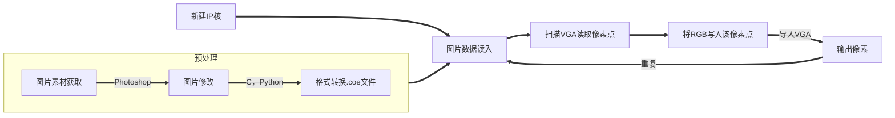
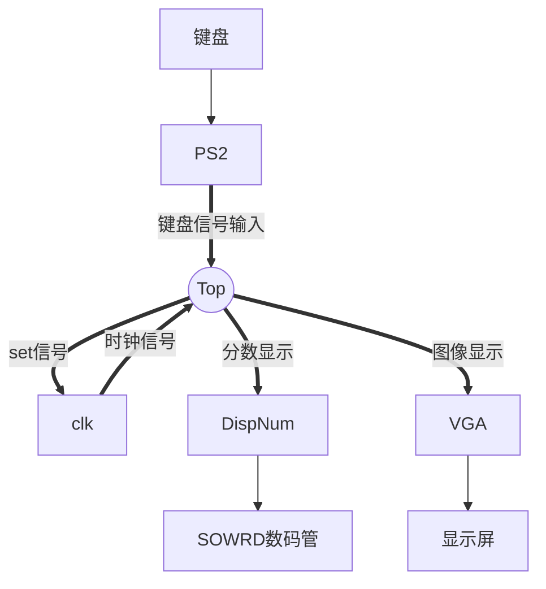
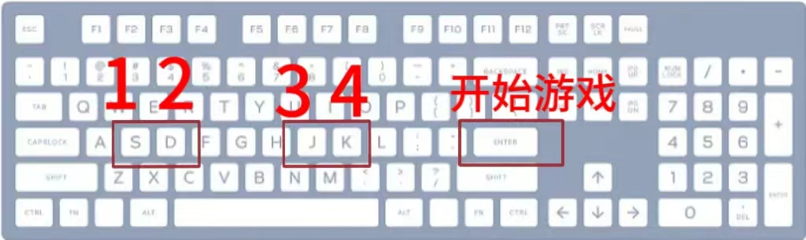
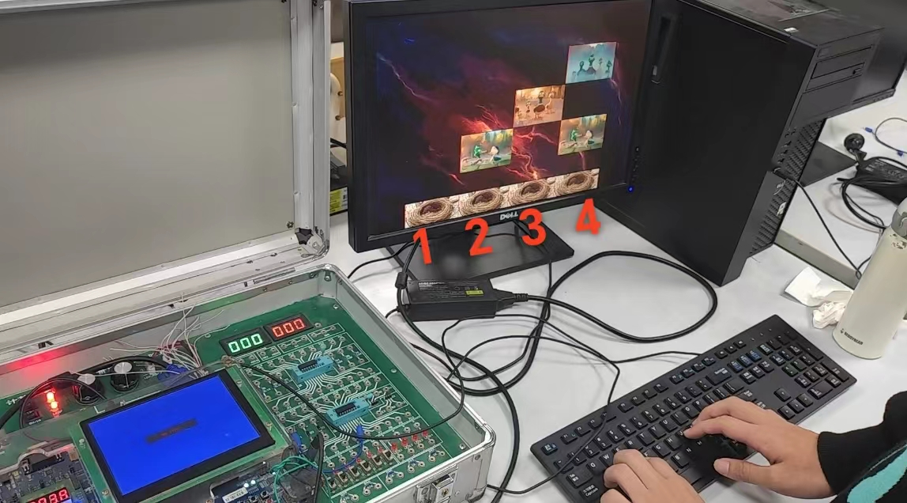
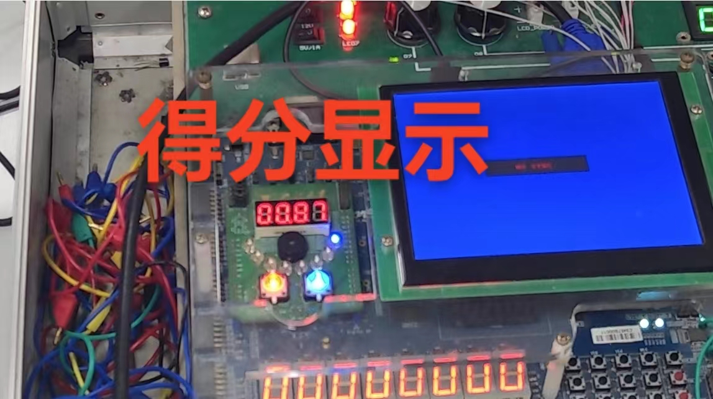

<br>

<br>

<div align=center></div>

# <center>数字逻辑设计·课程大作业{ignore=true}

# <center>基于FPGA的音游设计{ignore=true}

<div align=center>

<br>

<font size=6>组长：陈逸航</font>

专业：软件工程

学号：3220103591

<font size=6>组员：李秋宇</font>

专业：计算机科学与技术

学号：3220103373

</div>

<div style="page-break-after: always"></div>

# 目录{ignore=true}

<!-- @import "[TOC]" {cmd="toc" depthFrom=1 depthTo=6 orderedList=true} -->

<!-- code_chunk_output -->

1. [项目背景](#项目背景)
    1. [FPGA与开发平台](#fpga与开发平台)
    2. [游戏介绍](#游戏介绍)
    3. [设计与玩法介绍](#设计与玩法介绍)
    4. [设计重难点分析](#设计重难点分析)
2. [整体结构](#整体结构)
    1. [I/O 模块](#io-模块)
    2. [时钟](#时钟)
    3. [得分判定](#得分判定)
    4. [顶层模块](#顶层模块)
3. [模块介绍](#模块介绍)
    1. [PS2键盘信号模块](#ps2键盘信号模块)
    2. [VGA显示模块](#vga显示模块)
        1. [预处理](#预处理)
        2. [IP核创建](#ip核创建)
    3. [DispNum数码管数字显示模块](#dispnum数码管数字显示模块)
    4. [clk时钟信号](#clk时钟信号)
    5. [Top顶层模块](#top顶层模块)
4. [游戏演示](#游戏演示)
5. [改进思路](#改进思路)
    1. [分数显示](#分数显示)
    2. [随机下落](#随机下落)
    3. [得分排行榜](#得分排行榜)
    4. [防抖动](#防抖动)
6. [成员分工](#成员分工)
7. [工程说明](#工程说明)
8. [源代码](#源代码)
    1. [Top.v](#topv)
    2. [vgac.v](#vgacv)
    3. [disp_num.v](#disp_numv)
    4. [PS2.v](#ps2v)
    5. [block3.v](#block3v)

<!-- /code_chunk_output -->

<div style="page-break-after:always"></div>

# 项目背景

## FPGA与开发平台

FPGA（*Field－Programmable Gate Array*，即现场可编程门阵列）是在PAL、GAL、CPLD等可编程器件的基础上进一步发展产物。以硬件描述语言（Verilog或VHDL）所完成的电路设计，可以经过简单的综合与布局，快速的烧录至FPGA上进行测试。这些可编程元件可以被用来实现一些基本的逻辑门电路或者更复杂的一些的组合功能。

Xilinx的SWORD实验板为可编程的实验板，而且实验板还可以和许多外部设备进行连接，例如PS2、鼠标或者显示器，从而可以在FPGA的基础上设计使用PS2、鼠标的调用，或者显示器上显示图片。

本次设计所用的硬件编程软件为Xilinx公司设计的ISE 14.7软件，所使用的语言为Verilog语言。该软件的使用和Verilog语言的学习都较为简单，和c语言有相似之处。同方式或混合方式对设计建模。这些方式包括：行为描述方式建模；数据流方式建模；结构化方式建模等。Verilog HDL 中有两类数据类型：线网数据类型和寄存器数据类型。线网类型表示构件间的物理连线，而寄存器类型表示抽象的数据存储元件。通过模块化的设计与相应的外部接口，可以实现较好的人机交互。

本次设计通过原理图和行为描述相结合的方式实现游戏的设计，显示器、PS2 外接设备优化游戏。

<div align=center></div>

## 游戏介绍

宇宙中散落着许多无家可归的小鸟，它们亟需回到巢穴。你的任务就是帮助他们找到自己的巢穴。

随着游戏的开始，小鸟们在4列方格中匀速下落，下方有4个巢穴。当小鸟们掉落到巢穴附近时，你负责使用四个巢穴接收对应下落的小鸟。拯救成功时小鸟就会归入巢穴，并且你的分数自动增加，拯救失败则小鸟错失回家的机会。

游戏时长为1min，玩家将通过键盘按键来获取尽可能高的分数。

## 设计与玩法介绍

游戏的原型是风靡网络的音游。由于实验室的资源有限、作者的时间精力有限等诸多不利因素，我们对音游类进行了一定程度的化简，在大体实现音游类游戏的目标效果后对整体进行了一定的优化和测试，并赋予其***拯救小鸟***的卡通因素，以求达到大学生喜爱的效果。

游戏开始呈现一个主界面，标有“GAMER”的帅气红底喷漆渲染图样。

当按下`Enter`键，即可进入游戏，四列小鸟开始随机下落。玩家可以通过按下`s`，`d`，`j`和`k`四个按键操作四个巢穴来接收小鸟并得分。

每次下落的小鸟呈现不同的造型，对应接收到小鸟会有不同的得分。

游戏得分将在板子的数码管上进行实时显示，游戏时长为1min，时间结束后将返回主界面，并显示最终得分。

## 设计重难点分析

综合考虑整体架构，我们分析得出以下重难点：

1. 图片的VGA显示
2. PS2键盘的输入输出
3. 小鸟的下落过程显示
4. 下落得分的判定
5. 分数的显示

<div style="page-break-after:always"></div>

# 整体结构

## I/O 模块

本游戏的交互方式为键盘输入输出，主要调用模块`PS2`。采用四个按键`s`，`d`，`j`和`k`来操控四个巢穴接收来自四列的小鸟；使用`Enter`键从游戏封面进入游戏。

输出主要由两部分组成，`VGA`的显示器游戏图形输出和数码管分数显示模块`dispnum`。

## 时钟

游戏时长为1min，系统的总时钟为游戏模块提供`clk`时钟脉冲信号。

## 得分判定

当小鸟下落到巢穴附近时，按下键盘按键以接收小鸟，此处需要判定小鸟的位置以及按键是否按下。

## 顶层模块

`Top`作为顶层模块将所有子模块的内容整合形成完整的工程项目文件

<div style="page-break-after:always"></div>

# 模块介绍

## PS2键盘信号模块

游戏交互通过键盘按键实现，其中键盘的信号传入依赖的是PS2模块。

根据PS/2协议，一次按键传输11位信号，其中有效信号为中间8位，所以利用PS2模块将有效信号读出，并作为子模块的输出进行键盘信号的传输。

由于本游戏实现仅需要5个按键，所以模块的实现内容量并不大，只需要判定是否是`Enter`,`s`,`d`,`j`,`k`即可。

```verilog
module PS2(
    input clk,
    input rst, // Reset signal.
    input ps2_clk, // The keyboard clock input.
    input ps2_data, // The keyboard input data.
    output reg [9:0] data_out, // This vector equals to the 4 boards in the game.
    output ready
);
/* CLock */
reg ps2_clk_flag0, ps2_clk_flag1, ps2_clk_flag2;

always@(posedge clk or posedge rst)begin
    if(rst)begin // Reset.
        ps2_clk_flag0 <= 1'b0;
        ps2_clk_flag1 <= 1'b0;
        ps2_clk_flag2 <= 1'b0;
    end
    else begin
        ps2_clk_flag0 <= ps2_clk;
        ps2_clk_flag1 <= ps2_clk_flag0;
        ps2_clk_flag2 <= ps2_clk_flag1;
    end
end

wire negedge_ps2_clk = !ps2_clk_flag1 & ps2_clk_flag2;
reg negedge_ps2_clk_shift;

always@(posedge clk)begin
    negedge_ps2_clk_shift <= negedge_ps2_clk;
end
/* Input keyboard data. */
reg [3:0]num; // Data bit position.
reg [0:7]tmp_data; // Store 8-bit data from ps2_data.

/* Read data bit-by-bit. */
always@(posedge clk or posedge rst)begin
        if(rst) // Reset.
                num <= 4'd0;
        else if (num == 4'd11) // At the max position.
                num <= 4'd0;
        else if (negedge_ps2_clk) // Read bit-by-bit.
                num <= num + 1'b1;
end

always@(posedge clk or posedge rst)begin
    if(rst) // Reset.
        temp_data <= 8'd0;
    else if (negedge_ps2_clk_shift)begin // Capture keyboard data in negtive edge of the ps2_clk.
        case(num)
            4'd2 : tmp_data[0] <= ps2_data;
            4'd3 : tmp_data[1] <= ps2_data;
            4'd4 : tmp_data[2] <= ps2_data;
            4'd5 : tmp_data[3] <= ps2_data;
            4'd6 : tmp_data[4] <= ps2_data;
            4'd7 : tmp_data[5] <= ps2_data;
            4'd8 : tmp_data[6] <= ps2_data;
            4'd9 : tmp_data[7] <= ps2_data;
            default: tmp_data <= tmp_data;
        endcase
    end
    else tmp_data <= tmp_data;
end
/* Data transmission. */
reg data_break, data_done, data_expand;
reg [9:0]data;
always @(posedge clk or posedge rst) begin
    if (rst) begin // Reset.
        data_break <= 1'b0;
        data <= 10'd0;
        data_done <=1'b0;
        data_expand <=1'b0;
    end
    else if (num == 4'd11) begin // One keyboard data is already read in.
        if (num == 4'd11) begin
            data_expand <= 1'b1; // Use keyboard expansion.
        end
        else if (tmp_data == 8'hF0) begin // 'F0' at the beginning means the code is a break code so enable data_break.
            data_break <= 1'b1;
        end
        else begin // Read the data directly.
            data <= {data_expand, data_break, tmp_data};
            data_done <= 1'b1; // Keyboard data is ready for transmission.
            data_expand <= 1'b0;
            data_break <= 1'b0;
        end
    end
end
/* Output. */
assign data_out = data;
assign ready = data_done;

endmodule
```

模块流程如下：


## VGA显示模块

图形界面在VGA的显示需要我们对正常的图片文件进行一定的格式修改，之后才能将图片数据作为数据传输到VGA显示屏上。

### 预处理

1. 素材图片获取
2. 使用Photoshop编辑图片、修改图片属性
3. 编写Python，C程序将图片文件转为.coe文件

通过上网获得我们需要的素材图片，将其下载至本地。由于其图片存在冗余部分，且图片属性不是32位png图片所以我们使用Photoshop进行图片的修改，并使用一些格式工具将其格式进行转换

VGA显示屏需要.coe文件，所以我们编写了一个Python程序来实现png转coe，一个c程序来实现bmp转coe，代码如下：

```python
#!/usr/bin/python3
import numpy as np
from PIL import Image

# 图片文件路径
img_path = 'R-C.png'

# 调整原图像大小可设置set_size=1,反之为=0
set_size = 0
img_w = 300
img_h = 200

# 读取图片并做大小调整
def gen_img():
    img = Image.open(img_path)
    if set_size == 1:
        img = img.resize((img_w, img_h), Image.ANTIALIAS)
        img.save('re_picture.jpg')
    img = np.array(img)

    return img

# 分别生成R G B的coe文件
def gen_coe(img):
    img_R = []
    img_G = []
    img_B = []
    for i in range(img.shape[0]):
        for j in range(img.shape[1]):
            img_R.append(img[i][j][0])
            img_G.append(img[i][j][1])
            img_B.append(img[i][j][2])

    with open('Picture_R_Rom.coe', 'w') as f:
        f.writelines('memory_initialization_radix = 10;\nmemory_initialization_vector = ')
        for i in range(len(img_R)):
            if i % img.shape[1] == 0:
                f.write('\n')
            f.write(str(img_R[i]).rjust(4) + ',')
    f.close()

    with open('Picture_G_Rom.coe', 'w') as f:
        f.writelines('memory_initialization_radix = 10;\nmemory_initialization_vector = ')
        for i in range(len(img_G)):
            if i % img.shape[1] == 0:
                f.write('\n')
            f.write(str(img_G[i]).rjust(4) + ',')
    f.close()

    with open('Picture_B_Rom.coe', 'w') as f:
        f.writelines('memory_initialization_radix = 10;\nmemory_initialization_vector = ')
        for i in range(len(img_B)):
            if i % img.shape[1] == 0:
                f.write('\n')
            f.write(str(img_B[i]).rjust(4) + ',')
    f.close()

# coe文件转换成图片
def coe2picture():
    infos_R = []
    with open('Picture_R_Rom.coe', 'r') as f:
        info = f.read().splitlines()
        for i in range(2, len(info)):
            info1 = [int(a) for a in info[i].split(',')[:-1]]
            infos_R.append(info1)
    f.close()

    infos_G = []
    with open('Picture_G_Rom.coe', 'r') as f:
        info = f.read().splitlines()
        for i in range(2, len(info)):
            info1 = [int(a) for a in info[i].split(',')[:-1]]
            infos_G.append(info1)
    f.close()

    infos_B = []
    with open('Picture_B_Rom.coe', 'r') as f:
        info = f.read().splitlines()
        for i in range(2, len(info)):
            info1 = [int(a) for a in info[i].split(',')[:-1]]
            infos_B.append(info1)
    f.close()

    img_array = np.empty((np.array(infos_B).shape[0],np.array(infos_B).shape[1],3), dtype=int)
    if set_size == 1:
        img_array = np.empty((img_h,img_w,3), dtype=int)

    for i in range(np.array(infos_B).shape[0]):
        for j in range(np.array(infos_B).shape[1]):
            img_array[i][j][0] = infos_R[i][j]
            img_array[i][j][1] = infos_G[i][j]
            img_array[i][j][2] = infos_B[i][j]


    img_pil = Image.fromarray(np.uint8(img_array))
    img_pil.save('coe2picture.jpg')

if __name__ == '__main__':
    img = gen_img()
    gen_coe(img)
    coe2picture()
```

同时编写一个c程序来实现bmp转coe，代码如下：

```c
#define _CRT_SECURE_NO_DEPRECATE
#include <windows.h>
#include <stdio.h>
#include <stdlib.h>
#include <string.h>

FILE *outfp;
int carry2;
int BMPtoCOE(char *BMPfilename, int isfinished)
{
    FILE *fp;
    if ((fp = fopen(BMPfilename, "rb")) == NULL)
    {
        printf("在该路径下找不到该图片\n");
        return 1;
    }
    char bm[2];
    fseek(fp, sizeof(BITMAPFILEHEADER), 0);
    BITMAPINFOHEADER head;
    fread(&head, sizeof(BITMAPINFOHEADER), 1, fp);
    int picwidth = head.biWidth, picheight = head.biHeight;
    short ind;
    fseek(fp, 0L, 0);
    fread(bm, 2, 1, fp);
    fseek(fp, 0x1CL, 0);
    fread(&ind, 2, 1, fp);
    if (bm[0] != 'B' || bm[1] != 'M' || ind != 32)
    {
        printf("该图片不是 32 位的位图\n");
        return 1;
    }
    if (picheight < 0)
        picheight = -picheight;
    fseek(fp, 0x36L, 0);
    printf("图片尺寸%d*%d\n", picwidth, picheight);
    int buf = (picwidth * 3 % 4) ? 4 - (picwidth * 3) % 4 : 0;
    char *tmp = (char *)malloc(sizeof(char) * buf);
    int i, j;
    unsigned char r, g, b, t;
    for (i = picheight - 1; i >= 0; i--)
        for (j = picwidth - 1; j >= 0; j--)
        {
            fread(&b, 1, 1, fp);
            fread(&g, 1, 1, fp);
            fread(&r, 1, 1, fp);
            fprintf(outfp, "%3x%x%x", (int)(b / 256.0 * 16), (int)(g / 256.0 * 16), (int)(r / 256.0 * 16));
            if (i == 0 && j == 0 && isfinished)
                fprintf(outfp, ";");
            else
                fprintf(outfp, ",");
            carry2++;
            if (carry2 == 16)
                fprintf(outfp, "\n"), carry2 = 0;

            fread(&t, 1, 1, fp);
        }
    free(tmp);
    fclose(fp);
    return 0;
}
int main()
{
    outfp = fopen("C:\\Users\\金银白黑红\\Desktop\\新建文件夹\\Keydown.coe", "w");
    int i;
    char s[20] = "Keydown.bmp";
    fprintf(outfp, "memory_initialization_radix=16;\nmemory_initialization_vector =\n");
    BMPtoCOE(s, 1);
    system("pause");
    return 0;
}
```

完成上述预操作后，进行IP核的创建

### IP核创建

1. 创建IP核，名字起为background

@import "IP1.png"

2. 选择 Block Memory Generator，点击 next

@import "IP2.png"

3. 选择单端口的只读ROM

@import "IP3.png"

4. 调整合适的参数。选择12位输出，根据背景图片大小640\*480和其他小图片的大小120\*60填入的参数307200

@import "IP4.png"

完成上述后即可调用VGA模块显示图片。

模块流程图如下：



## DispNum数码管数字显示模块

游戏得分将在SWORD板的数码管上进行显示，得分作为子模块输入信号将对应展示在数码管上，这里主要调用了本学期实验课中已经实现的DisplayNumber模块，详细原理不再赘述。

DisplayNumber模块又分别调用了一些实验课已经实现的子模块，其文件结构和依赖关系如下：

`DisplayNumber.v`
* `clkdiv.v`
* `DisplaySync.v`
* * `Mux4to1.v`
* * `Mux5to1b4.v`
* `MyMC14495.v`


## clk时钟信号

系统的时钟信号模块。游戏开始时接入使能信号，产生时钟脉冲方波。


## Top顶层模块

顶层模块整合所有子模块，并实现总体游戏效果

分数判定、游戏时长倒计时、小鸟下落等均由top模块完成

完整源代码见文末

子模块依赖关系：



<div style="page-break-after:always"></div>

# 游戏演示

键盘可用键位如下：

<div align=center></div>

打开游戏并等待加载后会显示游戏封面：

<div align=center></div>

之后按下`Enter`键即可进入游戏

进入游戏后界面如下：

<div align=center></div>

之后四列将会出现下落的小鸟，在小鸟接近底部巢穴时按下对应的键位即可接收小鸟并得分

游戏实时得分展示在数码管上：

<div align=center></div>

> 注：分数显示形式为16进制

时间结束后将自动返回到游戏封面

<div style="page-break-after:always"></div>

# 改进思路

由于临近期末，可怜的计院学生面临诸多ddl，没有足够的时间精力完成后续的项目改进，所以仅在此提出一些改进的思路

## 分数显示

本项目中的分数显示是16进制，没有完成对十进制的转换显示

## 随机下落

游戏过程的随机下落并没有较好完成。事实上我们设计了一个随机模块`Random`以用于生成一个足够随机的序列来提供小鸟下落的随机选择，然而在实现的过程中没有达到预期的效果，所以后续bug有待修缮

```verilog
/*
 * Module: Random
 * This module is used to generate a series of random data
 * The random data consists of only 0 and 1.
 */
module Random(
    input clk,
    input rst,
    output reg rand
    );
	 reg [6:0] Time;
	 reg [31:0] seed;
initial begin
  Time=0;
  seed<=32'b00011110010101011011010011100101;
end;
always@(posedge clk)begin
    Time=Time+1;
    if (rst == 1'b1) begin
      if(Time==0) rand <= seed[0];
		if(Time==1) rand <= seed[1];
		if(Time==2) rand <= seed[2];
		if(Time==3) rand <= seed[3];
		if(Time==4) rand <= seed[4];
		if(Time==5) rand <= seed[5];
		if(Time==6) rand <= seed[6];
		if(Time==7) rand <= seed[7];
		if(Time==8) rand <= seed[8];
		if(Time==9) rand <= seed[9];
		if(Time==10) rand <= seed[10];
		if(Time==11) rand <= seed[11];
		if(Time==12) rand <= seed[12];
		if(Time==13) rand <= seed[13];
		if(Time==14) rand <= seed[14];
		if(Time==15) rand <= seed[15];
		if(Time==16) rand <= seed[16];
		if(Time==17) rand <= seed[17];
		if(Time==18) rand <= seed[18];
		if(Time==19) rand <= seed[19];
		if(Time==20) rand <= seed[20];
		if(Time==21) rand <= seed[21];
		if(Time==22) rand <= seed[22];
		if(Time==23) rand <= seed[23];
		if(Time==24) rand <= seed[24];
		if(Time==25) rand <= seed[25];
		if(Time==26) rand <= seed[26];
		if(Time==27) rand <= seed[27];
		if(Time==28) rand <= seed[28];
		if(Time==29) rand <= seed[29];
		if(Time==30) rand <= seed[30];
		if(Time==31) rand <= seed[31];
    end 
	 if(Time==32) Time=0;

end
endmodule

```

## 得分排行榜

本项目设计之初有考虑到利用寄存器设计一个得分排行榜，每次游戏结束后将当局得分与历史最高得分进行比较，并选择其中更高者。由于时间限制，没有完成

## 防抖动

得分的增加其实会出现随机性，因为防抖动并没有完成

<div style="page-break-after:always"></div>

# 成员分工

* 组长：陈逸航60%
* 组员：李秋宇40%

<div style="page-break-after:always"></div>

# 工程说明

本次大作业难度其实不小，临近期末，作者二人都投入了大量的时间和精力，周末两天连着泡在实验室内钻研，最后打造出这样的作品。不能说非常完美，也没有达到设计之初的效果，但是大体上实现了想要的功能，还是非常有成就感的，也学到了很多新的知识，对Verilog的认识也更进一步。《数字逻辑设计》这门课作为我们计院学子进入大学以后学习到比较正统的专业硬课之一，首次完成了这样的大作业的挑战，对今后的学习和工作有很大的帮助。

特别感谢洪奇军老师的实验课指导，王跃明老师在理论课上的精彩教学

<div style="page-break-after:always"></div>

# 源代码

## Top.v

```verilog{.line-numbers}
`timescale 1ns / 1ps

module Top(
	input clock,
	input rstn,
	input [15:0]SW,
	input ps2_clk,
	input ps2_data,
	output [3:0]AN,
	output [7:0]SEG,
	output hs,
	output vs,
	output [3:0] r,
	output [3:0] g,
	output [3:0] b,
	output SEGLED_CLK,
	output SEGLED_CLR,
	output SEGLED_DO,
	output SEGLED_PEN,
  // output LED_CLK,
	//output LED_CLR,
	//output LED_DO,
	//output LED_PEN,
	//inout [4:0]BTN_X,
	//inout [3:0]BTN_Y,
	output buzzer
    );
	 

	
	reg [31:0]clkdiv;
	always@(posedge clock) begin
		clkdiv <= clkdiv + 1'b1;
	end
	assign buzzer = 1'b1;
	wire [15:0] SW_OK;
	AntiJitter #(4) a0[15:0](.clk(clkdiv[15]), .I(SW), .O(SW_OK));
	
	wire [4:0] keyCode;
	wire keyReady;
	
	wire [31:0] segTestData;
	wire [3:0]sout;
   Seg7Device segDevice(.clkIO(clkdiv[3]), .clkScan(clkdiv[15:14]), .clkBlink(clkdiv[25]),
		.data(segTestData), .point(8'h0), .LES(8'h0),
		.sout(sout));
	assign SEGLED_CLK = sout[3];
	assign SEGLED_DO = sout[2];
	assign SEGLED_PEN = sout[1];
	assign SEGLED_CLR = sout[0];
	
 	reg [11:0] vga_data;
 	wire [9:0] col_addr;
 	wire [8:0] row_addr;
	
	vgac v0 (
		.vga_clk(clkdiv[1]), .clrn(SW_OK[0]), .d_in(vga_data), .row_addr(row_addr), .col_addr(col_addr), .r(r), .g(g), .b(b), .hs(hs), .vs(vs)
	);
	
	
	//Definition of Reg and Wire
	reg cover;
	reg finish;
	reg gamebegin;
	initial begin
	  cover=1;
	  finish=0;
	  gamebegin=0;
	end 
	
	wire clk_100ms;
	clk_100ms c1(clock,clk_100ms);
	wire clk_1s;
	clk_1s c2(clock,clk_1s);
	wire clk_4s;
	clk_4s c3(clock,clk_4s);
	wire clk_10ms;
	clk_10ms c7(clock,clk_10ms);
	wire clk_cover,clk_start;
	assign clk_cover=clock&(cover);
	assign clk_start=clock&(~cover)&(~finish);
	
	
	reg[18:0] first;
   wire[11:0] spo_first;
   newbackground b1(.addra(first),.douta(spo_first),.clka(clkdiv[1]));
	always @(posedge clk_cover)begin 
    first<=(col_addr>=0&&col_addr<=639&&row_addr>=0&&row_addr<=479)?col_addr+(479-row_addr)*640:0; //给封面赋值
   end
	
	reg[18:0] Background;
   wire[11:0] spo_Background;
   gamebg b2(.addra(Background),.douta(spo_Background),.clka(clkdiv[1]));
	always @(posedge clock)begin 
    Background<=(col_addr>=0&&col_addr<=639&&row_addr>=0&&row_addr<=479)?col_addr+(479-row_addr)*640:0; //给background赋值
   end
	
	
	
	//nowpostion
	reg[9:0] nowpos1;
	reg flag1;
	reg[9:0] nowpos2;
	reg flag2;
	reg[9:0] nowpos3;
	reg flag3;
	reg[9:0] nowpos4;
	reg flag4;
	
	//block
	reg[13:0] block1_1;
	wire[11:0] spo_block1_1;
	reg[13:0] block1_2;
	wire[11:0] spo_block1_2;
	reg[13:0] block1_3;
	wire[11:0] spo_block1_3;
	reg[13:0] block1_4;
	wire[11:0] spo_block1_4;
	
	reg[13:0] block2_1;
	wire[11:0] spo_block2_1;
	reg[13:0] block2_2;
	wire[11:0] spo_block2_2;
	reg[13:0] block2_3;
	wire[11:0] spo_block2_3;
	reg[13:0] block2_4;
	wire[11:0] spo_block2_4;
	
	reg[13:0] block3_1;
	wire[11:0] spo_block3_1;
	reg[13:0] block3_2;
	wire[11:0] spo_block3_2;
	reg[13:0] block3_3;
	wire[11:0] spo_block3_3;
	reg[13:0] block3_4;
	wire[11:0] spo_block3_4;
	
	reg[13:0] block4_1;
	wire[11:0] spo_block4_1;
	reg[13:0] block4_2;
	wire[11:0] spo_block4_2;
	reg[13:0] block4_3;
	wire[11:0] spo_block4_3;
	reg[13:0] block4_4;
	wire[11:0] spo_block4_4;
	
	reg[12:0] keyup_pic_1;
	wire[11:0] spo_keyup_pic_1;
	reg[12:0] keydown_pic_1;
	wire[11:0] spo_keydown_pic_1;
	
	reg[12:0] keyup_pic_2;
	wire[11:0] spo_keyup_pic_2;
	reg[12:0] keydown_pic_2;
	wire[11:0] spo_keydown_pic_2;
	
	reg[12:0] keyup_pic_3;
	wire[11:0] spo_keyup_pic_3;
	reg[12:0] keydown_pic_3;
	wire[11:0] spo_keydown_pic_3;
	
	reg[12:0] keyup_pic_4;
	wire[11:0] spo_keyup_pic_4;
	reg[12:0] keydown_pic_4;
	wire[11:0] spo_keydown_pic_4;
	
	Keyup_pic k1_1(.addra(keyup_pic_1),.douta(spo_keyup_pic_1),.clka(clkdiv[1]));
	always @(posedge clock)begin 
    keyup_pic_1<=(col_addr>=80&&col_addr<=199&&row_addr>=420&&row_addr<=479)?col_addr-60+(479-row_addr)*120:0; //给background赋值
   end
	Keydown_pic k0_1(.addra(keydown_pic_1),.douta(spo_keydown_pic_1),.clka(clkdiv[1]));
	always @(posedge clock)begin 
    keydown_pic_1<=(col_addr>=80&&col_addr<=199&&row_addr>=420&&row_addr<=479)?col_addr+60+(479-row_addr)*120:0; //给background赋值
   end
	
	Keyup_pic k1_2(.addra(keyup_pic_2),.douta(spo_keyup_pic_2),.clka(clkdiv[1]));
	always @(posedge clock)begin 
    keyup_pic_2<=(col_addr>=200&&col_addr<=319&&row_addr>=420&&row_addr<=479)?col_addr-60+(479-row_addr)*120:0; //给background赋值
   end
	Keydown_pic k0_2(.addra(keydown_pic_2),.douta(spo_keydown_pic_2),.clka(clkdiv[1]));
	always @(posedge clock)begin 
    keydown_pic_2<=(col_addr>=200&&col_addr<=319&&row_addr>=420&&row_addr<=479)?col_addr+60+(479-row_addr)*120:0; //给background赋值
   end
	
	Keyup_pic k1_3(.addra(keyup_pic_3),.douta(spo_keyup_pic_3),.clka(clkdiv[1]));
	always @(posedge clock)begin 
    keyup_pic_3<=(col_addr>=320&&col_addr<=439&&row_addr>=420&&row_addr<=479)?col_addr-60+(479-row_addr)*120:0; //给background赋值
   end
	Keydown_pic k0_3(.addra(keydown_pic_3),.douta(spo_keydown_pic_3),.clka(clkdiv[1]));
	always @(posedge clock)begin 
    keydown_pic_3<=(col_addr>=320&&col_addr<=439&&row_addr>=420&&row_addr<=479)?col_addr+60+(479-row_addr)*120:0; //给background赋值
   end
	
	Keyup_pic k1_4(.addra(keyup_pic_4),.douta(spo_keyup_pic_4),.clka(clkdiv[1]));
	always @(posedge clock)begin 
    keyup_pic_4<=(col_addr>=440&&col_addr<=559&&row_addr>=420&&row_addr<=479)?col_addr-60+(479-row_addr)*120:0; //给background赋值
   end
	Keydown_pic k0_4(.addra(keydown_pic_4),.douta(spo_keydown_pic_4),.clka(clkdiv[1]));
	always @(posedge clock)begin 
    keydown_pic_4<=(col_addr>=440&&col_addr<=559&&row_addr>=420&&row_addr<=479)?col_addr+60+(479-row_addr)*120:0; //给background赋值
   end
	
	
	//which is displayed
	reg randpos1_1,randpos1_2,randpos1_3,randpos1_4;
	reg randpos2_1,randpos2_2,randpos2_3,randpos2_4;
	reg randpos3_1,randpos3_2,randpos3_3,randpos3_4;
	reg randpos4_1,randpos4_2,randpos4_3,randpos4_4;
	
	//IP core invoke
	birdblock1 x1_1(.addra(block1_1),.douta(spo_block1_1),.clka(clkdiv[1]));
	birdblock1 x1_2(.addra(block1_2),.douta(spo_block1_2),.clka(clkdiv[1]));
	birdblock1 x1_3(.addra(block1_3),.douta(spo_block1_3),.clka(clkdiv[1]));
	birdblock1 x1_4(.addra(block1_4),.douta(spo_block1_4),.clka(clkdiv[1]));
	
	block2 x2_1(.addra(block2_1),.douta(spo_block2_1),.clka(clkdiv[1]));
	block2 x2_2(.addra(block2_2),.douta(spo_block2_2),.clka(clkdiv[1]));
	block2 x2_3(.addra(block2_3),.douta(spo_block2_3),.clka(clkdiv[1]));
	block2 x2_4(.addra(block2_4),.douta(spo_block2_4),.clka(clkdiv[1]));
	
	block3 x3_1(.addra(block3_1),.douta(spo_block3_1),.clka(clkdiv[1]));
	block3 x3_2(.addra(block3_2),.douta(spo_block3_2),.clka(clkdiv[1]));
	block3 x3_3(.addra(block3_3),.douta(spo_block3_3),.clka(clkdiv[1]));
	block3 x3_4(.addra(block3_4),.douta(spo_block3_4),.clka(clkdiv[1]));
	
	block4 x4_1(.addra(block4_1),.douta(spo_block4_1),.clka(clkdiv[1]));
	block4 x4_2(.addra(block4_2),.douta(spo_block4_2),.clka(clkdiv[1]));
	block4 x4_3(.addra(block4_3),.douta(spo_block4_3),.clka(clkdiv[1]));
	block4 x4_4(.addra(block4_4),.douta(spo_block4_4),.clka(clkdiv[1]));
	
	initial begin
	  nowpos1=-90;
	  nowpos2=-180;
	  nowpos3=-270;
	  nowpos4=-360;
	end
	
	always @(posedge clk_10ms)begin
	  nowpos1=nowpos1+1;
	  if(nowpos1==271)begin
   	nowpos1=-90;
	  end
	  
	  nowpos2=nowpos2+1;
	  if(nowpos2==271)begin
   	nowpos2=-90;
	  end
	  
	  nowpos3=nowpos3+1;
	  if(nowpos3==271)begin
   	nowpos3=-90;
	  end
	  
	  nowpos4=nowpos4+1;
	  if(nowpos4==271)begin
   	nowpos4=-90;
	  end
	  
	end
	
	always @(posedge clk_4s)begin
	  randpos1_1=1;
	  randpos1_2=0;
	  randpos1_3=1;
	  randpos1_4=0;
	  
	  randpos2_1=0;
	  randpos2_2=1;
	  randpos2_3=0;
	  randpos2_4=1;
	  
	  randpos3_1=0;
	  randpos3_2=0;
	  randpos3_3=1;
	  randpos3_4=0;
	  
	  randpos4_1=0;
	  randpos4_2=0;
	  randpos4_3=0;
	  randpos4_4=1;
	end
	
	always @(posedge clock)begin 
	 block1_1<=(col_addr>=80&&col_addr<200&&row_addr>=nowpos1*1+60&&row_addr<(nowpos1*1+60+90))?(col_addr-60)+((nowpos1*1+90)-(row_addr-60))*120:0;  //给background赋值
	 block1_2<=(col_addr>=200&&col_addr<320&&row_addr>=nowpos1*1+60&&row_addr<(nowpos1*1+60+90))?(col_addr-180)+((nowpos1*1+90)-(row_addr-60))*120:0;  //给background赋值
	 block1_3<=(col_addr>=320&&col_addr<440&&row_addr>=nowpos1*1+60&&row_addr<(nowpos1*1+60+90))?(col_addr-300)+((nowpos1*1+90)-(row_addr-60))*120:0;  //给background赋值
    block1_4<=(col_addr>=440&&col_addr<560&&row_addr>=nowpos1*1+60&&row_addr<(nowpos1*1+60+90))?(col_addr-420)+((nowpos1*1+90)-(row_addr-60))*120:0;  //给background赋值
	 
	 block2_1<=(col_addr>=80&&col_addr<200&&row_addr>=nowpos2*1+60&&row_addr<(nowpos2*1+60+90))?(col_addr-60)+((nowpos2*1+90)-(row_addr-60))*120:0;  //给background赋值
	 block2_2<=(col_addr>=200&&col_addr<320&&row_addr>=nowpos2*1+60&&row_addr<(nowpos2*1+60+90))?(col_addr-180)+((nowpos2*1+90)-(row_addr-60))*120:0;  //给background赋值
	 block2_3<=(col_addr>=320&&col_addr<440&&row_addr>=nowpos2*1+60&&row_addr<(nowpos2*1+60+90))?(col_addr-300)+((nowpos2*1+90)-(row_addr-60))*120:0;  //给background赋值
    block2_4<=(col_addr>=440&&col_addr<560&&row_addr>=nowpos2*1+60&&row_addr<(nowpos2*1+60+90))?(col_addr-420)+((nowpos2*1+90)-(row_addr-60))*120:0;  //给background赋值
	
	 block3_1<=(col_addr>=80&&col_addr<200&&row_addr>=nowpos3*1+60&&row_addr<(nowpos3*1+60+90))?(col_addr-60)+((nowpos3*1+90)-(row_addr-60))*120:0;  //给background赋值
	 block3_2<=(col_addr>=200&&col_addr<320&&row_addr>=nowpos3*1+60&&row_addr<(nowpos3*1+60+90))?(col_addr-180)+((nowpos3*1+90)-(row_addr-60))*120:0;  //给background赋值
	 block3_3<=(col_addr>=320&&col_addr<440&&row_addr>=nowpos3*1+60&&row_addr<(nowpos3*1+60+90))?(col_addr-300)+((nowpos3*1+90)-(row_addr-60))*120:0;  //给background赋值
    block3_4<=(col_addr>=440&&col_addr<560&&row_addr>=nowpos3*1+60&&row_addr<(nowpos3*1+60+90))?(col_addr-420)+((nowpos3*1+90)-(row_addr-60))*120:0;  //给background赋值
	 
	 block4_1<=(col_addr>=80&&col_addr<200&&row_addr>=nowpos4*1+60&&row_addr<(nowpos4*1+60+90))?(col_addr-60)+((nowpos4*1+90)-(row_addr-60))*120:0;  //给background赋值
	 block4_2<=(col_addr>=200&&col_addr<320&&row_addr>=nowpos4*1+60&&row_addr<(nowpos4*1+60+90))?(col_addr-180)+((nowpos4*1+90)-(row_addr-60))*120:0;  //给background赋值
	 block4_3<=(col_addr>=320&&col_addr<440&&row_addr>=nowpos4*1+60&&row_addr<(nowpos4*1+60+90))?(col_addr-300)+((nowpos4*1+90)-(row_addr-60))*120:0;  //给background赋值
    block4_4<=(col_addr>=440&&col_addr<560&&row_addr>=nowpos4*1+60&&row_addr<(nowpos4*1+60+90))?(col_addr-420)+((nowpos4*1+90)-(row_addr-60))*120:0;  //给background赋值
	end
	
	
	
	//main
	always@(posedge clock) begin
     if(cover==1) begin
       vga_data<=spo_first[11:0];
	  end
	  if(cover==0) begin
	    vga_data<=spo_Background[11:0];
	  end
	  if(gamebegin==1) begin
	  
	    if(col_addr>=80&&col_addr<200&&row_addr>=nowpos1*1+60&&row_addr<(nowpos1*1+60+90)&&randpos1_1==1) begin
		   vga_data<=spo_block1_1[11:0];
		 end
		 if(col_addr>=200&&col_addr<320&&row_addr>=nowpos1*1+60&&row_addr<(nowpos1*1+60+90)&&randpos1_2==1) begin
		   vga_data<=spo_block1_2[11:0];
		 end
		 if(col_addr>=320&&col_addr<440&&row_addr>=nowpos1*1+60&&row_addr<(nowpos1*1+60+90)&&randpos1_3==1) begin
		   vga_data<=spo_block1_3[11:0];
		 end
		 if(col_addr>=440&&col_addr<560&&row_addr>=nowpos1*1+60&&row_addr<(nowpos1*1+60+90)&&randpos1_4==1) begin
		   vga_data<=spo_block1_4[11:0];
		 end
		 
		 if(col_addr>=80&&col_addr<200&&row_addr>=nowpos2*1+60&&row_addr<(nowpos2*1+60+90)&&randpos2_1==1) begin
		   vga_data<=spo_block2_1[11:0];
		 end
		 if(col_addr>=200&&col_addr<320&&row_addr>=nowpos2*1+60&&row_addr<(nowpos2*1+60+90)&&randpos2_2==1) begin
		   vga_data<=spo_block2_2[11:0];
		 end
		 if(col_addr>=320&&col_addr<440&&row_addr>=nowpos2*1+60&&row_addr<(nowpos2*1+60+90)&&randpos2_3==1) begin
		   vga_data<=spo_block2_3[11:0];
		 end
		 if(col_addr>=440&&col_addr<560&&row_addr>=nowpos2*1+60&&row_addr<(nowpos2*1+60+90)&&randpos2_4==1) begin
		   vga_data<=spo_block2_4[11:0];
		 end
		 
		 if(col_addr>=80&&col_addr<200&&row_addr>=nowpos3*1+60&&row_addr<(nowpos3*1+60+90)&&randpos3_1==1) begin
		   vga_data<=spo_block3_1[11:0];
		 end
		 if(col_addr>=200&&col_addr<320&&row_addr>=nowpos3*1+60&&row_addr<(nowpos3*1+60+90)&&randpos3_2==1) begin
		   vga_data<=spo_block3_2[11:0];
		 end
		 if(col_addr>=320&&col_addr<440&&row_addr>=nowpos3*1+60&&row_addr<(nowpos3*1+60+90)&&randpos3_3==1) begin
		   vga_data<=spo_block3_3[11:0];
		 end
		 if(col_addr>=440&&col_addr<560&&row_addr>=nowpos3*1+60&&row_addr<(nowpos3*1+60+90)&&randpos3_4==1) begin
		   vga_data<=spo_block3_4[11:0];
		 end
		 
		 if(col_addr>=80&&col_addr<200&&row_addr>=nowpos4*1+60&&row_addr<(nowpos4*1+60+90)&&randpos4_1==1) begin
		   vga_data<=spo_block4_1[11:0];
		 end
		 if(col_addr>=200&&col_addr<320&&row_addr>=nowpos4*1+60&&row_addr<(nowpos4*1+60+90)&&randpos4_2==1) begin
		   vga_data<=spo_block4_2[11:0];
		 end
		 if(col_addr>=320&&col_addr<440&&row_addr>=nowpos4*1+60&&row_addr<(nowpos4*1+60+90)&&randpos4_3==1) begin
		   vga_data<=spo_block4_3[11:0];
		 end
		 if(col_addr>=440&&col_addr<560&&row_addr>=nowpos4*1+60&&row_addr<(nowpos4*1+60+90)&&randpos4_4==1) begin
		   vga_data<=spo_block4_4[11:0];
		 end
		 
		 if(col_addr>=80&&col_addr<200&&row_addr>=420&&row_addr<479&&KeyUp_1==1) begin
		   vga_data<=spo_keyup_pic_1[11:0];
		 end
		 if(col_addr>=80&&col_addr<200&&row_addr>=420&&row_addr<479&&KeyUp_1==0) begin
		   vga_data<=spo_keydown_pic_1[11:0];
		 end
		 
		 if(col_addr>=200&&col_addr<320&&row_addr>=420&&row_addr<479&&KeyUp_2==1) begin
		   vga_data<=spo_keyup_pic_2[11:0];
		 end
		 if(col_addr>=200&&col_addr<320&&row_addr>=420&&row_addr<479&&KeyUp_2==0) begin
		   vga_data<=spo_keydown_pic_2[11:0];
		 end
		 
		 if(col_addr>=320&&col_addr<440&&row_addr>=420&&row_addr<479&&KeyUp_3==1) begin
		   vga_data<=spo_keyup_pic_3[11:0];
		 end
		 if(col_addr>=320&&col_addr<440&&row_addr>=420&&row_addr<479&&KeyUp_3==0) begin
		   vga_data<=spo_keydown_pic_3[11:0];
		 end
		 
		 if(col_addr>=440&&col_addr<560&&row_addr>=420&&row_addr<479&&KeyUp_4==1) begin
		   vga_data<=spo_keyup_pic_4[11:0];
		 end
		 if(col_addr>=440&&col_addr<560&&row_addr>=420&&row_addr<479&&KeyUp_4==0) begin
		   vga_data<=spo_keydown_pic_4[11:0];
		 end
	  end
	end//xianshifengmian
	
	//zShiftReg #(.WIDTH(16)) ledDevice (.clk(clkdiv[3]), .pdata(~ledData), .sout({LED_CLK,LED_DO,LED_PEN,LED_CLR}));

    wire clock_20ms;
	 clk_20ms c4(clock,clock_20ms);
    wire [9:0] data_out;
	 wire ready;
	 reg [15:0] score;
	 wire [15:0] OutputScore;
	 reg [6:0] game_time;
	 reg KeyUp_1;
	 reg KeyUp_2;
	 reg KeyUp_3;
	 reg KeyUp_4;
	 initial begin
	   score=0;
		KeyUp_1=1;
		KeyUp_2=1;
		KeyUp_3=1;
		KeyUp_4=1;
	 end
	 ps2_ver2 ps2(.clk(clock),.rst(1'b0),.ps2_clk(ps2_clk),.ps2_data(ps2_data),.data_out(data_out[9:0]),.ready(ready));
	 always@(posedge clock_20ms) begin
	   KeyUp_1=1;
		KeyUp_2=1;
		KeyUp_3=1;
		KeyUp_4=1;
	   if(cover==1) begin
		  if(data_out[8]==1'b0) begin
		    if(data_out[7:0]==8'h5a) begin
			   cover=0;
				gamebegin=1;
			 end
		  end
		end
		if(game_time==60) begin
		  cover=1;
		  gamebegin=0;
		end
		if(gamebegin==1) begin
		  if(data_out[8]==1'b0) begin
		    if(finish==0) begin
			   if(data_out[8]==1'b0) begin
				  if(data_out[7:0]==8'h1b) begin//s
				    if(nowpos1>=250&&nowpos1<=270&&randpos1_1==1) begin 
					   score<=score+1;
						KeyUp_1=0;
					 end
					 if(nowpos2>=250&&nowpos2<=270&&randpos2_1==1) begin
   				   score<=score+1;
						KeyUp_1=0; 
					 end
					 if(nowpos3>=250&&nowpos3<=270&&randpos3_1==1) begin
					   score<=score+1;
						KeyUp_1=0;
					 end
					 if(nowpos4>=250&&nowpos4<=270&&randpos4_1==1) begin
					   score<=score+1;
						KeyUp_1=0;
					 end
		        end
				  if(data_out[7:0]==8'h23) begin//d
				    if(nowpos1>=250&&nowpos1<=270&&randpos1_2==1) begin
					   score<=score+1;
						KeyUp_2=0;
					 end
					 if(nowpos2>=250&&nowpos2<=270&&randpos2_2==1) begin
					   score<=score+1;
						KeyUp_2=0;
					 end
					 if(nowpos3>=250&&nowpos3<=270&&randpos3_2==1) begin
					   score<=score+1;
						KeyUp_2=0;
					 end
					 if(nowpos4>=250&&nowpos4<=270&&randpos4_2==1) begin
					   score<=score+1;
						KeyUp_2=0;
					 end
		        end
				  if(data_out[7:0]==8'h3b) begin//j
				    if(nowpos1>=250&&nowpos1<=270&&randpos1_3==1) begin
					   score<=score+1;
						KeyUp_3=0;
					 end 
					 if(nowpos2>=250&&nowpos2<=270&&randpos2_3==1) begin 
					   score<=score+1;
						KeyUp_3=0;
					 end
					 if(nowpos3>=250&&nowpos3<=270&&randpos3_3==1) begin
					   score<=score+1;
						KeyUp_3=0;
					 end
					 if(nowpos4>=250&&nowpos4<=270&&randpos4_3==1) begin
					   score<=score+1;
						KeyUp_3=0;
					 end
		        end
				  if(data_out[7:0]==8'h42) begin//k
				    if(nowpos1>=250&&nowpos1<=270&&randpos1_4==1) begin 
					   score<=score+1;
						KeyUp_4=0;
					 end
					 if(nowpos2>=250&&nowpos2<=270&&randpos2_4==1) begin
					   score<=score+1;
						KeyUp_4=0;
					 end
					 if(nowpos3>=250&&nowpos3<=270&&randpos3_4==1) begin
					   score<=score+1;
						KeyUp_4=0;
					 end
					 if(nowpos4>=250&&nowpos4<=270&&randpos4_4==1) begin
					   score<=score+1;
						KeyUp_4=0;
					 end
		        end
			   end
			 end  
		  end		 
		end
	 end
	 always@ (posedge clk_1s) begin
	   if(gamebegin==1) begin
	   game_time=game_time+1;
		end
		if(game_time==61) begin
		game_time=0;
		end
	 end
	
	 assign OutputScore=score;
	 disp_num d0(clock, OutputScore, 4'b0000, 4'b0100, 1'b0, AN, SEG);
	 
endmodule

```

## vgac.v

```verilog{.line-numbers}
`timescale 1ns / 1ps
//////////////////////////////////////////////////////////////////////////////////
// Company: 
// Engineer: 
// 
// Create Date:    00:27:04 01/02/2016 
// Design Name: 
// Module Name:    vgac 
// Project Name: 
// Target Devices: 
// Tool versions: 
// Description: 
//
// Dependencies: 
//
// Revision: 
// Revision 0.01 - File Created
// Additional Comments: 
//
//////////////////////////////////////////////////////////////////////////////////
module vgac (vga_clk,clrn,d_in,row_addr,col_addr,rdn,r,g,b,hs,vs); // vgac
   input     [11:0] d_in;     // bbbb_gggg_rrrr, pixel
   input            vga_clk;  // 25MHz
   input            clrn;
   output reg [8:0] row_addr; // pixel ram row address, 480 (512) lines
   output reg [9:0] col_addr; // pixel ram col address, 640 (1024) pixels
   output reg [3:0] r,g,b; // red, green, blue colors
   output reg       rdn;      // read pixel RAM (active_low)
   output reg       hs,vs;    // horizontal and vertical synchronization
   // h_count: VGA horizontal counter (0-799)
   reg [9:0] h_count; // VGA horizontal counter (0-799): pixels
   always @ (posedge vga_clk) begin
       if (!clrn) begin
           h_count <= 10'h0;
       end else if (h_count == 10'd799) begin
           h_count <= 10'h0;
       end else begin 
           h_count <= h_count + 10'h1;
       end
   end
   // v_count: VGA vertical counter (0-524)
   reg [9:0] v_count; // VGA vertical   counter (0-524): lines
   always @ (posedge vga_clk or negedge clrn) begin
       if (!clrn) begin
           v_count <= 10'h0;
       end else if (h_count == 10'd799) begin
           if (v_count == 10'd524) begin
               v_count <= 10'h0;
           end else begin
               v_count <= v_count + 10'h1;
           end
       end
   end
    // signals, will be latched for outputs
    wire  [9:0] row    =  v_count - 10'd35;     // pixel ram row addr 
    wire  [9:0] col    =  h_count - 10'd143;    // pixel ram col addr 
    wire        h_sync = (h_count > 10'd95);    //  96 -> 799
    wire        v_sync = (v_count > 10'd1);     //   2 -> 524
    wire        read   = (h_count > 10'd142) && // 143 -> 782
                         (h_count < 10'd783) && //        640 pixels
                         (v_count > 10'd34)  && //  35 -> 514
                         (v_count < 10'd515);   //        480 lines
    // vga signals
    always @ (posedge vga_clk) begin
        row_addr <=  row[8:0]; // pixel ram row address
        col_addr <=  col;      // pixel ram col address
        rdn      <= ~read;     // read pixel (active low)
        hs       <=  h_sync;   // horizontal synchronization
        vs       <=  v_sync;   // vertical   synchronization
        r        <=  rdn ? 4'h0 : d_in[3:0]; // 3-bit red
        g        <=  rdn ? 4'h0 : d_in[7:4]; // 3-bit green
        b        <=  rdn ? 4'h0 : d_in[11:8]; // 2-bit blue
    end
endmodule

```

## disp_num.v

```verilog{.line-numbers}
////////////////////////////////////////////////////////////////////////////////
// Copyright (c) 1995-2013 Xilinx, Inc.  All rights reserved.
////////////////////////////////////////////////////////////////////////////////
//   ____  ____ 
//  /   /\/   / 
// /___/  \  /    Vendor: Xilinx 
// \   \   \/     Version : 14.7
//  \   \         Application : sch2hdl
//  /   /         Filename : disp_num.vf
// /___/   /\     Timestamp : 01/02/2024 10:07:46
// \   \  /  \ 
//  \___\/\___\ 
//
//Command: sch2hdl -sympath /home/ise/Final_test_portion/ipcore_dir -intstyle ise -family kintex7 -verilog /home/ise/Final_test_portion/disp_num.vf -w /home/ise/Final_test_portion/disp_num.sch
//Design Name: disp_num
//Device: kintex7
//Purpose:
//    This verilog netlist is translated from an ECS schematic.It can be 
//    synthesized and simulated, but it should not be modified. 
//
`timescale 1ns / 1ps

module MyMC14495_MUSER_disp_num(D0, 
                                D1, 
                                D2, 
                                D3, 
                                LE, 
                                point, 
                                a, 
                                b, 
                                c, 
                                d, 
                                e, 
                                f, 
                                g, 
                                p);

    input D0;
    input D1;
    input D2;
    input D3;
    input LE;
    input point;
   output a;
   output b;
   output c;
   output d;
   output e;
   output f;
   output g;
   output p;
   
   wire XLXN_18;
   wire XLXN_25;
   wire XLXN_29;
   wire XLXN_30;
   wire XLXN_31;
   wire XLXN_32;
   wire XLXN_33;
   wire XLXN_34;
   wire XLXN_54;
   wire XLXN_55;
   wire XLXN_67;
   wire XLXN_72;
   wire XLXN_73;
   wire XLXN_74;
   wire XLXN_75;
   wire XLXN_76;
   wire XLXN_79;
   wire XLXN_80;
   wire XLXN_82;
   wire XLXN_83;
   wire XLXN_84;
   wire XLXN_85;
   wire XLXN_86;
   wire XLXN_87;
   wire XLXN_88;
   wire XLXN_89;
   wire XLXN_90;
   wire XLXN_91;
   wire XLXN_92;
   wire XLXN_93;
   wire XLXN_129;
   wire XLXN_130;
   
   AND4  XLXI_60 (.I0(D3), 
                 .I1(D2), 
                 .I2(XLXN_67), 
                 .I3(XLXN_129), 
                 .O(XLXN_33));
   AND4  XLXI_61 (.I0(XLXN_55), 
                 .I1(D2), 
                 .I2(D1), 
                 .I3(D0), 
                 .O(XLXN_34));
   AND4  XLXI_69 (.I0(D3), 
                 .I1(XLXN_130), 
                 .I2(D1), 
                 .I3(XLXN_129), 
                 .O(XLXN_83));
   AND4  XLXI_73 (.I0(XLXN_55), 
                 .I1(XLXN_130), 
                 .I2(D1), 
                 .I3(XLXN_129), 
                 .O(XLXN_87));
   AND4  XLXI_77 (.I0(D3), 
                 .I1(XLXN_130), 
                 .I2(D1), 
                 .I3(D0), 
                 .O(XLXN_93));
   AND4  XLXI_78 (.I0(D3), 
                 .I1(D2), 
                 .I2(XLXN_67), 
                 .I3(D0), 
                 .O(XLXN_76));
   AND4  XLXI_79 (.I0(XLXN_55), 
                 .I1(D2), 
                 .I2(XLXN_67), 
                 .I3(XLXN_129), 
                 .O(XLXN_85));
   AND4  XLXI_80 (.I0(XLXN_55), 
                 .I1(XLXN_67), 
                 .I2(XLXN_130), 
                 .I3(D0), 
                 .O(XLXN_54));
   OR2  XLXI_88 (.I0(XLXN_18), 
                .I1(LE), 
                .O(g));
   OR2  XLXI_89 (.I0(XLXN_31), 
                .I1(LE), 
                .O(f));
   OR2  XLXI_90 (.I0(XLXN_32), 
                .I1(LE), 
                .O(e));
   OR2  XLXI_91 (.I0(XLXN_30), 
                .I1(LE), 
                .O(d));
   OR2  XLXI_92 (.I0(XLXN_29), 
                .I1(LE), 
                .O(c));
   OR2  XLXI_93 (.I0(XLXN_25), 
                .I1(LE), 
                .O(b));
   OR2  XLXI_94 (.I0(XLXN_92), 
                .I1(LE), 
                .O(a));
   INV  XLXI_95 (.I(D3), 
                .O(XLXN_55));
   INV  XLXI_97 (.I(D1), 
                .O(XLXN_67));
   INV  XLXI_98 (.I(D0), 
                .O(XLXN_129));
   INV  XLXI_99 (.I(point), 
                .O(p));
   OR3  XLXI_101 (.I0(XLXN_72), 
                 .I1(XLXN_34), 
                 .I2(XLXN_33), 
                 .O(XLXN_18));
   OR3  XLXI_110 (.I0(XLXN_88), 
                 .I1(XLXN_87), 
                 .I2(XLXN_86), 
                 .O(XLXN_29));
   OR3  XLXI_114 (.I0(XLXN_82), 
                 .I1(XLXN_80), 
                 .I2(XLXN_79), 
                 .O(XLXN_32));
   AND3  XLXI_115 (.I0(XLXN_55), 
                  .I1(XLXN_130), 
                  .I2(XLXN_67), 
                  .O(XLXN_72));
   AND3  XLXI_116 (.I0(XLXN_55), 
                  .I1(D1), 
                  .I2(D0), 
                  .O(XLXN_73));
   OR4  XLXI_118 (.I0(XLXN_76), 
                 .I1(XLXN_75), 
                 .I2(XLXN_74), 
                 .I3(XLXN_73), 
                 .O(XLXN_31));
   OR4  XLXI_119 (.I0(XLXN_54), 
                 .I1(XLXN_85), 
                 .I2(XLXN_84), 
                 .I3(XLXN_83), 
                 .O(XLXN_30));
   OR4  XLXI_120 (.I0(XLXN_91), 
                 .I1(XLXN_90), 
                 .I2(XLXN_88), 
                 .I3(XLXN_89), 
                 .O(XLXN_25));
   AND3  XLXI_121 (.I0(XLXN_55), 
                  .I1(XLXN_130), 
                  .I2(D1), 
                  .O(XLXN_74));
   AND3  XLXI_122 (.I0(XLXN_55), 
                  .I1(XLXN_130), 
                  .I2(D0), 
                  .O(XLXN_75));
   AND3  XLXI_124 (.I0(XLXN_130), 
                  .I1(XLXN_67), 
                  .I2(D0), 
                  .O(XLXN_79));
   AND3  XLXI_125 (.I0(XLXN_55), 
                  .I1(D2), 
                  .I2(XLXN_67), 
                  .O(XLXN_80));
   AND2  XLXI_127 (.I0(XLXN_55), 
                  .I1(D0), 
                  .O(XLXN_82));
   AND3  XLXI_128 (.I0(D2), 
                  .I1(D1), 
                  .I2(D0), 
                  .O(XLXN_84));
   AND3  XLXI_129 (.I0(D3), 
                  .I1(D2), 
                  .I2(D1), 
                  .O(XLXN_86));
   AND3  XLXI_130 (.I0(D3), 
                  .I1(D1), 
                  .I2(D0), 
                  .O(XLXN_89));
   AND3  XLXI_131 (.I0(D3), 
                  .I1(D2), 
                  .I2(XLXN_129), 
                  .O(XLXN_88));
   AND3  XLXI_132 (.I0(D2), 
                  .I1(D1), 
                  .I2(XLXN_129), 
                  .O(XLXN_90));
   AND4  XLXI_133 (.I0(XLXN_55), 
                  .I1(D2), 
                  .I2(XLXN_67), 
                  .I3(D0), 
                  .O(XLXN_91));
   OR4  XLXI_134 (.I0(XLXN_54), 
                 .I1(XLXN_85), 
                 .I2(XLXN_76), 
                 .I3(XLXN_93), 
                 .O(XLXN_92));
   INV  XLXI_135 (.I(D2), 
                 .O(XLXN_130));
endmodule
`timescale 1ns / 1ps

module Mux4to1b4_MUSER_disp_num(D0, 
                                D1, 
                                D2, 
                                D3, 
                                S, 
                                Y);

    input [3:0] D0;
    input [3:0] D1;
    input [3:0] D2;
    input [3:0] D3;
    input [1:0] S;
   output [3:0] Y;
   
   wire XLXN_6;
   wire XLXN_14;
   wire XLXN_24;
   wire XLXN_32;
   wire XLXN_36;
   wire XLXN_40;
   wire XLXN_63;
   wire XLXN_64;
   wire XLXN_65;
   wire XLXN_66;
   wire XLXN_67;
   wire XLXN_68;
   wire XLXN_69;
   wire XLXN_70;
   wire XLXN_71;
   wire XLXN_72;
   wire XLXN_73;
   wire XLXN_74;
   wire XLXN_75;
   wire XLXN_76;
   wire XLXN_77;
   wire XLXN_78;
   
   AND2  XLXI_1 (.I0(XLXN_14), 
                .I1(XLXN_6), 
                .O(XLXN_24));
   AND2  XLXI_2 (.I0(XLXN_14), 
                .I1(S[0]), 
                .O(XLXN_32));
   AND2  XLXI_3 (.I0(S[1]), 
                .I1(XLXN_6), 
                .O(XLXN_36));
   AND2  XLXI_4 (.I0(S[1]), 
                .I1(S[0]), 
                .O(XLXN_40));
   AND2  XLXI_5 (.I0(D0[0]), 
                .I1(XLXN_24), 
                .O(XLXN_63));
   AND2  XLXI_6 (.I0(D2[0]), 
                .I1(XLXN_36), 
                .O(XLXN_65));
   AND2  XLXI_7 (.I0(D3[0]), 
                .I1(XLXN_40), 
                .O(XLXN_66));
   AND2  XLXI_8 (.I0(D1[1]), 
                .I1(XLXN_32), 
                .O(XLXN_68));
   AND2  XLXI_9 (.I0(D3[1]), 
                .I1(XLXN_40), 
                .O(XLXN_70));
   AND2  XLXI_10 (.I0(D0[2]), 
                 .I1(XLXN_24), 
                 .O(XLXN_71));
   AND2  XLXI_11 (.I0(D1[2]), 
                 .I1(XLXN_32), 
                 .O(XLXN_72));
   AND2  XLXI_12 (.I0(D2[2]), 
                 .I1(XLXN_36), 
                 .O(XLXN_73));
   AND2  XLXI_13 (.I0(D2[1]), 
                 .I1(XLXN_36), 
                 .O(XLXN_69));
   AND2  XLXI_14 (.I0(D0[1]), 
                 .I1(XLXN_24), 
                 .O(XLXN_67));
   AND2  XLXI_15 (.I0(D1[0]), 
                 .I1(XLXN_32), 
                 .O(XLXN_64));
   AND2  XLXI_16 (.I0(D3[2]), 
                 .I1(XLXN_40), 
                 .O(XLXN_74));
   AND2  XLXI_17 (.I0(D0[3]), 
                 .I1(XLXN_24), 
                 .O(XLXN_75));
   AND2  XLXI_18 (.I0(D1[3]), 
                 .I1(XLXN_32), 
                 .O(XLXN_76));
   AND2  XLXI_19 (.I0(D2[3]), 
                 .I1(XLXN_36), 
                 .O(XLXN_77));
   AND2  XLXI_20 (.I0(D3[3]), 
                 .I1(XLXN_40), 
                 .O(XLXN_78));
   OR4  XLXI_21 (.I0(XLXN_66), 
                .I1(XLXN_65), 
                .I2(XLXN_64), 
                .I3(XLXN_63), 
                .O(Y[0]));
   OR4  XLXI_22 (.I0(XLXN_70), 
                .I1(XLXN_69), 
                .I2(XLXN_68), 
                .I3(XLXN_67), 
                .O(Y[1]));
   OR4  XLXI_23 (.I0(XLXN_74), 
                .I1(XLXN_73), 
                .I2(XLXN_72), 
                .I3(XLXN_71), 
                .O(Y[2]));
   OR4  XLXI_24 (.I0(XLXN_78), 
                .I1(XLXN_77), 
                .I2(XLXN_76), 
                .I3(XLXN_75), 
                .O(Y[3]));
   INV  XLXI_25 (.I(S[0]), 
                .O(XLXN_6));
   INV  XLXI_26 (.I(S[1]), 
                .O(XLXN_14));
endmodule
`timescale 1ns / 1ps

module Mux4to1_MUSER_disp_num(D0, 
                              D1, 
                              D2, 
                              D3, 
                              S, 
                              O1);

    input D0;
    input D1;
    input D2;
    input D3;
    input [1:0] S;
   output O1;
   
   wire XLXN_7;
   wire XLXN_8;
   wire XLXN_13;
   wire XLXN_14;
   wire XLXN_15;
   wire XLXN_16;
   wire XLXN_21;
   wire XLXN_22;
   wire XLXN_23;
   wire XLXN_24;
   
   AND2  XLXI_1 (.I0(XLXN_7), 
                .I1(XLXN_8), 
                .O(XLXN_13));
   AND2  XLXI_2 (.I0(XLXN_7), 
                .I1(S[0]), 
                .O(XLXN_14));
   AND2  XLXI_3 (.I0(S[1]), 
                .I1(XLXN_8), 
                .O(XLXN_15));
   AND2  XLXI_4 (.I0(S[1]), 
                .I1(S[0]), 
                .O(XLXN_16));
   AND2  XLXI_5 (.I0(D0), 
                .I1(XLXN_13), 
                .O(XLXN_21));
   AND2  XLXI_6 (.I0(D1), 
                .I1(XLXN_14), 
                .O(XLXN_22));
   AND2  XLXI_7 (.I0(D2), 
                .I1(XLXN_15), 
                .O(XLXN_23));
   AND2  XLXI_8 (.I0(D3), 
                .I1(XLXN_16), 
                .O(XLXN_24));
   INV  XLXI_9 (.I(S[0]), 
               .O(XLXN_8));
   INV  XLXI_10 (.I(S[1]), 
                .O(XLXN_7));
   OR4  XLXI_11 (.I0(XLXN_24), 
                .I1(XLXN_23), 
                .I2(XLXN_22), 
                .I3(XLXN_21), 
                .O(O1));
endmodule
`timescale 1ns / 1ps

module DisplaySync_MUSER_disp_num(HEXS, 
                                  LES, 
                                  points, 
                                  SCAN, 
                                  AN, 
                                  HEX, 
                                  LE, 
                                  p);

    input [15:0] HEXS;
    input [3:0] LES;
    input [3:0] points;
    input [1:0] SCAN;
   output [3:0] AN;
   output [3:0] HEX;
   output LE;
   output p;
   
   wire V0;
   wire V1;
   
   Mux4to1_MUSER_disp_num  XLXI_1 (.D0(points[0]), 
                                  .D1(points[1]), 
                                  .D2(points[2]), 
                                  .D3(points[3]), 
                                  .S(SCAN[1:0]), 
                                  .O1(p));
   Mux4to1_MUSER_disp_num  XLXI_2 (.D0(LES[0]), 
                                  .D1(LES[1]), 
                                  .D2(LES[2]), 
                                  .D3(LES[3]), 
                                  .S(SCAN[1:0]), 
                                  .O1(LE));
   Mux4to1b4_MUSER_disp_num  XLXI_3 (.D0(HEXS[3:0]), 
                                    .D1(HEXS[7:4]), 
                                    .D2(HEXS[11:8]), 
                                    .D3(HEXS[15:12]), 
                                    .S(SCAN[1:0]), 
                                    .Y(HEX[3:0]));
   Mux4to1b4_MUSER_disp_num  XLXI_4 (.D0({V1, V1, V1, V0}), 
                                    .D1({V1, V0, V1, V1}), 
                                    .D2({V1, V1, V0, V1}), 
                                    .D3({V0, V1, V1, V1}), 
                                    .S(SCAN[1:0]), 
                                    .Y(AN[3:0]));
   GND  XLXI_5 (.G(V0));
   VCC  XLXI_6 (.P(V1));
endmodule
`timescale 1ns / 1ps

module disp_num(clk, 
                HEXS, 
                LES, 
                points, 
                RST, 
                AN, 
                segment);

    input clk;
    input [15:0] HEXS;
    input [3:0] LES;
    input [3:0] points;
    input RST;
   output [3:0] AN;
   output [7:0] segment;
   
   wire [31:0] clkdiv;
   wire [3:0] HEX;
   wire XLXN_18;
   wire XLXN_19;
   
   DisplaySync_MUSER_disp_num  XLXI_1 (.HEXS(HEXS[15:0]), 
                                      .LES(LES[3:0]), 
                                      .points(points[3:0]), 
                                      .SCAN(clkdiv[18:17]), 
                                      .AN(AN[3:0]), 
                                      .HEX(HEX[3:0]), 
                                      .LE(XLXN_18), 
                                      .p(XLXN_19));
   MyMC14495_MUSER_disp_num  XLXI_2 (.D0(HEX[0]), 
                                    .D1(HEX[1]), 
                                    .D2(HEX[2]), 
                                    .D3(HEX[3]), 
                                    .LE(XLXN_18), 
                                    .point(XLXN_19), 
                                    .a(segment[0]), 
                                    .b(segment[1]), 
                                    .c(segment[2]), 
                                    .d(segment[3]), 
                                    .e(segment[4]), 
                                    .f(segment[5]), 
                                    .g(segment[6]), 
                                    .p(segment[7]));
   clkdiv  XLXI_3 (.clk(clk), 
                  .rst(RST), 
                  .clkdiv(clkdiv[31:0]));
endmodule

```

## PS2.v

已在[PS2键盘信号模块](#ps2键盘信号模块)展示

## block3.v

```verilog{.line-numbers}
/*******************************************************************************
*     This file is owned and controlled by Xilinx and must be used solely      *
*     for design, simulation, implementation and creation of design files      *
*     limited to Xilinx devices or technologies. Use with non-Xilinx           *
*     devices or technologies is expressly prohibited and immediately          *
*     terminates your license.                                                 *
*                                                                              *
*     XILINX IS PROVIDING THIS DESIGN, CODE, OR INFORMATION "AS IS" SOLELY     *
*     FOR USE IN DEVELOPING PROGRAMS AND SOLUTIONS FOR XILINX DEVICES.  BY     *
*     PROVIDING THIS DESIGN, CODE, OR INFORMATION AS ONE POSSIBLE              *
*     IMPLEMENTATION OF THIS FEATURE, APPLICATION OR STANDARD, XILINX IS       *
*     MAKING NO REPRESENTATION THAT THIS IMPLEMENTATION IS FREE FROM ANY       *
*     CLAIMS OF INFRINGEMENT, AND YOU ARE RESPONSIBLE FOR OBTAINING ANY        *
*     RIGHTS YOU MAY REQUIRE FOR YOUR IMPLEMENTATION.  XILINX EXPRESSLY        *
*     DISCLAIMS ANY WARRANTY WHATSOEVER WITH RESPECT TO THE ADEQUACY OF THE    *
*     IMPLEMENTATION, INCLUDING BUT NOT LIMITED TO ANY WARRANTIES OR           *
*     REPRESENTATIONS THAT THIS IMPLEMENTATION IS FREE FROM CLAIMS OF          *
*     INFRINGEMENT, IMPLIED WARRANTIES OF MERCHANTABILITY AND FITNESS FOR A    *
*     PARTICULAR PURPOSE.                                                      *
*                                                                              *
*     Xilinx products are not intended for use in life support appliances,     *
*     devices, or systems.  Use in such applications are expressly             *
*     prohibited.                                                              *
*                                                                              *
*     (c) Copyright 1995-2023 Xilinx, Inc.                                     *
*     All rights reserved.                                                     *
*******************************************************************************/
// You must compile the wrapper file block3.v when simulating
// the core, block3. When compiling the wrapper file, be sure to
// reference the XilinxCoreLib Verilog simulation library. For detailed
// instructions, please refer to the "CORE Generator Help".

// The synthesis directives "translate_off/translate_on" specified below are
// supported by Xilinx, Mentor Graphics and Synplicity synthesis
// tools. Ensure they are correct for your synthesis tool(s).

`timescale 1ns/1ps

module block3(
  clka,
  addra,
  douta
);

input clka;
input [13 : 0] addra;
output [11 : 0] douta;

// synthesis translate_off

  BLK_MEM_GEN_V7_3 #(
    .C_ADDRA_WIDTH(14),
    .C_ADDRB_WIDTH(14),
    .C_ALGORITHM(1),
    .C_AXI_ID_WIDTH(4),
    .C_AXI_SLAVE_TYPE(0),
    .C_AXI_TYPE(1),
    .C_BYTE_SIZE(9),
    .C_COMMON_CLK(0),
    .C_DEFAULT_DATA("0"),
    .C_DISABLE_WARN_BHV_COLL(0),
    .C_DISABLE_WARN_BHV_RANGE(0),
    .C_ENABLE_32BIT_ADDRESS(0),
    .C_FAMILY("kintex7"),
    .C_HAS_AXI_ID(0),
    .C_HAS_ENA(0),
    .C_HAS_ENB(0),
    .C_HAS_INJECTERR(0),
    .C_HAS_MEM_OUTPUT_REGS_A(0),
    .C_HAS_MEM_OUTPUT_REGS_B(0),
    .C_HAS_MUX_OUTPUT_REGS_A(0),
    .C_HAS_MUX_OUTPUT_REGS_B(0),
    .C_HAS_REGCEA(0),
    .C_HAS_REGCEB(0),
    .C_HAS_RSTA(0),
    .C_HAS_RSTB(0),
    .C_HAS_SOFTECC_INPUT_REGS_A(0),
    .C_HAS_SOFTECC_OUTPUT_REGS_B(0),
    .C_INIT_FILE("BlankString"),
    .C_INIT_FILE_NAME("block3.mif"),
    .C_INITA_VAL("0"),
    .C_INITB_VAL("0"),
    .C_INTERFACE_TYPE(0),
    .C_LOAD_INIT_FILE(1),
    .C_MEM_TYPE(3),
    .C_MUX_PIPELINE_STAGES(0),
    .C_PRIM_TYPE(1),
    .C_READ_DEPTH_A(10800),
    .C_READ_DEPTH_B(10800),
    .C_READ_WIDTH_A(12),
    .C_READ_WIDTH_B(12),
    .C_RST_PRIORITY_A("CE"),
    .C_RST_PRIORITY_B("CE"),
    .C_RST_TYPE("SYNC"),
    .C_RSTRAM_A(0),
    .C_RSTRAM_B(0),
    .C_SIM_COLLISION_CHECK("ALL"),
    .C_USE_BRAM_BLOCK(0),
    .C_USE_BYTE_WEA(0),
    .C_USE_BYTE_WEB(0),
    .C_USE_DEFAULT_DATA(0),
    .C_USE_ECC(0),
    .C_USE_SOFTECC(0),
    .C_WEA_WIDTH(1),
    .C_WEB_WIDTH(1),
    .C_WRITE_DEPTH_A(10800),
    .C_WRITE_DEPTH_B(10800),
    .C_WRITE_MODE_A("WRITE_FIRST"),
    .C_WRITE_MODE_B("WRITE_FIRST"),
    .C_WRITE_WIDTH_A(12),
    .C_WRITE_WIDTH_B(12),
    .C_XDEVICEFAMILY("kintex7")
  )
  inst (
    .CLKA(clka),
    .ADDRA(addra),
    .DOUTA(douta),
    .RSTA(),
    .ENA(),
    .REGCEA(),
    .WEA(),
    .DINA(),
    .CLKB(),
    .RSTB(),
    .ENB(),
    .REGCEB(),
    .WEB(),
    .ADDRB(),
    .DINB(),
    .DOUTB(),
    .INJECTSBITERR(),
    .INJECTDBITERR(),
    .SBITERR(),
    .DBITERR(),
    .RDADDRECC(),
    .S_ACLK(),
    .S_ARESETN(),
    .S_AXI_AWID(),
    .S_AXI_AWADDR(),
    .S_AXI_AWLEN(),
    .S_AXI_AWSIZE(),
    .S_AXI_AWBURST(),
    .S_AXI_AWVALID(),
    .S_AXI_AWREADY(),
    .S_AXI_WDATA(),
    .S_AXI_WSTRB(),
    .S_AXI_WLAST(),
    .S_AXI_WVALID(),
    .S_AXI_WREADY(),
    .S_AXI_BID(),
    .S_AXI_BRESP(),
    .S_AXI_BVALID(),
    .S_AXI_BREADY(),
    .S_AXI_ARID(),
    .S_AXI_ARADDR(),
    .S_AXI_ARLEN(),
    .S_AXI_ARSIZE(),
    .S_AXI_ARBURST(),
    .S_AXI_ARVALID(),
    .S_AXI_ARREADY(),
    .S_AXI_RID(),
    .S_AXI_RDATA(),
    .S_AXI_RRESP(),
    .S_AXI_RLAST(),
    .S_AXI_RVALID(),
    .S_AXI_RREADY(),
    .S_AXI_INJECTSBITERR(),
    .S_AXI_INJECTDBITERR(),
    .S_AXI_SBITERR(),
    .S_AXI_DBITERR(),
    .S_AXI_RDADDRECC()
  );

// synthesis translate_on

endmodule

```