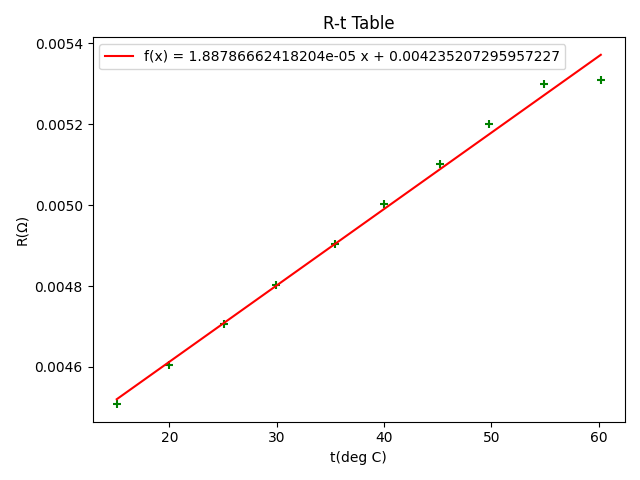

# 测定金属的电阻率

选择倍率$\times0.01$

|序号|长度$(cm)$|直径$(mm)$|阻值$(\times0.01\Omega)$|电阻率$\rho(\times10^{-8}\Omega\cdot m)$|
| :--: | :--: | :--: | :--: | :--: |
|1|25.00|4.06|0.05034|2.607|
|2|24.97|4.04|0.05040|2.587|
|3|24.95|4.06|0.05049|2.620|
|4|25.05|4.04|0.05046|2.582|
|5|25.03|4.06|0.05056|2.615|
|平均值|25.00|4.052|0.05045|2.6022|

$\rho=\dfrac{R\cdot s}{l}=\frac{\pi R\cdot d^2}{4l}$

$\overline{\rho}=\dfrac{1}{5}\sum_{i=0}^5\rho_i=2.6022\times10^{-8}\Omega\cdot m$

$U_A=\sqrt{\dfrac{1}{n(n-1)}\sum_{i=1}^n(\rho_i-\overline{\rho})^2}=7.559\times10^{-11}$

$U_B=\overline{\rho}\sqrt{(\dfrac{\Delta R}{R})^2+(\dfrac{2\Delta d}{d})^2+(\dfrac{\Delta l}{l})^2}=2.622\times10^{-10}$

$U=\sqrt{U_A^2+U_B^2}=2.729\times10^{-10}$

$\therefore\rho=(2.6022\times10^{-8}\pm2.729\times10^{-10})\Omega\cdot m$

---

# 测定金属的电阻温度系数

选择倍率$\times0.1$

|序号|温度$(\degree C)$|阻值$(\times0.1\Omega)$|序号|温度$(\degree C)$|阻值$(\times0.1\Omega)$|
| :--: | :--: | :--: | :--: | :--: | :--: |
|1|15.1|0.045079|6|40.0|0.050035|
|2|20.0|0.046041|7|45.2|0.051030|
|3|25.1|0.047051|8|49.8|0.052009|
|4|29.9|0.048039|9|54.9|0.053005|
|5|35.4|0.049042|10|60.2|0.053098|

知$R=R_0(1+\alpha t)$

由图知$R_0=4.24\times10^{-3}\Omega$

则$\overline{\alpha}=4.46\times10^{-3}\degree{C}^{-1}$

理论值$\alpha=433\times10^{-5}\degree C^{-1}$

相对误差$E=\dfrac{|\alpha-\overline{\alpha}|}{\alpha}\times100\%=3\%$