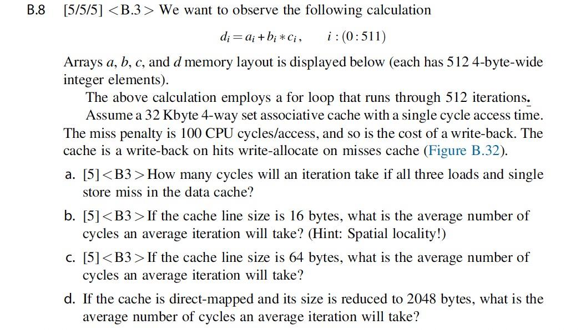
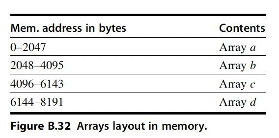

# HW2

[toc]

---

## 1

**Solution:**

- `LOAD a[i]` costs 100 cycles
- `LOAD b[i]` costs 100 cycles
- `LOAD c[i]` costs 100 cycles
- `STORE d[i]` costs 100 cycles

So an interation will cost 400 cycles.

---

## 2

**Solution:**

1 cache line can hold $\dfrac{16bytes}{4bytes}=4$ elements

For spacial locality, every 4 elements in an array will be load and store together.

For every 4 interations:

- Load `a[i]` ~ `a[i+3]` will cost 100 cycles.
- Load `b[i]` ~ `b[i+3]` will cost 100 cycles.
- Load `c[i]` ~ `c[i+3]` will cost 100 cycles.
- Store  `d[i]` ~ `d[i+3]` will cost 100 + 100 = 200 cycles due to write-allocate strategy.

So the average cycles per itertaion is $\dfrac{100+100+100+200}{4}=125$

---

## 3

**Solution:**

1 cache line can hold $\dfrac{64bytes}{4bytes}=16$ elements

For spacial locality, every 16 elements in an array will be load and store together.

For every 16 interations:

- Load `a[i]` ~ `a[i+15]` will cost 100 cycles.
- Load `b[i]` ~ `b[i+15]` will cost 100 cycles.
- Load `c[i]` ~ `c[i+15]` will cost 100 cycles.
- Store  `d[i]` ~ `d[i+15]` will cost 100 + 100 = 200 cycles due to write-allocate strategy.

So the average cycles per itertaion is $\dfrac{100+100+100+200}{16}=31.25$

---

## 4

**Solution:**

For each iteration:

- Load a[i] will costs 100 cycles.
- Load b[i] will costs 100 cycles.
- Load c[i] will cost 100 cycles.
- Store d[i] will cost 100 + 100 = 200 cycles.

So the average cycles per iteration is 500 cycles.