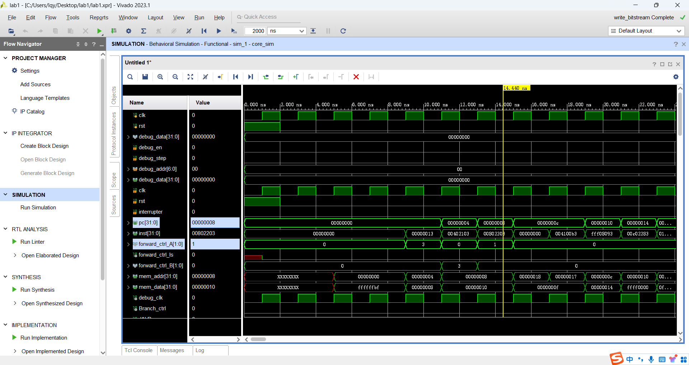

# Lab 1

作者：李秋宇 3220103373 计算机科学与技术2205

---

## Design

### `cmp_32.v`

此部分实现一个32位比较器的功能，比较的结果用于B类型指令作分支跳转

根据传入的两个数`a`和`b`，并根据比较的类型进行比较

总体部分都已经实现了，只需要对结果进行一个输出即可，是什么类型就返回对应的比较结果即可

写代码的时候参考了`CtrlUnit`里面的一些写法，原来我写的是一坨的三目运算符嵌套，感觉不太精简，后来参考后改成了现在这样的6组与结果的或，即

```Verilog
assign c = EQ  & res_EQ  |
           NE  & res_NE  |
           LT  & res_LT  |
           LTU & res_LTU |
           GE  & res_GE  |
           GEU & res_GEU ;
```

!!! tip 一些思考
    这样的精简表述是之前在计组里没有的，用基本的运算符就表述了大段的if-else和case-switch语句，非常牛逼！！！

### `CtrlUnit.v`

这部分实现一个控制单元

RV32I指令的部分都具有格式上的相似性，结合RV32I的指令格式图可以很容易仿写出对应的指令；

`Branch`在分支指令的前提下根据分支比较结果决定是否跳转，只需要一个与运算即可，而J类型的指令都直接跳转

```Verilog
assign Branch = JAL | JALR | B_valid & cmp_res; // Added.
```

`cmp_ctrl`这个信号还要结合`cmp_32.v`里面的控制信号，二者要互相对应，而6种B类型指令肯定至多有一个为真，所以也是用6个与的或结果作为这个信号的输出

```Verilog
assign cmp_ctrl = {3{BEQ}} & 3'b001 |
                  {3{BNE}} & 3'b010 |
                  {3{BLT}} & 3'b011 |
                  {3{BGE}} & 3'b101 |
                  {3{BLTU}}& 3'b100 |
                  {3{BGEU}}& 3'b110 ; // Added.
```

寄存器是否适用只需要看对应的指令有没有生效，就可以判断，易得

最后设计`hazard_optype`，`00`代表没有冒险指令，`01`代表连可能有连续两个`ALU`类型的指令，`10`代表可能有load hazard，`11`代表可能有store hazard

```Verilog
    /* 00: none; 01: ALU hazard; 10: load hazard; 11: store hazard */
assign hazard_optype = {2{R_valid | I_valid | JAL | JALR | LUI | AUIPC}} & 2'b01 |
                       {2{L_valid}}                                      & 2'b10 |
                       {2{S_valid}}                                      & 2'b11 ; // Added.
```

### `HazardDetectionUnit.v`

最复杂的设计部分，因为要写的最多

这部分相当于是把原理图中的检测部分和前递部分融合在一起了

首先用一个简单的时序逻辑把每个阶段的冒险类型存储下来

`MEM`阶段只需要把上一个`EXE`阶段的冒险类型往前推即可，而`EXE`阶段除了把`ID`阶段的类型前推，还要判断DE时有没有发生flush，有的话就无需冒险

```Verilog
reg [1:0] hazard_optype_EXE, hazard_optype_MEM;
always @ (posedge clk) begin
    hazard_optype_MEM <= hazard_optype_EXE;
    hazard_optype_EXE <= hazard_optype_ID & {2{~reg_DE_flush}};
end
```

接下来看寄存器的前递

对于两个寄存器来说，需要考虑4种情况：

1. 当前指令的目标寄存器`rd`为下一条指令的源寄存器`rs`，此时还未写回，需要前递
2. 当前指令的目标寄存器`rd`为下两条指令的源寄存器`rs`，此时还未写回，需要前递
3. 当前指令为`load`指令且目标寄存器`rd`为下两条指令的源寄存器`rs`。此时还未写回，需要前递
4. 当前指令为`load`指令且目标寄存器`rd`为下一条指令的源寄存器`rs`，且下一条指令不是`store`指令，需要stall一个周期等待数据从mem中load出来

针对这4个情况，设计对应的前递及stall变量，`rs1`和`rs2`同理

```Verilog
parameter hazard_optype_ALU = 2'b01;
parameter hazard_optype_LOAD = 2'b10;
parameter hazard_optype_STORE = 2'b11;

wire rs1_forward_1     = rs1use_ID & rs1_ID == rd_EXE & rd_EXE != 5'd0 & hazard_optype_EXE == hazard_optype_ALU; // Next rs1 is the same as the current rd in EXE stage.
wire rs1_forward_2     = rs1use_ID & rs1_ID == rd_MEM & rd_MEM != 5'd0 & hazard_optype_MEM == hazard_optype_ALU; // Next rs1 is the same as the current rd in MEM stage.
wire rs1_forward_3     = rs1use_ID & rs1_ID == rd_MEM & rd_MEM != 5'd0 & hazard_optype_MEM == hazard_optype_LOAD; // Next rs1 is loaded this MEM stage.
wire rs1_forward_stall = rs1use_ID & rs1_ID == rd_EXE & rd_EXE != 5'd0 & hazard_optype_EXE == hazard_optype_LOAD & hazard_optype_ID != hazard_optype_STORE; // Next rs1 is not loaded until a stall.

wire rs2_forward_1     = rs2use_ID & rs2_ID == rd_EXE & rd_EXE != 5'd0 & hazard_optype_EXE == hazard_optype_ALU; // Next rs2 is the same as the current rd in EXE stage.
wire rs2_forward_2     = rs2use_ID & rs2_ID == rd_MEM & rd_MEM != 5'd0 & hazard_optype_MEM == hazard_optype_ALU; // Next rs2 is the same as the current rd in MEM stage.
wire rs2_forward_3     = rs2use_ID & rs2_ID == rd_MEM & rd_MEM != 5'd0 & hazard_optype_MEM == hazard_optype_LOAD; // Next rs2 is loaded this MEM stage.
wire rs2_forward_stall = rs2use_ID & rs2_ID == rd_EXE & rd_EXE != 5'd0 & hazard_optype_EXE == hazard_optype_LOAD & hazard_optype_ID != hazard_optype_STORE; // Next rs2 is not loaded until a stall.

wire load_stall = rs1_forward_stall | rs2_forward_stall; // A load instruction is stalled if either rs1 or rs2 is loaded.
```

如果其中一个需要stall，那么整体stall一次，用变量`load_stall`标记

对所有的流水线寄存器的使能信号全部置一，`PC`的使能信号由`load_stall`决定，IFID的流水线寄存器遇到stall的情况则stall，遇到分支跳转的情况则flush

```Verilog
assign PC_EN_IF = ~load_stall; // Enable PC_EN_IF if there is no load stall.

assign reg_FD_EN = 1'b1;
assign reg_FD_stall = load_stall;
assign reg_FD_flush = Branch_ID; // Flush the register file if a branch is taken.

assign reg_DE_EN = 1'b1;
assign reg_DE_flush = load_stall;

assign reg_EM_EN = 1'b1;
assign reg_EM_flush = 1'b0; 

assign reg_MW_EN = 1'b1;
```

最后根据寄存器的3种前递情况，输出对应的forward信号即可

```Verilog
assign forward_ctrl_A = {2{rs1_forward_1}} & 2'b01 |
                        {2{rs1_forward_2}} & 2'b10 |
                        {2{rs1_forward_3}} & 2'b11;

assign forward_ctrl_B = {2{rs2_forward_1}} & 2'b01 |
                        {2{rs2_forward_2}} & 2'b10 |
                        {2{rs2_forward_3}} & 2'b11;
```

最后一步是`load`和`store`两个指令相邻且寄存器有关系的情况，则直接前递即可

```Verilog
assign forward_ctrl_ls = rs2_EXE == rd_MEM & hazard_optype_MEM == hazard_optype_LOAD & hazard_optype_EXE == hazard_optype_STORE; // Next rs2 will be loaded and stored in the next cycle.
```

### `RV32code.v`

顶层模块的连线，根据原理图连线即可，需要填的部分都是多路选择器

---

## Exercises

### 1

!!! question 添加了 Forwarding 机制后，是否观察到了 stall 延迟减少的情况？请在测试程序中给出 Forwarding 机制起到实际作用的位置，并给出仿真图加以证明。（只需要贴出一次 Forwarding 机制起效的仿真图片即可）
    
    如图所示，在`PC=0x08`的指令，即`lw x4, 8(x0)`，存在冒险，而下一条指令需要用到前面两条指令的load出的寄存器的值，所以需要前递，`forward_A`也出现对应变化

### 2

!!! question 在我们的框架中，比较器 cmp_32 处于 ID 段。请说明比较器在 ID 对比比较器在 EX 的优劣。（提示：可以从时延的角度考虑）
    - 优势：在ID阶段完成比较，可以在取出寄存器值之后直接比较从而决定是否发生分支跳转，相比于在EX阶段进入ALU运算可以提前一个时钟周期完成跳转
    - 劣势：需要专门实现一个比较器，增加了设计的复杂程度
