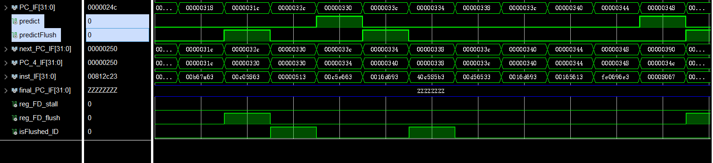
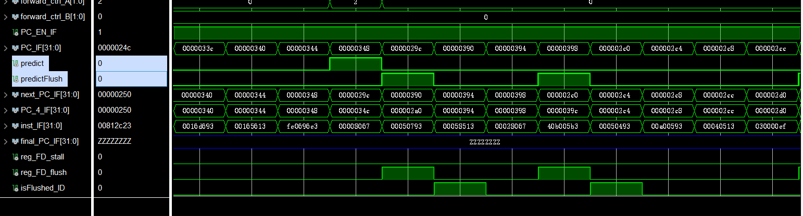
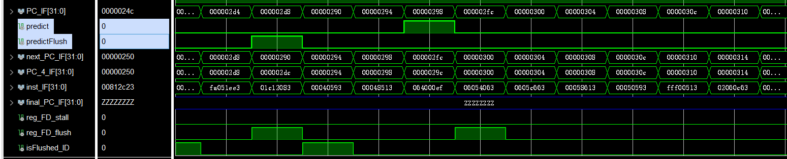
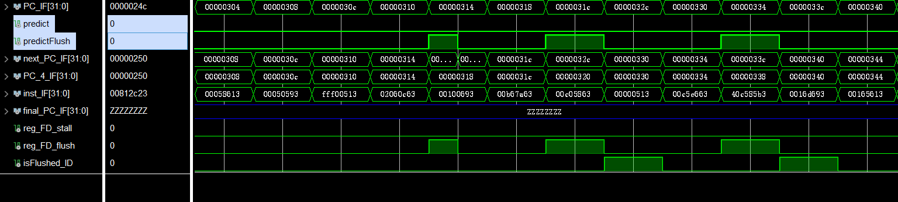

# Lab 3

李秋宇 3220103373

## Design

### BranchTargetBuffer

#### 模块接口

模块接口定义如下：

```Verilog
module BranchTargetBuffer(
    input clk, rst,
    input [31:0] PC_IF,
    input [31:0] PC_ID,
    input [31:0] jump_PC_ID,
    input Branch_ID, // If branch is actually taken.
    input B_valid, // If this branch is a branch instruction.
    input stall, // If stall is asserted, do not update BTB.

    output [31:0] predictedPC, // Predicted PC.
    output predict, // Predicted branch taken or not, if taken, predictedPC will be next PC.
    output flush
);
```

#### BTB设计

首先设计BTB，把BHT和BTB合在一起，统称为**BranchTargetBuffer**

本实验中的程序的指令地址为`0x80000000`到`0x800003ac`，一共236个地址

指令PC与分指标索引的转换：

```Verilog
input [31:0] pc;
wire [7:0] index;
assign index = pc[9:2];
```

一共256个表项，每个表项有11bit：

- 有效位`Valid`: 1bit
- 状态`State`: 2bit
- 跳转的目标地址的索引值`Target Index`: 8bit

```txt
          10    9         8   7                        0 
        ┌─────┬─────────────┬────────────────────────────┐
  0     │Valid│    State    │        Target Index        │
        └─────┴─────────────┴────────────────────────────┘
        ┌─────┬─────────────┬────────────────────────────┐
  1     │Valid│    State    │        Target Index        │
        └─────┴─────────────┴────────────────────────────┘
                            .
                            .
                            .
        ┌─────┬─────────────┬────────────────────────────┐
  255   │Valid│    State    │        Target Index        │
        └─────┴─────────────┴────────────────────────────┘
                        分支表结构
```

实现如下：

```Verilog
parameter BTB_SIZE = 256;
parameter ENTRY_SIZE = 11;
reg [ENTRY_SIZE-1:0] btb [0:BTB_SIZE-1];

wire [7:0] IF_index, ID_index; // Index of PC in BTB.
assign IF_index = PC_IF[9:2];
assign ID_index = PC_ID[9:2];
```

#### 根据BTB进行预测

因为预测发生在IF阶段，所以从BTB中根据`PC_IF`取出预测的地址`predictrfPC`，结合当前BTB的状态决定是否采用预测结果`predict`

只有状态为`11`或`10`时才采用，即状态的第2位信息

`flush`的逻辑如下：

- 当前指令是分支类型指令
- **当前没有冒险的stall发生**，否则不进行flush
- 根据实际分支情况和预测情况进行判断
    - 如果预测跳转但实际上不需要跳转
    - 如果预测不跳转但实际上需要跳转
    - 如果预测跳转且实际上需要跳转，但是预测的地址和实际的地址不同

!!! tip 关于Stall
    原本没有考虑到这个点，导致load类型后如果有分支指令会出错，经过大量调试才发现这个问题 😓

采用组合逻辑赋值

```Verilog
// Make prediction based on BTB.
assign predictedPC = btb[IF_index][7:0] << 2 | 32'h00000000; // Extend pc index to pc.
assign predict = btb[IF_index][10] & btb[IF_index][9]; // To take prediction or not.
assign flush = (!stall) && B_valid && ((btb[ID_index][9] != Branch_ID) || (Branch_ID && (btb[ID_index][7:0] != jump_PC_ID[9:2]))); // Flush.
```

#### 更新BTB

预测结果的纠正发生在ID阶段，根据ID传入的信号进行纠正

如果当前Stall则不更新，不然会发生冒险

如果当前指令是分支类型的指令，根据是否采取分支`Branch_ID`和当前状态进行更新

- 有效位置1，不用每次都判断是否存在entry
- 当前状态为
    - `11`
        - `Branch` -> `11`
        - `!Branch` -> `10`
    - `10`
        - `Branch` -> `11`
        - `!Branch` -> `00`
    - `01`
        - `Branch` -> `11`
        - `!Branch` -> `00`
    - `00`
        - `Branch` -> `01`
        - `!Branch` -> `00`

此外，地址的更新取决于是否发生分支，如果发生了就更新

实现起来可以更加简洁，提取其中的公共部分代码

```Verilog
// Update BTB.
always @ (posedge clk or posedge rst) begin
    if (rst) begin
        for (i = 0; i < BTB_SIZE; i = i + 1) begin
            btb[i] <= 11'b0;
        end
    end else if (!stall) begin
        // Update states.
        if (B_valid) begin
            btb[ID_index][10] = 1'b1; // Set valid bit.
            if (btb[ID_index][9] == btb[ID_index][8]) begin btb[ID_index][8] = Branch_ID; end // 11 && 00.
            else begin btb[ID_index][9:8] = {2{Branch_ID}}; end // 01 && 10.
        end

        // Update branch target.
        if (Branch_ID) begin 
            btb[ID_index][7:0] = jump_PC_ID[9:2];
        end
    end
end
```

### RV32core

需要修改一些模块

首先肯定是实例化BTB模块，接入信号

```Verilog
// Branch prediction wires.
wire [1:0] instType;
wire predict, predictFlush;
wire [31:0] predicted_PC;

...

// Branch prediction.
BranchTargetBuffer BTB(.clk(debug_clk),.rst(rst),
    .PC_IF(PC_IF),.PC_ID(PC_ID),.jump_PC_ID(jump_PC_ID),.Branch_ID(Branch_ctrl),.B_valid(instType[0] | instType[1]),.stall(reg_FD_stall),
    .predictedPC(predicted_PC),.predict(predict),.flush(predictFlush));
```

然后修改一下控制单元，接出当前指令是否为分支指令和跳转指令`B_valid`和`J_valid`

然后是修改一下取指逻辑，如果需要flush就采用ID阶段的pc，否则采用IF阶段的，ID阶段根据ID译码出的信号决定是否跳转，IF阶段根据是否采用预测结果进行决定

```Verilog
MUX4T1_32 mux_IF(.I0(PC_4_IF),.I1(predicted_PC),.I2(PC_ID + 32'd4),.I3(jump_PC_ID),
    .s(predictFlush ? {1'b1, Branch_ctrl} : {1'b0, predict}),.o(next_PC_IF)); // If flushed, use pc from ID, otherwise use pc from IF.
```

---

## Run

仿真正确，上板正确

---

## Exercises

!!! question 请在报告里展示四种仿真波形：分支预测跳转但实际不跳转，分支预测不跳转但实际跳转，分支预测跳转且实际跳转，分支预测不跳转且实际不跳转
    分支预测跳转但实际不跳转：

      

    分支预测不跳转但实际跳转：

    

    分支预测跳转且实际跳转：

      

    分支预测不跳转且实际不跳转：

      

!!! question 相比于静态分支预测，说明动态分支预测的优点以及缺点
    - 优点：准确性更高，能够通过程序运行的历史信息进行预测，适应性更强，能够减少预测错误的损失，性能更好
    - 缺点：硬件复杂性提升，能耗增加，如果程序存在很多分支那么可能造成分指标大量修改
