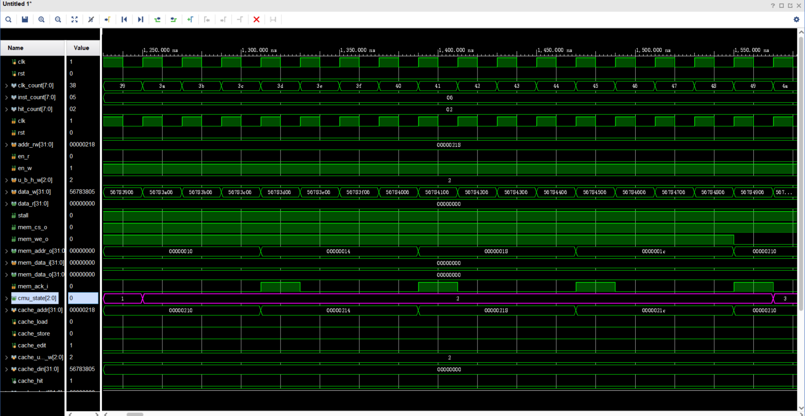
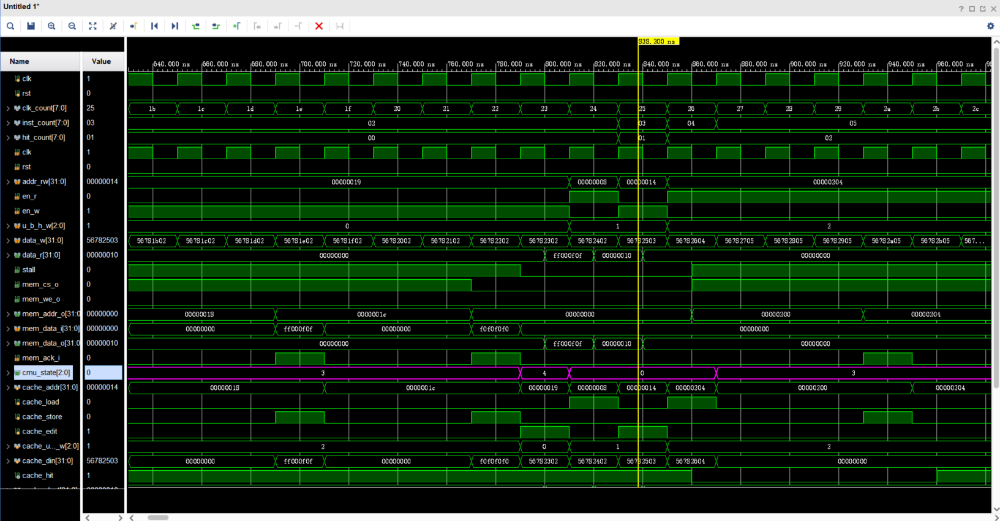

# Lab 4

李秋宇 3220103373

---

## Design

### Cache

地址的索引值和标签获取只需要取出对应位上的地址信息即可

```Verilog
assign addr_tag = addr[ADDR_BITS-1:ADDR_BITS-TAG_BITS]; // Added.
assign addr_index = addr[ADDR_BITS-TAG_BITS-1:ADDR_BITS-TAG_BITS-SET_INDEX_WIDTH]; // Added.
```

后续的操作基本上都是照葫芦画瓢即可，对应取出每个字、每个半字、每个字节的数据

```Verilog
assign addr_element1 = {addr_index, 1'b0};
assign addr_element2 = {addr_index, 1'b1}; // Added.
assign addr_word1 = {addr_element1, addr[ELEMENT_WORDS_WIDTH+WORD_BYTES_WIDTH-1:WORD_BYTES_WIDTH]};
assign addr_word2 = {addr_element2, addr[ELEMENT_WORDS_WIDTH+WORD_BYTES_WIDTH-1:WORD_BYTES_WIDTH]}; // Added.

assign word1 = inner_data[addr_word1];
assign word2 = inner_data[addr_word2]; // Added.
assign half_word1 = addr[1] ? word1[31:16] : word1[15:0];
assign half_word2 = addr[1] ? word2[31:16] : word2[15:0]; // Added.
assign byte1 = addr[1] ?
                addr[0] ? word1[31:24] : word1[23:16] :
                addr[0] ? word1[15:8] :  word1[7:0]   ;
assign byte2 = addr[1] ?
                addr[0] ? word2[31:24] : word2[23:16] :
                addr[0] ? word2[15:8] :  word2[7:0]   ; // Added.

assign recent1 = inner_recent[addr_element1];
assign recent2 = inner_recent[addr_element2]; // Added.
assign valid1 = inner_valid[addr_element1];
assign valid2 = inner_valid[addr_element2]; // Added.
assign dirty1 = inner_dirty[addr_element1];
assign dirty2 = inner_dirty[addr_element2]; // Added.
assign tag1 = inner_tag[addr_element1];
assign tag2 = inner_tag[addr_element2]; // Added.

assign hit1 = valid1 & (tag1 == addr_tag);
assign hit2 = valid2 & (tag2 == addr_tag); // Added.
```

有效位、脏位取决于前述的信号是否生效，而是否命中则看是否有其中任何一个命中

```Verilog
valid <= recent1 ? valid2 : valid1; // Added.
dirty <= recent1 ? dirty2 : dirty1; // Added
tag <= recent1 ? tag2 : tag1; // Added.
hit <= hit1 | hit2; // Added.
```

剩下的全部仿制即可

### CMU

#### States

状态的演变根据状态机进行撰写即可，其中`S_BACK`和`S_FILL`部分还需要统计周期数

```Verilog
// state ctrl
always @ (*) begin
    if (rst) begin
        next_state = S_IDLE;
        next_word_count = 2'b00;
    end
    else begin
        case (state)
            S_IDLE: begin
                if (en_r || en_w) begin
                    if (cache_hit)
                        next_state = S_IDLE; // Added.
                    else if (cache_valid && cache_dirty)
                        next_state = S_PRE_BACK; // Added.
                    else
                        next_state = S_FILL; // Added.
                end
                next_word_count = 2'b00;
            end

            S_PRE_BACK: begin
                next_state = S_BACK; // Added.
                next_word_count = 2'b00;
            end

            S_BACK: begin
                if (mem_ack_i && word_count == {ELEMENT_WORDS_WIDTH{1'b1}})    // 2'b11 in default case
                    next_state = S_FILL; // Added.
                else
                    next_state = S_BACK; // Added.

                if (mem_ack_i)
                    next_word_count = word_count + 1; // Added.
                else
                    next_word_count = word_count;
            end

            S_FILL: begin
                if (mem_ack_i && word_count == {ELEMENT_WORDS_WIDTH{1'b1}})
                    next_state = S_WAIT; // Added.
                else
                    next_state = S_FILL; // Added.

                if (mem_ack_i)
                    next_word_count = word_count + 1; // Added.
                else
                    next_word_count = word_count;
            end

            S_WAIT: begin
                next_state = S_IDLE; // Added.
                next_word_count = 2'b00;
            end
        endcase
    end
end
```

#### Stall

是否需要Stall就看当前状态是否是正常的读写状态，如果不是IDLE则需要进行Stall

```Verilog
assign stall = next_state != S_IDLE; // Added.
```

---

## Exercises

!!! question 在实验报告分别展示 cache hit、cache miss+dirty 两种情况，分析两种情况下的状态机状态变化以及需要的时钟周期。
    - Cache miss+dirty:
          
        状态机从`S_IDLE`到`S_PRE_BACK`到`S_BACK`到`S_FILL`到`S_WAIT`最后回到`S_IDLE`，经历的时钟周期为`0x5a-0x38+1=35`个周期
    - Cache hit:
        
        这里读hit和写hit均只用了一个周期

!!! question 在本次实验中，cache 采取的是 2 路组相联，在实现 LRU 替换的时候，每一个 set 需要用多少 bit 来用于真正的 LRU 替换实现？
    2位，标记最晚访问的块的对应位将其置1
