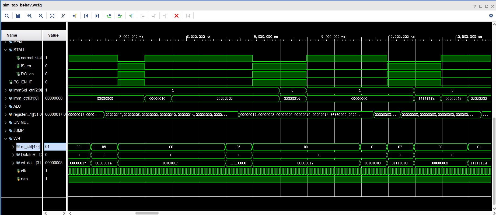

# Lab 5

李秋宇 3220103373

---

## Design

### IP Cores Generation

按照文档添加乘法器、除法器IP核

### Control Unit

#### Normal Stall

判断有无结构冒险或者WAW类型即可

注意到如果没有使用某个部件，对应的FU就是`FU_BLANK`

- 如果有结构冒险，那么使用部件非空，且使用的部件正忙
- 如果有WAW，那么要写的目标寄存器的来源非空

```Verilog
assign normal_stall = ((use_FU != `FU_BLANK && FUS[use_FU][`BUSY]) || (RRS[dst] != `FU_BLANK));
```

#### WARs

处理五个部件的WAR，注意到WAR置1时可以写，否则不可写

写回寄存器值时需要判断要写的目标寄存器是否是别的部件的源寄存器，如果是的话如果其值还没有被读走则会发生WAR，所以这里需要判断

五个部件都是同样的逻辑，所以很快就可以得到全部的内容

```Verilog
wire ALU_WAR = (
    (FUS[`FU_MEM][`SRC1_H:`SRC1_L]  != FUS[`FU_ALU][`DST_H:`DST_L] | !FUS[`FU_MEM][`RDY1])  &
    (FUS[`FU_MEM][`SRC2_H:`SRC2_L]  != FUS[`FU_ALU][`DST_H:`DST_L] | !FUS[`FU_MEM][`RDY2])  &
    (FUS[`FU_MUL][`SRC1_H:`SRC1_L]  != FUS[`FU_ALU][`DST_H:`DST_L] | !FUS[`FU_MUL][`RDY1])  &
    (FUS[`FU_MUL][`SRC2_H:`SRC2_L]  != FUS[`FU_ALU][`DST_H:`DST_L] | !FUS[`FU_MUL][`RDY2])  &
    (FUS[`FU_DIV][`SRC1_H:`SRC1_L]  != FUS[`FU_ALU][`DST_H:`DST_L] | !FUS[`FU_DIV][`RDY1])  &
    (FUS[`FU_DIV][`SRC2_H:`SRC2_L]  != FUS[`FU_ALU][`DST_H:`DST_L] | !FUS[`FU_DIV][`RDY2])  &
    (FUS[`FU_JUMP][`SRC1_H:`SRC1_L] != FUS[`FU_ALU][`DST_H:`DST_L] | !FUS[`FU_JUMP][`RDY1]) &
    (FUS[`FU_JUMP][`SRC2_H:`SRC2_L] != FUS[`FU_ALU][`DST_H:`DST_L] | !FUS[`FU_JUMP][`RDY2])  
);

wire MEM_WAR = (
    (FUS[`FU_ALU][`SRC1_H:`SRC1_L]  != FUS[`FU_MEM][`DST_H:`DST_L] | !FUS[`FU_ALU][`RDY1])  &
    (FUS[`FU_ALU][`SRC2_H:`SRC2_L]  != FUS[`FU_MEM][`DST_H:`DST_L] | !FUS[`FU_ALU][`RDY2])  &
    (FUS[`FU_MUL][`SRC1_H:`SRC1_L]  != FUS[`FU_MEM][`DST_H:`DST_L] | !FUS[`FU_MUL][`RDY1])  &
    (FUS[`FU_MUL][`SRC2_H:`SRC2_L]  != FUS[`FU_MEM][`DST_H:`DST_L] | !FUS[`FU_MUL][`RDY2])  &
    (FUS[`FU_DIV][`SRC1_H:`SRC1_L]  != FUS[`FU_MEM][`DST_H:`DST_L] | !FUS[`FU_DIV][`RDY1])  &
    (FUS[`FU_DIV][`SRC2_H:`SRC2_L]  != FUS[`FU_MEM][`DST_H:`DST_L] | !FUS[`FU_DIV][`RDY2])  &
    (FUS[`FU_JUMP][`SRC1_H:`SRC1_L] != FUS[`FU_MEM][`DST_H:`DST_L] | !FUS[`FU_JUMP][`RDY1]) &
    (FUS[`FU_JUMP][`SRC2_H:`SRC2_L] != FUS[`FU_MEM][`DST_H:`DST_L] | !FUS[`FU_JUMP][`RDY2])  
);

wire MUL_WAR = (
    (FUS[`FU_ALU][`SRC1_H:`SRC1_L]  != FUS[`FU_MUL][`DST_H:`DST_L] | !FUS[`FU_ALU][`RDY1])  &
    (FUS[`FU_ALU][`SRC2_H:`SRC2_L]  != FUS[`FU_MUL][`DST_H:`DST_L] | !FUS[`FU_ALU][`RDY2])  &
    (FUS[`FU_MEM][`SRC1_H:`SRC1_L]  != FUS[`FU_MUL][`DST_H:`DST_L] | !FUS[`FU_MEM][`RDY1])  &
    (FUS[`FU_MEM][`SRC2_H:`SRC2_L]  != FUS[`FU_MUL][`DST_H:`DST_L] | !FUS[`FU_MEM][`RDY2])  &
    (FUS[`FU_DIV][`SRC1_H:`SRC1_L]  != FUS[`FU_MUL][`DST_H:`DST_L] | !FUS[`FU_DIV][`RDY1])  &
    (FUS[`FU_DIV][`SRC2_H:`SRC2_L]  != FUS[`FU_MUL][`DST_H:`DST_L] | !FUS[`FU_DIV][`RDY2])  &
    (FUS[`FU_JUMP][`SRC1_H:`SRC1_L] != FUS[`FU_MUL][`DST_H:`DST_L] | !FUS[`FU_JUMP][`RDY1]) &
    (FUS[`FU_JUMP][`SRC2_H:`SRC2_L] != FUS[`FU_MUL][`DST_H:`DST_L] | !FUS[`FU_JUMP][`RDY2])  
);

wire DIV_WAR = (
    (FUS[`FU_ALU][`SRC1_H:`SRC1_L]  != FUS[`FU_DIV][`DST_H:`DST_L] | !FUS[`FU_ALU][`RDY1])  &
    (FUS[`FU_ALU][`SRC2_H:`SRC2_L]  != FUS[`FU_DIV][`DST_H:`DST_L] | !FUS[`FU_ALU][`RDY2])  &
    (FUS[`FU_MEM][`SRC1_H:`SRC1_L]  != FUS[`FU_DIV][`DST_H:`DST_L] | !FUS[`FU_MEM][`RDY1])  &
    (FUS[`FU_MEM][`SRC2_H:`SRC2_L]  != FUS[`FU_DIV][`DST_H:`DST_L] | !FUS[`FU_MEM][`RDY2])  &
    (FUS[`FU_MUL][`SRC1_H:`SRC1_L]  != FUS[`FU_DIV][`DST_H:`DST_L] | !FUS[`FU_MUL][`RDY1])  &
    (FUS[`FU_MUL][`SRC2_H:`SRC2_L]  != FUS[`FU_DIV][`DST_H:`DST_L] | !FUS[`FU_MUL][`RDY2])  &
    (FUS[`FU_JUMP][`SRC1_H:`SRC1_L] != FUS[`FU_DIV][`DST_H:`DST_L] | !FUS[`FU_JUMP][`RDY1]) &
    (FUS[`FU_JUMP][`SRC2_H:`SRC2_L] != FUS[`FU_DIV][`DST_H:`DST_L] | !FUS[`FU_JUMP][`RDY2])  
);

wire JUMP_WAR = (
    (FUS[`FU_ALU][`SRC1_H:`SRC1_L] != FUS[`FU_JUMP][`DST_H:`DST_L] | !FUS[`FU_ALU][`RDY1])  &
    (FUS[`FU_ALU][`SRC2_H:`SRC2_L] != FUS[`FU_JUMP][`DST_H:`DST_L] | !FUS[`FU_ALU][`RDY2])  &
    (FUS[`FU_MEM][`SRC1_H:`SRC1_L] != FUS[`FU_JUMP][`DST_H:`DST_L] | !FUS[`FU_MEM][`RDY1])  &
    (FUS[`FU_MEM][`SRC2_H:`SRC2_L] != FUS[`FU_JUMP][`DST_H:`DST_L] | !FUS[`FU_MEM][`RDY2])  &
    (FUS[`FU_MUL][`SRC1_H:`SRC1_L] != FUS[`FU_JUMP][`DST_H:`DST_L] | !FUS[`FU_MUL][`RDY1])  &
    (FUS[`FU_MUL][`SRC2_H:`SRC2_L] != FUS[`FU_JUMP][`DST_H:`DST_L] | !FUS[`FU_MUL][`RDY2])  &
    (FUS[`FU_DIV][`SRC1_H:`SRC1_L] != FUS[`FU_JUMP][`DST_H:`DST_L] | !FUS[`FU_DIV][`RDY1])  &
    (FUS[`FU_DIV][`SRC2_H:`SRC2_L] != FUS[`FU_JUMP][`DST_H:`DST_L] | !FUS[`FU_DIV][`RDY2])   
);
```

#### Maintain Tables

##### IS

把指令记入FUS表和RRS表

```Verilog
if (RO_en) begin
    // not busy, no WAW, write info to FUS and RRS
    if (|dst) RRS[dst] <= use_FU;
    FUS[use_FU][`BUSY] <= 1'b1;
    FUS[use_FU][`OP_H:`OP_L] <= op;
    FUS[use_FU][`DST_H:`DST_L] <= dst;
    FUS[use_FU][`SRC1_H:`SRC1_L] <= rs1;
    FUS[use_FU][`SRC2_H:`SRC2_L] <= rs2;
    FUS[use_FU][`FU1_H:`FU1_L] <= fu1;
    FUS[use_FU][`FU2_H:`FU2_L] <= fu2;
    FUS[use_FU][`RDY1] <= rdy1;
    FUS[use_FU][`RDY2] <= rdy2;
    FUS[use_FU][`FU_DONE] <= 1'b0;
    
    IMM[use_FU] <= imm;
    PCR[use_FU] <= PC;
end
```

##### RO

RO阶段判断源操作数是否已经就绪，如果都就绪了就读走，将Ri和Rj置0

对应需要判断每个部件，都是相同的原理

```Verilog
if (FUS[`FU_JUMP][`RDY1] & FUS[`FU_JUMP][`RDY2]) begin
    // JUMP
    FUS[`FU_JUMP][`RDY1] <= 1'b0;
    FUS[`FU_JUMP][`RDY2] <= 1'b0;
    FUS[`FU_JUMP][`FU1_H:`FU1_L] <= 3'b0;
    FUS[`FU_JUMP][`FU2_H:`FU2_L] <= 3'b0;
end
else if (FUS[`FU_ALU][`RDY1] & FUS[`FU_ALU][`RDY2]) begin
    // ALU
    FUS[`FU_ALU][`RDY1] <= 1'b0;
    FUS[`FU_ALU][`RDY2] <= 1'b0;
    FUS[`FU_ALU][`FU1_H:`FU1_L] <= 3'b0;
    FUS[`FU_ALU][`FU2_H:`FU2_L] <= 3'b0;
end
else if (FUS[`FU_MEM][`RDY1] & FUS[`FU_MEM][`RDY2]) begin
    // MEM
    FUS[`FU_MEM][`RDY1] <= 1'b0;
    FUS[`FU_MEM][`RDY2] <= 1'b0;
    FUS[`FU_MEM][`FU1_H:`FU1_L] <= 3'b0;
    FUS[`FU_MEM][`FU2_H:`FU2_L] <= 3'b0;
end
else if (FUS[`FU_MUL][`RDY1] & FUS[`FU_MUL][`RDY2]) begin
    // MUL
    FUS[`FU_MUL][`RDY1] <= 1'b0;
    FUS[`FU_MUL][`RDY2] <= 1'b0;
    FUS[`FU_MUL][`FU1_H:`FU1_L] <= 3'b0;
    FUS[`FU_MUL][`FU2_H:`FU2_L] <= 3'b0;
end
else if (FUS[`FU_DIV][`RDY1] & FUS[`FU_DIV][`RDY2]) begin
    // DIV
    FUS[`FU_DIV][`RDY1] <= 1'b0;
    FUS[`FU_DIV][`RDY2] <= 1'b0;
    FUS[`FU_DIV][`FU1_H:`FU1_L] <= 3'b0;
    FUS[`FU_DIV][`FU2_H:`FU2_L] <= 3'b0;
end
```

##### EX

根据输入信号来确定是否完成某部件的执行

```Verilog
FUS[`FU_ALU][`FU_DONE]  <= FUS[`FU_ALU][`FU_DONE]  | ALU_done;
FUS[`FU_MEM][`FU_DONE]  <= FUS[`FU_MEM][`FU_DONE]  | MEM_done;
FUS[`FU_MUL][`FU_DONE]  <= FUS[`FU_MUL][`FU_DONE]  | MUL_done;
FUS[`FU_DIV][`FU_DONE]  <= FUS[`FU_DIV][`FU_DONE]  | DIV_done;
FUS[`FU_JUMP][`FU_DONE] <= FUS[`FU_JUMP][`FU_DONE] | JUMP_done;
```

##### WB

写回时，需要判断要写回的部件是否已经运算完成，并且此时没有WAR，如果都满足就直接完成这条指令，能进行写回，并从FUS和RRS中清除相关的数据

同时还要确保没有RAW，检查其它部件，如果其它部件依赖当前这个部件，那么此时已完成，依赖清除，可以对相关位进行设置，用于标记完成

每个部件的原理一致，这里只放了JUMP作为示例

```Verilog
if (FUS[`FU_JUMP][`FU_DONE] & JUMP_WAR) begin
    FUS[`FU_JUMP] <= 32'b0;
    RRS[FUS[`FU_JUMP][`DST_H:`DST_L]] <= 3'b0;

    // ensure RAW
    if (FUS[`FU_ALU][`FU1_H:`FU1_L] == `FU_JUMP) begin
        FUS[`FU_ALU][`FU1_H:`FU1_L] <= `FU_BLANK;
        FUS[`FU_ALU][`RDY1] <= 1'b1;
    end
    if (FUS[`FU_MEM][`FU1_H:`FU1_L] == `FU_JUMP) begin
        FUS[`FU_MEM][`FU1_H:`FU1_L] <= `FU_BLANK;
        FUS[`FU_MEM][`RDY1] <= 1'b1;
    end
    if (FUS[`FU_MUL][`FU1_H:`FU1_L] == `FU_JUMP) begin
        FUS[`FU_MUL][`FU1_H:`FU1_L] <= `FU_BLANK;
        FUS[`FU_MUL][`RDY1] <= 1'b1;
    end
    if (FUS[`FU_DIV][`FU1_H:`FU1_L] == `FU_JUMP) begin
        FUS[`FU_DIV][`FU1_H:`FU1_L] <= `FU_BLANK;
        FUS[`FU_DIV][`RDY1] <= 1'b1;
    end

    if (FUS[`FU_ALU][`FU2_H:`FU2_L] == `FU_JUMP) begin
        FUS[`FU_ALU][`FU2_H:`FU2_L] <= `FU_BLANK;
        FUS[`FU_ALU][`RDY2] <= 1'b1;
    end
    if (FUS[`FU_MEM][`FU2_H:`FU2_L] == `FU_JUMP) begin
        FUS[`FU_MEM][`FU2_H:`FU2_L] <= `FU_BLANK;
        FUS[`FU_MEM][`RDY2] <= 1'b1;
    end
    if (FUS[`FU_MUL][`FU2_H:`FU2_L] == `FU_JUMP) begin
        FUS[`FU_MUL][`FU2_H:`FU2_L] <= `FU_BLANK;
        FUS[`FU_MUL][`RDY2] <= 1'b1;
    end
    if (FUS[`FU_DIV][`FU2_H:`FU2_L] == `FU_JUMP) begin
        FUS[`FU_DIV][`FU2_H:`FU2_L] <= `FU_BLANK;
        FUS[`FU_DIV][`RDY2] <= 1'b1;
    end
end
```

---

## Test

仿真正确，下板正确

---

## Exercises

!!! question 指出仿真波形中乱序发生的位置（一处即可）
      
    查看提交写寄存器的顺序可以知道，原本的顺序应该是24115671，但是`lw x7, 20(x0)`和`sub x1,x4,x2`两条指令的执行顺序互换了，先提交的sub指令后提交的lw指令，发生了乱序

---

## Thinkings

**谈谈你对本学期体系结构课的感想、心得、收获，以及建议**（选做，对报告评分没有影响）

本学期的体系课总体来说是非常好的

首先是课程上来说，我觉得cr老师讲课非常好，很清晰清楚，感觉相比于常规的读ppt上课的老师来说是完全不一样的，可以看出来cr老师真的想要教会学生有关体系的内容，而我觉得我对新学的内容的掌握有一定的了解了，可以说从课上收获了不少

助教哥哥们都非常用心认真，协助我们完成lab验收、pre提问把关等环节，感谢助教的用心付出~ 🥰 感觉助教哥哥们能成为助教不是没有理由的，他们都水平过硬，是值得我学习的

特别感谢一下Hobbitia助教，大二的时候就看到了他的笔记本，其中很多课都参考了学长的笔记，这学期刚好遇到真人了，非常感谢他带来的帮助，是我cs学习生涯的指路人之一 🥰

总体来说，课程的难度不算特别大，不过可能和我计组学的不是很好也有关系，中间的两个lab其实花费了比较多的时间和精力去完成，不过好在最后也都做完了，可以说是非常不容易

最初我也觉得硬件的内容还是蛮有意思的，但是经过不断学习后感觉自己可能不太适合硬件的学习（至少目前的状态来说体系令我头疼） 可能这学期学完以后就不太会接触特别多的硬件开发内容了

还是非常不容易的，回过头来已经做完了全部的lab 😍 其实主要难度和任务感觉在lab2和lab3，lab2我调试了很久很久，非常头疼；lab3主要是动态分支预测，仔细思考了该怎么去实现，最后写完其实马上要验收了，但是有个bug没办法找到解决方案，还好在验收前一小时找出了，就完美解决了
