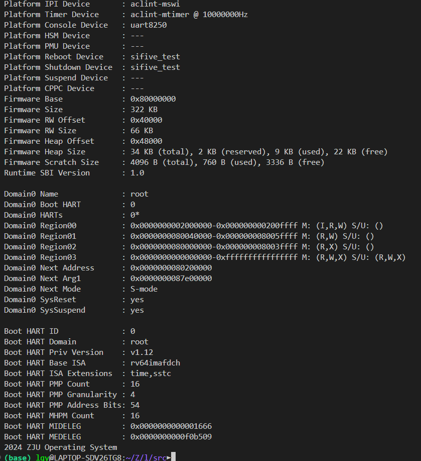
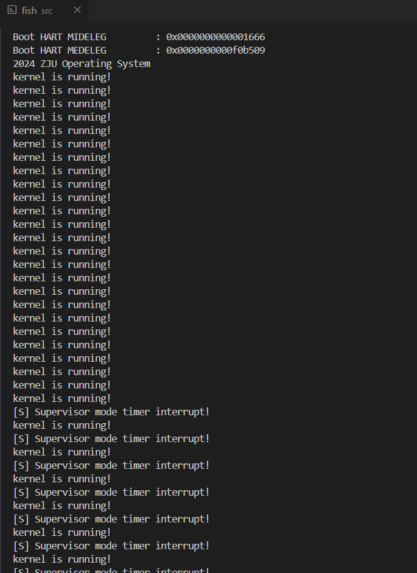
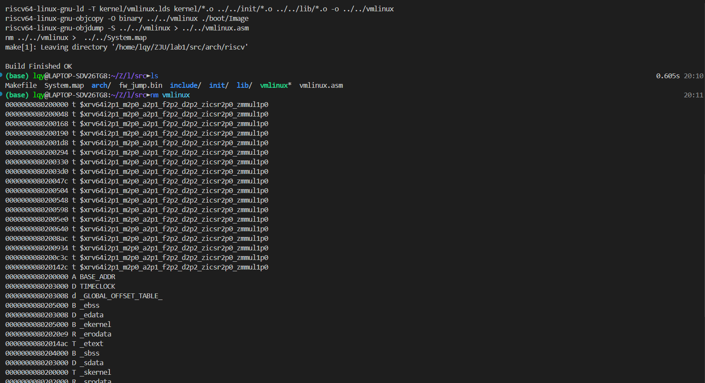
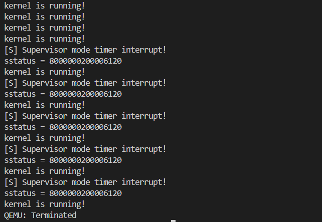
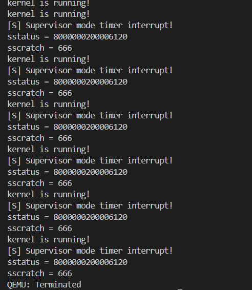
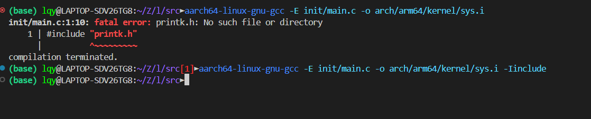
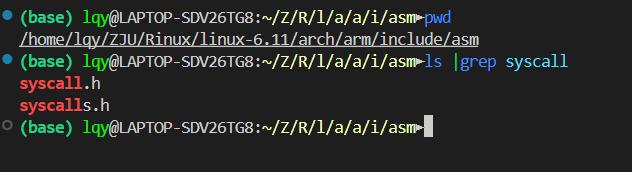
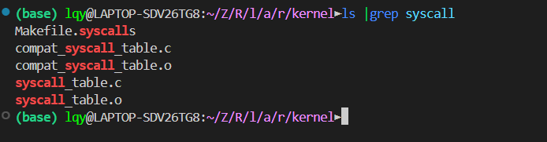
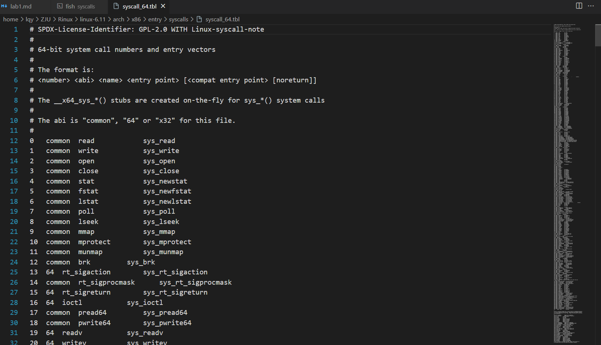

# Lab 1

李秋宇 3220103373

---

## Design

### 4.1 准备工程

从仓库拉取了源码

### 4.2 RV64内核引导

#### 4.2.1 Makefile

在这里编写`printk.c`的编译规则

设定`clean`规则以完成清除构建文件

注意到`{Makefile}$(CFLAG)`这些变量已经在最顶层的Makefile中定义，因此直接使用

```Makefile title:"lib/Makefile"
SRC = $(wildcard *.c)
OBJ = $(patsubst %.c,%.o,$(SRC))

all: $(OBJ)

%.o: %.c
    $(GCC) $(CFLAG) -c $< -o $@

.PHONY: clean
clean:
    rm -f *.o
```

完成

#### 4.2.2 head.S

根据要求写汇编

注意到这里已经定义了`start_kernel`并且有栈和栈顶的信息，直接使用即可

```asm title:"head.S" hl:5,6,11
    .extern start_kernel
    .section .text.entry
    .globl _start
_start:
    la sp, boot_stack_top # set stack pointer to top of boot stack
    jal start_kernel # jump to start_kernel

    .section .bss.stack
    .globl boot_stack
boot_stack:
    .space 4096 # Stack size 4KiB

    .globl boot_stack_top
boot_stack_top:
```

#### 4.2.3 sbi.c

参照示例进行内联汇编撰写，照葫芦画瓢

使用伪指令`mv`把寄存器拷贝，然后按照内联汇编格式写，写完返回结构体就完事儿了兄弟们

```c title="sbi.c"
struct sbiret sbi_ecall(uint64_t eid, uint64_t fid,
                        uint64_t arg0, uint64_t arg1, uint64_t arg2,
                        uint64_t arg3, uint64_t arg4, uint64_t arg5) {
    struct sbiret ret;
    asm volatile (
        "mv a7, %[eid]\n"
        "mv a6, %[fid]\n"
        "mv a0, %[arg0]\n"
        "mv a1, %[arg1]\n"
        "mv a2, %[arg2]\n"
        "mv a3, %[arg3]\n"
        "mv a4, %[arg4]\n"
        "mv a5, %[arg5]\n"
        "ecall\n"
        "mv %[error], a0\n"
        "mv %[value], a1\n"
        : [error] "=r" (ret.error), [value] "=r" (ret.value)
        : [eid] "r" (eid), [fid] "r" (fid),
          [arg0] "r" (arg0), [arg1] "r" (arg1), [arg2] "r" (arg2),
          [arg3] "r" (arg3), [arg4] "r" (arg4), [arg5] "r" (arg5)
    );
    return ret;
}
```

完成`sbi_ecall`后只需要在剩下几个函数里面调用就完事儿了兄弟们

根据表格中每个函数对应的`eid`和`fid`直接调用

```c title:"sbi.c"
struct sbiret sbi_set_timer(uint64_t stime_value) {
    struct sbiret ret;
    ret = sbi_ecall(0x54494d45, 0x0, stime_value, 0 ,0, 0, 0, 0);
    return ret;
}

struct sbiret sbi_debug_console_write_byte(uint8_t byte) {
    struct sbiret ret;
    ret = sbi_ecall(0x4442434E, 0x2, byte, 0, 0, 0, 0, 0);
    return ret;
}

struct sbiret sbi_system_reset(uint32_t reset_type, uint32_t reset_reason) {
    struct sbiret ret;
    ret = sbi_ecall(0x53525354, 0x0, reset_type, reset_reason, 0, 0, 0, 0);
    return ret;
}
```

#### 4.2.4 defs.h

依旧是照葫芦画瓢，使用指令`csrr`进行读取

```c title:"defs.h" hl:4
#define csr_read(csr)                           \
  ({                                            \
    uint64_t __v;                               \
    asm volatile("csrr %0, " #csr : "=r"(__v)); \
    __v;                                        \
  })
```

#### Run

完成上述后，进行构建


构建完成，使用`{Shell}make run`进行运行



完成！

### 4.3 RV64时钟中断处理

这一部分写其实压栈了，因为相当于先写4.3.3再写4.3.2再倒着写 🤔

#### 4.3.0 Preparation

首先根据准备工作完成对应修改

#### 4.3.1 head.S

除了根据模板作一些调整之外，还编写了以下四部曲

1. 根据`_traps`地址赋值给`stvec`用于中断处理
2. 设置开启时钟中断，把`sie`的第二位置`1`
3. 设置第一个时钟中断，这里根据了`clock.c`里面的定义设定了下一次时钟中断
4. 开启中断响应

```asm title:"head.S"
._start:

    # set stvec = _traps
    la t0, _traps
    csrw stvec, t0
     
    # set sie[STIE] = 1
    csrr t0, sie
    li t1, 0x20
    or t0, t0, t1
    csrw sie, t0

    # set first time interrupt
    li t0, 0x10000000
    csrw stimecmp, t0

    # set sstatus[SIE] = 1
    csrr t0, sstatus
    li t1, 0x2
    or t0, t0, t1
    csrw sstatus, t0
```

#### 4.3.2 entry.S

还是四部曲

1. 首先压栈保存所有寄存器，注意到这里其实我没有保存`x0`，因为感觉没啥必要👀
2. 调用`trap_handler`，这里后来注意到还需要传参，通过`a0`和`a1`进行传参
3. 上下文恢复，注意`sp`最后恢复，顺序和保存时相反
4. 返回

```asm title:"entry.S"
    .extern trap_handler
    .section .text.entry
    .align 2
    .globl _traps 
_traps:
    # 1. save 32 registers and sepc to stack
    addi sp, sp, -32*8
    sd ra, 0(sp) # x1
    sd sp, 8(sp) # x2
    sd gp, 16(sp) # x3
    sd tp, 24(sp) # x4
    sd t0, 32(sp) # x5
    sd t1, 40(sp) # x6
    sd t2, 48(sp) # x7
    sd s0, 56(sp) # x8
    sd s1, 64(sp) # x9
    sd a0, 72(sp) # x10
    sd a1, 80(sp) # x11
    sd a2, 88(sp) # x12
    sd a3, 96(sp) # x13
    sd a4, 104(sp) # x14
    sd a5, 112(sp) # x15
    sd a6, 120(sp) # x16
    sd a7, 128(sp) # x17
    sd s2, 136(sp) # x18
    sd s3, 144(sp) # x19
    sd s4, 152(sp) # x20
    sd s5, 160(sp) # x21
    sd s6, 168(sp) # x22
    sd s7, 176(sp) # x23
    sd s8, 184(sp) # x24
    sd s9, 192(sp) # x25
    sd s10, 200(sp) # x26
    sd s11, 208(sp) # x27
    sd t3, 216(sp) # x28
    sd t4, 224(sp) # x29
    sd t5, 232(sp) # x30
    sd t6, 240(sp) # x31
    csrr t0, sepc
    sd t0, 248(sp) # sepc

    # 2. call trap_handler
    csrr a0, scause # arg1: scause
    csrr a1, sepc # arg2: sepc
    call trap_handler

    # 3. restore sepc and 32 registers (x2(sp) should be restore last) from stack
    ld t0, 248(sp) # sepc
    csrw sepc, t0
    ld t6, 240(sp) # x31
    ld t5, 232(sp) # x30
    ld t4, 224(sp) # x29
    ld t3, 216(sp) # x28
    ld s11, 208(sp) # x27
    ld s10, 200(sp) # x26
    ld s9, 192(sp) # x25
    ld s8, 184(sp) # x24
    ld s7, 176(sp) # x23
    ld s6, 168(sp) # x22
    ld s5, 160(sp) # x21
    ld s4, 152(sp) # x20
    ld s3, 144(sp) # x19
    ld s2, 136(sp) # x18
    ld a7, 128(sp) # x17
    ld a6, 120(sp) # x16
    ld a5, 112(sp) # x15
    ld a4, 104(sp) # x14
    ld a3, 96(sp) # x13
    ld a2, 88(sp) # x12
    ld a1, 80(sp) # x11
    ld a0, 72(sp) # x10
    ld s1, 64(sp) # x9
    ld s0, 56(sp) # x8
    ld t2, 48(sp) # x7
    ld t1, 40(sp) # x6
    ld t0, 32(sp) # x5
    ld tp, 24(sp) # x4
    ld gp, 16(sp) # x3
    ld ra, 0(sp) # x1
    ld sp, 8(sp) # x2
    addi sp, sp, 32*8

    # 4. return from trap
    sret
```

#### 4.3.3 trap.c

查阅了[priv-isa-asciidoc第43页](https://github.com/riscv/riscv-isa-manual/releases/download/20240411/priv-isa-asciidoc.pdf)可以得到对应的异常代码，然后判断`scause`是否符合即可

注意到还要输出，所以调用`printk`配合输出

#### 4.3.4 clock.c

主要是内联汇编，根据提示写

顺便调用一下前面已经实现的`sbi_set_timer`

```c title:"clock.c"
#include "../../../include/stdint.h"
#include "sbi.h"

// QEMU 中时钟的频率是 10MHz，也就是 1 秒钟相当于 10000000 个时钟周期
uint64_t TIMECLOCK = 10000000;

uint64_t get_cycles() {
    // 编写内联汇编，使用 rdtime 获取 time 寄存器中（也就是 mtime 寄存器）的值并返回
    uint64_t time;
    asm volatile ("rdtime %0" : "=r" (time));
    return time;
}

void clock_set_next_event() {
    // 下一次时钟中断的时间点
    uint64_t next = get_cycles() + TIMECLOCK;

    // 使用 sbi_set_timer 来完成对下一次时钟中断的设置
    sbi_set_timer(next);
    return ;
}
```

#### 4.3.5 test.c

根据文档修改

编译成功

运行成功



---

## Exercises

### 1

**请总结一下RISC-V的calling convention，并解释Caller / Callee Saved Register有什么区别？**

Calling Convention:

- 函数传参使用寄存器`a0`到`a7`，如果超过8个则使用栈
- 函数返回值使用寄存器`a0`和`a1`返回
- 函数调用时通常需要保存当前的上下文并调整栈指针

Caller Saved Register：调用者保存寄存器，在RISC-V中为`t0`到`t6`，在调用函数之前需要手动保存

Callee Saved Register：被调用者保存寄存器，在RISC-V中为`s0`到`s11`，在被调用者进入函数时保存在栈上，在函数返回前恢复

### 2

**编译之后，通过System.map查看vmlinux.lds中自定义符号的值并截图.**



### 3

**用`csr_read`宏读取`sstatus`寄存器的值，对照RISC-V手册解释其含义并截图**

在`arch/riscv/kernel/trap.c`中加入读取`sstatus`的逻辑：

```c title:"trap.c"
uint64_t status = csr_read(sstatus);
printk("sstatus = %lx\n", status);
```

重新编译运行后得到



即`{c}sstatus = 0x8000000200006120`，即二进制

```Verilog
64'b10000000_00000000_00000000_00000010_00000000_00000000_01100001_00100000
```

对应置`1`位的具体信息为

- `SPIE`(5)： 上一次进入S模式之前的中断使能状态
- `SPP`(8)：S模式中断处理前的特权模式为机器模式
- `FS`(13,14)
- `UXL[1]`(33)
- `SD`(63)

### 4

**用`csr_write`宏向`sscratch`寄存器写入数据，并验证是否写入成功并截图**

还是在`trap.c`中写

```c title:"trap.c"
csr_write(sscratch, 0x666);
uint64_t res = csr_read(sscratch);
printk("sscratch = %lx\n", res);
```

编译后运行结果为



### 5

**详细描述你可以通过什么步骤来得到`arch/arm64/kernel/sys.i`，给出过程以及截图**

首先安装交叉编译链工具`gcc-aarch64-linux-gnu`

然后使用命令：

```Shell
aarch64-linux-gnu-gcc -E init/main.c -o arch/arm64/kernel/sys.i -Iinclude
```

即可生成



```c title:"arch/arm64/kernel/sys.i"
# 0 "init/main.c"
# 0 "<built-in>"
# 0 "<command-line>"
# 1 "/usr/aarch64-linux-gnu/include/stdc-predef.h" 1 3
# 0 "<command-line>" 2
# 1 "init/main.c"
# 1 "include/printk.h" 1


# 1 "include/stddef.h" 1


typedef long int ptrdiff_t;
typedef long unsigned int size_t;
typedef unsigned int wchar_t;


typedef __builtin_va_list va_list;
# 5 "include/printk.h" 2


int printk(const char *, ...);
# 2 "init/main.c" 2

extern void test();

int start_kernel() {
    printk("2024");
    printk(" ZJU Operating System\n");

    test();
    return 0;
}
```

### 6

**寻找 Linux v6.0 中 ARM32 RV32 RV64 x86_64 架构的系统调用表；请列出源代码文件，展示完整的系统调用表（宏展开后），每一步都需要截图。**

> [!tip] 方便
> 由于本人之前使用了Linux 6.11，因此这里为了方便没有使用Linux v6.0而是直接在6.11基础上进行这一步

各个架构的系统调用表都在Linux源码的根目录下的`arch/`中

```Shell title:"ARM32"
$ cd arch/arm/include/asm
$ ls | grep syscall
syscall.h
syscalls.h

```



```Shell title:"RV"
$ cd arch/riscv/kernel
$ ls | grep syscall
Makefile.syscalls
compat_syscall_table.c
compat_syscall_table.o
syscall_table.c
syscall_table.o
```



```Shell title:"x86_64"
$ cd arch/x86/entry/syscalls
$ ls
Makefile  syscall_32.tbl  syscall_64.tbl
```




### 7

**阐述什么是 ELF 文件？尝试使用 readelf 和 objdump 来查看 ELF 文件，并给出解释和截图.**

ELF文件是一种广泛用于Unix和类Unix系统的可执行文件、目标代码、共享库的文件格式，其格式具有灵活性和可扩展性

- `readelf`可以用于展示ELF文件的信息，有多种可选选项，包括`-h`,`-a`等
- `objdump`可以用于展示目标文件的信息

```Shell
$ readlef -h vmlinux
ELF Header:
  Magic:   7f 45 4c 46 02 01 01 00 00 00 00 00 00 00 00 00 
  Class:                             ELF64
  Data:                              2's complement, little endian
  Version:                           1 (current)
  OS/ABI:                            UNIX - System V
  ABI Version:                       0
  Type:                              EXEC (Executable file)
  Machine:                           RISC-V
  Version:                           0x1
  Entry point address:               0x80200000
  Start of program headers:          64 (bytes into file)
  Start of section headers:          30864 (bytes into file)
  Flags:                             0x0
  Size of this header:               64 (bytes)
  Size of program headers:           56 (bytes)
  Number of program headers:         4
  Size of section headers:           64 (bytes)
  Number of section headers:         20
  Section header string table index: 19

$ objdump vmlinux -h

vmlinux:     file format elf64-little

Sections:
Idx Name          Size      VMA               LMA               File off  Algn
  0 .text         000014fc  0000000080200000  0000000080200000  00001000  2**12
                  CONTENTS, ALLOC, LOAD, READONLY, CODE
  1 .rodata       00000109  0000000080202000  0000000080202000  00003000  2**12
                  CONTENTS, ALLOC, LOAD, READONLY, DATA
  2 .eh_frame     000002a8  0000000080202110  0000000080202110  00003110  2**3
                  CONTENTS, ALLOC, LOAD, READONLY, DATA
  3 .data         00000008  0000000080203000  0000000080203000  00004000  2**12
                  CONTENTS, ALLOC, LOAD, DATA
  4 .got          00000020  0000000080203008  0000000080203008  00004008  2**3
                  CONTENTS, ALLOC, LOAD, DATA
  5 .got.plt      00000010  0000000080203028  0000000080203028  00004028  2**3
                  CONTENTS, ALLOC, LOAD, DATA
  6 .bss          00001000  0000000080204000  0000000080204000  00004038  2**12
                  ALLOC
  7 .debug_info   00000d12  0000000000000000  0000000000000000  00004038  2**0
                  CONTENTS, READONLY, DEBUGGING, OCTETS
  8 .debug_abbrev 000005a5  0000000000000000  0000000000000000  00004d4a  2**0
                  CONTENTS, READONLY, DEBUGGING, OCTETS
  9 .debug_aranges 00000220  0000000000000000  0000000000000000  000052f0  2**4
                  CONTENTS, READONLY, DEBUGGING, OCTETS
 10 .debug_rnglists 0000010b  0000000000000000  0000000000000000  00005510  2**0
                  CONTENTS, READONLY, DEBUGGING, OCTETS
 11 .debug_line   00001379  0000000000000000  0000000000000000  0000561b  2**0
                  CONTENTS, READONLY, DEBUGGING, OCTETS
 12 .debug_str    0000035a  0000000000000000  0000000000000000  00006994  2**0
                  CONTENTS, READONLY, DEBUGGING, OCTETS
 13 .debug_line_str 00000116  0000000000000000  0000000000000000  00006cee  2**0
                  CONTENTS, READONLY, DEBUGGING, OCTETS
 14 .comment      00000026  0000000000000000  0000000000000000  00006e04  2**0
                  CONTENTS, READONLY
 15 .riscv.attributes 00000046  0000000000000000  0000000000000000  00006e2a  2**0
                  CONTENTS, READONLY

```

**运行一个 ELF 文件，然后通过 cat /proc/PID/maps 来给出其内存布局并截图.**

这里随便写一个简单的C程序然后看

```c title:"t.c"
#include <stdio.h>

int main() {
    int i = 0;
    while (i < 10000000000000000) {
        printf("%d\n", i);
        i++;
    }
    return 0;
}
```

编译并运行

```Shell
gcc t.c -o a.out
./a.out
```

这时开始疯狂跑循环输出

开另一个终端，查看PID

```Shell
$ ps -e | grep a.out
  90706 pts/5    00:00:04 a.out

$ cat /proc/90706/maps
5627216a8000-5627216a9000 r--p 00000000 08:20 303404                     /home/lqy/ZJU/lab1/a.out
5627216a9000-5627216aa000 r-xp 00001000 08:20 303404                     /home/lqy/ZJU/lab1/a.out
5627216aa000-5627216ab000 r--p 00002000 08:20 303404                     /home/lqy/ZJU/lab1/a.out
5627216ab000-5627216ac000 r--p 00002000 08:20 303404                     /home/lqy/ZJU/lab1/a.out
5627216ac000-5627216ad000 rw-p 00003000 08:20 303404                     /home/lqy/ZJU/lab1/a.out
562723442000-562723463000 rw-p 00000000 00:00 0                          [heap]
7f5712e0f000-7f5712e12000 rw-p 00000000 00:00 0 
7f5712e12000-7f5712e3a000 r--p 00000000 08:20 291046                     /usr/lib/x86_64-linux-gnu/libc.so.6
7f5712e3a000-7f5712fc2000 r-xp 00028000 08:20 291046                     /usr/lib/x86_64-linux-gnu/libc.so.6
7f5712fc2000-7f5713011000 r--p 001b0000 08:20 291046                     /usr/lib/x86_64-linux-gnu/libc.so.6
7f5713011000-7f5713015000 r--p 001fe000 08:20 291046                     /usr/lib/x86_64-linux-gnu/libc.so.6
7f5713015000-7f5713017000 rw-p 00202000 08:20 291046                     /usr/lib/x86_64-linux-gnu/libc.so.6
7f5713017000-7f5713024000 rw-p 00000000 00:00 0 
7f5713032000-7f5713034000 rw-p 00000000 00:00 0 
7f5713034000-7f5713035000 r--p 00000000 08:20 291043                     /usr/lib/x86_64-linux-gnu/ld-linux-x86-64.so.2
7f5713035000-7f5713060000 r-xp 00001000 08:20 291043                     /usr/lib/x86_64-linux-gnu/ld-linux-x86-64.so.2
7f5713060000-7f571306a000 r--p 0002c000 08:20 291043                     /usr/lib/x86_64-linux-gnu/ld-linux-x86-64.so.2
7f571306a000-7f571306c000 r--p 00036000 08:20 291043                     /usr/lib/x86_64-linux-gnu/ld-linux-x86-64.so.2
7f571306c000-7f571306e000 rw-p 00038000 08:20 291043                     /usr/lib/x86_64-linux-gnu/ld-linux-x86-64.so.2
7ffe72256000-7ffe72277000 rw-p 00000000 00:00 0                          [stack]
7ffe722cf000-7ffe722d3000 r--p 00000000 00:00 0                          [vvar]
7ffe722d3000-7ffe722d5000 r-xp 00000000 00:00 0                          [vdso]

```

### 8

在我们使用 make run 时，OpenSBI 会产生如下输出：

```Shell
    OpenSBI v1.5.1
     ____                    _____ ____ _____
    / __ \                  / ____|  _ \_   _|
   | |  | |_ __   ___ _ __ | (___ | |_) || |
   | |  | | '_ \ / _ \ '_ \ \___ \|  _ < | |
   | |__| | |_) |  __/ | | |____) | |_) || |_
    \____/| .__/ \___|_| |_|_____/|____/_____|
          | |
          |_|

    ......

    Boot HART MIDELEG         : 0x0000000000000222
    Boot HART MEDELEG         : 0x000000000000b109

    ......
```

**通过查看[RISC-V Privileged Spec](https://github.com/riscv/riscv-isa-manual/releases/download/20240411/priv-isa-asciidoc.pdf) 中的 medeleg 和 mideleg 部分，解释上面 MIDELEG 和 MEDELEG 值的含义**

在手册的35页有详细定义

通常来说，所有的trap都可以在M模式下解决，因为M模式下的陷入解决程序可以重定向到合适的权限等级进行解决陷入；但是为了提升性能表现，引入这两个寄存器

- MIDELEG: 用于保存哪些中断需要交给S模式处理
- MEDELEG: 用于保存哪些异常需要交给S模式处理

这里的`{C}MIDELEG == 0x222 == 0b001000100010`，即第1,5,9位置1，则表明

- Supervisor Software Interrupt
- Supervisor Timer Interrupt
- Supervisor External Interrupt

上述三种中断交给S模式处理

这里`{C}MEDELEG == 0xb109 == 0b101100001001`，即第0,3,8,9,11位置1，则表明

- Instruction Address Misaligned
- Breakpoint
- Environment Call from U-mode
- Environment Call from S-mode
- Environment Call from M-mode

上述五种异常交给S模式处理

---

## Thinkings

这个lab总体来说难度不大，主要是学习一些船新版本的知识，比如内联汇编之类的，而实验指导非常完善，夸夸助教们👍，因此上手很快，也很容易写完

内容不算多，而且学习新东西的过程比较有趣，所有总体顺利~

不过思考题觉得有点子多，甚至觉得写思考题的时间比写lab还要就，所以偷懒了一些😆
