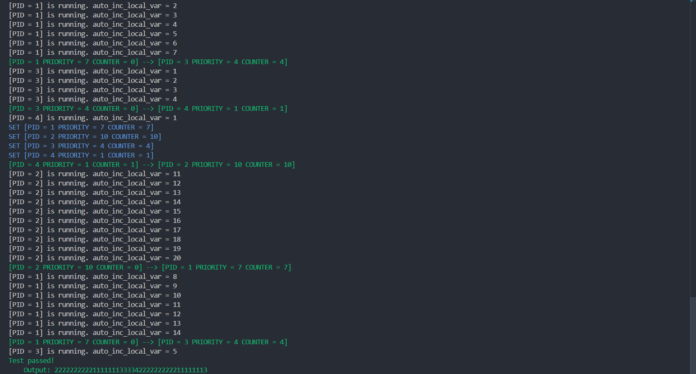
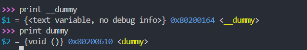
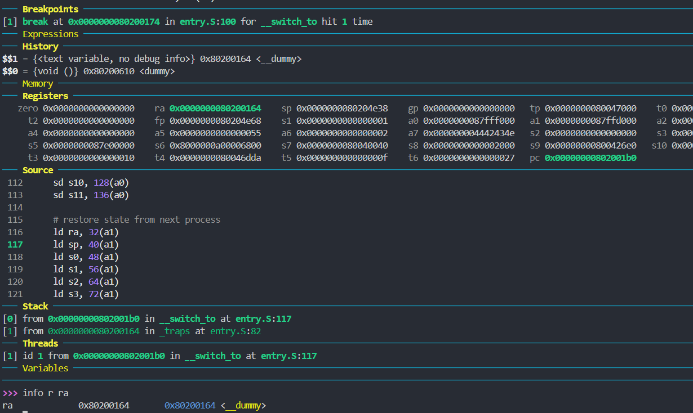
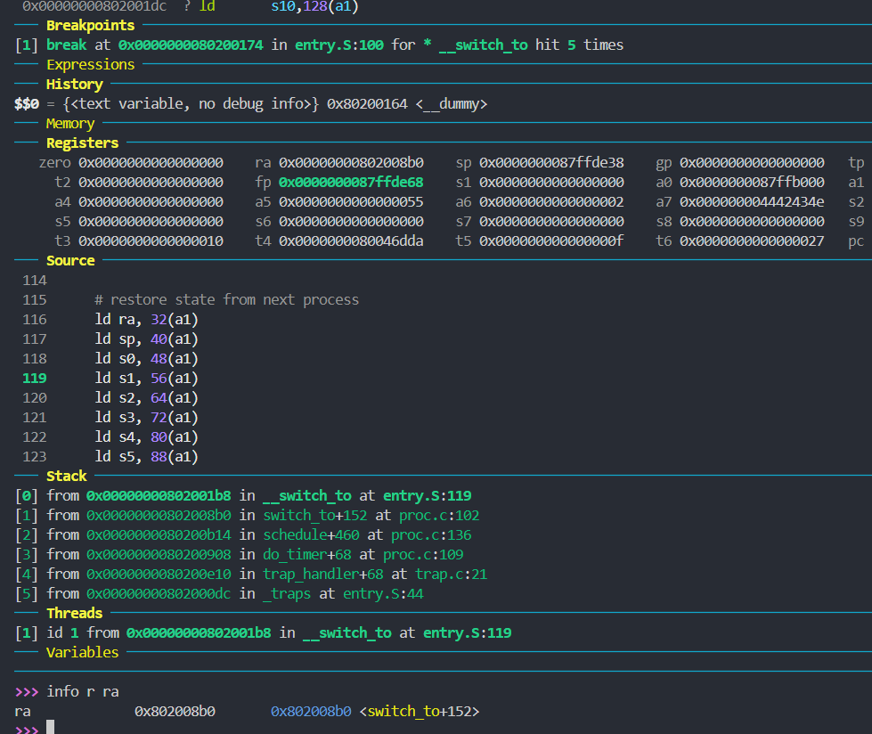

# Lab 2

李秋宇 3220103373

---

## Design

### 准备工程

首先在`defs.h`中添加宏，直接复制粘贴即可

然后在`head.S`的`_start`段中加入调用`mm_init`的部分：

```armasm title:"arch/riscv/kernel/head.S" hl:2,9-10
    .extern start_kernel
    .extern mm_init
    .section .text.init # Changed from ".text.entry" to ".text.init"
    .globl _start
_start:
    # set stack pointer to top of boot stack
    la sp, boot_stack_top

    # Initialize memory management unit
    call mm_init
    ...
```

编译成功，运行成功

### 线程调度

#### 线程初始化

首先实现`{C title:"proc.c"}task_init()`

注意这里把`pid`写进去

```C title:"arch/riscv/kernel/proc.c"
void task_init() {
    srand(2024);

    // 1. 调用 kalloc() 为 idle 分配一个物理页
    idle = (struct task_struct *)kalloc();
    if (!idle) {
        printk("Failed to allocate idle task!\n");
    }

    // 2. 设置 state 为 TASK_RUNNING;
    // 3. 由于 idle 不参与调度，可以将其 counter / priority 设置为 0
    // 4. 设置 idle 的 pid 为 0
    idle->state = TASK_RUNNING;
    idle->counter = 0;
    idle->priority = 0;
    idle->pid = 0;

    // 5. 将 current 和 task[0] 指向 idle
    current = idle;
    task[0] = idle;

    // 1. 参考 idle 的设置，为 task[1] ~ task[NR_TASKS - 1] 进行初始化
    // 2. 其中每个线程的 state 为 TASK_RUNNING, 此外，counter 和 priority 进行如下赋值：
    //     - counter  = 0;
    //     - priority = rand() 产生的随机数（控制范围在 [PRIORITY_MIN, PRIORITY_MAX] 之间）
    // 3. 为 task[1] ~ task[NR_TASKS - 1] 设置 thread_struct 中的 ra 和 sp
    //     - ra 设置为 __dummy（见 4.2.2）的地址
    //     - sp 设置为该线程申请的物理页的高地址
    for (int i = 1; i < NR_TASKS; i++) {
        task[i] = (struct task_struct *)kalloc();
        task[i]->state = TASK_RUNNING;
        task[i]->counter = 0;
        task[i]->priority = rand() % (PRIORITY_MAX - PRIORITY_MIN + 1) + PRIORITY_MIN;
        task[i]->pid = i;
        task[i]->thread.ra = (uint64_t)__dummy;
        task[i]->thread.sp = (uint64_t)task[i] + PGSIZE;
    }

    printk("...task_init done!\n");
}
```

然后在`head.S`中调用，进行线程初始化

```armasm title:"arch/riscv/kernel/head.S"
    ...
    .extern task_init
    ...
_start:
    ...

    # Initialize tasks.
    call task_init

    ...
```

#### __dummy实现

`dummy`部分直接删掉对应条件编译的代码

根据要求，在`entry.S`中写`__dummy`：

```armasm title:"arch/riscv/kernel/entry.S"
    .extern dummy
    .globl __dummy
__dummy:
    # Set sepc to dummy.
    la t0, dummy
    csrw sepc, t0

    # Return from trap.
    sret
```

#### 线程切换

首先进行判断，然后把当前进程切换成`next`

```C title:"arch/riscv/kernel/proc.c"
extern void __switch_to(struct task_struct *prev, struct task_struct *next);

void switch_to(struct task_struct *next) {
    if (current != next) {
        struct task_struct *prev = current;
        current = next;
        printk("\033[32m[PID = %d PRIORITY = %d COUNTER = %d] --> [PID = %d PRIORITY = %d COUNTER = %d]\033[0m\n", prev->pid, prev->priority, prev->counter, next->pid, next->priority, next->counter);
        __switch_to(prev, next);
    }
}
```

然后实现`{C}__switch_to(struct task_struct *prev, struct task_struct *next)`

这里的传参为`a0`对应`prev`，`a1`对应`next`，而考虑`{C}struct task_struct`的定义：

```C
/* 线程状态段数据结构 */
struct thread_struct {
    uint64_t ra;
    uint64_t sp;
    uint64_t s[12];
};

/* 线程数据结构 */
struct task_struct {
    uint64_t state;     // 线程状态
    uint64_t counter;   // 运行剩余时间
    uint64_t priority;  // 运行优先级 1 最低 10 最高
    uint64_t pid;       // 线程 id

    struct thread_struct thread;
};
```

所以其实是这样的

```C
struct task_struct {
    uint64_t state;     // 0:7
    uint64_t counter;   // 8:15
    uint64_t priority;  // 16:23
    uint64_t pid;       // 24:31
    uint64_t ra;        // 32:40
    uint64_t sp;        // 41:48
    uint64_t s[12];     // 49:56
};
```

所以根据结构体的内存排布进行保存和载入操作

```armasm title:"arch/riscv/kernel/entry.S"
    .globl __switch_to
__switch_to:
    # a0: prev, a1: next
    # ra, sp, s0~s11

    # save state to prev process
    sd ra, 32(a0)
    sd sp, 40(a0)
    sd s0, 48(a0)
    sd s1, 56(a0)
    sd s2, 64(a0)
    sd s3, 72(a0)
    sd s4, 80(a0)
    sd s5, 88(a0)
    sd s6, 96(a0)
    sd s7, 104(a0)
    sd s8, 112(a0)
    sd s9, 120(a0)
    sd s10, 128(a0)
    sd s11, 136(a0)

    # restore state from next process
    ld ra, 32(a1)
    ld sp, 40(a1)
    ld s0, 48(a1)
    ld s1, 56(a1)
    ld s2, 64(a1)
    ld s3, 72(a1)
    ld s4, 80(a1)
    ld s5, 88(a1)
    ld s6, 96(a1)
    ld s7, 104(a1)
    ld s8, 112(a1)
    ld s9, 120(a1)
    ld s10, 128(a1)
    ld s11, 136(a1)

    ret
```

#### 调度入口函数

首先实现`{C}do_timer()`

需要判断的是

- 如果当前进程为IDLE则直接调度
- 如果当前进程时间片已经为0也直接调度
- 如果当前时间片时间不为0，则运行并减少一个时间片
    - 如果此时时间片为0了，进行调度
    - 否则继续

```C title:"arch/riscv/kernel/proc.c"
void do_timer() {
    // 1. 如果当前线程是 idle 线程或当前线程时间片耗尽则直接进行调度
    // 2. 否则对当前线程的运行剩余时间减 1，若剩余时间仍然大于 0 则直接返回，否则进行调度
    if (current == idle || current->counter == 0) schedule();
    else if ((--current->counter) == 0) schedule();
    return ;
}
```

然后在`trap.c`中调用

```C title:"arch/riscv/kernel/trap.c" hl:4,14
#include "../../../include/stdint.h"
#include "printk.h"
#include "defs.h"
#include "proc.h" // Added.

#define SUPERVISOR_TIMER_INTERRUPT_TYPE UINT64_C(1UL << 63 | 5)

void trap_handler(uint64_t scause, uint64_t sepc) {
    if (scause >> 63) {
        uint64_t interruptType = scause & UINT64_MAX;
        switch (interruptType) {
            case SUPERVISOR_TIMER_INTERRUPT_TYPE:
                clock_set_next_event();
                do_timer(); // Added.
                break;
            default:
                printk("Unknown interrupt code: %lu\n", interruptType);
        }
    } else {
        printk("Unknown exception code: %lu\n", scause);
    }

    return ;
}
```

#### 线程调度算法

首先找出一个时间片最大的进程，并标记出来

如果最大时间片的进程的时间片为0，那么所有进程时间片都用完了，需要重新分配，基于优先级进行，分配的过程中顺便标记最大时间片的进程，然后进行调度

```c title:"arch/riscv/kernel/proc.c"
void schedule() {
    int maxCount = 0;
    int nextPid = 0;
    for (int i = 1; i < NR_TASKS; i++) {
        if (task[i]->counter > maxCount) {
            maxCount = task[i]->counter;
            nextPid = i;
        }
    }

    if (!maxCount) {
        for (int i = 1; i < NR_TASKS; i++) {
            task[i]->counter = task[i]->priority;
            printk("\033[34mSET [PID = %d PRIORITY = %d COUNTER = %d]\033[0m\n", task[i]->pid, task[i]->priority, task[i]->counter);
            if (task[i]->counter > maxCount) {
                maxCount = task[i]->counter;
                nextPid = i;
            }
        }
    }

    struct task_struct *next = task[nextPid];
    switch_to(next);
}
```

### 编译与测试



---

## Exercises

### 1

> [!question] 在 RV64 中一共有 32 个通用寄存器，为什么`__switch_to`中只保存了14个？
> 并不是所有的寄存器在上下文切换时需要保存，有些寄存器（如`t0`）就不需要保存，因为它们在调用约定中可以被调用者和被调用者自由使用，因此无需保存，只有需要保存和恢复的寄存器需要再调用过程中保持稳定，因此上下文切换时需要保存这类寄存器；此外，减少需要保存的寄存器的数量可以在上下文切换的时候减少系统开销

### 2

> [!question] 阅读并理解 arch/riscv/kernel/mm.c 代码，尝试说明`mm_init`函数都做了什么，以及在`kalloc`和`kfree`的时候内存是如何被管理的
> 调用`kfreerange`进行`__start`代码内存空间的释放，以给后续运行留出空间

### 3

> [!question] 当线程第一次调用时，其`ra`所代表的返回点是`__dummy`，那么在之后的线程调用中`__switch_to`中，`ra`保存 / 恢复的函数返回点是什么呢？请同学用 gdb 尝试追踪一次完整的线程切换流程，并关注每一次`ra`的变换（需要截图）
> 首先注意到`dummy`和`__dummy`的地址
> 
> 第一次进程调度时的`ra`为`__dummy`的地址
> 
> 经过**一轮调度**后的新一轮调度时，`ra`代表的地址是`{C}0x802008b0`，即`0x00000000802008b0 in switch_to+152 at proc.c:102`，即
> 
> ```c title:"arch/riscv/kernel/proc.c" hl:6
> void switch_to(struct task_struct *next) {
>     if (current != next) {
>         struct task_struct *prev = current;
>         current = next;
>         printk("\033[32m[PID = %d PRIORITY = %d COUNTER = %d] --> [PID = %d PRIORITY = %d COUNTER = %d]\033[0m\n", prev->pid, prev->priority, prev->counter, next->pid, next->priority, next->counter);
>         __switch_to(prev, next);
>     }
> }
> ```
>
> 即从进程切换函数`switch_to`原处返回
> 

### 4

> [!question] 请尝试分析并画图说明 kernel 运行到输出第两次`switch to [PID ...`的时候内存中存在的全部函数帧栈布局； 可通过 gdb 调试使用`backtrace`等指令辅助分析，注意分析第一次时钟中断触发后的`pc`和`sp`的变化
> 第二次输出切换进程的信息时，此时是从进程2切换到进程1，首先调用`_traps`处理时钟中断，然后保存当前寄存器信息，然后进入`trap_handler`处理，由其判断出是`SUPERVISOR_TIMER_INTERRUPT`，所以进入调度入口`do_timer`函数，判断当前进程时间片为0，进入调度函数`schedule`，在其中决定了进行调度的下一个进程为进程1，然后进入`switch_to`函数进行进程切换，这里包含了输出题目所述的信息
>
> 函数栈帧布局如下：（自栈顶向下）
> 
> ```mermaid
> classDiagram
>     class Frame0 {
>         -函数名: switch_to
>         +返回地址: 0x80200b14
>         +旧帧指针: 0x87ffde58
>         +局部变量
>         +参数: next=0x87ffe000
>     }
> 
>     class Frame1 {
>         +函数名: schedule
>         +返回地址: 0x80200908
>         +旧帧指针: 0x87ffde88
>         +局部变量
>         +参数
>     }
> 
>     class Frame2 {
>         +函数名: do_timer
>         +返回地址: 0x80200e10
>         +旧帧指针: 0x87ffde98
>         +局部变量
>         +参数
>     }
> 
>     class Frame3 {
>         +函数名: trap_handler
>         +返回地址: 0x802000dc
>         +旧帧指针: 0x87ffdec8
>         +局部变量
>         +参数: scause=9223372036854775813, sepc=2149582424
>         +保存寄存器: ra=0x87ffded0, fp=0x87ffdec8, pc=0x87ffded0
>     }
> 
>     class Frame4 {
>         +函数名: _traps
>         +返回地址: <not saved>
>         +旧帧指针: <not saved>
>         +局部变量
>         +参数
>     }
> 
>     Frame0 <|-- Frame1
>     Frame1 <|-- Frame2
>     Frame2 <|-- Frame3
>     Frame3 <|-- Frame4
> 
> ```

---

## Thinkings

好像不是很难，写的过程很快，因为思路还是比较清晰的，但是debug的过程非常久，因为一些低级错误而耽搁了，比如

> [!example] 低级错误大赏🥸
> ```c title:"arch/riscv/kernel/proc.c" hl:4
> void switch_to(struct task_struct *next) {
>     if (current != next) {
>         struct task_struct *prev = current;
>         current = next;
>         printk("\033[32m[PID = %d PRIORITY = %d COUNTER = %d] --> [PID = %d PRIORITY = %d COUNTER = %d]\033[0m\n", prev->pid, prev->priority, prev->counter, next->pid, next->priority, next->counter);
>         __switch_to(prev, next);
>     }
> }
> ```
> 
> 这里把`current`切换为`next`当时忘记加了，导致怎么也切换不了进程 🃏
