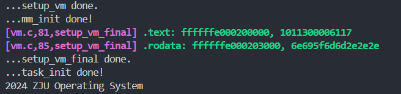

# Lab 3

李秋宇 3220103373

## Design

### 准备工程

复制粘贴头文件的更新，同时更新`vmlinux.lds`

### 关于PIE

在Makefile中添加编译选项

### 开启虚拟内存映射

#### `setup_vm`的实现

首先需要把从物理地址`{c}0x80000000`开始的1GiB空间映射到虚拟内存中

注意到`defs.h`中定义了这两个地址：

```c title:"arch/riscv/include/defs.h"
#define PHY_START 0x0000000080000000
#define VM_START (0xffffffe000000000)
```

1. 等值映射：从`PHY_START`到`PHY_START`
2. 线性映射：从`PHY_START`到`VM_START`

根据物理地址、虚拟地址和页表项的结构定义，进行：

1. 得到页表索引值为`{Verilog}PA[31:39]`：右移30位，并取右移后的低9位
2. 得到PPN（合并PPN的三项）：`{Verilog}PA[55:12]`变为`{Verilog}VA[53:10]`
3. 低位相关字段置1：`{Verilog}VA[3:0] = 4'b1`

```c title:arch/riscv/kernel/vm.c" hl:17-18
void setup_vm() {
    /* 
     * 1. 由于是进行 1GiB 的映射，这里不需要使用多级页表 
     * 2. 将 va 的 64bit 作为如下划分： | high bit | 9 bit | 30 bit |
     *     high bit 可以忽略
     *     中间 9 bit 作为 early_pgtbl 的 index
     *     低 30 bit 作为页内偏移，这里注意到 30 = 9 + 9 + 12，即我们只使用根页表，根页表的每个 entry 都对应 1GiB 的区域
     * 3. Page Table Entry 的权限 V | R | W | X 位设置为 1
    **/
    early_pgtbl[(PHY_START >> 30) & 0x1FF] = ((PHY_START >> 12) << 10) | 0xF;
    early_pgtbl[(VM_START >> 30) & 0x1FF] = ((PHY_START >> 12) << 10) | 0xF;
    printk("...setup_vm done.\n");
    return ;
}
```

完成之后，设定`satp`以开启虚拟地址映射

注意到这里把模式改为`{c}0x8`，即Sv39模式，模式位于高4位

同时把顶级页表的地址作为PPN存入`satp`

```armasm title:"arch/riscv/kernel/head.S"
_start:
    # set stack pointer to top of boot stack
    la sp, boot_stack_top

    call setup_vm
    call relocate
    ...
relocate:
    # set ra = ra + PA2VA_OFFSET
    # set sp = sp + PA2VA_OFFSET (If you have set the sp before)
    li t0, 0xffffffdf80000000
    add ra, ra, t0
    add sp, sp, t0

    # need a fence to ensure the new translations are in use
    sfence.vma zero, zero

    # set satp with early_pgtbl
    la t0, early_pgtbl
    srli t0, t0, 12 # PPN
    li t1, 0x8000000000000000 # set mode to SV39
    or t0, t0, t1
    csrw satp, t0

    ret
```

然后把`mm_init()`修改成释放的地址是虚拟空间的即可

```c title:"arch/riscv/kernel/mm.c"
void mm_init(void) {
    kfreerange(_ekernel, (char *)VM_START + PHY_SIZE);
    printk("...mm_init done!\n");
}
```

#### `setup_vm_final`的实现

要把物理内存中的**每一页**都映射到虚拟内存中，并且建立三级页表

首先实现`create_mapping`函数，负责建立一段从物理地址到虚拟地址的映射过程，其中根页表的基地址传入

计算出每一个虚拟地址页号：

```txt
 55                30 29        21 20        12 11                           0
┌────────────────────┬────────────┬────────────┬──────────────────────────────┐
│       PPN[2]       │   PPN[1]   │   PPN[0]   │          page offset         │
└────────────────────┴────────────┴────────────┴──────────────────────────────┘
                            Sv39 physical address

 38        30 29        21 20        12 11                           0
┌────────────┬────────────┬────────────┬──────────────────────────────┐
│   VPN[2]   │   VPN[1]   │   VPN[0]   │          page offset         │
└────────────┴────────────┴────────────┴──────────────────────────────┘
                        Sv39 virtual address

 63      54 53        28 27        19 18        10 9   8 7 6 5 4 3 2 1 0
┌──────────┬────────────┬────────────┬────────────┬─────┬─┬─┬─┬─┬─┬─┬─┬─┐
│ Reserved │   PPN[2]   │   PPN[1]   │   PPN[0]   │ RSW │D│A│G│U│X│W│R│V│
└──────────┴────────────┴────────────┴────────────┴─────┴─┴─┴─┴─┴─┴─┴─┴─┘
                        Sv39 page table entry
```

则

```c title:"arch/riscv/kernel/vm.c" ln:51
uint64_t vpn2 = (va >> 30) & 0x1FF;
uint64_t vpn1 = (va >> 21) & 0x1FF;
uint64_t vpn0 = (va >> 12) & 0x1FF;
```

然后从根页表开始，查看V位是否有效：

- 如果有效，表示页存在，直接从页表项中读出下一级页表的物理基地址为`{Verilog}pte[53:10]`，进行下一级访问
- 如果无效，表示页不存在，直接分配一个页，由于分配出的页为虚拟地址，做一个反向映射回物理地址，然后存在当前页表的表项中，并置V位为1

```c title:"arch/riscv/kernel/vm.c"
    if (pgtbl2[vpn2] & 0x1) pgtbl1 = (uint64_t *)(pgtbl2[vpn2] >> 10 << 12);
    else {
        pgtbl1 = (uint64_t *)((uint64_t)kalloc() - PA2VA_OFFSET);
        pgtbl2[vpn2] = (uint64_t)pgtbl1 >> 12 << 10 | 0x1;
    }

    if (pgtbl1[vpn1] & 0x1) pgtbl0 = (uint64_t *)(pgtbl1[vpn1] >> 10 << 12);
    else {
        pgtbl0 = (uint64_t *)((uint64_t)kalloc() - PA2VA_OFFSET);
        pgtbl1[vpn1] = (uint64_t)pgtbl0 >> 12 << 10 | 0x1;
    }

    if (!(pgtbl0[vpn0] & 0x1)) pgtbl0[vpn0] = pa >> 12 << 10 | perm;
```

通过上述流程操作，直到查到第三级页表，如果有了就不用继续了，如果没有就把当前物理地址`pa`放入，置相关权限位为`perm`

完事之后直接在`setup_vm_final`里面调用，注意到这里要对kernel的text段、rodata段和其它段作映射，而这些段的地址信息在`vmlinux.lds`里面定义好了，直接在这里使用即可：

- text段从`_stext`到`_etext`
- rodata段从`_srodata`到`_erodata`
- 其它段从`_sdata`到末尾

```c title:"arch/riscv/kernel/vm.c"
extern uint64_t _stext[];
extern uint64_t _etext[];
extern uint64_t _srodata[];
extern uint64_t _erodata[];
extern uint64_t _sdata[];

...

// mapping kernel text X|-|R|V
create_mapping(swapper_pg_dir, (uint64_t)_stext, (uint64_t)_stext - PA2VA_OFFSET, (uint64_t)_etext - (uint64_t)_stext, 0xB);

// mapping kernel rodata -|-|R|V
create_mapping(swapper_pg_dir, (uint64_t)_srodata, (uint64_t)_srodata - PA2VA_OFFSET, (uint64_t)_erodata - (uint64_t)_srodata, 0x3);

// mapping other memory -|W|R|V
create_mapping(swapper_pg_dir, (uint64_t)_sdata, (uint64_t)_sdata - PA2VA_OFFSET, PHY_END + PA2VA_OFFSET - (uint64_t)_sdata, 0x7);
```

最后写一下`satp`寄存器即可

```c title:"arch/riscv/kernel/vm.c"
// set satp with swapper_pg_dir
uint64_t _satp = 0x8000000000000000 | (((uint64_t)swapper_pg_dir - PA2VA_OFFSET) >> 12);
csr_write(satp, _satp);
```

### 编译及测试

编译成功，测试成功

---

## Exercises

> [!question] 验证 .text，.rodata 段的属性是否成功设置，给出截图
> 在`setup_vm_final`中添加读取这两段的代码：
> 
> ```c title:"arch/riscv/kernel/vm.c"
> // mapping kernel text X|-|R|V
> create_mapping(swapper_pg_dir, (uint64_t)_stext, (uint64_t)_stext - PA2VA_OFFSET, (uint64_t)_etext - (uint64_t)_stext, 0xB);
> log(GREEN ".text: %lx, %lx" CLEAR, _stext, *_stext);
> 
> // mapping kernel rodata -|-|R|V
> create_mapping(swapper_pg_dir, (uint64_t)_srodata, (uint64_t)_srodata - PA2VA_OFFSET, (uint64_t)_erodata - (uint64_t)_srodata, 0x3);
> log(GREEN ".rodata: %lx, %lx" CLEAR, _srodata, *_srodata);
> ```
> 
> 运行结果为
> 

> [!question] 为什么我们在`setup_vm`中需要做等值映射？在 Linux 中，是不需要做等值映射的，请探索一下不在`setup_vm`中做等值映射的方法。你需要回答以下问题：
> > [!question] 本次实验中如果不做等值映射，会出现什么问题，原因是什么
> > 因为在`setup_vm_final`中需要建立三级页表，其地址都是物理地址，每一级都从页表项中读出下一级页表的PPN，然后根据PPN得到下一级页表的物理地址，如果在`setup_vm`中没有等值映射，会导致这里的三级页表访问的虚拟地址是未被等值映射的，发生访问错误
> 
> > [!question] 简要分析 Linux v5.2.21 或之后的版本中的内核启动部分（直至 init/main.c 中 start_kernel 开始之前），特别是设置 satp 切换页表附近的逻辑
> > 1. 开启中断响应
> > 2. 加载全局指针
> > 3. 选择一个硬盘来运行主启动程序
> > 4. 清除BSS，保存硬盘ID和DTB的物理地址
> > 5. 初始化页表
> > 6. 进行relocate
> >     1. 加载`PAGE_OFFSET`
> >     2. 重定向返回地址
> >     3. 设定`stvec`为写`satp`后一条指令
> >     4. 计算内核页表的`satp`
> >     5. 加载内核页表
> > 7. 进程/线程初始化
> > 8. 解析DTB
> > 9. 开始运行内核`start_kernel`
>
> > [!question] 回答 Linux 为什么可以不进行等值映射，它是如何在无等值映射的情况下让 pc 从物理地址跳到虚拟地址
> > 因为Linux内核中的早期页表是在MMU开启之前建立的，作用是在物理地址和虚拟地址相等的情况下提供一个临时的页表，如果虚拟地址和物理地址不一致，即出现`{c}VA != PA`则会引发一个陷入处理，所以能够访问的情况已经是虚拟地址和物理地址一致了，就不需要再做一个等值映射了
>
> > [!question] Linux v5.2.21 中的`trampoline_pg_dir`和`swapper_pg_dir`有什么区别，它们分别是在哪里通过 satp 设为所使用的页表的
> > - `trampoline_pg_dir`是内核的早期临时页表，允许内核在启用MMU之前通过这个临时页表进行访问物理内存，在`head.S/relocate`中设置为satp`
> > - `swapper_pg_dir`是内核的永久页表，在内核完成初始化后进行所有的内核空间映射，在`setup_vm_final`中完成设置
> 
> > [!question] 尝试修改你的 kernel，使得其可以像 Linux 一样不需要等值映射
> > 把页表项中读到的页号计算的物理地址转为虚拟地址用于下一次访问
> > ```c title:"arch/riscv/kernel/vm.c"
> > #if NO_EQUAL_MAPPING
> >         if (pgtbl2[vpn2] & 0x1) pgtbl1 = (uint64_t *)((pgtbl2[vpn2] >> 10) << 12 + PA2VA_OFFSET);
> >         else {
> >             pgtbl1 = (uint64_t *)kalloc();
> >             pgtbl2[vpn2] = ((uint64_t)pgtbl1 - PA2VA_OFFSET) >> 12 << 10 | 0x1;
> >         }
> > 
> >         if (pgtbl1[vpn1] & 0x1) pgtbl0 = (uint64_t *)((pgtbl1[vpn1] >> 10) << 12 + PA2VA_OFFSET);
> >         else {
> >             pgtbl0 = (uint64_t *)kalloc();
> >             pgtbl1[vpn1] = ((uint64_t)pgtbl0 - PA2VA_OFFSET) >> 12 << 10 | 0x1;
> >         }
> > 
> >         if (!(pgtbl0[vpn0] & 0x1)) pgtbl0[vpn0] = pa >> 12 << 10 | perm;
> > #else
> >         if (pgtbl2[vpn2] & 0x1) pgtbl1 = (uint64_t *)(pgtbl2[vpn2] >> 10 << 12);
> >         else {
> >             pgtbl1 = (uint64_t *)((uint64_t)kalloc() - PA2VA_OFFSET);
> >             pgtbl2[vpn2] = (uint64_t)pgtbl1 >> 12 << 10 | 0x1;
> >         }
> > 
> >         if (pgtbl1[vpn1] & 0x1) pgtbl0 = (uint64_t *)(pgtbl1[vpn1] >> 10 << 12);
> >         else {
> >             pgtbl0 = (uint64_t *)((uint64_t)kalloc() - PA2VA_OFFSET);
> >             pgtbl1[vpn1] = (uint64_t)pgtbl0 >> 12 << 10 | 0x1;
> >         }
> > 
> >         if (!(pgtbl0[vpn0] & 0x1)) pgtbl0[vpn0] = pa >> 12 << 10 | perm;
> > #endif
> > ```

---

## Thinking

这次实验挺难的，因为课上内容还没有讲到这里，然后相比于之前几个lab比较简单易懂的内容来说这次的内容难度可以说是全新升级了，还要读大量的文档和源码，做完还要持续debug，非常的劳累

还好最后还是做完了，不负一切

比较新学习到的一些就比如，函数不一定需要返回，因为这里的`setup_vm`等函数实际上是在内存中布局了，而不需要函数进行结果返回，后续操作直接到已经布局过的内存中进行即可，这种方法是第一次使用，不过如果布局失败就容易出现大问题
