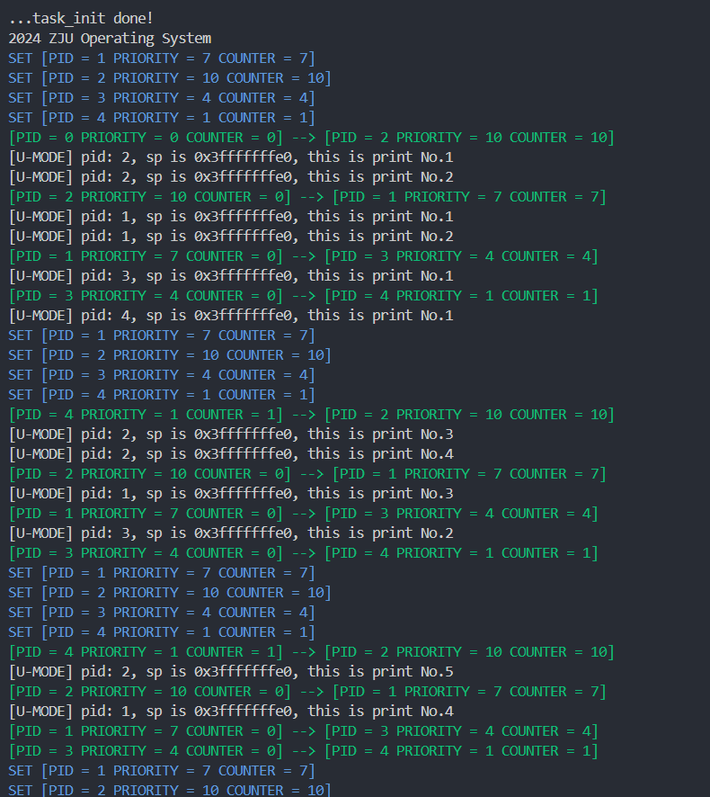
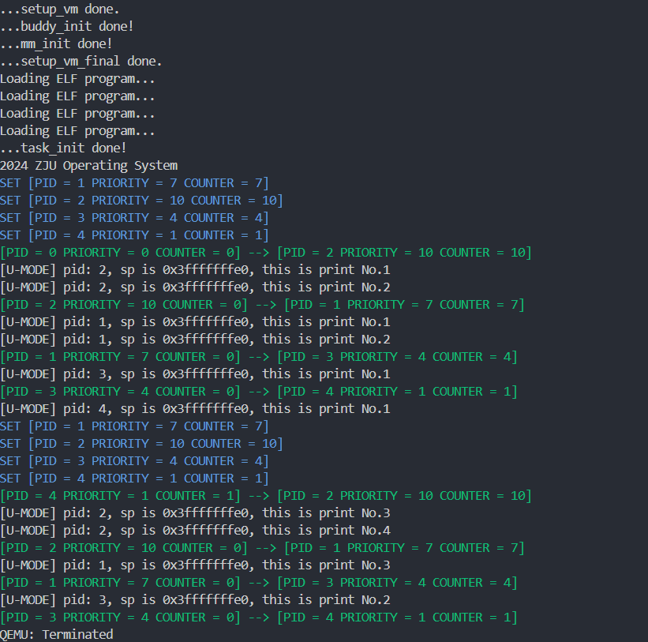

# Lab 4

李秋宇 3220103373

## Design

### 准备工程

按要求添加相关代码和文件

修改根目录下的Makefile，使得`user`目录也纳入工程管理：

```Makefile
all: clean
    $(MAKE) -C lib all
    $(MAKE) -C init all
    $(MAKE) -C user all
    $(MAKE) -C arch/riscv all
    @echo -e '\n'Build Finished OK

clean:
    ...
    $(MAKE) -C user clean
    ...
```

注意`user`的需要在内核代码前编译

### 创建用户态进程

#### 结构体更新

添加用户态进程结构体

#### 修改`task_init()`

首先设置新添加的三个变量

- `{C}task->thread.sepc`设为`USER_START`
- `{C}task[i]->thread.sstatus`设定
    - `{C}SPP = 0x0`
    - `{C}SUM = 0x1`
- `{C}task[i]->thread.sscratch`设为`USER_END`;

然后给每个进程创建自己的页表

这里需要进行内存复制，而`string.c`中没有实现，所以自己简单实现一个：

```c title:"lib/string.c"
void *memcpy(void *dest, const void *src, uint64_t n) {
    char *d = (char *)dest;
    const char *s = (const char *)src;
    for (uint64_t i = 0; i < n; ++i) {
        d[i] = s[i];
    }
    return dest;
}
```

之后进行内核页表的复制，先调用`{C}alloc_page()`申请页表空间，然后使用内存复制函数进行复制

完成之后，进行uapp的内容拷贝

注意到后续这里需要替换成ELF文件解析，为了方便直接把纯二进制的拷贝设成函数`{C}void load_program_bin(struct task_struct *task)`

```c title:"arch/riscv/kernel/proc.c"
extern char _sramdisk[];
extern char _eramdisk[];

extern void create_mapping(uint64_t *pgtbl, uint64_t va, uint64_t pa, uint64_t sz, uint64_t perm);

void load_program_bin(struct task_struct *task) {
    uint64_t size = (uint64_t)_eramdisk - (uint64_t)_sramdisk;
    uint64_t nPages = PGROUNDUP(size) / PGSIZE;
    uint64_t *page = (uint64_t *)alloc_pages(nPages);
    memset(page, 0x0, nPages * PGSIZE);
    memcpy((void *)page, (void *)_sramdisk, size);
    create_mapping(task->pgd, USER_START, VA2PA((uint64_t)page), size, 0b11111);
}
```

首先先计算出uapp的向上取整后的所需页数，然后进行uapp内容的内存拷贝，之后再映射到页表中，设定权限为U|X|W|R|V

完成之后设定用户栈，也是先申请一个页，然后映射到页表中

```c title:"arch/riscv/kernel/proc.c"
uint64_t *stack = (uint64_t *)alloc_page();
memset((void *)stack, 0x0, PGSIZE);
create_mapping(task[i]->pgd, USER_END - PGSIZE, VA2PA((uint64_t)stack), PGSIZE, 0b10111); // U | | W | R | V
```

### 修改`__switch_to`

将原进程的寄存器和`sepc`，`sstatus`，`sscratch`保存在栈上，读取新进程的寄存器

然后读取结构体中存放的页表的虚拟地址，做完虚拟地址到物理地址变换后将页表的PPN写入`satp`寄存器，用于页表切换

完成之后刷新TLB

```armasm title:"arch/riscv/kernel/entry.S"
__switch_to:
    ...

    # save state to prev process
    ...
    csrr t0, sepc
    sd t0, 144(a0)
    csrr t0, sstatus
    sd t0, 152(a0)
    csrr t0, sscratch
    sd t0, 160(a0)

    # restore state from next process
    ...
    ld t0, 144(a1)
    csrw sepc, t0
    ld t0, 152(a1)
    csrw sstatus, t0
    ld t0, 160(a1)
    csrw sscratch, t0

    # Switch page table
    li t0, 0xffffffdf80000000 # PA2VA_OFFSET
    ld t1, 168(a1) # pgd VA
    sub t1, t1, t0 # VA2PA
    srli t1, t1, 12 # PPN
    li t2, 0x8000000000000000 # Mode
    or t1, t1, t2
    csrw satp, t1
    sfence.vma zero, zero

    ret
```

### 更新中断处理逻辑

#### 修改`__dummy`

切换`sscratch`和`sp`寄存器的值

```armasm title:"arch/riscv/kernel/entry.S"
__dummy:
    # Switch stacks.
    csrrw t0, sscratch, sp
    mv sp, t0
```

#### 修改`_traps`

判断当前进程是否处于用户态，如果处于用户态就进行栈切换，否则不切换

根据`sscratch`是否为0判断当前状态，如果是0则表明当前在内核态，无需切换，直接进行后续

```armasm title:"arch/riscv/kernel/entry.S"
_traps:
    # Switch stacks.
    csrr t0, sscratch
    beq t0, zero, _trap_start
    csrw sscratch, sp
    mv sp, t0

_trap_start:
    # 1. save 32 registers and sepc to stack
    addi sp, sp, -32*8
    sd ra, 0(sp) # x1
    sd sp, 8(sp) # x2
    ...
    sd t6, 240(sp) # x31
    csrr t0, sepc
    sd t0, 248(sp) # sepc

    # 2. call trap_handler
    csrr a0, scause # arg1: scause
    csrr a1, sepc # arg2: sepc
    mv a2, sp # arg3: pt_regs
    call trap_handler

    # 3. restore sepc and 32 registers (x2(sp) should be restore last) from stack
    ld t0, 248(sp) # sepc
    csrw sepc, t0
    ld t6, 240(sp) # x31
    ...
    ld gp, 16(sp) # x3
    ld ra, 0(sp) # x1
    ld sp, 8(sp) # x2
    addi sp, sp, 32*8

    # Switch stacks.
    csrr t0, sscratch
    beq t0, zero, _trap_end
    csrw sscratch, sp
    mv sp, t0

_trap_end:
    # 4. return from trap
    sret
```

#### 修改`trap_handler`

迎合`_traps`中的函数调用的要求，首先定义`{C}struct pt_regs`，按照地址从低到高是`x1`到`x31`和`sepc`

考虑到`x0`恒为0，所以这里直接去掉了，减少空间占用

```c title:"arch/riscv/include/proc.h"
struct pt_regs {
    uint64_t regs[31]; // [0:30] -> [x1:x31]
    uint64_t sepc;
};
```

然后补充`trap_handler`的逻辑，用于系统调用使用

用户模式下的环境调用的`scause`号为`{C}0x8`

直接在原来的异常处理上进行扩展，如果是用户模式下环境调用，则进行[系统调用](#添加系统调用)

```c title:"arch/riscv/kernel/proc.c" hl:13-15
#define SUPERVISOR_TIMER_INTERRUPT_TYPE 0x8000000000000005
#define ENVIRONMRNT_CALL_FROM_U_MODE_TYPE 0x8

void trap_handler(uint64_t scause, uint64_t sepc, struct pt_regs *regs) {

    switch (scause) {
        // Interrupts.
        case SUPERVISOR_TIMER_INTERRUPT_TYPE:
            clock_set_next_event();
            do_timer();
            break;
        // Exceptions.
        case ENVIRONMRNT_CALL_FROM_U_MODE_TYPE:
            syscall(regs);
            break;
        // default.
        default:
            printk("Unknown trap code: %x\n", scause);
    }
}
```

### 添加系统调用

实现两个系统调用，然后统一在`{C}void syscall(struct pt_regs regs)`中调用，用作接口

其中这里的函数都需要借助前面的[结构体](#修改trap_handler)来实现

```c title:"arch/riscv/include/syscall.h"
#ifndef __SYSCALL_H__
#define __SYSCALL_H__

#include "stdint.h"
#include "stddef.h"
#include "proc.h"

void syscall(struct pt_regs* regs);

#define SYS_WRITE 64
#define SYS_GETPID 172

size_t sys_write(unsigned int fd, const char* buf, size_t count);
uint64_t sys_getpid();

#endif /* __SYSCALL_H__ */
```

实现如下

```c title:"arch/riscv/kernel/syscall.c"
#include "syscall.h"
#include "stddef.h"
#include "proc.h"
#include "stdint.h"
#include "printk.h"

void syscall(struct pt_regs *regs) {
    // Syscall number in a7 -> x17 -> regs.regs[16].
    switch (regs->regs[16]) {
        case SYS_WRITE:
            regs->regs[9] = sys_write(regs->regs[9], (const char *)regs->regs[10], regs->regs[11]);
            break;
        case SYS_GETPID:
            regs->regs[9] = sys_getpid();
            break;
        default:
            printk("[U] Unsupported syscall number: %lu\n", regs->regs[16]);
    }
    regs->sepc += 4;
}

size_t sys_write(unsigned int fd, const char* buf, size_t count) {
    size_t ret = 0;
    switch (fd) {
        case 1: // stdout.
            for (size_t i = 0; i < count; i++) {
                printk("%c", buf[i]);
                ret++;
            }
            break;
        default:
            printk("[U] sys_write: unsupported file descriptor %d\n", fd);
    }
    return ret;
}

extern struct task_struct *current;
uint64_t sys_getpid() { return current->pid; }
```

### 调整时钟中断

首先在`{C}test()`之前调用`{C}schedule()`立刻进行调度，然后设置`head.S`中的SIE

### 测试纯二进制文件



### 添加ELF解析与加载

这里只需要把纯二进制文件替换为ELF文件进行操作即可，相比于纯二进制来说ELF多了一些内容，但是总体原理还是一样的

首先先取出ELF的文件头`ehdr`，然后取出ELF文件的每个段，遍历寻找每个段，如果满足是`PT_LOAD`类型的段就加载进来

加载的段所需要的内存大小为`{C}phdr->p_memsz`，但是由于对齐需要还要加上`{C}phdr->p_offset`，对齐之后还要向上取整，计算出所需要的内存大小，然后分配页面

段的内容的地址为`{C}uint64_t *segment = (uint64_t *)((uint64_t)_sramdisk + phdr->offset)`，然后进行拷贝，拷贝到内存`{C}page[phdr->p_offset], page[phdr->p_offset + phdr->p_memsz]`中，完成内容拷贝

完成之后还要把剩余的内存清零

清零后进行地址映射到页表即可，由于虚拟地址也是按页分配的，所以也要对齐页面

```c title:"arch/riscv/kernel/proc.c"
void load_program_elf(struct task_struct *task) {
    Elf64_Ehdr *ehdr = (Elf64_Ehdr *)_sramdisk;
    Elf64_Phdr *phdrs = (Elf64_Phdr *)(_sramdisk + ehdr->e_phoff);
    for (int i = 0; i < ehdr->e_phnum; ++i) {
        Elf64_Phdr *phdr = phdrs + i;
        if (phdr->p_type == PT_LOAD) {
            // Allocate space.
            uint64_t size = PGROUNDUP(phdr->p_memsz + phdr->p_offset);
            uint64_t *page = (uint64_t *)alloc_pages(size / PGSIZE);
            memset((void *)page, 0x0, phdr->p_offset);
            // Copy segment content to memory.
            memcpy((void *)((uint64_t)page + phdr->p_offset), (void *)((uint64_t)_sramdisk + phdr->p_offset), phdr->p_memsz);
            memset((void *)((uint64_t)page + phdr->p_offset + phdr->p_filesz), 0x0, phdr->p_memsz - phdr->p_filesz);
            // Do mapping.
            create_mapping(task->pgd, PGROUNDDOWN(phdr->p_vaddr), VA2PA((uint64_t)page), size, 0b11111);
        }
    }
    task->thread.sepc = ehdr->e_entry;
}
```



---

## Exercises

### 我们在实验中使用的用户态线程和内核态线程的对应关系是怎样的？（一对一，一对多，多对一还是多对多）

这里是一对一，每个用户态线程进入内核态后都有一个内核线程服务

### 系统调用返回为什么不能直接修改寄存器？

因为系统调用是用户态环境调用类型(*ENVIRONMRNT_CALL_FROM_U_MODE*)，需要陷入处理，而陷入处理前后OS会把进程的上下文保存好，使得处理完环境调用后继续，所以直接修改的寄存器在恢复上下文时会被覆盖，只能通过结构体来标记返回值来修改寄存器

### 针对系统调用，为什么要手动将 sepc + 4？

因为系统调用是一种环境调用，调用完后如果回到原中断处就会导致又一次执行环境调用，就无法退出，因此处理完后从中断返回时只需要从下一条指令处继续即可

### 为什么 Phdr 中，p_filesz 和 p_memsz 是不一样大的，它们分别表示什么？

`p_filesz`代表在ELF文件中该段的实际占用大小，而`p_memsz`代表该段在内存中的大小，即加载到内存后的占用空间，内存占用大小是大于实际大小的，可以用于满足内存对齐、未初始化数据的放置等

### 为什么多个进程的栈虚拟地址可以是相同的？用户有没有常规的方法知道自己栈所在的物理地址？

因为虚拟内存技术使得每个用户态进程的虚拟地址一致，均从`USER_START`到`USER_END`，而栈的大小都是一个页的大小，占据在用户空间的末尾

用户可以通过系统调用`{C}getpid()`和查看`/proc`中的信息了解内存布局

---

## Thinkings

这个lab相当花费时间，主要原因在于调试的过程非常麻烦，大概整个周末的时间都用在了调试上

最开始其实对指针地址转换这里不是特别清楚，经过大量的调试之后明白了其中的原理

还经历了很多次的重写，有些地方写的不到位就需要大改特改，不过好在最后也是修出来了 💀
