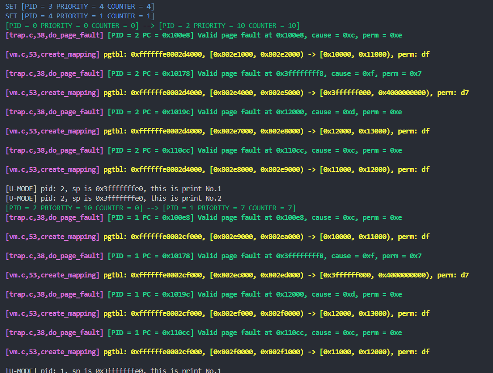
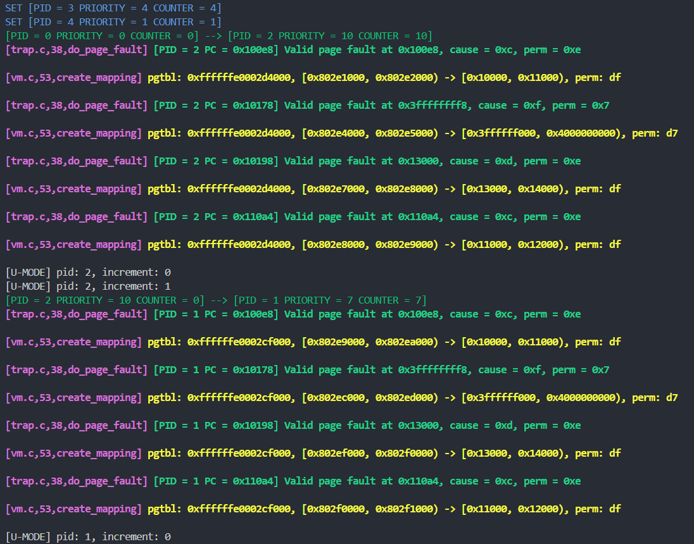
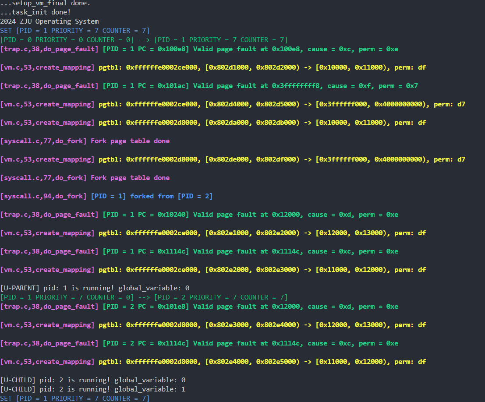
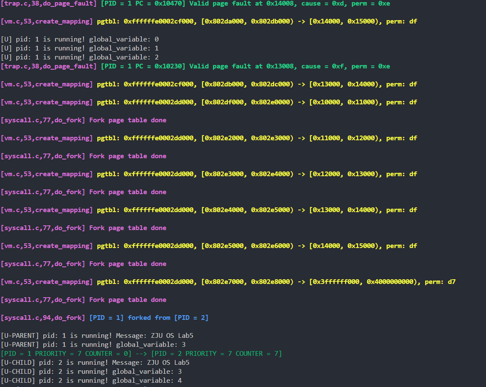
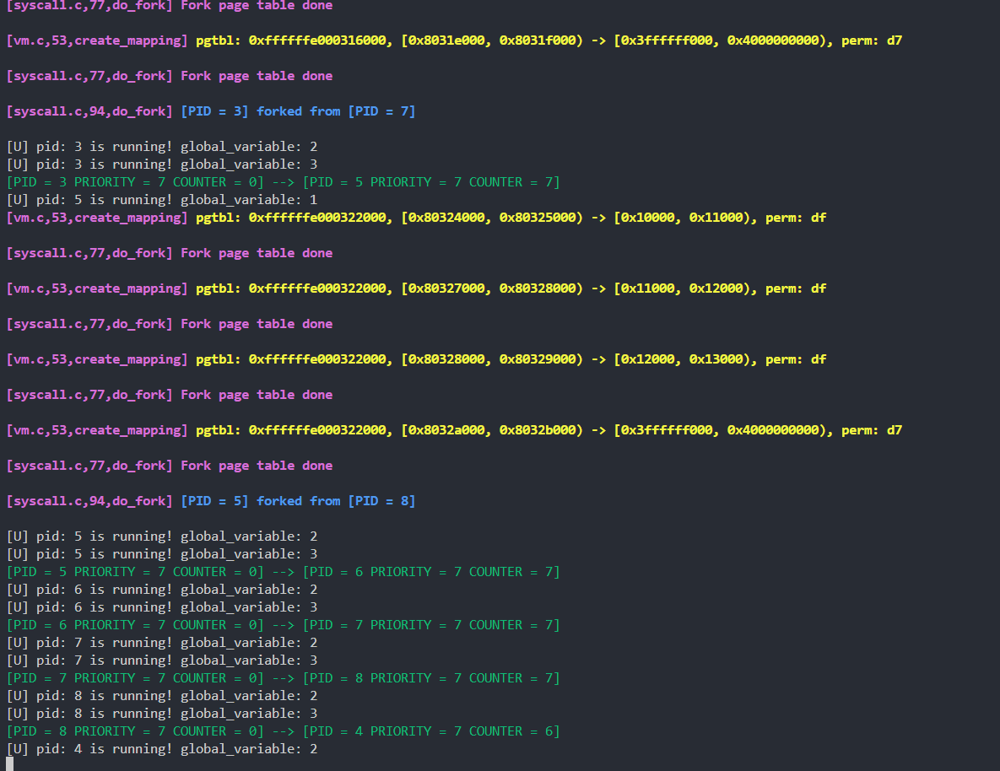
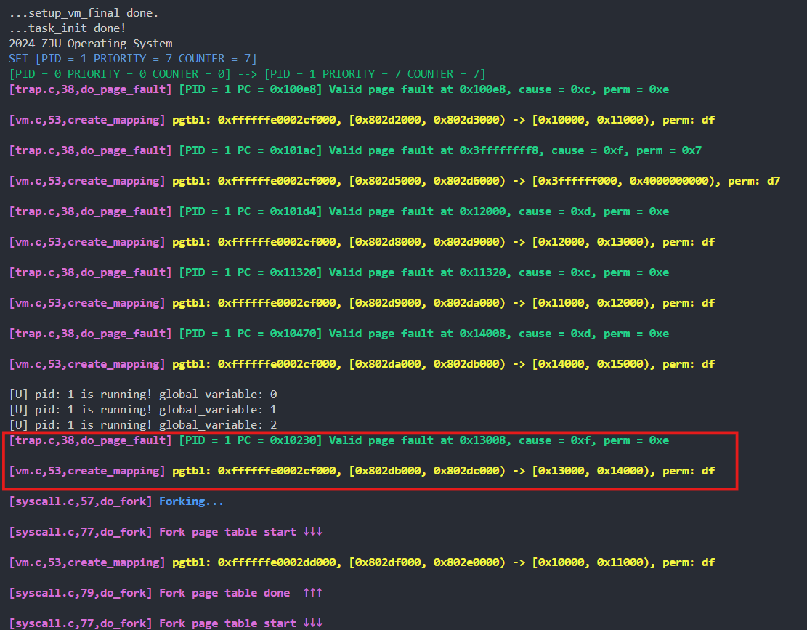

# Lab 5

李秋宇 3220103373

## Design

### 准备工程

添加文件，修改Makefile

### 缺页异常处理

#### 实现虚拟内存管理功能

首先在`proc.h`中添加VMA的宏和数据结构

然后实现对`{C}struct vm_area_struct`的查找和添加方法

注意到所有的VMA都是以链表的形式串在一起，所以

- 查找：从链表头部开始往后遍历，如果找到地址在某个VMA中就直接返回，否则一直往后遍历
- 添加：新建VMA，填入参数，插入到链表尾部

```c title:"arch/riscv/kernel/proc.c"
struct vm_area_struct *find_vma(struct mm_struct *mm, uint64_t addr) {
    struct vm_area_struct *vma = mm->mmap; // Header of the VMA list.
    while (vma) {
        if (addr >= vma->vm_start && addr < vma->vm_end) return vma;
        vma = vma->vm_next;
    }
    return NULL;
}

uint64_t do_mmap(struct mm_struct *mm, uint64_t addr, uint64_t len, uint64_t vm_pgoff, uint64_t vm_filesz, uint64_t flags) {
    struct vm_area_struct *vma = (struct vm_area_struct *)alloc_page();
    vma->vm_start = PGROUNDDOWN(addr);
    vma->vm_end = PGROUNDUP(addr + len);
    vma->vm_pgoff = vm_pgoff;
    vma->vm_filesz = vm_filesz;
    vma->vm_flags = flags;

    struct vm_area_struct *vma = (struct vm_area_struct *)alloc_page();
    vma->vm_start = addr;
    vma->vm_end = addr + len;
    vma->vm_pgoff = vm_pgoff;
    vma->vm_filesz = vm_filesz;
    vma->vm_flags = flags;
    vma->vm_next = NULL;

    struct vm_area_struct *head = mm->mmap;
    if (!head) {
        mm->mmap = vma;
        mm->mmap->vm_prev = NULL;
    } else {
        for (; head->vm_next; head = head->vm_next);
        head->vm_next = vma;
        vma->vm_prev = head;
    }

    return _sva;
}
```

#### 修改`task_init`

首先把原来的对用户程序uapp、用户态栈的空间分配和页表映射取消，改为Demand Paging模式

- 对于用户态栈来说，在VMA中映射区域为`[USER_END-PGSIZE:USER_END]`，权限为R|W且为匿名区域
- 对于用户程序来说，在VMA中映射预取位`[vaddr:vaddr+memsz]`，即它在内存中实际占据的空间，权限位R|W|X

```c title:"arch/riscv/kernel/proc.c" hl:7,29
void load_program(struct task_struct *task) {
    Elf64_Ehdr *ehdr = (Elf64_Ehdr *)_sramdisk;
    Elf64_Phdr *phdrs = (Elf64_Phdr *)(_sramdisk + ehdr->e_phoff);
    for (int i = 0; i < ehdr->e_phnum; ++i) {
        Elf64_Phdr *phdr = phdrs + i;
        if (phdr->p_type == PT_LOAD) {
            do_mmap(&task->mm, phdr->p_vaddr, phdr->p_memsz, phdr->p_offset, phdr->p_filesz, VM_READ | VM_WRITE | VM_EXEC);
        }
    }
    task->thread.sepc = ehdr->e_entry;
}

extern uint64_t swapper_pg_dir[];
void task_init() {
    ...
    for (int i = 1; i < NR_TASKS; i++) {
        ...

        // Create page table for user process.
        ...

        // Create VMA for user process.
        task[i]->mm.mmap = NULL;

        // Copy user app.
        load_program(task[i]);

        // Create stack for user process.
        do_mmap(&task[i]->mm, USER_END - PGSIZE, PGSIZE, 0x0, 0x0, VM_READ | VM_WRITE | VM_ANON);
    }

    printk("...task_init done!\n");
}
```

实现后截获的缺页异常符合实验指导中所述

#### 实现 Page Fault Handler

在`trap_handler`中扩展缺页异常处理类型，都调用`{C}void do_page_fault(struct pt_regs *regs)`

```c title:"arch/riscv/kernel/trap.c"
#define SUPERVISOR_TIMER_INTERRUPT_TYPE   0x8000000000000005
#define ENVIRONMRNT_CALL_FROM_U_MODE_TYPE 0x8
#define INSTRUCTION_PAGE_FAULT_TYPE       0xC
#define LOAD_PAGE_FAULT_TYPE              0xD
#define STORE_PAGE_FAULT_TYPE             0xF

void trap_handler(uint64_t scause, uint64_t sepc, struct pt_regs *regs) {
    switch (scause) {
        // Interrupts.
        case SUPERVISOR_TIMER_INTERRUPT_TYPE:
            ...
        // Exceptions.
        case ENVIRONMRNT_CALL_FROM_U_MODE_TYPE:
            ...
        case INSTRUCTION_PAGE_FAULT_TYPE:
            [[fallthrough]];
        case LOAD_PAGE_FAULT_TYPE:
            [[fallthrough]];
        case STORE_PAGE_FAULT_TYPE:
            do_page_fault(regs);
            break;
        // default.
        default:
            ...
    }
}
```

然后具体实现缺页异常处理，根据以下流程走

1. 检查是否是Bad Address，根据`stval`是否在进程的VMA所属范围中判断
2. 判断是否非法访问，根据VMA标注的权限和中断原因判断，其中
   1. `INSTRUCTION_PAGE_FAULT`类型需要执行权限
   2. `LOAD_PAGE_FAULT`类型需要可读权限
   3. `STORE_PAGE_FAULT`类型需要可写权限
3. 合法访问，先分配一个页
4. 判断是否是匿名区域访问
   1. 如果是，直接映射到页表中
   2. 如果否，是用户程序数据，先拷贝后映射到页表

由于内存分布是从`vaddr`开始的，如果访问的地址处在`vaddr`所在的页内，就把这个页拷贝；如果是下一个页内的，就把下一个页拷贝

拷贝是从`_sramdisk + pgoff`开始

如果超过了`filesz`的部分，根据lab4，需要把超出的部分置0，因此如果是整页全超出了就不必进行拷贝了，这里需要叠加一个判断

```c title:"arch/riscv/kernel/trap.c"
extern struct task_struct *current;
extern char _sramdisk[];
extern char _eramdisk[];
extern void create_mapping(uint64_t *pgtbl, uint64_t va, uint64_t pa, uint64_t sz, uint64_t perm);

void do_page_fault(struct pt_regs *regs) {
    // Check bad address.
    uint64_t addr = csr_read(stval);
    struct vm_area_struct *vma = find_vma(&current->mm, addr);
    if (!vma) error("Bad address for page fault at 0x%lx", addr);

    // Check permission.
    uint64_t perm = vma->vm_flags; // Get the permission of the vma.
    uint64_t cause = csr_read(scause); // Get the cause of the trap.
    bool is_illegal = (
        cause == INSTRUCTION_PAGE_FAULT_TYPE && !(perm & VM_EXEC) ||
        cause == LOAD_PAGE_FAULT_TYPE        && !(perm & VM_READ) ||
        cause == STORE_PAGE_FAULT_TYPE       && !(perm & VM_WRITE)
    );
    if (is_illegal) error("Illegal access to 0x%lx", addr); // Permission denied.

    // Legal access, continue.
    uint64_t *page = (uint64_t *)alloc_page();
    memset((void *)page, 0x0, PGSIZE);
    if (!(perm & VM_ANON)) {
        uint64_t *src = (uint64_t *)((uint64_t)_sramdisk + PGROUNDDOWN(vma->vm_pgoff + addr - vma->vm_start));
        if (addr >= PGROUNDDOWN(vma->vm_start + vma->vm_filesz) && addr < PGROUNDUP(vma->vm_start + vma->vm_filesz)) {
            memcpy((void *)page, (void *)src, PGOFFSET(vma->vm_filesz));
        } else if (addr < PGROUNDDOWN(vma->vm_start + vma->vm_filesz)) memcpy((void *)page, (void *)src, PGSIZE);
    }
    create_mapping(current->pgd, PGROUNDDOWN(addr), VA2PA((uint64_t)page), PGSIZE, 0b11010001 | (perm & (VM_READ | VM_WRITE | VM_EXEC)));
}
```

#### 测试缺页处理

运行测试PFH1：



运行测试PFH2：



### 实现`fork`系统调用

#### 准备工作

设置全局变量`nr_tasks`，仅初始化一个进程

添加系统调用号，扩展系统调用

#### 拷贝内核栈

创建新进程的结构体，并直接复制当前进程的内核栈

```c title:"arch/riscv/kernel/syscall.c" hl:7,8
extern uint64_t nr_tasks;
extern struct task_struct *task[NR_TASKS];
extern uint64_t swapper_pg_dir[];
extern void __ret_from_fork();
extern void create_mapping(uint64_t *pgtbl, uint64_t va, uint64_t pa, uint64_t sz, uint64_t perm);
uint64_t do_fork(struct pt_regs *regs) {
    struct task_struct *_task = (struct task_struct *)alloc_page();
    memcpy((void *)_task, (void *)current, PGSIZE);
    ...
}
```

#### 创建页表

首先先拷贝内核页表，直接拷贝即可

```c title:"arch/riscv/kernel/syscall.c/do_fork()"
uint64_t do_fork(struct pt_regs *regs) {
    ...
    _task->pgd = (uint64_t *)alloc_page();
    memset((void *)_task->pgd, 0x0, PGSIZE);
    memcpy((void *)_task->pgd, (void *)swapper_pg_dir, PGSIZE);
    ...
}
```

之后遍历父进程的VMA和页表

先实现一个在进程页表中进行查找的函数，用于查找目标地址是否在页表中存在，即是否PTE有效

查找的原理和创建三级页表原理一致，一级一级查找，如果这一级没找到就直接说明不存在，如果找到了就顺着往下一级查找

最终返回结果表示是否存在

```c title:"arch/riscv/kernel/syscall.c"
bool find_pte(uint64_t *pgtbl, uint64_t va) {
    uint64_t *pgtbl2 = pgtbl;
    uint64_t vpn2 = (va >> 30) & 0x1FF;
    if (!(pgtbl2[vpn2] & 0x1)) return false;

    uint64_t *pgtbl1;
    uint64_t vpn1 = (va >> 21) & 0x1FF;
    pgtbl1 = (uint64_t *)((pgtbl2[vpn2] >> 10 << 12) + PA2VA_OFFSET);
    if (!(pgtbl1[vpn1] & 0x1)) return false;

    uint64_t *pgtbl0;
    uint64_t vpn0 = (va >> 12) & 0x1FF;
    pgtbl0 = (uint64_t *)((pgtbl1[vpn1] >> 10 << 12) + PA2VA_OFFSET);
    return pgtbl0[vpn0] & 0x1;
}
```

完成之后进行父进程的VMA遍历

1. 获取父进程的mmap
2. 遍历mmap
   1. 每一个父进程中的VMA都使用`{C}do_mmap()`完成在子进程中的添加
   2. 对于每一个VMA，从它的起始地址`vm_start`开始，一直按页递增到`vm_end`，调用`{C}find_pte()`查找是否在父进程页表中存在，如果存在，就拷贝整页内容，并映射到子进程页表中，注意这里的`va`已经是对齐了的，所以可以放心使用

```c title:"arch/riscv/kernel/syscall.c"
uint64_t do_fork(struct pt_regs *regs) {
    ...
    _task->mm.mmap = NULL;
    struct vm_area_struct *vma = current->mm.mmap;
    while (vma) {
        do_mmap(&_task->mm, vma->vm_start, vma->vm_end - vma->vm_start, vma->vm_pgoff, vma->vm_filesz, vma->vm_flags);
        for (uint64_t va = PGROUNDDOWN(vma->vm_start); va <= vma->vm_end; va += PGSIZE) {
            if(find_pte(current->pgd, va)) {
                uint64_t *page = (uint64_t *)alloc_page();
                memcpy((void *)page, (void *)va, PGSIZE);
                create_mapping(_task->pgd, va, VA2PA((uint64_t)page), PGSIZE, 0b11010001 | (vma->vm_flags & (VM_READ | VM_WRITE | VM_EXEC)));
            }
        }
        vma = vma->vm_next;
    }
    ...
}
```

#### 进程返回

父进程返回是直接从`{C}do_fork()`返回

对于子进程来说

- `ra`设为`__ret_from_fork`，子进程认为自己也是刚刚执行完一个中断处理，从`__traps`返回
- `sp`设为当前子进程的内核栈指针
- `sscratch`设为当前的`sscratch`寄存器值

对于子进程来说，它的`{C}struct pt_regs`寄存器保存的地址与子进程的偏移量是和父进程与其`{C}struct pt_regs`寄存器偏移量一致的，因为在[拷贝内核栈](#拷贝内核栈)时已经把寄存器的相关信息一起拷贝了，已经在子进程的内核栈中，所以直接计算出即可

子进程的`sp`设为刚刚的`thread.sp`，并设返回值`a0`为0，并手动`{C}sepc+4`

最后添加到进程列表中，父进程返回PID

```c title:"arch/riscv/kernel/syscall.c"
uint64_t do_fork(struct pt_regs *regs) {
    ...
    _task->thread.ra = (uint64_t)__ret_from_fork;
    _task->thread.sp = (uint64_t)_task - (uint64_t)current + regs->regs[reg_sp];
    _task->thread.sscratch = csr_read(sscratch);

    struct pt_regs *child_regs = (struct pt_regs *)((uint64_t)_task - (uint64_t)current + (uint64_t)regs);
    child_regs->regs[reg_sp] = _task->thread.sp;
    child_regs->regs[reg_a0] = 0;
    child_regs->sepc += 4;

    task[_task->pid = nr_tasks++] = _task; // Add to task table.
    return _task->pid;
}
```

#### 测试Fork

测试Fork1：



测试Fork2：



测试Fork3：



---

## Exercises

### 1 呈现出你在 page fault 的时候拷贝 ELF 程序内容的逻辑

拷贝ELF程序时

1. 分配一个页`page`用于拷贝内容
2. 判断不是匿名区域
3. 计算出拷贝的源地址`{C}uint64_t *src = (uint64_t *)((uint64_t)_sramdisk + PGROUNDDOWN(vma->vm_pgoff + addr - vma->vm_start))`
4. 判断Bad Address是否超出`{C}vm_start + vm_filesz`
   1. 如果`addr`所在页地址小于`{C}vm_start + vm_filesz`所在页，则直接拷贝即可
   2. 如果`addr`所在页刚好就是`{C}vm_start + vm_filesz`所在页，则仅拷贝小于的那部分，超出的部分因为在分配页时已经初始化置0所以不用额外操作
   3. 如果`addr`所在页地址大于`{C}vm_start + vm_filesz`所在页，则无需拷贝
5. 把`addr`所在页低地址映射到页表中，设置权限值

其中，拷贝的源地址是从`{C}(uint64_t)_sramdisk + vma->vm_pgoff`开始，目标地址是`{C}addr`，而且这里是按页拷贝，也就是说要得到`{C}addr`所在的那一页

> [!tip] 切入点
> 如果`{C}addr == vma->vm_start`，那么就是拷贝第一页，即从`{C}(uint64_t)_sramdisk`拷贝`PGSIZE`内容到`{C}PGROUNDDOWN(addr)`上

```txt title:"拷贝ELF示意图"
    ┌───────────┬───────────┬───────────┬───────────┬───────────┐
    │  *        │  *        │           │           │           │
    └───────────┴───────────┴───────────┴───────────┴───────────┘
    |  |        |  |
    |  |        |  |
    |  |        |  └ addr
    |  |        |
    |  |        └ (uint64_t)page = PGROUNDDOWN(addr)
    |  |
    |  └ vm_start
    |
    └ vm_start - vm_pgoff

    ┌───────────┬───────────┬───────────┬───────────┬───────────┐
    │  .        │  .        │           │           │           │
    └───────────┴───────────┴───────────┴───────────┴───────────┘
    |  |
    |  |
    |  └ (uint64_t)_sramdisk + vm_pgoff
    |
    └ (uint64_t)_sramdisk
```

```c title:"arch/riscv/kernel/trap.c" hl:18-26
void do_page_fault(struct pt_regs *regs) {
    // Check bad address.
    uint64_t addr = csr_read(stval);
    struct vm_area_struct *vma = find_vma(&current->mm, addr);
    if (!vma) error("Bad address for page fault at 0x%lx", addr);

    // Check permission.
    uint64_t perm = vma->vm_flags; // Get the permission of the vma.
    uint64_t cause = csr_read(scause); // Get the cause of the trap.
    bool is_illegal = (
        cause == INSTRUCTION_PAGE_FAULT_TYPE && !(perm & VM_EXEC) ||
        cause == LOAD_PAGE_FAULT_TYPE        && !(perm & VM_READ) ||
        cause == STORE_PAGE_FAULT_TYPE       && !(perm & VM_WRITE)
    );
    if (is_illegal) error("Illegal access to 0x%lx", addr); // Permission denied.

    // Legal access, continue.
    uint64_t *page = (uint64_t *)alloc_page();
    memset((void *)page, 0x0, PGSIZE);
    if (!(perm & VM_ANON)) {
        uint64_t *src = (uint64_t *)((uint64_t)_sramdisk + PGROUNDDOWN(vma->vm_pgoff + addr - vma->vm_start));
        if (addr >= PGROUNDDOWN(vma->vm_start + vma->vm_filesz) && addr < PGROUNDUP(vma->vm_start + vma->vm_filesz)) {
            memcpy((void *)page, (void *)src, PGOFFSET(vma->vm_filesz));
        } else if (addr < PGROUNDDOWN(vma->vm_start + vma->vm_filesz)) memcpy((void *)page, (void *)src, PGSIZE);
    }
    create_mapping(current->pgd, PGROUNDDOWN(addr), VA2PA((uint64_t)page), PGSIZE, 0b11010001 | (perm & (VM_READ | VM_WRITE | VM_EXEC)));
}
```

### 2 回答 [4.3.5](https://zju-sec.github.io/os24fall-stu/lab5/#_12) 中的问题

#### 2.1 在 do_fork 中，父进程的内核栈和用户栈指针分别是什么

在中断处理`__traps`中，先是把用户态栈和内核态栈进行了切换，原来的用户态栈指针`sp`保存在了`sscratch`中，而内核态栈的指针从`sscratch`中读出，存入`sp`中，而这个`sp`又保存在了`{C}struct pt_regs`这个结构体中用于给`trap_handler`传参，一路由`trap_handler`传到`syscall`传到`do_fork`中，所以

- 内核栈指针：`{C}regs[reg_sp]`
- 用户栈指针：`{C}sscratch`

#### 2.2 在 do_fork 中，子进程的内核栈和用户栈指针的值应该是什么

- 内核栈指针值应该等于内核栈上保存的寄存器`{C}sp`的值
- 用户栈指针值应该等于`{C}sscratch`的值

#### 2.3 在 do_fork 中，子进程的内核栈和用户栈指针分别应该赋值给谁

- 内核栈指针应该赋值给内核栈上的`{C}struct pt_regs`中的`{C}sp`寄存器
- 用户栈指针应该赋值给子进程的`{C}thread.sscratch`

这样，在子进程经过`{C}schedule()`调度，经过`{C}__switch_to`切换后从`__traps`中返回时有一个恢复上下文的过程，在这里会有二者的交换，交换后就是正确的

### 3 为什么要为子进程 pt_regs 的 sepc 手动加四？

因为子进程返回并没有从`syscall()`里面返回，因此需要在Fork时手动加四，使得中断返回正常执行用户态程序后执行的下一条指令是Fork后的指令

### 4 对于 Fork main #2（即 FORK2），在运行时，ZJU OS Lab5 位于内存的什么位置？是否在读取的时候产生了 page fault？请给出必要的截图以说明

如下图所述，运行时在内存的`{C}0x13008`所在页，产生了缺页异常



### 5 画图分析 make run TEST=FORK3 的进程 fork 过程，并呈现出各个进程的 global_variable 应该从几开始输出，再与你的输出进行对比验证

Fork3的用户程序如下，为三个Fork添加了标号

```c title:"user/main.c" hl:6,7,10
int global_variable = 0;

int main() {

    printf("[U] pid: %ld is running! global_variable: %d\n", getpid(), global_variable++);
    fork(); // Fork 1.
    fork(); // Fork 2.

    printf("[U] pid: %ld is running! global_variable: %d\n", getpid(), global_variable++);
    fork(); // Fork 3.

    while(1) {
        printf("[U] pid: %ld is running! global_variable: %d\n", getpid(), global_variable++);
        wait(WAIT_TIME);
    }
}
```

初始时只有PID=1被初始化并运行

```txt

PID             1   4   3   7   2   6   5   8

[PID 1] ====>   ┬
                │
print(0)        │
                │
Fork 1  -->     ├───────────────┐
                │               *
Fork 2  -->     ├───────┐       *
                │       *       *
print(1)        │       *       *
                │       *       *
Fork 3  -->     ├───┐   *       *
                │   *   *       *
[PID 2] ====>   ┴   *   *       ┬
                *   *   *       │
Fork 2  -->     *   *   *       ├───────┐
                *   *   *       │       *
print(1)        *   *   *       │       *
                *   *   *       │       *
Fork 3  -->     *   *   *       ├───┐   *
                *   *   *       │   *   *
[PID 3] ====>   *   *   ┬       ┴   *   *
                *   *   │       *   *   *
print(1)        *   *   │       *   *   *
                *   *   │       *   *   *
Fork 3  -->     *   *   ├───┐   *   *   *
                *   *   │   *   *   *   *
[PID 5] ====>   *   *   ┴   *   *   *   ┬
                *   *   *   *   *   *   │
pirnt(1)        *   *   *   *   *   *   │
                *   *   *   *   *   *   │
Fork 3  -->     *   *   *   *   *   *   ├───┐
                *   *   *   *   *   *   │   *
[PID 6] ====>   *   *   *   *   *   ┬   ┴   *
                *   *   *   *   *   │   *   *
print(2)        *   *   *   *   *   │   *   *
                *   *   *   *   *   │   *   *
[PID 7] ====>   *   *   *   ┬   *   ┴   *   *
                *   *   *   │   *   *   *   *
print(2)        *   *   *   │   *   *   *   *
                *   *   *   │   *   *   *   *
[PID 8] ====>   *   *   *   ┴   *   *   *   ┬
                *   *   *   *   *   *   *   │
print(2)        *   *   *   *   *   *   *   │
                *   *   *   *   *   *   *   │
[PID 4] ====>   *   ┬   *   *   *   *   *   ┴
                *   │   *   *   *   *   *   *
print(2)        *   │   *   *   *   *   *   *
                *   │   *   *   *   *   *   *
[PID 1] ====>   ┬   ┴   *   *   *   *   *   *
                │   *   *   *   *   *   *   *

                ...

```

---

## Thinkings

这个实验还是蛮有内容的，花了很多时间，因为debug比较麻烦所以耗时好多天才完成，最后还花了些时间做实验报告，特别是两个画图都比较花时间，但是总体上对缺页异常和Fork系统调用理解更深了
