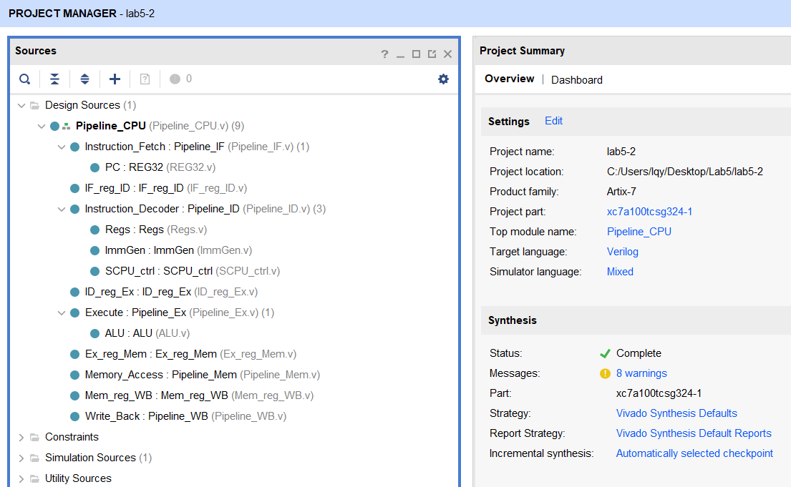
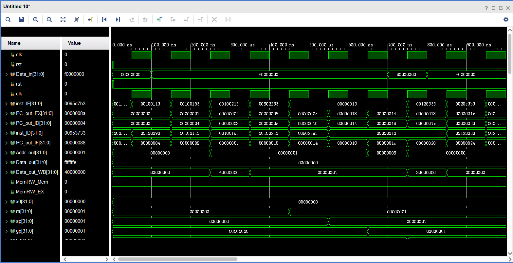
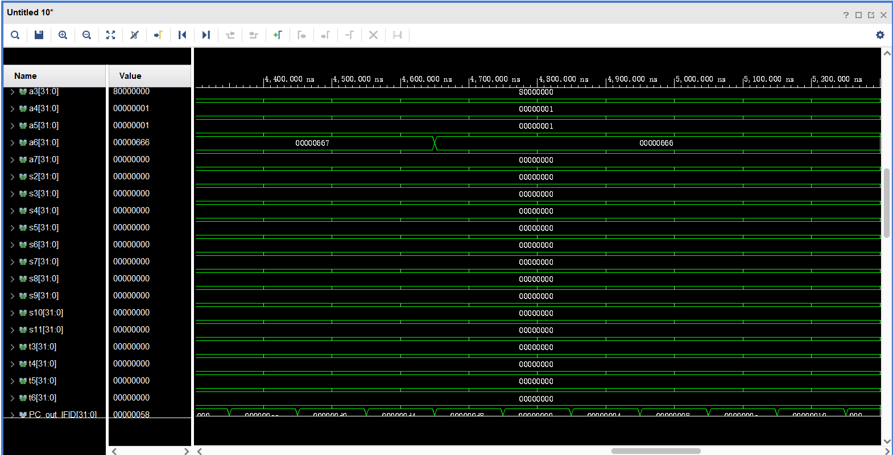
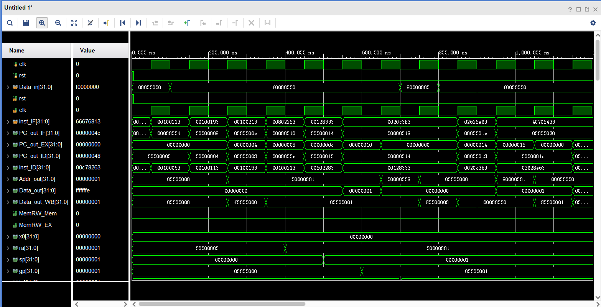

# Lab 5

[TOC]

---

## 5级流水线的搭建与集成

5级流水线的搭建难度不大，主要依照原理图进行连线即可

> 流水线寄存器代码没有列出，因为它们都是寄存器堆，实现原理一致且简单，因此没有给出

在顶层模块与五级流水线的子模块连线的时候有一些问题，PPT中给出的端口名有细微错误，比如有一个端口名字`Jump`打成了`Junp`，而且给出的IP里面也是使用的`Junp`，导致一度出现错误，其它也有几处类似的地方，因此需要进行修改

> 如果想要跳过代码查看，请[点击这里](#流水线cpu集成)

### Pipeline_CPU

流水线CPU的模块

```verilog
`timescale 1ns / 1ps

module Pipeline_CPU(
    input [31:0] Data_in,
    input rst,
    input clk,
    input [31:0] inst_IF,
    output [31:0] PC_out_EX,
    output [31:0] PC_out_ID,
    output [31:0] inst_ID,
    output [31:0] PC_out_IF,
    output [31:0] Addr_out,
    output [31:0] Data_out,
    output [31:0] Data_out_WB,
    output MemRW_Mem,
    output MemRW_EX
    );

    /* Module wire definitions */
    // Instruction_Fetch.
    // wire [31:0] PC_out_IF;
    // IF_reg_ID.
    wire [31:0] PC_out_IFID;
    wire [31:0] inst_out_IFID;
    // Instruction_Decoder.
    wire [4:0] Rd_addr_out_ID;
    wire [31:0] Rs1_out_ID;
    wire [31:0] Rs2_out_ID;
    wire [31:0] Imm_out_ID;
    wire ALUSrc_B_ID;
    wire [2:0] ALU_control_ID;
    wire Branch_ID;
    wire BranchN_ID;
    wire MemRW_ID;
    wire Jump_ID;
    wire [1:0] MemtoReg_ID;
    wire RegWrite_out_ID;
    // ID_reg_Ex.
    wire [31:0] PC_out_IDEX;
    wire [4:0] Rd_addr_out_IDEX;
    wire [31:0] Rs1_out_IDEX;
    wire [31:0] Rs2_out_IDEX;
    wire [31:0] Imm_out_IDEX;
    wire ALUSrc_B_out_IDEX;
    wire [2:0] ALU_control_out_IDEX;
    wire Branch_out_IDEX;
    wire BranchN_out_IDEX;
    wire MemRW_out_IDEX;
    wire Jump_out_IDEX;
    wire [1:0] MemtoReg_out_IDEX;
    wire RegWrite_out_IDEX;
    // Execute.
    // wire [31:0] PC_out_EX;
    wire [31:0] PC4_out_EX;
    wire zero_out_EX;
    wire [31:0] ALU_out_EX;
    wire [31:0] Rs2_out_EX;
    // Ex_reg_Mem.
    wire [31:0] PC_out_EXMem;
    wire [31:0] PC4_out_EXMem;
    wire [4:0] Rd_addr_out_EXMem;
    wire zero_out_EXMem;
    wire [31:0] ALU_out_EXMem;
    wire [31:0] Rs2_out_EXMem;
    wire Branch_out_EXMem;
    wire BranchN_out_EXMem;
    wire MemRW_out_EXMem;
    wire Jump_out_EXMem;
    wire [1:0] MemtoReg_out_EXMem;
    wire RegWrite_out_EXMem;
    // Memory_Access.
    wire PCSrc;
    // Mem_reg_WB.
    wire [31:0] PC4_out_MemWB;
    wire [4:0] Rd_addr_out_MemWB;
    wire [31:0] ALU_out_MemWB;
    wire [31:0] DMem_data_out_MemWB;
    wire [1:0] MemtoReg_out_MemWB;
    wire RegWrite_out_MemWB;
    // Write_Back.
    // wire [31:0] Data_out_WB;

    Pipeline_IF Instruction_Fetch (
        // Input.
        .clk_IF(clk),
        .rst_IF(rst),
        .en_IF(1'b1),
        .PC_in_IF(PC_out_EXMem),
        .PCSrc(PCSrc),
        // Output.
        .PC_out_IF(PC_out_IF)
    );

    IF_reg_ID IF_reg_ID (
        // Input.
        .clk_IFID(clk),
        .rst_IFID(rst),
        .en_IFID(1'b1),
        .PC_in_IFID(PC_out_IF),
        .inst_in_IFID(inst_IF),
        // Output.
        .PC_out_IFID(PC_out_IFID),
        .inst_out_IFID(inst_out_IFID)
    );

    Pipeline_ID Instruction_Decoder (
        // Input.
        .clk_ID(clk),
        .rst_ID(rst),
        .RegWrite_in_ID(RegWrite_out_MemWB),
        .Rd_addr_ID(Rd_addr_out_MemWB),
        .Wt_data_ID(Data_out_WB),
        .Inst_in_ID(inst_out_IFID),
        // Output.
        .Rd_addr_out_ID(Rd_addr_out_ID),
        .Rs1_out_ID(Rs1_out_ID),
        .Rs2_out_ID(Rs2_out_ID),
        .Imm_out_ID(Imm_out_ID),
        .ALUSrc_B_ID(ALUSrc_B_ID),
        .ALU_control_ID(ALU_control_ID),
        .Branch_ID(Branch_ID),
        .BranchN_ID(BranchN_ID),
        .MemRW_ID(MemRW_ID),
        .Jump_ID(Jump_ID),
        .MemtoReg_ID(MemtoReg_ID),
        .RegWrite_out_ID(RegWrite_out_ID)
    );

    ID_reg_Ex ID_reg_Ex (
        // Input.
        .clk_IDEX(clk),
        .rst_IDEX(rst),
        .en_IDEX(1'b1),
        .PC_in_IDEX(PC_out_IFID),
        .Rd_addr_IDEX(Rd_addr_out_ID),
        .Rs1_in_IDEX(Rs1_out_ID), // IDEX!!!!!!
        .Rs2_in_IDEX(Rs2_out_ID),
        .Imm_in_IDEX(Imm_out_ID),
        .ALUSrc_B_in_IDEX(ALUSrc_B_ID),
        .ALU_control_in_IDEX(ALU_control_ID),
        .Branch_in_IDEX(Branch_ID),
        .BranchN_in_IDEX(BranchN_ID),
        .MemRW_in_IDEX(MemRW_ID),
        .Jump_in_IDEX(Jump_ID),
        .MemtoReg_in_IDEX(MemtoReg_ID),
        .RegWrite_in_IDEX(RegWrite_out_ID),
        // Output.
        .PC_out_IDEX(PC_out_IDEX),
        .Rd_addr_out_IDEX(Rd_addr_out_IDEX),
        .Rs1_out_IDEX(Rs1_out_IDEX),
        .Rs2_out_IDEX(Rs2_out_IDEX),
        .Imm_out_IDEX(Imm_out_IDEX),
        .ALUSrc_B_out_IDEX(ALUSrc_B_out_IDEX),
        .ALU_control_out_IDEX(ALU_control_out_IDEX),
        .Branch_out_IDEX(Branch_out_IDEX),
        .BranchN_out_IDEX(BranchN_out_IDEX),
        .MemRW_out_IDEX(MemRW_out_IDEX),
        .Jump_out_IDEX(Jump_out_IDEX),
        .MemtoReg_out_IDEX(MemtoReg_out_IDEX),
        .RegWrite_out_IDEX(RegWrite_out_IDEX)
    );

    Pipeline_Ex Execute (
        // Input.
        .PC_in_EX(PC_out_IDEX),
        .Rs1_in_EX(Rs1_out_IDEX),
        .Rs2_in_EX(Rs2_out_IDEX),
        .Imm_in_EX(Imm_out_IDEX),
        .ALUSrc_B_in_EX(ALUSrc_B_out_IDEX),
        .ALU_control_in_EX(ALU_control_out_IDEX),
        // Output.
        .PC_out_EX(PC_out_EX),
        .PC4_out_EX(PC4_out_EX),
        .zero_out_EX(zero_out_EX),
        .ALU_out_EX(ALU_out_EX),
        .Rs2_out_EX(Rs2_out_EX)
    );

    Ex_reg_Mem Ex_reg_Mem (
        // Input.
        .clk_EXMem(clk),
        .rst_EXMem(rst),
        .en_EXMem(1'b1),
        .PC_in_EXMem(PC_out_EX),
        .PC4_in_EXMem(PC4_out_EX),
        .Rd_addr_EXMem(Rd_addr_out_IDEX),
        .zero_in_EXMem(zero_out_EX),
        .ALU_in_EXMem(ALU_out_EX),
        .Rs2_in_EXMem(Rs2_out_EX),
        .Branch_in_EXMem(Branch_out_IDEX),
        .BranchN_in_EXMem(BranchN_out_IDEX),
        .MemRW_in_EXMem(MemRW_out_IDEX),
        .Jump_in_EXMem(Jump_out_IDEX), // Jump!!!!!!
        .MemtoReg_in_EXMem(MemtoReg_out_IDEX),
        .RegWrite_in_EXMem(RegWrite_out_IDEX),
        // Output.
        .PC_out_EXMem(PC_out_EXMem),
        .PC4_out_EXMem(PC4_out_EXMem),
        .Rd_addr_out_EXMem(Rd_addr_out_EXMem),
        .zero_out_EXMem(zero_out_EXMem),
        .ALU_out_EXMem(ALU_out_EXMem),
        .Rs2_out_EXMem(Rs2_out_EXMem),
        .Branch_out_EXMem(Branch_out_EXMem),
        .BranchN_out_EXMem(BranchN_out_EXMem),
        .MemRW_out_EXMem(MemRW_out_EXMem),
        .Jump_out_EXMem(Jump_out_EXMem),
        .MemtoReg_out_EXMem(MemtoReg_out_EXMem),
        .RegWrite_out_EXMem(RegWrite_out_EXMem)
    );

    Pipeline_Mem Memory_Access (
        // Input.
        .zero_in_Mem(zero_out_EXMem),
        .Branch_in_Mem(Branch_out_EXMem),
        .BranchN_in_Mem(BranchN_out_EXMem),
        .Jump_in_Mem(Jump_out_EXMem),
        // Output.
        .PCSrc(PCSrc)
    );

    Mem_reg_WB Mem_reg_WB (
        // Input.
        .clk_MemWB(clk),
        .rst_MemWB(rst),
        .en_MemWB(1'b1),
        .PC4_in_MemWB(PC4_out_EXMem),
        .Rd_addr_MemWB(Rd_addr_out_EXMem),
        .ALU_in_MemWB(ALU_out_EXMem),
        .DMem_data_MemWB(Data_in),
        .MemtoReg_in_MemWB(MemtoReg_out_EXMem),
        .RegWrite_in_MemWB(RegWrite_out_EXMem),
        // Output.
        .PC4_out_MemWB(PC4_out_MemWB),
        .Rd_addr_out_MemWB(Rd_addr_out_MemWB),
        .ALU_out_MemWB(ALU_out_MemWB),
        .DMem_data_out_MemWB(DMem_data_out_MemWB),
        .MemtoReg_out_MemWB(MemtoReg_out_MemWB),
        .RegWrite_out_MemWB(RegWrite_out_MemWB)
    );

    Pipeline_WB Write_Back (
        // Input.
        .PC4_in_WB(PC4_out_MemWB),
        .ALU_in_WB(ALU_out_MemWB),
        .DMem_data_WB(DMem_data_out_MemWB),
        .MemtoReg_in_WB(MemtoReg_out_MemWB),
        // Output.
        .Data_out_WB(Data_out_WB)
    );

    // Output.
    assign PC_out_ID = PC_out_IFID;
    assign inst_ID = inst_out_IFID;
    assign Addr_out = ALU_out_EXMem;
    assign Data_out = Rs2_out_EXMem;
    assign MemRW_Mem = MemRW_out_EXMem;
    assign MemRW_EX = MemRW_out_IDEX;

endmodule
```

### 5级子模块

#### IF

```verilog
`timescale 1ns / 1ps

module Pipeline_IF(
    input clk_IF,
    input rst_IF,
    input en_IF,
    input [31:0] PC_in_IF,
    input PCSrc,
    output [31:0] PC_out_IF
    );

    REG32 PC (
        .clk(clk_IF),
       .rst(rst_IF),
       .CE(en_IF),
       .D(PCSrc? PC_in_IF: 32'b100 + PC_out_IF),
       .Q(PC_out_IF)
    );

endmodule
```

#### ID

```verilog
`timescale 1ns / 1ps

module Pipeline_ID(
    input clk_ID,
    input rst_ID,
    input [4:0] Rd_addr_ID,
    input [31:0] Wt_data_ID,
    input RegWrite_in_ID,
    input [31:0] Inst_in_ID,
    output [31:0] Rs1_out_ID,
    output [31:0] Rs2_out_ID,
    output [31:0] Imm_out_ID,
    output ALUSrc_B_ID,
    output [1:0] MemtoReg_ID,
    output Jump_ID,
    output Branch_ID,
    output BranchN_ID,
    output RegWrite_out_ID,
    output MemRW_ID,
    output [2:0] ALU_control_ID,
    output [4:0] Rd_addr_out_ID
    );

    wire [1:0] ImmSel;
    
    Regs Regs (
        .clk(clk_ID),
        .rst(rst_ID),
        .Rs1_addr(Inst_in_ID[19:15]),
        .Rs2_addr(Inst_in_ID[24:20]),
        .Wt_addr(Rd_addr_ID),
        .Wt_data(Wt_data_ID),
        .RegWrite(RegWrite_in_ID),
        .Rs1_data(Rs1_out_ID),
        .Rs2_data(Rs2_out_ID)
    );

    ImmGen ImmGen (
        .ImmSel(ImmSel),
        .inst_field(Inst_in_ID),
        .Imm_out(Imm_out_ID)
    );

    SCPU_ctrl SCPU_ctrl (
        .OPcode(Inst_in_ID[6:2]),
        .Fun3(Inst_in_ID[14:12]),
        .Fun7(Inst_in_ID[30]),
        .MIO_ready(1'b0),
        .ImmSel(ImmSel),
        .ALUSrc_B(ALUSrc_B_ID),
        .MemtoReg(MemtoReg_ID),
        .Jump(Jump_ID),
        .Branch(Branch_ID),
        .BranchN(BranchN_ID),
        .RegWrite(RegWrite_out_ID),
        .MemRW(MemRW_ID),
        .ALU_Control(ALU_control_ID),
        .CPU_MIO()
    );

    assign Rd_addr_out_ID = Inst_in_ID[11:7];

endmodule
```

#### EX

```verilog
`timescale 1ns / 1ps

module Pipeline_Ex(
    input [31:0] PC_in_EX,
    input [31:0] Imm_in_EX,
    input [31:0] Rs1_in_EX,
    input [2:0] ALU_control_in_EX,
    input [31:0] Rs2_in_EX,
    input ALUSrc_B_in_EX,
    output [31:0] PC4_out_EX,
    output [31:0] PC_out_EX,
    output [31:0] ALU_out_EX,
    output zero_out_EX,
    output [31:0] Rs2_out_EX
    );

    ALU ALU (
        .A(Rs1_in_EX),
        .ALU_operation(ALU_control_in_EX),
        .B(ALUSrc_B_in_EX? Imm_in_EX: Rs2_in_EX),
        .res(ALU_out_EX),
        .zero(zero_out_EX)
    );

    assign PC4_out_EX = 32'b100 + PC_in_EX;
    assign PC_out_EX = PC_in_EX + Imm_in_EX;
    assign Rs2_out_EX = Rs2_in_EX;

endmodule
```

#### MEM

```verilog
`timescale 1ns / 1ps

module Pipeline_Mem(
    input Branch_in_Mem,
    input zero_in_Mem,
    input BranchN_in_Mem,
    input Jump_in_Mem,
    output PCSrc
    );

    assign PCSrc = (Branch_in_Mem & zero_in_Mem) | (BranchN_in_Mem & ~zero_in_Mem) | Jump_in_Mem;

endmodule
```

#### WB

```verilog
`timescale 1ns / 1ps

module Pipeline_WB(
    input [1:0] MemtoReg_in_WB,
    input [31:0] ALU_in_WB,
    input [31:0] DMem_data_WB,
    input [31:0] PC4_in_WB,
    output [31:0] Data_out_WB
    );

    assign Data_out_WB = (MemtoReg_in_WB[1]? PC4_in_WB: (MemtoReg_in_WB[0]? DMem_data_WB: ALU_in_WB));

endmodule
```

### 流水线CPU集成

完成上述模块后进行流水线CPU集成



### SOC仿真

使用`socTest`平台进行流水线CPU的仿真



寄存器值正确：



### 顶层模块CSSTE

根据原理图进行连线

加入了宏`Defines.vh`使得寄存器的值能够在VGA上显示

[下板验证](#下板验证)

```verilog
`include "./Defines.vh"
`timescale 1ns / 1ps

module CSSTE_Pipeline(
    input clk_100mhz,
    input RSTN,
    input [3:0] BTN_y,
    input [15:0] SW,
    output HSYNC,
    output VSYNC,
    output [3:0] Red,
    output [3:0] Green,
    output [3:0] Blue,
    output [15:0] LED_out,
    output [7:0] AN,
    output [7:0] segment
    );

    /* Modules wire definition */

    // U1.
    wire [31:0] PC_out_IF;
    wire [31:0] PC_out_ID;
    wire [31:0] inst_ID;
    wire [31:0] PC_out_EX;
    wire MemRW_EX;
    wire MemRW_Mem;
    wire [31:0] Data_out;
    wire [31:0] Addr_out;
    wire [31:0] Data_out_WB;

    // U2.
    wire [31:0] spo;

    // U3.
    wire [31:0] douta;

    // U4.
    wire [31:0] Cpu_data4bus;
    wire [31:0] ram_data_in;
    wire [9:0] ram_addr;
    wire data_ram_we;
    wire GPIOf0000000_we;
    wire GPIOe0000000_we;
    wire counter_we;
    wire [31:0] Peripheral_in;

    // U5.
    wire [7:0] point_out;
    wire [7:0] LE_out;
    wire [31:0] Disp_num;

    // U6.
    // wire [7:0] AN;
    // wire [7:0] segment;

    // U7.
    wire [1:0] counter_set;
    // wire [15:0] LED_out;

    // U8.
    wire [31:0] clkdiv;
    wire Clk_CPU;

    // U9.
    wire [3:0] BTN_OK;
    wire [15:0] SW_OK;
    wire rst;

    // U10.
    wire counter0_OUT;
    wire counter1_OUT;
    wire counter2_OUT;
    wire [31:0] counter_out;

    // U11.
    // wire hs;
    // wire vs;
    // wire [3:0] vga_r;
    // wire [3:0] vga_g;
    // wire [3:0] vga_b;

    // Register wires definition.
    `RegFile_Regs_Declaration

    /* Modules instance */

    // U1.
    Pipeline_CPU U1 (
        // Input.
        .clk(Clk_CPU),
        .rst(rst),
        .inst_IF(spo),
        .Data_in(Cpu_data4bus),
        // Output.
        .PC_out_IF(PC_out_IF),
        .PC_out_ID(PC_out_ID),
        .inst_ID(inst_ID),
        .PC_out_EX(PC_out_EX),
        .MemRW_EX(MemRW_EX),
        .MemRW_Mem(MemRW_Mem),
        .Data_out(Data_out),
        .Addr_out(Addr_out),
        .Data_out_WB(Data_out_WB),
        `RegFile_Regs_Arguments
    );

    // U2.
    ROM_D U2 (
        .a(PC_out_IF[11:2]),
        .spo(spo)
    );

    // U3.
    RAM_B U3 (
        // Input.
        .clka(~clk_100mhz),
        .wea(data_ram_we),
        .addra(ram_addr),
        .dina(ram_data_in),
        // Output.
        .douta(douta)
    );

    // U4.
    MIO_BUS U4 (
        // Input.
        .clk(clk_100mhz),
        .rst(rst),
        .BTN(BTN_OK),
        .SW(SW_OK),
        .mem_w(MemRW_Mem),
        .Cpu_data2bus(Data_out),
        .addr_bus(Addr_out),
        .ram_data_out(douta),
        .led_out(LED_out),
        .counter_out(counter_out),
        .counter0_out(counter0_OUT),
        .counter1_out(counter1_OUT),
        .counter2_out(counter2_OUT),
        // Output.
        .Cpu_data4bus(Cpu_data4bus),
        .ram_data_in(ram_data_in),
        .ram_addr(ram_addr),
        .data_ram_we(data_ram_we),
        .GPIOf0000000_we(GPIOf0000000_we),
        .GPIOe0000000_we(GPIOe0000000_we),
        .counter_we(counter_we),
        .Peripheral_in(Peripheral_in)
    );

    // U5.
    Multi_8CH32 U5 (
        // Input.
        .clk(~Clk_CPU),
        .rst(rst),
        .EN(GPIOe0000000_we),
        .Test(SW_OK[7:5]),
        .point_in({clkdiv[31:0], clkdiv[31:0]}),
        .LES(64'b0),
        .Data0(Peripheral_in),
        .data1({2'b0, PC_out_IF[31:2]}),
        .data2(spo),
        .data3(counter_out),
        .data4(Addr_out),
        .data5(Data_out),
        .data6(Cpu_data4bus),
        .data7(PC_out_IF),
        // Output.
        .point_out(point_out),
        .LE_out(LE_out),
        .Disp_num(Disp_num)
    );

    // U6.
    Seg7_Dev U6 (
        // Input.
        .disp_num(Disp_num),
        .point(point_out),
        .les(LE_out),
        .scan(clkdiv[18:16]),
        // Output.
        .AN(AN),
        .segment(segment)
    );

    // U7.
    SPIO U7 (
        // Input.
        .clk(~Clk_CPU),
        .rst(rst),
        .Start(clkdiv[20]),
        .EN(GPIOf0000000_we),
        .P_Data(Peripheral_in),
        // Output.
        .counter_set(counter_set),
        .LED_out(LED_out),
        .led_clk(),
        .led_sout(),
        .led_clrn(),
        .LED_PEN(),
        .GPIOf0()
    );

    // U8.
    clk_div U8 (
        // Input.
        .clk(clk_100mhz),
        .rst(rst),
        .SW2(SW_OK[2]),
        .SW8(SW_OK[8]),
        .STEP(SW_OK[10]),
        // Output.
        .clkdiv(clkdiv),
        .Clk_CPU(Clk_CPU)
    );

    // U9.
    SAnti_jitter U9 (
        // Input.
        .clk(clk_100mhz),
        .RSTN(RSTN),
        .readn(1'b0), // Unconnected.
        .Key_y(BTN_y),
        .SW(SW),
        // Output.
        .Key_x(),
        .Key_out(),
        .Key_ready(),
        .pulse_out(),
        .BTN_OK(BTN_OK),
        .SW_OK(SW_OK),
        .CR(),
        .rst(rst)
    );

    // U10.
    Counter_x U10 (
        // Input.
        .clk(~Clk_CPU),
        .rst(rst),
        .clk0(clkdiv[6]),
        .clk1(clkdiv[9]),
        .clk2(clkdiv[11]),
        .counter_we(counter_we),
        .counter_val(Peripheral_in),
        .counter_ch(counter_set),
        // Output.
        .counter0_OUT(counter0_OUT),
        .counter1_OUT(counter1_OUT),
        .counter2_OUT(counter2_OUT),
        .counter_out(counter_out)
    );

    // U11.
    VGA U11 (
        // Input.
        .clk_25m(clkdiv[1]),
        .clk_100m(clk_100mhz),
        .rst(rst),
        .PC_IF(PC_out_IF),
        .inst_IF(spo),
        .PC_ID(PC_out_ID),
        .inst_ID(inst_ID),
        .PC_Ex(PC_out_EX),
        .MemRW_Ex(MemRW_EX),
        .MemRW_Mem(MemRW_Mem),
        .Data_out(Data_out),
        .Addr_out(Addr_out),
        .Data_out_WB(Data_out_WB),
        `RegFile_Regs_Arguments,
        // Output.
        .hs(HSYNC),
        .vs(VSYNC),
        .vga_r(Red),
        .vga_g(Green),
        .vga_b(Blue)
    );

endmodule
```

### 下板验证

结果正确

---

## 采用Stall机制处理流水线冒险

### stall冒险检测

依据Stall的原理，分别处理*Data hazard* 和*Control hazard*的情况

主要就是依据对应是否需要Stall的情况调整对应的使能信号

> 这里有很多没有想到的地方，比如如果直接按照实验指导进行模块编写会导致很多问题发生，需要引入`PCSrc`来确定控制冒险是否会发生

首先根据是否存在本阶段的寄存器来自于上一条指令的计算结果或者访存结果，如果有则发生数据冒险，将`data_stall`置1

数据冒险之后判断是否会发生控制冒险，需要考虑的就很多了

最开始以为控制冒险的`NOP_IFID`和`en_IFID`这些只是简单的取反关系，后来发现还是太naive了

对于控制冒险，如果发生了控制冲突，则对`control_stall`和`isNOPIFID`进行对应的设置

但是，使能信号不是简单的取反

* 对于`en_IFID`来说是`data_stall`取反，数据冒险的设计较为简单
* 对于`en_IF`来说，如果
  * 有数据冒险则一定会stall
  * 没有数据冒险，则看是否发生控制冒险
    * 发生控制冒险，还要查看有没有发生分支跳转：
      * 没有跳转则保持取指为`PC+4`
      * 发生跳转，即结合`PCSrc`等信号的判断，则进行stall

实现后如下：

```verilog
`timescale 1ns / 1ps

module stall(
    input rst_stall, // 复位
    input RegWrite_out_IDEX, // 执行阶段寄存器写控制
    input [4:0] Rd_addr_out_IDEX, // 执行阶段寄存器写地址
    input RegWrite_out_EXMem, // 访存阶段寄存器写控制
    input [4:0] Rd_addr_out_EXMem, // 访存阶段寄存器写地址
    input RegWrite_out_MemWB, // 写回阶段寄存器写控制
    input [4:0] Rd_addr_out_MemWB, // 写回阶段寄存器写地址
    input [4:0] Rs1_addr_ID, // 译码阶段寄存器读地址1
    input [4:0] Rs2_addr_ID, // 译码阶段寄存器读地址2
    input Rs1_used, // Rs1被使用
    input Rs2_used, // Rs2被使用
    input Branch_ID, // 译码阶段beq
    input BranchN_ID, // 译码阶段bne
    input Jump_ID, // 译码阶段jal
    input Branch_out_IDEX, // 执行阶段beq
    input BranchN_out_IDEX, // 执行阶段bne
    input Jump_out_IDEX, // 执行阶段jal
    input Branch_out_EXMem, // 访存阶段beq
    input BranchN_out_EXMem, // 访存阶段bne
    input Jump_out_EXMem, // 访存阶段jal
    input PCSrc, // PC选择
    output en_IF, // 流水线寄存器的使能及NOP信号
    output en_IFID,
    output NOP_IFID,
    output NOP_IDEX
    );

    reg data_stall;
    reg control_stall;
    reg isNOPIFID;

    // Data hazards.
    always @ (*) begin
        /*
        // WB hazard.
        if (RegWrite_out_MemWB && Rs1_used && Rs1_addr_ID && (Rd_addr_out_MemWB == Rs1_addr_ID)) begin
            data_stall = 1;
        end else if (RegWrite_out_MemWB && Rs2_used && Rs2_addr_ID && (Rd_addr_out_MemWB == Rs2_addr_ID)) begin
            data_stall = 1;
        end
        */
        // MEM hazard.
        if (RegWrite_out_EXMem && Rs1_used && Rs1_addr_ID && (Rd_addr_out_EXMem == Rs1_addr_ID)) begin
            data_stall = 1;
        end else if (RegWrite_out_EXMem && Rs2_used && Rs2_addr_ID && (Rd_addr_out_EXMem == Rs2_addr_ID)) begin
            data_stall = 1;
        end
        // EX hazard.
        else if (RegWrite_out_IDEX && Rs1_used && Rs1_addr_ID && (Rd_addr_out_IDEX == Rs1_addr_ID)) begin
            data_stall = 1;
        end else if (RegWrite_out_IDEX && Rs2_used && Rs2_addr_ID && (Rd_addr_out_IDEX == Rs2_addr_ID)) begin
            data_stall = 1;
        end
        // Otherwise.
        else begin data_stall = 0; end
    end

    // Control hazards.
    always @ (*) begin
        // ID.
        if (Branch_ID || BranchN_ID || Jump_ID) begin
            control_stall = 1;
            isNOPIFID = 1;
        end 
        // Ex.
        else if (Branch_out_IDEX || BranchN_out_IDEX || Jump_out_IDEX) begin
            control_stall = 1;
            isNOPIFID = 1;
        end
        // Mem.
        else if (Branch_out_EXMem || BranchN_out_EXMem || Jump_out_EXMem) begin
            control_stall = 1;
            isNOPIFID = 0;
        end
        // Otherwise.
        else begin
            control_stall = 0;
            isNOPIFID = 0;
        end
    end

    // Reset.
    always @ (*) begin
        if (rst_stall) begin
            data_stall <= 0;
            control_stall <= 0;
            isNOPIFID <= 0;
        end
    end

    assign NOP_IDEX = data_stall;
    assign NOP_IFID = data_stall? 0: (isNOPIFID? 1: (control_stall & PCSrc)); //control_stall & PCSrc;
    assign en_IF = data_stall? 0: (control_stall & (~Branch_out_EXMem | ~BranchN_out_EXMem | ~Jump_out_EXMem)? 0: 1); //(~data_stall | ~control_stall);
    assign en_IFID = ~data_stall;

endmodule
```

### ID重设计

根据原理对`Pipeline_ID`模块添加对应stall的端口，然后对对应端口的内容进行解码，主要体现在`Rs1_used`和`Rs2_used`上

> 原先按照实验指导，没有使用拓展指令集的控制单元，所以后续导致一条指令`sltu`出错，后续重新调整了

```verilog
`include "./Defines.vh"
`timescale 1ns / 1ps

module Pipeline_ID(
    input clk_ID,
    input rst_ID,
    input [4:0] Rd_addr_ID,
    input [31:0] Wt_data_ID,
    input RegWrite_in_ID,
    input [31:0] Inst_in_ID,
    output [31:0] Rs1_out_ID,
    output [31:0] Rs2_out_ID,
    output Rs1_used, // STALL
    output Rs2_used, // STALL
    output [4:0] Rs1_addr_ID, // STALL
    output [4:0] Rs2_addr_ID, // STALL
    output [31:0] Imm_out_ID,
    output ALUSrc_B_ID,
    output [1:0] MemtoReg_ID,
    output Jump_ID,
    output Branch_ID,
    output BranchN_ID,
    output RegWrite_out_ID,
    output MemRW_ID,
    output [3:0] ALU_control_ID,
    output [4:0] Rd_addr_out_ID,
    `RegFile_Regs_output
    );

    wire [1:0] ImmSel;

    assign Rd_addr_out_ID = Inst_in_ID[11:7];
    assign Rs1_addr_ID = Inst_in_ID[19:15];
    assign Rs2_addr_ID = Inst_in_ID[24:20];
    
    Regs Regs (
        .clk(clk_ID),
        .rst(rst_ID),
        .Rs1_addr(Rs1_addr_ID),
        .Rs2_addr(Rs2_addr_ID),
        .Wt_addr(Rd_addr_ID),
        .Wt_data(Wt_data_ID),
        .RegWrite(RegWrite_in_ID),
        .Rs1_data(Rs1_out_ID),
        .Rs2_data(Rs2_out_ID),
        `RegFile_Regs_Arguments
    );

    ImmGen ImmGen (
        .ImmSel(ImmSel),
        .inst_field(Inst_in_ID),
        .Imm_out(Imm_out_ID)
    );

    SCPU_ctrl SCPU_ctrl (
        .OPcode(Inst_in_ID[6:2]),
        .Fun3(Inst_in_ID[14:12]),
        .Fun7(Inst_in_ID[30]),
        .MIO_ready(1'b0),
        .ImmSel(ImmSel),
        .ALUSrc_B(ALUSrc_B_ID),
        .MemtoReg(MemtoReg_ID),
        .Jump(Jump_ID),
        .Branch(Branch_ID),
        .BranchN(BranchN_ID),
        .RegWrite(RegWrite_out_ID),
        .MemRW(MemRW_ID),
        .ALU_Control(ALU_control_ID),
        .CPU_MIO(),
        .Rs1_used(Rs1_used),
        .Rs2_used(Rs2_used)
    );

endmodule
```

### 流水线寄存器重设计

流水线寄存器重设计套路基本一致，只需要判断是否需要NOP以及前面一级流水线寄存器如果是invalid的情况会延续到后续流水线寄存器中，只需要对这一点急性判断即可

给出`ID_reg_EX`的例子

```verilog
`timescale 1ns / 1ps

module ID_reg_Ex(
    input clk_IDEX,
    input rst_IDEX,
    input en_IDEX,
    input NOP_IDEX, // STALL
    input valid_in_IDEX, // STALL
    input [31:0] PC_in_IDEX,
    input [31:0] Inst_in_IDEX, // NEW
    input [4:0] Rd_addr_IDEX,
    input [31:0] Rs1_in_IDEX,
    input [31:0] Rs2_in_IDEX,
    input [31:0] Imm_in_IDEX,
    input ALUSrc_B_in_IDEX,
    input [3:0] ALU_control_in_IDEX,
    input Branch_in_IDEX,
    input BranchN_in_IDEX,
    input MemRW_in_IDEX,
    input Jump_in_IDEX,
    input [1:0] MemtoReg_in_IDEX,
    input RegWrite_in_IDEX,
    output [31:0] PC_out_IDEX,
    output [31:0] Inst_out_IDEX, // NEW
    output [4:0] Rd_addr_out_IDEX,
    output [31:0] Rs1_out_IDEX,
    output [31:0] Rs2_out_IDEX,
    output [31:0] Imm_out_IDEX,
    output ALUSrc_B_out_IDEX,
    output [3:0] ALU_control_out_IDEX,
    output Branch_out_IDEX,
    output BranchN_out_IDEX,
    output MemRW_out_IDEX,
    output Jump_out_IDEX,
    output [1:0] MemtoReg_out_IDEX,
    output RegWrite_out_IDEX,
    output valid_out_IDEX // STALL
    );

    reg [31:0] PC;
    reg [31:0] Inst;
    reg [4:0] Rd_addr;
    reg [31:0] Rs1;
    reg [31:0] Rs2;
    reg [31:0] Imm;
    reg ALUSrc_B;
    reg [3:0] ALU_control;
    reg Branch;
    reg BranchN;
    reg MemRW;
    reg Jump;
    reg [1:0] MemtoReg;
    reg RegWrite;
    reg valid;

    always @ (posedge clk_IDEX or posedge rst_IDEX) begin
        if (rst_IDEX) begin
            PC <= 32'b0;
            Inst <= 32'b0;
            Rs1 <= 32'b0;
            Rs2 <= 32'b0;
            Imm <= 32'b0;
            Rd_addr <= 4'b0;
            ALUSrc_B <= 1'b0;
            ALU_control <= 4'b0;
            Branch <= 1'b0;
            BranchN <= 1'b0;
            MemRW <= 1'b0;
            Jump <= 1'b0;
            MemtoReg <= 2'b0;
            RegWrite <= 1'b0;
            valid <= 1'b1;
        end else if (NOP_IDEX) begin
            PC <= 32'b0;
            Inst = 32'h00000013; // NOP
            Rs1 <= 32'b0;
            Rs2 <= 32'b0;
            Imm <= 32'b0;
            Rd_addr <= 4'b0;
            ALUSrc_B <= 1'b0;
            ALU_control <= 4'b0;
            Branch <= Branch_in_IDEX; //1'b0;
            BranchN <= BranchN_in_IDEX; //1'b0;
            MemRW <= 1'b0;
            Jump <= Jump_in_IDEX; //1'b0;
            MemtoReg <= 2'b0;
            RegWrite <= 1'b0;
            valid <= 1'b0;
        end else if (en_IDEX) begin
            PC <= PC_in_IDEX;
            Inst <= Inst_in_IDEX;
            Rs1 <= Rs1_in_IDEX;
            Rs2 <= Rs2_in_IDEX;
            Imm <= Imm_in_IDEX;
            Rd_addr <= Rd_addr_IDEX;
            ALUSrc_B <= ALUSrc_B_in_IDEX;
            ALU_control <= ALU_control_in_IDEX;
            Branch <= Branch_in_IDEX;
            BranchN <= BranchN_in_IDEX;
            MemRW <= MemRW_in_IDEX;
            Jump <= Jump_in_IDEX;
            MemtoReg <= MemtoReg_in_IDEX;
            RegWrite <= RegWrite_in_IDEX;
            valid <= 1'b1;
        end
    end

    assign PC_out_IDEX = PC;
    assign Inst_out_IDEX = Inst;
    assign Rd_addr_out_IDEX = Rd_addr;
    assign Rs1_out_IDEX = Rs1;
    assign Rs2_out_IDEX = Rs2;
    assign Imm_out_IDEX = Imm;
    assign ALUSrc_B_out_IDEX = ALUSrc_B;
    assign ALU_control_out_IDEX = ALU_control;
    assign Branch_out_IDEX = Branch;
    assign BranchN_out_IDEX = BranchN;
    assign MemRW_out_IDEX = MemRW;
    assign Jump_out_IDEX = Jump;
    assign MemtoReg_out_IDEX = MemtoReg;
    assign RegWrite_out_IDEX = RegWrite;
    assign valid_out_IDEX = valid;

endmodule
```

### Pipeline_CPU_Stall重设计

根据新添加的stall模块重新对顶层的模块进行连线

根据前文所述，对额外需要的控制信号进行接入，保证模块正确运行

[点击跳过](#stall仿真)

```verilog
`include "./Defines.vh"
`timescale 1ns / 1ps

module Pipeline_CPU_Stall (
    input [31:0] Data_in,
    input rst,
    input clk,
    input [31:0] inst_IF,
    output [31:0] PC_out_IF,
    output [31:0] PC_out_EX,
    output [31:0] PC_out_ID,
    output [31:0] inst_ID,
    output [31:0] Addr_out,
    output [31:0] Data_out,
    output [31:0] Data_out_WB,
    output MemRW_Mem,
    output MemRW_EX,
    `RegFile_Regs_output
    );

    /* Module wire definitions */
    // Instruction_Fetch.
    // wire [31:0] PC_out_IF;
    // IF_reg_ID.
    wire [31:0] PC_out_IFID;
    wire [31:0] inst_out_IFID;
    wire valid_IFID; // STALL
    // Instruction_Decoder.
    wire [4:0] Rd_addr_out_ID;
    wire [31:0] Rs1_out_ID;
    wire [31:0] Rs2_out_ID;
    wire [4:0] Rs1_addr_ID; // STALL
    wire [4:0] Rs2_addr_ID; // STALL
    wire Rs1_used; // STALL
    wire Rs2_used; // STALL
    wire [31:0] Imm_out_ID;
    wire ALUSrc_B_ID;
    wire [3:0] ALU_control_ID;
    wire Branch_ID;
    wire BranchN_ID;
    wire MemRW_ID;
    wire Jump_ID;
    wire [1:0] MemtoReg_ID;
    wire RegWrite_out_ID;
    // ID_reg_Ex.
    wire [31:0] PC_out_IDEX;
    wire [31:0] Inst_out_IDEX; // NEW
    wire [4:0] Rd_addr_out_IDEX;
    wire [31:0] Rs1_out_IDEX;
    wire [31:0] Rs2_out_IDEX;
    wire [31:0] Imm_out_IDEX;
    wire ALUSrc_B_out_IDEX;
    wire [3:0] ALU_control_out_IDEX;
    wire Branch_out_IDEX;
    wire BranchN_out_IDEX;
    wire MemRW_out_IDEX;
    wire Jump_out_IDEX;
    wire [1:0] MemtoReg_out_IDEX;
    wire RegWrite_out_IDEX;
    wire valid_out_IDEX; // STALL
    // Execute.
    // wire [31:0] PC_out_EX;
    wire [31:0] PC4_out_EX;
    wire zero_out_EX;
    wire [31:0] ALU_out_EX;
    wire [31:0] Rs2_out_EX;
    // Ex_reg_Mem.
    wire [31:0] PC_out_EXMem;
    wire [31:0] PC4_out_EXMem;
    wire [31:0] PC_imm_out_EXMem; // NEW
    wire valid_out_EXMem; // STALL
    wire [31:0] Inst_out_EXMem; // NEW
    wire [4:0] Rd_addr_out_EXMem;
    wire zero_out_EXMem;
    wire [31:0] ALU_out_EXMem;
    wire [31:0] Rs2_out_EXMem;
    wire Branch_out_EXMem;
    wire BranchN_out_EXMem;
    wire MemRW_out_EXMem;
    wire Jump_out_EXMem;
    wire [1:0] MemtoReg_out_EXMem;
    wire RegWrite_out_EXMem;
    // Memory_Access.
    wire PCSrc;
    // Mem_reg_WB.
    wire [31:0] PC4_out_MemWB;
    wire [4:0] Rd_addr_out_MemWB;
    wire [31:0] ALU_out_MemWB;
    wire [31:0] DMem_data_out_MemWB;
    wire [1:0] MemtoReg_out_MemWB;
    wire RegWrite_out_MemWB;
    // Write_Back.
    // wire [31:0] Data_out_WB;
    // Stall.
    wire en_IF;
    wire en_IFID;
    wire NOP_IDEX;
    wire NOP_IFID;

    /* Module instanciations */

    Pipeline_IF Instruction_Fetch (
        // Input.
        .clk_IF(clk),
        .rst_IF(rst),
        .en_IF(en_IF),
        .PC_in_IF(PC_imm_out_EXMem),
        .PCSrc(PCSrc),
        // Output.
        .PC_out_IF(PC_out_IF)
    );

    IF_reg_ID IF_reg_ID (
        // Input.
        .clk_IFID(clk),
        .rst_IFID(rst),
        .en_IFID(en_IFID),
        .PC_in_IFID(PC_out_IF),
        .inst_in_IFID(inst_IF),
        .NOP_IFID(NOP_IFID),
        // Output.
        .PC_out_IFID(PC_out_IFID),
        .inst_out_IFID(inst_out_IFID),
        .valid_IFID(valid_IFID)
    );

    Pipeline_ID Instruction_Decoder (
        // Input.
        .clk_ID(clk),
        .rst_ID(rst),
        .RegWrite_in_ID(RegWrite_out_MemWB),
        .Rd_addr_ID(Rd_addr_out_MemWB),
        .Wt_data_ID(Data_out_WB),
        .Inst_in_ID(inst_out_IFID),
        // Output.
        .Rd_addr_out_ID(Rd_addr_out_ID),
        .Rs1_out_ID(Rs1_out_ID),
        .Rs2_out_ID(Rs2_out_ID),
        .Rs1_addr_ID(Rs1_addr_ID), // STALL
        .Rs2_addr_ID(Rs2_addr_ID), // STALL
        .Rs1_used(Rs1_used), // STALL
        .Rs2_used(Rs2_used), // STALL
        .Imm_out_ID(Imm_out_ID),
        .ALUSrc_B_ID(ALUSrc_B_ID),
        .ALU_control_ID(ALU_control_ID),
        .Branch_ID(Branch_ID),
        .BranchN_ID(BranchN_ID),
        .MemRW_ID(MemRW_ID),
        .Jump_ID(Jump_ID),
        .MemtoReg_ID(MemtoReg_ID),
        .RegWrite_out_ID(RegWrite_out_ID),
        `RegFile_Regs_Arguments
    );

    ID_reg_Ex ID_reg_Ex (
        // Input.
        .clk_IDEX(clk),
        .rst_IDEX(rst),
        .en_IDEX(1'b1),
        .NOP_IDEX(NOP_IDEX), // STALL
        .valid_in_IDEX(valid_IFID), // STALL
        .PC_in_IDEX(PC_out_IFID),
        .Inst_in_IDEX(inst_out_IFID), // NEW
        .Rd_addr_IDEX(Rd_addr_out_ID),
        .Rs1_in_IDEX(Rs1_out_ID), // IDEX!!!!!!
        .Rs2_in_IDEX(Rs2_out_ID),
        .Imm_in_IDEX(Imm_out_ID),
        .ALUSrc_B_in_IDEX(ALUSrc_B_ID),
        .ALU_control_in_IDEX(ALU_control_ID),
        .Branch_in_IDEX(Branch_ID),
        .BranchN_in_IDEX(BranchN_ID),
        .MemRW_in_IDEX(MemRW_ID),
        .Jump_in_IDEX(Jump_ID),
        .MemtoReg_in_IDEX(MemtoReg_ID),
        .RegWrite_in_IDEX(RegWrite_out_ID),
        // Output.
        .PC_out_IDEX(PC_out_IDEX),
        .Inst_out_IDEX(Inst_out_IDEX), // NEW
        .Rd_addr_out_IDEX(Rd_addr_out_IDEX),
        .Rs1_out_IDEX(Rs1_out_IDEX),
        .Rs2_out_IDEX(Rs2_out_IDEX),
        .Imm_out_IDEX(Imm_out_IDEX),
        .ALUSrc_B_out_IDEX(ALUSrc_B_out_IDEX),
        .ALU_control_out_IDEX(ALU_control_out_IDEX),
        .Branch_out_IDEX(Branch_out_IDEX),
        .BranchN_out_IDEX(BranchN_out_IDEX),
        .MemRW_out_IDEX(MemRW_out_IDEX),
        .Jump_out_IDEX(Jump_out_IDEX),
        .MemtoReg_out_IDEX(MemtoReg_out_IDEX),
        .RegWrite_out_IDEX(RegWrite_out_IDEX),
        .valid_out_IDEX(valid_out_IDEX) // STALL
    );

    Pipeline_Ex Execute (
        // Input.
        .PC_in_EX(PC_out_IDEX),
        .Rs1_in_EX(Rs1_out_IDEX),
        .Rs2_in_EX(Rs2_out_IDEX),
        .Imm_in_EX(Imm_out_IDEX),
        .ALUSrc_B_in_EX(ALUSrc_B_out_IDEX),
        .ALU_control_in_EX(ALU_control_out_IDEX),
        // Output.
        .PC_out_EX(PC_out_EX),
        .PC4_out_EX(PC4_out_EX),
        .zero_out_EX(zero_out_EX),
        .ALU_out_EX(ALU_out_EX),
        .Rs2_out_EX(Rs2_out_EX)
    );

    Ex_reg_Mem Ex_reg_Mem (
        // Input.
        .clk_EXMem(clk),
        .rst_EXMem(rst),
        .en_EXMem(1'b1),
        .PC_imm_EXMem(PC_out_EX), // NEW
        .PC4_in_EXMem(PC4_out_EX),
        .PC_in_EXMem(PC_out_IDEX),
        .valid_in_EXMem(valid_out_IDEX), // STALL
        .Inst_in_EXMem(Inst_out_IDEX), // NEW
        .Rd_addr_EXMem(Rd_addr_out_IDEX),
        .zero_in_EXMem(zero_out_EX),
        .ALU_in_EXMem(ALU_out_EX),
        .Rs2_in_EXMem(Rs2_out_EX),
        .Branch_in_EXMem(Branch_out_IDEX),
        .BranchN_in_EXMem(BranchN_out_IDEX),
        .MemRW_in_EXMem(MemRW_out_IDEX),
        .Jump_in_EXMem(Jump_out_IDEX), // Jump!!!!!!
        .MemtoReg_in_EXMem(MemtoReg_out_IDEX),
        .RegWrite_in_EXMem(RegWrite_out_IDEX),
        // Output.
        .PC_out_EXMem(PC_out_EXMem),
        .PC4_out_EXMem(PC4_out_EXMem),
        .PC_imm_out_EXMem(PC_imm_out_EXMem), // NEW
        .valid_out_EXMem(valid_out_EXMem), // STALL
        .Inst_out_EXMem(Inst_out_EXMem), // NEW
        .Rd_addr_out_EXMem(Rd_addr_out_EXMem),
        .zero_out_EXMem(zero_out_EXMem),
        .ALU_out_EXMem(ALU_out_EXMem),
        .Rs2_out_EXMem(Rs2_out_EXMem),
        .Branch_out_EXMem(Branch_out_EXMem),
        .BranchN_out_EXMem(BranchN_out_EXMem),
        .MemRW_out_EXMem(MemRW_out_EXMem),
        .Jump_out_EXMem(Jump_out_EXMem),
        .MemtoReg_out_EXMem(MemtoReg_out_EXMem),
        .RegWrite_out_EXMem(RegWrite_out_EXMem)
    );

    Pipeline_Mem Memory_Access (
        // Input.
        .zero_in_Mem(zero_out_EXMem),
        .Branch_in_Mem(Branch_out_EXMem),
        .BranchN_in_Mem(BranchN_out_EXMem),
        .Jump_in_Mem(Jump_out_EXMem),
        // Output.
        .PCSrc(PCSrc)
    );

    Mem_reg_WB Mem_reg_WB (
        // Input.
        .clk_MemWB(clk),
        .rst_MemWB(rst),
        .en_MemWB(1'b1),
        .PC4_in_MemWB(PC4_out_EXMem),
        .PC_in_MemWB(PC_out_EXMem), // NEW
        .Inst_in_MemWB(Inst_out_EXMem), // NEW
        .valid_in_MemWB(valid_out_EXMem), // STALL
        .Rd_addr_MemWB(Rd_addr_out_EXMem),
        .ALU_in_MemWB(ALU_out_EXMem),
        .DMem_data_MemWB(Data_in),
        .MemtoReg_in_MemWB(MemtoReg_out_EXMem),
        .RegWrite_in_MemWB(RegWrite_out_EXMem),
        // Output.
        .PC4_out_MemWB(PC4_out_MemWB),
        .PC_out_MemWB(), // NEW
        .Inst_out_MemWB(), // NEW
        .valid_out_MemWB(), // STALL
        .Rd_addr_out_MemWB(Rd_addr_out_MemWB),
        .ALU_out_MemWB(ALU_out_MemWB),
        .DMem_data_out_MemWB(DMem_data_out_MemWB),
        .MemtoReg_out_MemWB(MemtoReg_out_MemWB),
        .RegWrite_out_MemWB(RegWrite_out_MemWB)
    );

    Pipeline_WB Write_Back (
        // Input.
        .PC4_in_WB(PC4_out_MemWB),
        .ALU_in_WB(ALU_out_MemWB),
        .DMem_data_WB(DMem_data_out_MemWB),
        .MemtoReg_in_WB(MemtoReg_out_MemWB),
        // Output.
        .Data_out_WB(Data_out_WB)
    );

    stall stall (
        // Input.
        .rst_stall(rst),
        .Rs1_addr_ID(Rs1_addr_ID),
        .Rs2_addr_ID(Rs2_addr_ID),
        .RegWrite_out_IDEX(RegWrite_out_IDEX),
        .Rd_addr_out_IDEX(Rd_addr_out_IDEX),
        .RegWrite_out_EXMem(RegWrite_out_EXMem),
        .Rd_addr_out_EXMem(Rd_addr_out_EXMem),
        .RegWrite_out_MemWB(RegWrite_out_MemWB),
        .Rd_addr_out_MemWB(Rd_addr_out_MemWB),
        .Rs1_used(Rs1_used),
        .Rs2_used(Rs2_used),
        .Branch_ID(Branch_ID),
        .BranchN_ID(BranchN_ID),
        .Jump_ID(Jump_ID),
        .Branch_out_IDEX(Branch_out_IDEX),
        .BranchN_out_IDEX(BranchN_out_IDEX),
        .Jump_out_IDEX(Jump_out_IDEX),
        .Branch_out_EXMem(Branch_out_EXMem),
        .BranchN_out_EXMem(BranchN_out_EXMem),
        .Jump_out_EXMem(Jump_out_EXMem),
        .PCSrc(PCSrc),
        // Output.
        .en_IF(en_IF),
        .en_IFID(en_IFID),
        .NOP_IDEX(NOP_IDEX),
        .NOP_IFID(NOP_IFID)
    );

    // Output.
    assign PC_out_ID = PC_out_IFID;
    assign inst_ID = inst_out_IFID;
    assign Addr_out = ALU_out_EXMem;
    assign Data_out = Rs2_out_EXMem;
    assign MemRW_Mem = MemRW_out_EXMem;
    assign MemRW_EX = MemRW_out_IDEX;

endmodule
```

### Stall仿真

对搭建的SOC平台进行功能仿真



可以看到在出现了1个NOP，发生在`PC_out_IF = 32'h00000018`处

> 原先的Stall会导致在`32'h00000018`处发生4个周期的NOP，经过修正后是3个周期


寄存器结果正确，没有发生错误


### Stall下板验证

下板验证有一些问题，最开始是Stall模块逻辑错误，后续下板会导致整个显示屏直接息屏，不指明原因
