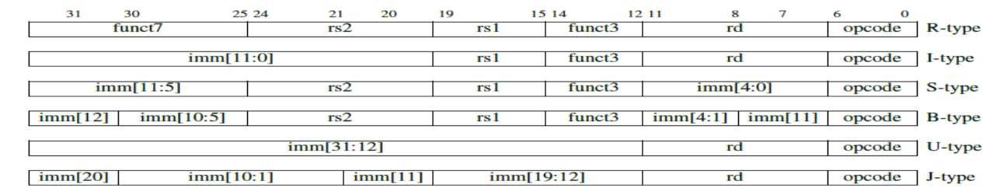
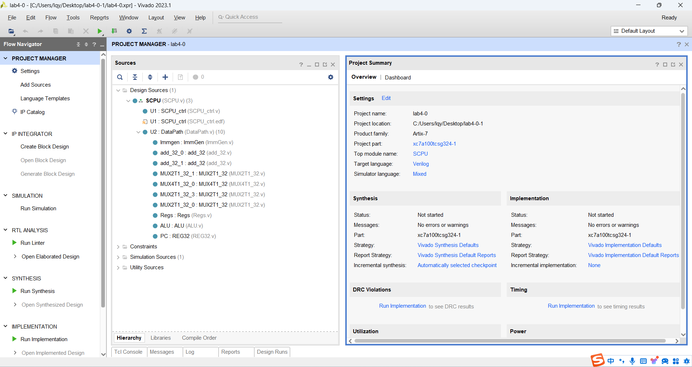
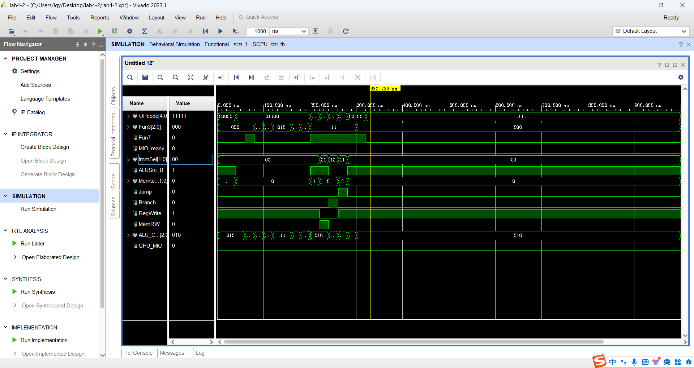
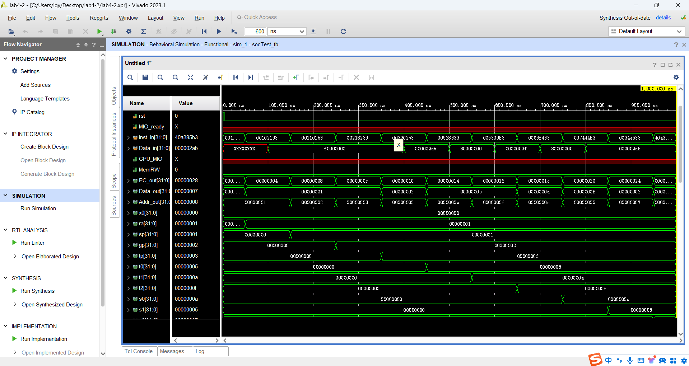
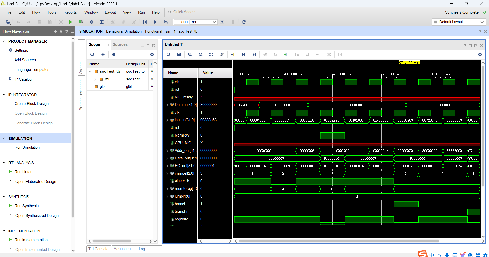

# Lab4

[TOC]

---

## CPU数据通路与控制器实现

### Lab4-1

#### 数据通路实现

##### PC

```verilog
`timescale 1ns / 1ps

module REG32(
    input clk, rst, CE, [31:0] D,
    output reg [31:0] Q
    );
    always @(posedge clk or posedge rst) begin // clk上升沿触发
        if (rst) Q <= 0; // rst == 1时复位寄存器
        else if (CE) Q <= D; // CE == 1时使能，写入寄存器
    end
endmodule
```

##### ImmGen

根据注释所写对不同格式的指令集进行立即数的编码提取



```verilog
`timescale 1ns / 1ps

module ImmGen (
    input wire [1:0] ImmSel, //立即数操作控制
    input wire [31:0] inst_field, //指令数据域[31:7]
    output reg [31:0] Imm_out //立即数输出
    );
    always@(*) begin
        case(ImmSel)
            2'b00: Imm_out = {{20{inst_field[31]}}, inst_field[31:20]}; //addi\lw(I)
            2'b01: Imm_out = {{20{inst_field[31]}}, inst_field[30:25], inst_field[11:7]}; //sw(s)
            2'b10: Imm_out = {{20{inst_field[31]}}, inst_field[7], inst_field[30:25], inst_field[11:8], 1'b0}; //beq(b)
            2'b11: Imm_out = {{20{inst_field[31]}}, inst_field[19:12], inst_field[20], inst_field[30:21], 1'b0}; //jal(j)
        endcase
    end
endmodule
```

##### 顶层模块：DataPath

根据数据通路原理图，完成对顶层模块DataPath的设计

同时为了确保VGA能够显示，加入`Defines.vh`宏定义

> 后续想法：子模块中的`add_32`和`MUX`其实在模块代码书写时可以采用功能性描述，而不是结构性描述，便于debug

```verilog
`include "Defines.vh"
`timescale 1ns / 1ps

module DataPath(
    input wire Branch, //Beq指令
    input wire Jump, //J指令
    input wire [31:0] Data_in, //存储器输入
    input wire [1:0] MemtoReg, //Regs写入数据源控制
    input wire ALUSrc_B, //ALU端口B输入选择
    input wire [1:0] ImmSel, //ImmGen操作控制
    input wire [31:0]inst_field, //指令数据域[31:7]
    input wire [2:0] ALU_operation, //ALU操作控制
    input wire clk, //寄存器时钟
    input wire rst, //寄存器复位
    input wire RegWrite, //寄存器写入
    output [31:0] ALU_out, //ALU运算输出
    output [31:0] Data_out, //CPU数据输出
    output [31:0] PC_out, //PC指针输出
    `RegFile_Regs_output
    ); 

    // Module wires definition
    wire [31:0] Imm_out;      
    wire [31:0] add_32_0_c;
    wire [31:0] add_32_1_c;
    wire [31:0] MUX2T1_32_1_o;
    wire [31:0] MUX4T1_32_0_o;
    wire [31:0] MUX2T1_32_3_o;
    wire [31:0] MUX2T1_32_0_o;
    wire [31:0] Rs1_data;
    wire [31:0] Rs2_data;
    wire [31:0] res;
    wire zero;
    wire [31:0] Q;

    // Module instances
    ImmGen Immgen (
        // Input
        .ImmSel(ImmSel),
        .inst_field(inst_field),
        // Output
        .Imm_out(Imm_out)
    );

    add_32 add_32_0 (
        // Input
        .a(Q),
        .b(32'b100),
        // Output
        .c(add_32_0_c)
    );

    add_32 add_32_1 (
        // Input
        .a(Q),
        .b(Imm_out),
        // Output
        .c(add_32_1_c)
    );

    MUX2T1_32 MUX2T1_32_1 (
        // Input
        .I0(add_32_0_c),
        .I1(add_32_1_c),
        .s(Branch & zero),
        // Output
        .o(MUX2T1_32_1_o)
    );

    MUX4T1_32 MUX4T1_32_0 (
        // Input
        .s(MemtoReg),
        .I0(res),
        .I1(Data_in),
        .I2(add_32_0_c),
        .I3(add_32_0_c),
        // Output
        .o(MUX4T1_32_0_o)
    );

    MUX2T1_32 MUX2T1_32_3 (
        // Input
        .I0(MUX2T1_32_1_o),
        .I1(add_32_1_c),
        .s(Jump),
        // Output
        .o(MUX2T1_32_3_o)
    );

    MUX2T1_32 MUX2T1_32_0 (
        // Input
        .I0(Rs2_data),
        .I1(Imm_out),
        .s(ALUSrc_B),
        // Output
        .o(MUX2T1_32_0_o)
    );

    Regs Regs (
        // Input
        .clk(clk),
        .rst(rst),
        .Rs1_addr(inst_field[19:15]),
        .Rs2_addr(inst_field[24:20]),
        .Wt_addr(inst_field[11:7]),
        .Wt_data(MUX4T1_32_0_o),
        .RegWrite(RegWrite),
        // Output
        .Rs1_data(Rs1_data),
        .Rs2_data(Rs2_data),
        `RegFile_Regs_Arguments
    );

    ALU ALU (
        // Input
        .A(Rs1_data),
        .ALU_operation(ALU_operation),
        .B(MUX2T1_32_0_o),
        // Output
        .res(res),
        .zero(zero)
    );

    REG32 PC (
        // Input
        .clk(clk),
        .rst(rst),
        .CE(1'b1),
        .D(MUX2T1_32_3_o),
        // Output
        .Q(Q)
    );

    // Output
    assign ALU_out = res;
    assign Data_out = Rs2_data;
    assign PC_out = Q;

endmodule
```

#### CPU替换与下板验证

##### 数据通路替换集成



##### SCPU替换集成

与上述同理，进行SCPU的打包、替换

##### 上板准备

重新生成ROM和RAM并烧录初始化文件

##### VGA信号调试

将`Define.vh`通过预编译指令`include`到`VGA.v`中，并在合适位置进行宏调用以完成32个通用寄存器的VGA显示

```verilog
`include "Defines.vh"
`timescale 1ns / 1ps

module VGA(
    input wire clk_25m,
    input wire clk_100m,
    input wire rst,
    input wire [31:0] pc,
    input wire [31:0] inst,
    input wire [31:0] alu_res,
    input wire mem_wen,
    input wire [31:0] dmem_o_data,
    input wire [31:0] dmem_i_data,
    input wire [31:0] dmem_addr,
    `VGA_Regs_Input
    output wire hs,
    output wire vs,
    output wire [3:0] vga_r,
    output wire [3:0] vga_g,
    output wire [3:0] vga_b
    );
    wire [9:0] vga_x;
    wire [8:0] vga_y;
    wire video_on;
    VgaController vga_controller(
		...
      );
 wire display_wen;
 wire [11:0] display_w_addr;
 wire [7:0] display_w_data;
 VgaDisplay vga_display(
		...
      );
 VgaDebugger vga_debugger(
		...
         .pc            (pc             ),
         .inst          (inst           ),
		...
         .alu_res       (alu_res        ),
         `RegFile_Regs_Arguments,
		...
     );
endmodule
```

### Lab4-2

#### 控制器实现

##### 模块实现

这个模块的实现主要是根据`opcode`来确定一坨参数，然后`ALU_Control`再依靠`opcode`和`func3`和`func7`来确定，只需要写一堆`case`条件语句即可

```verilog
`timescale 1ns / 1ps

module SCPU_ctrl(
    input[4:0]OPcode, //Opcode------inst[6:2]
    input[2:0]Fun3, //Function-----inst[14:12]
    input Fun7, //Function-----inst[30]
    input MIO_ready, //CPU Wait not use
    output reg [1:0]ImmSel, //立即数选择控制
    output reg ALUSrc_B, //源操作数2选择
    output reg [1:0] MemtoReg, //写回数据选择控制
    output reg Jump, //jal
    output reg Branch, //beq
    output reg RegWrite, //寄存器写使能
    output reg MemRW, //存储器读写使能
    output reg [2:0]ALU_Control, //alu控制
    output CPU_MIO //not use
    );

    reg [1:0] ALUop;
    wire [3:0] Fun;
    assign Fun = {Fun3,Fun7};
    `define CPU_ctrl_signals {ImmSel, ALUSrc_B, MemtoReg, RegWrite, MemRW, Branch, Jump, ALUop}
    always@(*) begin
        case(OPcode)
            5'b01100: begin `CPU_ctrl_signals = {2'b00, 1'b0, 2'b00, 1'b1, 1'b0, 1'b0, 1'b0, 2'b10}; end //ALU
            5'b00000: begin `CPU_ctrl_signals = {2'b00, 1'b1, 2'b01, 1'b1, 1'b0, 1'b0, 1'b0, 2'b00}; end //load
            5'b01000: begin `CPU_ctrl_signals = {2'b01, 1'b1, 2'b00, 1'b0, 1'b1, 1'b0, 1'b0, 2'b00}; end //store
            5'b11000: begin `CPU_ctrl_signals = {2'b10, 1'b0, 2'b00, 1'b0, 1'b0, 1'b1, 1'b0, 2'b01}; end //beq
            5'b11011: begin `CPU_ctrl_signals = {2'b11, 1'b0, 2'b10, 1'b1, 1'b0, 1'b0, 1'b1, 2'b00}; end //jump
            5'b00100: begin `CPU_ctrl_signals = {2'b00, 1'b1, 2'b00, 1'b1, 1'b0, 1'b0, 1'b0, 2'b11}; end //ALU(addi;;;;)
            default: begin `CPU_ctrl_signals = {2'b00, 1'b1, 2'b00, 1'b1, 1'b0, 1'b0, 1'b0, 2'b11}; end
        endcase
    end

    always@(*) begin
        case(ALUop)
            2'b00: ALU_Control = 3'b010; //add计算地址
            2'b01: ALU_Control = 3'b110; //sub比较条件
            2'b10:
                case(Fun)
                    4'b0000: ALU_Control = 3'b010 ; //add
                    4'b0001: ALU_Control = 3'b110; //sub
                    4'b1110: ALU_Control = 3'b000; //and
                    4'b1100: ALU_Control = 3'b001; //or
                    4'b0100: ALU_Control = 3'b111; //slt
                    4'b1010: ALU_Control = 3'b101; //srl
                    4'b1000: ALU_Control = 3'b011; //xor
                    default: ALU_Control = 3'bxxx;  
                endcase
            2'b11:
                case(Fun3)
                    3'b000: ALU_Control = 3'b010; //addi    
                    3'b010: ALU_Control = 3'b111; //slti
                    3'b100: ALU_Control = 3'b011; // xori
                    3'b110: ALU_Control = 3'b001; //ori
                    3'b111: ALU_Control = 3'b000; //andi
                    3'b101: ALU_Control = 3'b101; //srli
                    default: ALU_Control = 3'bxxx;
                endcase
        endcase
    end

    assign CPU_MIO = MIO_ready;

endmodule
```

##### 仿真结果

经过仔细比对PDF和自己的仿真结果，最终不断修改模块代码，以确保逻辑正确

注意到原本按照PDF上面的写法对ALU控制器进行套用PDF的模版，但是发现只使用`assign Fun = {Fun3,Fun7};`这一句会导致`ALU_Control`只会随着`opcode`改变而不会随着`ALUop`改变

因此经过一番调试，在`assign Fun = {Fun3, Fun7};`前面加了一句`wire [3:0] Fun;`才使得结果正确 :open_mouth:



#### CPU集成

##### 模块实现

```verilog
module socTest(
    input clk,
    input rst
    );
    
    /* SCPU 中接出 */
    wire [31:0] Addr_out;
    wire [31:0] Data_out;       
    wire        CPU_MIO;
    wire        MemRW;
    wire [31:0] PC_out;
    /* RAM 接出 */
    wire [31:0] douta;
    /* ROM 接出 */
    wire [31:0] spo;
    
    SCPU u0(
        /*YOUR_CODE*/
        .Data_in(douta),
        .MIO_ready(CPU_MIO),
        .clk(clk),
        .inst_in(spo),
        .rst(rst),
        .Addr_out(Addr_out),
        .CPU_MIO(CPU_MIO),
        .Data_out(Data_out),
        .MemRW(MemRW),
        .PC_out(PC_out)
    );

    RAM_B u1(
        /*YOUR_CODE*/
        .clka(~clk),
        .wea(MemRW),
        .addra(Addr_out[11:2]),
        .dina(Data_out),
        .douta(douta)
    );

    ROM_D u2(
        /*YOUR_CODE*/
        .a(PC_out[11:2]),
        .spo(spo)
    );
endmodule
```

基于原理图进行连线

##### 功能仿真

利用SOC平台进行功能仿真



#### 下板验证

经过检查，下板验证结果正确


特别注意到这里`s10`寄存器的值是74，符合预期结果，而且指令也完成了循环


---

## CPU指令拓展

### 数据通路重实现

根据原理图进行连线

> :cry: 数据通路部分的多路选择器`MUX2T1_32`在模块定义时把控制信号错误写为32位，导致后续功能仿真时一致出现没有指令读出的情况，这个细小的问题困扰了我两天两夜之久，助教哥哥也花了一晚上才看出来问题所在:crying_cat_face:

```verilog
`timescale 1ns / 1ps

module Data_path_more(
    input [1:0] Jump, //J指令
    input Branch, //Beq指令
    input BranchN, //Bne指令
    input ALUSrc_B, //ALU端口B输入选择
    input [3:0] ALU_Control, //ALU操作控制
    input clk, //寄存器时�??
    input [1:0] MemtoReg, //Regs写入数据源控�??
    input [31:0] Data_in, //存储器输�??
    input [2:0] ImmSel, //ImmGen操作控制
    input [31:0] inst_field, //指令数据域[31:7]
    input rst, //寄存器复�??
    input RegWrite, //寄存器写信号
    output wire [31:0] PC_out, //PC指针输出
    output [31:0] ALU_out, //ALU运算输出
    output [31:0] Data_out //CPU数据输出
    );

    // Wires Definition.
    // ImmGen_0 wires definition.
    wire [31:0] imm_out;
    // add_32_0 wires definition.
    wire [31:0] add_32_0_c;
    // add_32_1 wires definition.
    wire [31:0] add_32_1_c;
    // MUX4T1_32_0 wires definition.
    wire [31:0] MUX4T1_32_0_o;
    // MUX2T1_32_1 wires definition.
    wire [31:0] MUX2T1_32_1_o;
    // MUX4T1_32_1 wires definition.
    wire [31:0] MUX4T1_32_1_o;
    // MUX2T1_32_0 wire definition.
    wire [31:0] MUX2T1_32_0_o;
    // Regs_0 wires definition.
    wire [31:0] Rs1_data;
    wire [31:0] Rs2_data;
    // PC wires definition.
    wire [31:0] Q;
    // ALU_0 wires definition.
    wire [31:0] res;
    wire zero;

    // Module definition.
    // ImmGen_0
    ImmGen ImmGen_0 (
        // Input.
        .ImmSel(ImmSel),
        .inst_field(inst_field),
        // Output.
        .Imm_out(imm_out)
    );

    // add_32_0
    add_32 add_32_0 (
        // Input.
        .a(32'h4),
        .b(Q),
        // Output.
        .c(add_32_0_c)
    );

    // add_32_1
    add_32 add_32_1 (
        // Input.
        .a(Q),
        .b(imm_out),
        // Output.
        .c(add_32_1_c)
    );

    // MUX4T1_32_0
    MUX4T1_32 MUX4T1_32_0 (
        // Input.
        .s(MemtoReg),
        .I0(res),
        .I1(Data_in),
        .I2(add_32_0_c),
        .I3(imm_out),
        // Output.
        .o(MUX4T1_32_0_o)
    );

    // MUX2T1_32_1
    MUX2T1_32 MUX2T1_32_1 (
        // Input.
        .s((Branch & zero) | (BranchN & !zero)),
        .I0(add_32_0_c),
        .I1(add_32_1_c),
        // Output.
        .o(MUX2T1_32_1_o)
    );

    // MUX4T1_32_1
    MUX4T1_32 MUX4T1_32_1 (
        // Input.
        .s(Jump),
        .I0(MUX2T1_32_1_o),
        .I1(add_32_1_c),
        .I2(res),
        .I3(MUX2T1_32_1_o),
        // Output.
        .o(MUX4T1_32_1_o)
    );

    // MUX2T1_32_0
    //assign MUX2T1_32_0_o = (ALUSrc_B ? imm_out : Rs2_data);
    MUX2T1_32 MUX2T1_32_0 (
        // Input.
        .s(ALUSrc_B),
        .I0(Rs2_data),
        .I1(imm_out),
        // Output.
        .o(MUX2T1_32_0_o)
    );

    // Regs_0
    Regs Regs_0 (
        // Input.
        .clk(clk),
        .rst(rst),
        .Rs1_addr(inst_field[19:15]),
        .Rs2_addr(inst_field[24:20]),
        .Wt_addr(inst_field[11:7]),
        .Wt_data(MUX4T1_32_0_o),
        .RegWrite(RegWrite),
        // Output.
        .Rs1_data(Rs1_data),
        .Rs2_data(Rs2_data)
    );

    // PC
    REG32 PC (
        // Input.
        .clk(clk),
        .rst(rst),
        .CE(1'b1),
        .D(MUX4T1_32_1_o),
        // Output.
        .Q(Q)
    );

    // ALU_0
    ALU ALU_0 (
        // Input.
        .A(Rs1_data),
        .B(MUX2T1_32_0_o),
        .ALU_operation(ALU_Control),
        // Output.
        .res(res),
        .zero(zero)
    );

    // Output.
    assign PC_out = Q;
    assign ALU_out = res;
    assign Data_out = Rs2_data;

endmodule
```

### 控制器重实现

#### 模块代码

根据对应的控制信号表将对应信号写出来

> 中间标注为注释的一些指令是留存带扩展的指令，未实现

```verilog
`timescale 1ns / 1ps

module SCPU_ctrl_more(
    input [4:0] OPcode, //OPcode
    input [2:0] Fun3, //Function
    input Fun7, //Function
    input MIO_ready, //CPU Wait
    output reg [2:0] ImmSel,
    output reg ALUSrc_B,
    output reg [1:0] MemtoReg,
    output reg [1:0] Jump,
    output reg Branch,
    output reg BranchN,
    output reg RegWrite,
    output reg MemRW,
    output reg [3:0] ALU_Control,
    output CPU_MIO
    ); 

    `define CPU_ctrl_signals {ImmSel, ALUSrc_B, MemtoReg, RegWrite, MemRW, Branch, BranchN, Jump, ALU_Control}
    always@(*) begin
        case(OPcode)
            5'b01100: begin // R-type
                case({Fun3, Fun7})
                    4'b0000: begin `CPU_ctrl_signals = {3'b010, 1'b0, 2'b00, 1'b1, 1'b0, 1'b0, 1'b0, 2'b00, 4'b0010}; end // add
                    4'b0001: begin `CPU_ctrl_signals = {3'b010, 1'b0, 2'b00, 1'b1, 1'b0, 1'b0, 1'b0, 2'b00, 4'b0110}; end // sub
                    4'b0010: begin `CPU_ctrl_signals = {3'b010, 1'b0, 2'b00, 1'b1, 1'b0, 1'b0, 1'b0, 2'b00, 4'b1110}; end // sll
                    4'b0100: begin `CPU_ctrl_signals = {3'b010, 1'b0, 2'b00, 1'b1, 1'b0, 1'b0, 1'b0, 2'b00, 4'b0111}; end // slt
                    4'b0110: begin `CPU_ctrl_signals = {3'b010, 1'b0, 2'b00, 1'b1, 1'b0, 1'b0, 1'b0, 2'b00, 4'b1001}; end // sltu
                    4'b1000: begin `CPU_ctrl_signals = {3'b010, 1'b0, 2'b00, 1'b1, 1'b0, 1'b0, 1'b0, 2'b00, 4'b1100}; end // xor
                    4'b1010: begin `CPU_ctrl_signals = {3'b010, 1'b0, 2'b00, 1'b1, 1'b0, 1'b0, 1'b0, 2'b00, 4'b1101}; end // srl
                    4'b1011: begin `CPU_ctrl_signals = {3'b010, 1'b0, 2'b00, 1'b1, 1'b0, 1'b0, 1'b0, 2'b00, 4'b1111}; end // sra
                    4'b1100: begin `CPU_ctrl_signals = {3'b010, 1'b0, 2'b00, 1'b1, 1'b0, 1'b0, 1'b0, 2'b00, 4'b0001}; end // or
                    4'b1110: begin `CPU_ctrl_signals = {3'b010, 1'b0, 2'b00, 1'b1, 1'b0, 1'b0, 1'b0, 2'b00, 4'b0000}; end // and
                    default: begin `CPU_ctrl_signals = {3'b010, 1'b0, 2'b00, 1'b1, 1'b0, 1'b0, 1'b0, 2'b00, 4'b0010}; end
                endcase
            end
            5'b00000: begin `CPU_ctrl_signals = {3'b001, 1'b1, 2'b01, 1'b1, 1'b0, 1'b0, 1'b0, 2'b00, 4'b0010}; end // I-type, lw
            5'b00100: begin // I-type, ALU
                case(Fun3)
                    3'b000: begin `CPU_ctrl_signals = {3'b001, 1'b1, 2'b00, 1'b1, 1'b0, 1'b0, 1'b0, 2'b00, 4'b0010}; end // addi
                    3'b010: begin `CPU_ctrl_signals = {3'b001, 1'b1, 2'b00, 1'b1, 1'b0, 1'b0, 1'b0, 2'b00, 4'b0111}; end // slti
                    3'b011: begin `CPU_ctrl_signals = {3'b001, 1'b1, 2'b00, 1'b1, 1'b0, 1'b0, 1'b0, 2'b00, 4'b1001}; end // sltiu
                    3'b100: begin `CPU_ctrl_signals = {3'b001, 1'b1, 2'b00, 1'b1, 1'b0, 1'b0, 1'b0, 2'b00, 4'b1100}; end // xori
                    3'b110: begin `CPU_ctrl_signals = {3'b001, 1'b1, 2'b00, 1'b1, 1'b0, 1'b0, 1'b0, 2'b00, 4'b0001}; end // ori
                    3'b111: begin `CPU_ctrl_signals = {3'b001, 1'b1, 2'b00, 1'b1, 1'b0, 1'b0, 1'b0, 2'b00, 4'b0000}; end // andi
                    3'b001: begin `CPU_ctrl_signals = {3'b001, 1'b1, 2'b00, 1'b1, 1'b0, 1'b0, 1'b0, 2'b00, 4'b1110}; end // slli
                    3'b101: begin
                        case(Fun7)
                            1'b0: begin `CPU_ctrl_signals = {3'b001, 1'b1, 2'b00, 1'b1, 1'b0, 1'b0, 1'b0, 2'b00, 4'b1101}; end // srli
                            1'b1: begin `CPU_ctrl_signals = {3'b001, 1'b1, 2'b00, 1'b1, 1'b0, 1'b0, 1'b0, 2'b00, 4'b1111}; end // srai
                        endcase
                    end
                endcase
            end
            5'b11001: begin `CPU_ctrl_signals = {3'b001, 1'b1, 2'b10, 1'b1, 1'b0, 1'b0, 1'b0, 2'b10, 4'b0010}; end // I-type, jalr
            5'b01000: begin // S-type
                case(Fun3)
                    //3'b000: begin `CPU_ctrl_signals = 16'b010_1_xx_0_1_0_0_00_0010; end // sb
                    //3'b001: begin `CPU_ctrl_signals = 16'b010_1_xx_0_1_0_0_00_0010; end // sh
                    3'b010: begin `CPU_ctrl_signals = {3'b010, 1'b1, 2'b00, 1'b0, 1'b1, 1'b0, 1'b0, 2'b00, 4'b0010}; end // sw
                    default: begin `CPU_ctrl_signals = {3'b010, 1'b1, 2'b00, 1'b0, 1'b1, 1'b0, 1'b0, 2'b00, 4'b0010}; end
                endcase
            end
            5'b11000: begin // B-type
                case(Fun3)
                    3'b000: begin `CPU_ctrl_signals = {3'b011, 1'b0, 2'b00, 1'b0, 1'b0, 1'b1, 1'b0, 2'b00, 4'b0110}; end // beq
                    3'b001: begin `CPU_ctrl_signals = {3'b011, 1'b0, 2'b00, 1'b0, 1'b0, 1'b0, 1'b1, 2'b00, 4'b0110}; end // bne
                    //3'b100: begin `CPU_ctrl_signals = 16'b011_0_xx_0_x_1_0_00_0111; end // blt
                    //3'b101: begin `CPU_ctrl_signals = 16'b011_0_xx_0_x_1_0_00_0111; end // bge
                    //3'b110: begin `CPU_ctrl_signals = 16'b011_0_xx_0_x_1_0_00_1001; end // bltu
                    //3'b111: begin `CPU_ctrl_signals = 16'b011_0_xx_0_x_1_0_00_1001; end // bgeu
                    default: begin `CPU_ctrl_signals = {3'b011, 1'b0, 2'b00, 1'b0, 1'b0, 1'b1, 1'b0, 2'b00, 4'bxxxx}; end
                endcase
            end
            5'b11011: begin `CPU_ctrl_signals = {3'b100, 1'b1, 2'b10, 1'b1, 1'b0, 1'b0, 1'b0, 2'b01, 4'b0010}; end // J-type, jal
            5'b00101: begin `CPU_ctrl_signals = {3'b000, 1'bx, 2'b11, 1'b1, 1'bx, 1'b0, 1'b0, 2'b00, 4'bxxxx}; end // U-type, auipc
            5'b01101: begin `CPU_ctrl_signals = {3'b000, 1'b0, 2'b11, 1'b1, 1'b0, 1'b0, 1'b0, 2'b00, 4'b0010}; end // U-type, lui
            default: begin  `CPU_ctrl_signals = {3'bxxx, 1'bx, 2'bxx, 1'bx, 1'bx, 1'bx, 1'bx, 2'bxx, 4'bxxxx}; end 
        endcase
    end

    assign CPU_MIO = MIO_ready;

endmodule
```

#### 功能仿真

根据提供的正确仿真结果写出仿真代码，进行仿真后得到如下结果

> 原本对控制器参数表中未定义的控制信号全部赋值`X`，后来根据仿真图将其修改为对应的默认值


#### SOC平台仿真

通过SOC平台进行SCPU模块的仿真，结果如下：



### 下板验证


> 经过助教验收，但是注意到最后跳转到`error`部分，原因是在`PC=0x20`的`gp`寄存器应该是`0x80000000`，仿真的结果也是这个，但是下板时VGA上的显示为`0x08888000`，助教说是时序的问题，其他同学也有遇到，最后给了验收通过

---

## CPU指令中断

>  这一部分不太会写

### 数据通路修改


### 控制器修改


### 下板验证

