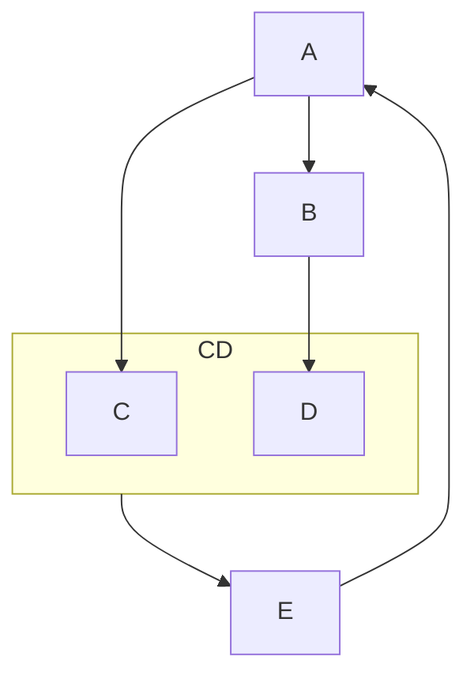

# HW7

[TOC]

---

## 7.1

**Proof:**

Let $R_1=(A,B,C)$, $R_2=(A,D,E)$

So $R_1\bigcap R_2=(A)$

In $R_1$, we know that $F_1=\{A\rightarrow BC\}=\{A\rightarrow B, A\rightarrow C\}$, so $A$ is a key in $R_1$

In $R_2$, we know that $F_2=\{A\rightarrow BC, CD\rightarrow E, B\rightarrow D, E\rightarrow A\}=\{A\rightarrow D, E \rightarrow A\}$, so $E$ is a key in $R_2$.

Knowing that $R_1\bigcap R_2\rightarrow R_1$, so this is a lossless decomposition.

Q.E.D.

---

## 7.13

**Proof:**

In $R_1=(A,B,C)$ and $R_2=(A,D,E)$, we can easily see that the dependency $B\rightarrow D$ cannot be checked only in both $R_1$ and $R_2$ since $B$ only appears in $R_1$ while $D$ only appears in $R_2$. Only by grouping $R_1$ and $R_2$ together can we examine this dependency. 

So it is not a dependency-preserving decomposition.

Q.E.D.

---

## 7.21

**Solution:**

By the given function-dependency we can get that:

So we can get two function-dependency: $F'=\{E\rightarrow A \rightarrow BC\}$, $F_1=\{B\rightarrow D\}$

So we can get one BCNF: $R'=(A,B,C,E)$, $R_1=(B,D)$

Keep decompositing, we can get that: $R''=(A,E)$, $R_2=(A,B,C)$ with $F''=\{E\rightarrow A\}$, $F_2=\{A\rightarrow BC\}$

So finally we can get 3 BCNF:

* $R_1=(B,D)$
* $R_2=(A,B,C)$
* $R_3=(A,E)$

---

## 7.22

**Solution:**

Apparently we can get that

* $R_1=(A,B,C)$ with $F_1=\{A\rightarrow BC\}$
* $R_2=(B,D)$ with $F_2=\{B\rightarrow D\}$
* $R_3=(C,D,E)$ with $F_3=\{CD\rightarrow E\}$
* $R_4=(A,E)$ with $F_4=\{E\rightarrow A\}$

---

## 7.30

### a

**Solution:**

$B^+=\{ABCDE\}$

### b

**Proof:**

Knowing that $A\rightarrow BCD$ so $A\rightarrow B, A\rightarrow C, A\rightarrow D$

By *Reflexivity* we know that $A\rightarrow A$

By *Transitivity* we know that $A\rightarrow BCD\rightarrow BC\rightarrow E$.

So $A^+=\{ABCDE\}$, $G^+=\{G\}$

So $AG\rightarrow ABCDEG$

So $AG$ is the superkey.

Q.E.D.

### c

**Solution:**

Knowing $F=\{A\rightarrow BCD,BC\rightarrow DE,B\rightarrow D, D\rightarrow A\}

Considering that $A\rightarrow BCD$ and $BC\rightarrow DE$ so $rightarrow BC\rightarrow D$ can be simplier.

And $B\rightarrow D$ so in $BC\rightarrow DE$ it can be simplified as $BC\rightarrow E$, $B\rightarrow D$

So $F_c=\{A\rightarrow BC,BC\rightarrow E, B\rightarrow D, D\rightarrow A\}$

### d

**Solution:**

* $R_1=(A,B,C)$ with $F_1=\{A\rightarrow BC\}
* $R_2=(B,C,E)$ with $F_2=\{BC\rightarrow E\}$
* $R_3=(B,D)$ with $F_3=\{B\rightarrow D\}$
* $R_4=(A,D)$ with $F_4=\{D\rightarrow A\}$
* $R_5=(A,G)$ with $F_5=\{AG\rightarrow AG\}$

### e

**Solution:**

* $R_1=(B,D)$ with $F_1=\{B\rightarrow D\}$, $R'=(A,B,C,E,G)$
* $R_2=(A,E)$ with $F_2=\{A\rightarrow BC\rightarrow E\}$, $R''=(A,B,C,G)$
* $R_3=(A,B,C)$ with $F_3=\{A\rightarrow BC\}$
* $R_4=(A,G)$ with $F_4=\{AG\rightarrow AG\}$

---

## 7.32

### a

**Solution:**

Dont know

### <a id="7.32-b">b</a>

**Solution:**

1. $R_1=(A,B,C)$ with $F_1=\{A\rightarrow BC\}$, $R'=(A,D,E,G)$
2. $R_2=(A,D,E)$ with $F_2=\{AD\rightarrow BD\rightarrow E\}$, $R''=(A,D,G)$
3. $R_3=(A,D,G)$ with $F_3=\{ADG\rightarrow ADG\}$

### c

**Solution:**

For the decomposition in [b](#7.32-b), $R_1\bigcap R_2\bigcap R_3=A$, and $A\rightarrow R_1$ so it is lossless. 

### d

For the decomposition in [b](#7.32-b), $(F_1\bigcup F_2\bigcup F_3)^+=\{A\rightarrow BC, AD\rightarrow E, ADG\rightarrow ADG\}^+=\{A\rightarrow B, A\rightarrow C, AD\rightarrow E, ADG\rightarrow ADG\}$

But $F^+=\{A\rightarrow B, A\rightarrow C, BD\rightarrow E, CD\rightarrow BC\}=\cdots$

So $(F_1\bigcup F_2\bigcup F_3)^+ \neq F^+$

Thus, it is not dependency preserving.
