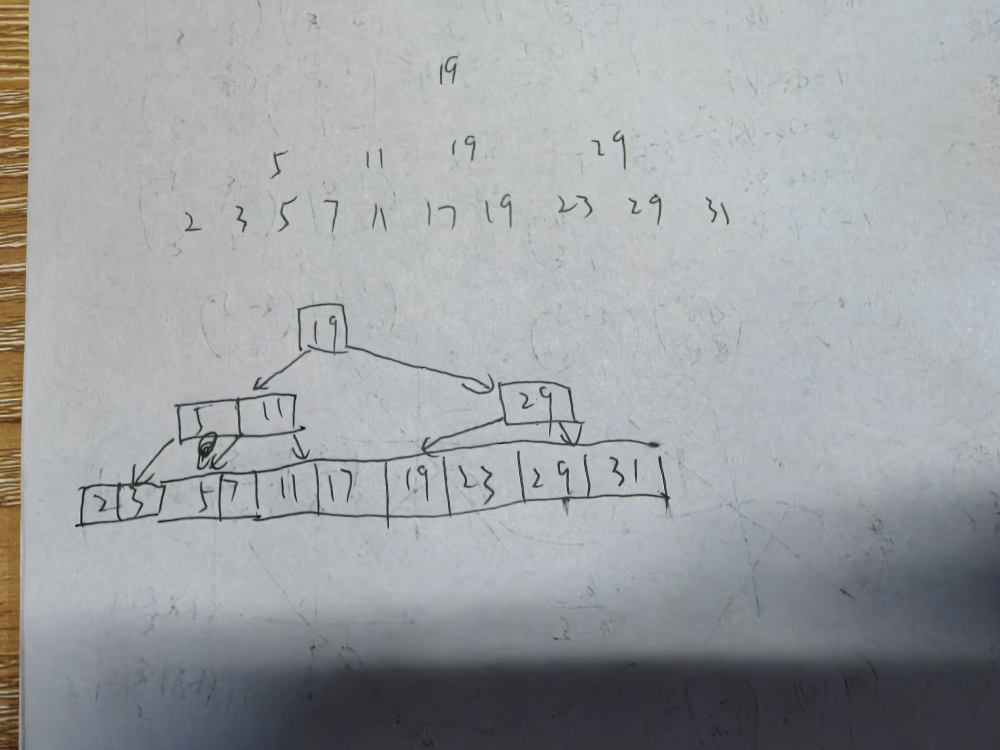
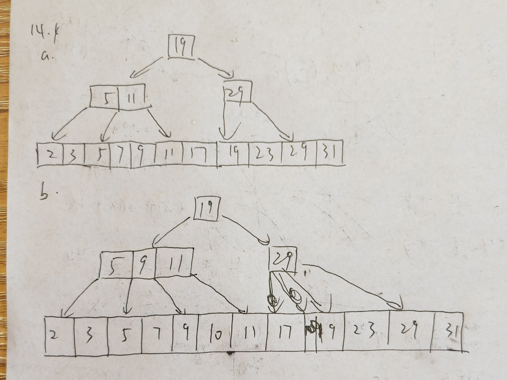
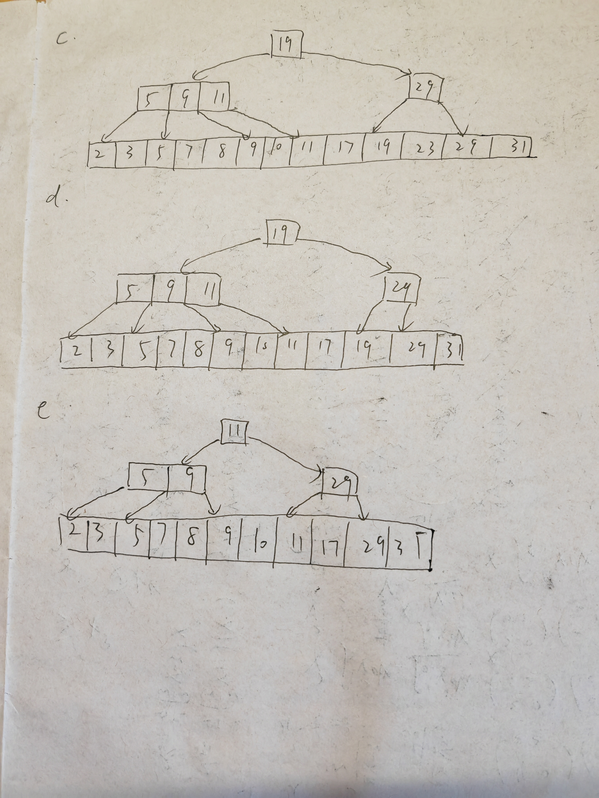

# HW9

[toc]

---

## 14.3.a

---

## 14.4

---

## 14.11

We can still merge the entries which is not full at one level to the next level, which can reduce the cost of reads.

---

## 24.10

It will make read cost higher and Write Amplification may be caused.