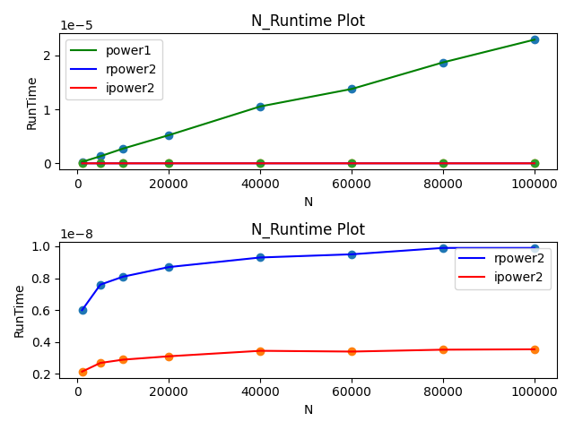

# PROJECT 1:Performance Measurement (POW)</br>Written By 李秋宇</br>Date:2023-10-04

---
# Chapter 1: Introduction

### 问题描述

幂运算的不同算法比较

### 算法分析

幂运算计算$x^N$的算法有很多，算法1直接用$x$乘$N$次，算法2是将$x^N$分为$N$奇数偶数讨论：

* 若$N$是奇数，则$x^N=x^{\frac{N-1}{2}}*x^{\frac{N-1}{2}}*x$

* 若$N$是偶数，则$x^N=x^{\frac{N}{2}}*x^{\frac{N}{2}}$
其中算法2可以分为迭代法和递归法两种

---
# Chapter 2: Algorithm Specification

### 算法1

没啥好说的，就直接暴力乘N次

### 算法2

#### 递归法

考虑到幂运算$x^N=x^{\frac{N}{2}}*x^{\frac{N}{2}}$，这里出现可以递归的结构，即`power(x,N)`调用`power(x,N/2)`这个过程。注意到在C语言中，整数除法是自动取整的，所以算法的步骤$x^N=x^{\frac{N-1}{2}}*x^{\frac{N-1}{2}}*x$其实在代码中可以直接表述为$x^N=x^{\frac{N}{2}}*x^{\frac{N}{2}}*x$

因此奇数的情况只需要多乘一次$x$即可

递归的终止条件是`power(x,0)`

```dotnetcli{.line-numbers}
psedocode: power2(x,N)
    if x==0: return 1    
    else if x mod 2: return power(x,N/2)*power(x,N/2)*x
    else: return power(x,N/2)*power(x,N/2)
```

#### 迭代法

迭代法的实现其实是递归的变式。注意到需要将递归的过程转为循环，而循环终止的条件是幂指数$N=0$的时候

注意到算法2其实是把幂指数$N$每次除2，进行不断计算直到$N=0$。这个过程其实是$N$进行十进制转二进制

> 例1：$x^{15}=x^7*x^7*x$,$x^7=x^3*x^3*x$,$x^3=x*x*x$,而$15d=1111b$，对应$x^0,x^1,x^2,x^4$，所以$x^{15}=x^8*x^4*x^2*x=((x^2)^2)^2*(x^2)^2*x^2*x$

> 例2：$x^{16}=x^8*x^8,x^8=x^4*x^4,x^4=x^2*x^2,x^2=x*x$，而$16d=10000b$，所以$x^{16}=x^{16}=(((x^2)^2)^2)^2$

所以先从$x^1$开始，逐渐平方进行迭代升级，从二进制最低位开始，遇到1的情况就乘$x$，否则进行平方迭代，直至$N=0$

```dotnetcli{.line-numbers}
psedocode:power2(x,N)
    ans=1
    while(N>0):
        if(N%2==1): ans*=x
        x*=x
        N/=2
    return ans
```

---
# Chapter 3: Testing Results

因为实验要求为了获得10%以上的精度，需要每个函数的总运行时间大于10s，这就需要对每个步骤进行重复$K$次

所以在正式开始实验前，先进行预实验以确定迭代次数的取值

本次project本人使用的环境是Ubuntu22.04LTS，考虑到所以存在`ticks`和`total time`的关系为$$ticks=10^6\times totaltime$$

预实验代码在appendix中给出

### Algorithm1

预实验，选取$K=50000,N=100000$，运行结果为`Total time:12.797132`

再选取$K=5000000,N=1000$，运行结果为`Total time:11.875016`

注意到算法时间近似于线性时间，选取$K=50000起始,K=5000000终止$

|N|1000|5000|10000|20000|40000|60000|80000|100000|
| :--: | :--: | :--: | :--: | :--: | :--: | :--: | :--: | :--: |
|Iterations(K)|$5\times10^6$|$1\times10^6$|$5\times10^5$|$2.5\times10^5$|$1.25\times10^5$|83333|62500|50000|
|Ticks|13235484|13118755|13712358|1306535|13185151|11487709|11697065|11464509|
|Total time</br>(sec)|13.235484|13.118755|13.712358|13.06535|13.185151|11.487709|11.697065|11.464509|
|Duration</br>($\times10^{-10}$s)|2647|13119|27425|52261|105481|137853|187153|229290|

### Algorithm2_Recursion

预实验，选取$K=200000000,N=1000$，运行结果为`Total time:12.260687`

再选取$K=200000000,N=100000$，运行结果为`Total time:21.814173`

则选取迭代次数$K=200000000$

|N|1000|5000|10000|20000|40000|60000|80000|100000|
| :--: | :--: | :--: | :--: | :--: | :--: | :--: | :--: | :--: |
|Iterations(K)|$2\times10^8$|$2\times10^8$|$2\times10^8$|$2\times10^8$|$2\times10^8$|$2\times10^8$|$2\times10^8$|$2\times10^8$|
|Ticks|11976332|15181380|16222317|17325547|18564159|18995593|19817379|19778393|
|Total time</br>(sec)|11.976332|15.181380|16.222317|17.325547|18.564159|18.995593|19.817379|19.778393|
|Duration</br>($\times10^{-10}$s)|60|76|81|87|93|95|99|99|

### Algorithm2_iteration
预实验，选取$K=500000000,N=1000$，运行结果为`Total time:10.473753`
再选取$K=500000000,N=100000$，运行结果为`Total time:18.331956`
则选取迭代次数为$K=500000000$
|N|1000|5000|10000|20000|40000|60000|80000|100000|
| :--: | :--: | :--: | :--: | :--: | :--: | :--: | :--: | :--: |
|Iterations(K)|$5\times10^8$|$5\times10^8$|$5\times10^8$|$5\times10^8$|$5\times10^8$|$5\times10^8$|$5\times10^8$|$5\times10^8$|
|Ticks|10740666|13460169|14491565|15545545|17258138|17018575|17609813|17728376|
|Total time</br>(sec)|10.740666|13.460169|14.491565|15.545545|17.258138|17.018575|17.609813|17.728376|
|Duration</br>($\times10^{-10}$s)|21.48|26.92|28.98|31.09|34.52|34.04|35.22|35.46|

### 运行时间图表

使用Python的matplotlib库进行数据绘图

考虑到算法1和算法2的运行时间不在同一个量级，因此还单独将算法2的两种实现画在另一张图中



---
# Chapter 4: Analysis and Comments 

## 算法复杂度分析

#### 算法1

算法1非常暴力进行N次乘法，所以时间复杂度为$O(N)$

注意到没有使用额外的空间进行存储所以空间复杂度为$O(1)$

#### 算法2 递归过程

算法2对$x^N$计算拆成了两部分$x^{\frac{N}{2}}$，并以此递归

因此算法的时间复杂度为$O(logN)$

注意到递归过程中分别需要计算$x^{\frac{N}{2}}$两次，而对每个$x^{\frac{N}{2}}$又需要去计算两次$x^{\frac{N}{4}}$，因此总共需要计算$\sum_{i=0}^{log_2N}2^i$算法的空间复杂度为$O(N)$

#### 算法2 迭代过程

算法2迭代过程同样也是将$x^N$拆分为$x^{\frac{N}{2}}$，因此时间复杂度还是$O(logN)$

空间复杂度上，由于没有额外使用其他存储空间，而导致空间复杂度为$O(1)$

---
# Appendix: Source Code

### power.h

```c{.line-numbers}
/*
 * File: power.h
 */

#ifndef _power_h
#define _power_h
#include<stdio.h>

double power1(double,int);
double rpower2(double,int);
double ipower2(double,int);

#endif
```

### power.c

```C{.line-numbers}
/*
 * File: power.c
 */

#include<stdio.h>
#include"power.h"

double power1(double x,int N)
{
    double ans=1;
    for (int i=0;i<N;i++){
        ans*=x; //连续乘N次
    }
    return ans;
}

double rpower2(double x,int N)
{
    if (N==0) return 1; //递归终止
    double tmp=rpower2(x,N/2); //定义临时变量存储递归过程的函数值
    return N%2?tmp*tmp*x:tmp*tmp; //N奇偶的情况对应不同的计算
}

double ipower2(double x,int N)
{
    double ans=1;
    while (N>0) //迭代过程结束条件：N=0
    {
        if (N%2) ans*=x;
        x*=x; //幂运算升级
        N/=2; //迭代升级
     }
    return ans;
}
```

### timetest.c

##### 预实验代码

```c{.line-numbers}
start=clock();
for (int i=0;i<K;i++)
{
    tmp=function(x,N);
}
stop=clock();
tick=ticks(start,stop);
duration=timer(start,stop);
printf("Total time:%lf\n",duration);
```

##### 主程序

```c{.line-numbers}
/*
 * File: timetest.c
 */

#include<stdio.h>
#include<time.h>
#include"power.h" //将实验用到的三个幂运算函数写入库

/*全局变量定义*/
clock_t start,stop; //设置时间点用于计时
double duration; //时间间隔
int tick; //ticks记录

/*函数声明*/
double timer(clock_t,clock_t); //用于计算时间间隔
int ticks(clock_t,clock_t); //用于计算ticks

/*主程序入口*/
int main()
{
    double x=1.0001; //定义x
    int N[8]={1000,5000,10000,20000,40000,60000,80000,100000}; //幂指数N
    int K; //迭代次数K
    double tmp; //用于幂运算结果的赋值
    /*Functions time test here*/
    /*Function1: power1*/
    printf("-----Algorithm1-----\n");
    K=50000; //预实验结果
    for (int i=0;i<8;i++) //对每个N都进行测试
    {
        K=5000000000/N[i]; //迭代次数选择
        start=clock(); //计时开始
        for (int j=0;j<K;j++)
        {
            tmp=power1(x,N[i]); //迭代K次运算
        }
        stop=clock();
        tick=ticks(start,stop);
        duration=timer(start,stop);
        printf("-*-*-*-*-*-\nN=%d\nK=%d\nTicks=%d\nTotal time=%.9lf\nDuration=%.9lf\n",N[i],K,tick,duration,duration/K); //输出结 果
    }
    /*Function2: rpower2*/
    printf("-----Recursive Algorithm2-----\n");
    K=200000000; //预实验结果
    for (int i=0;i<8;i++) //对每个N都进行测试
    {
        start=clock(); //计时开始
        for (int j=0;j<K;j++)
        {
            tmp=rpower2(x,N[i]); //迭代K次运算
        }
        stop=clock();
        tick=ticks(start,stop);
        duration=timer(start,stop);
        printf("-*-*-*-*-*-\nN=%d\nK=%d\nTicks=%d\nTotal time=%.9lf\nDuration=%.9lf\n",N[i],K,tick,duration,duration/K);
    }
    /*Function3: ipower2*/
    printf("-----Iterative Algorithm2-----\n");
    K=500000000; //预实验结果
    for (int i=0;i<8;i++) //对每个N都进行测试
    {
        start=clock(); //计时开始
        for (int j=0;j<K;j++)
        {
            tmp=ipower2(x,N[i]); //迭代K次运算
        }
        stop=clock();
        tick=ticks(start,stop);
        duration=timer(start,stop);
        printf("-*-*-*-*-*-\nN=%d\nK=%d\nTicks=%d\nTotal time=%.11lf\nDuration=%.11lf\n",N[i],K,tick,duration,duration/K);
    }
    return 0;
}

/*函数定义*/
/*
 * 函数：timer
 * 本函数用于计算算法用时，返回单位为秒
 */
double timer(clock_t begin,clock_t end)
{
    return ((double)(end-begin))/CLOCKS_PER_SEC;
}

/*
 * 函数：ticks
 * 本函数用于计算ticks
 */
int ticks(clock_t begin,clock_t end)
{
    return (int)(end-begin);
}
```

### runtimefig.py

```python{.line-numbers}
#!/usr/bin/python3

import matplotlib.pyplot as plt # 导入库

plt.figure() # 生成图片

# 数据集
xs = [1000,5000,10000,20000,40000,60000,80000,100000]
y1s = [2647e-10,13119e-10,27425e-10,52261e-10,105481e-10,137853e-10,187153e-10,229290e-10]
y2rs = [60e-10,76e-10,81e-10,87e-10,93e-10,95e-10,99e-10,99e-10]
y2is = [21.48e-10,26.92e-10,28.98e-10,31.09e-10,34.52e-10,34.04e-10,35.22e-10,35.46e-10]

# 子图1：将3个函数全部绘图
fig1=plt.subplot(211)
fig1.scatter(xs,y1s) # 散点图
fig1.scatter(xs,y2rs)
fig1.scatter(xs,y2is)
fig1.plot(xs,y1s,color='g',label='power1') # 折线图
fig1.plot(xs,y2rs,color='b',label='rpower2')
fig1.plot(xs,y2is,color='r',label='ipower2')
fig1.set(xlabel="N",ylabel="RunTime",title="N_Runtime Plot") # 设置坐 标轴和图表标题名称
fig1.legend() # 显示图例

# 子图2：对算法2的函数进行绘图
fig2=plt.subplot(212)
fig2.scatter(xs,y2rs)
fig2.scatter(xs,y2is)
fig2.plot(xs,y2rs,color='b',label='rpower2')
fig2.plot(xs,y2is,color='r',label='ipower2')
fig2.set(xlabel="N",ylabel="RunTime",title="N_Runtime Plot")
fig2.legend()

plt.tight_layout() # 修改排版
plt.savefig('runtime.png') # 保存图片
```

### Makefile

```makefile{.line-numbers}
# Makefile for ZJU_FDS_2023 project1

CC=gcc
OBJ=timetest.o power.o
RM=rm
TARGET=timetest.exe
CXXFLAGS=-c -W

${TARGET}:${OBJ}
        ${CC} -o $@ $^
%.o:%.c
        ${CC} ${CXXFLAGS} $^
.PHONY:clean
clean:
        ${RM} *.o
```

---
# Declaration
*I hereby declare that all the work done in this project titled "project1" is of my independent effort.*