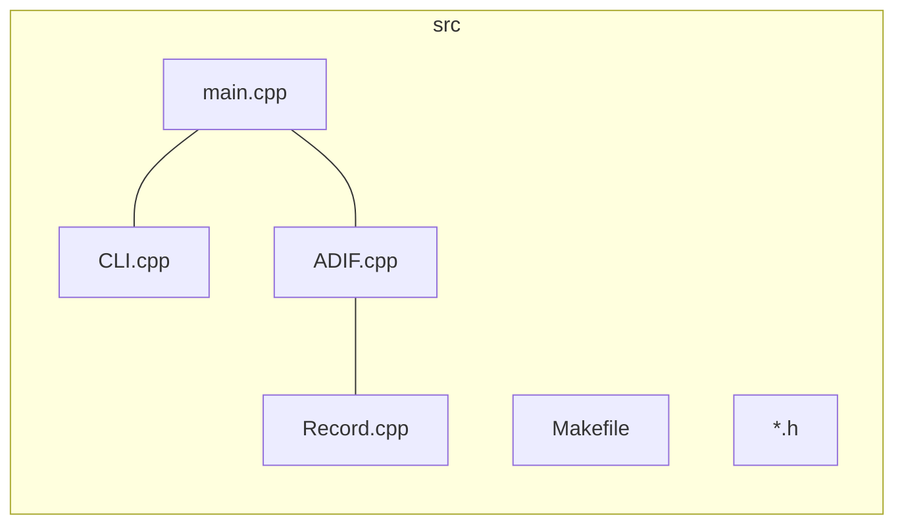

# Project 1: ADIF

> 李秋宇 3220103373

[TOC]

---

## 文件结构



文件架构及组织方式如上，主程序为`main.cpp`

---

## 实现

### Record类

Record类是最底层的类，一个`Record`的对象代表一条ADIF记录

#### 成员变量

```cpp
class Record {
    std::map<std::string, std::string> fields; // Fields and values.
    int fieldSize; // Total size of fields.
    ...
}
```

其中使用一个`std::map<std::string, std::string>`用来存储ADIF记录的键值对，是整个记录类的核心，再用一个`fieldSize`来记录总共存放了多少个键值对

> 所有的值都以字符串的形式存储

#### 类方法

类方法主要有常规的构造函数，获取键值和设置键值，打印单条记录

设置了`getPrimaryKey()`函数用于获取记录的主键，由于ADIF记录的主键是`<QSO_DATE, TIME_OM>`一起决定，因此主键只是简单地把两个值进行字符串加法

这里最麻烦的操作就是初始化，对于ADIF格式来说，在传参给本类时需要把所有的字段的键值对转化成`fieldName:fieldValue\n`的形式，然后在构造函数对这个传入的字符串进行解析，拆成`fieldName`和`fieldValue`然后调用函数`setField(fieldName, fieldValue)`

### ADIF类

ADIF类是整个项目的核心部分，主要负责实现题目的功能：

1. 解析ADIF文件并存储数据
2. 多文件合并数据
3. 列出所有记录
4. 转化成`.csv`和`.json`格式
5. 记录搜索
6. 记录修改
7. 记录删除

#### 成员变量

```cpp
class ADIF {
    std::map<std::string, Record> records; // Store all records.
    std::vector<std::string> fieldNames; // Store all field names.
    ...
};
```

使用一个`std::vector<std::string>`存储所有的字段名，用于转化为`.csv`格式输出时使用

使用一个`std::map<std::string, Record>`存储所有的记录，以`<primaryKey, Record>`形式存储

> 根据主键的索引建立，方便定位到具体记录

#### 类方法

类方法主要是不同功能对应一条函数

##### 文件解析

最麻烦的也是文件的解析，使用`parse(filename)`函数打开一个ADIF文件并解析，这里采用对文件进行逐字符读取，并利用`<string>`库的相关字符串操作函数对每个标签进行处理

采用了异常处理，如果

* 文件扩展名不对，不是`.adi`
* 文件无法打开或不存在
* 错误的ADIF标签，如题目所示

并且采取了冲突检查的方式，如果出现两条记录有一样的主键，会提示是否覆盖

##### 记录搜索

这里支持多条件的搜索，对于每个条件都采用一个`std::pair<std::string, std::string>`的方式存储要查询的字段及其值`<fieldName, fieldValue>`，而且支持模糊查询，因为所有的值都是字符串形式存储，所以只需要调用`substr`方法就可以实现

用一个`std::vector<std::pair<std::string, std::string>>`来存储多条件，然后传给`searchRecords(searchConditions)`进行查询

查询结果返回一个满足条件的记录的集合，并且控制台打印输出对应的记录信息

##### 记录修改

记录修改与记录搜索一致，也是支持多字段修改，传参额外需要一个被修改字段的原始`ID`

为什么是原始`ID`呢？因为如果修改了字段是`QSO_DATE`或`TIME_ON`的其中一个或者两个，会导致这条记录的主键变化，这里就是`modifyRecord`函数的处理机制，如果修改后新的主键与已经存在的记录冲突，也会询问是否覆盖

##### 其它功能

* 打印所有记录，只需要遍历记录字典并调用每条记录的打印方法即可
* 导出为`.csv`和`.json`，只需要按照对应文件格式将记录转化即可
* 删除记录，只需要找到对应记录并擦除即可

### CLI类

最开始设计完上述两个类觉得任务已经基本完成了，后来又着手设计了这个交互的类

主要就是一些字符串的处理

#### 成员变量

```cpp
class CLI {
public:
    /**
     * @brief The ADIF_COMMAND enum defines all supported commands that can be entered by the user.
    */
    enum ADIF_COMMAND {
        PARSE_ADIF,
        PRINT_ADIF,
        EXPORT_ADIF_TO_CSV,
        EXPORT_ADIF_TO_JSON,
        SEARCH_ADIF_RECORDS,
        MODIFY_ADIF_RECORD,
        DELETE_ADIF_RECORD,
        EXIT,
        HELP,
        INVALID_COMMAND
    };
    ...
private:
    ADIF_COMMAND command; // Store the command.
    std::string name; // Store the filename or key for search or modify commands.
    std::vector <std::pair<std::string, std::string>> searchConditions; // Store the search conditions.
};
```

这里使用了一个枚举类型表示所有的指令，并用成员变量`command`表示

其它成员变量用于调用ADIF类时传参使用

#### 类方法

类方法都是字符串的相关操作，主要是读取用户输入的`readCommand()`，将用户输入的字符串识别为对应指令，并读取对应需要的参数

错误指令和不支持的指令都有专门的处理方法

为了追求完美的UI，作者将这个CLI类打造成为像bash一样的模式，还设置有help menu，欢迎词和欢送词

### 主程序

由于之前的类已经很好完成所需功能的封装，因此主程序只需要调用CLI类和ADIF类即可完成操作

---

## 撰写说明

这个大程内容确实不少，认真做花了不少时间，虽然难度不达但是要处理的细节很多

个人认为本人所编写的程序规范性较好，也有符合规范的注释说明，也完成了很好的类设计与封装，用户交互也做的很好

写起来非常爽，很沉浸式

不足之处也有，比如没有完成中文字符的识别

> 查阅相关资料了解到中文字符识别需要用到`<locale>`库，以及`wcin`等等，就没有做

以及查找的效率可能偏低，是顺序遍历进行的查找，对于小文件来说无伤大雅，但是大文件可能就遭殃

一个最初的思路是建立一个索引字典，嵌套的字典
```cpp
std::map<std::string, std::map<std::string, Record>> index;
```

形式为`fieldName:[<fieldValue1, Record1>, <fieldValue2, Record2>, ...]`可以快速查找，当然这也带来了内存的开销增加和实现上的繁琐，所以没有实现，仅限于一个想法

---

## 测试

测试均使用PTA提供的3个ADIF文件，均已存放在`test/`目录下且通过测试

---

## 源代码

### main.cpp

```cpp
#include <iostream>
#include "ADIF.h"
#include "CLI.h"

int main()
{
    CLI command;
    ADIF adif;
    command.welcomeMessage();
    while (true) {
        command.readCommand();
        try {
            switch(command.getCommand()) {
                case CLI::ADIF_COMMAND::PARSE_ADIF:
                    adif.parse(command.getName());
                    break;
                case CLI::ADIF_COMMAND::PRINT_ADIF:
                    adif.print();
                    break;
                case CLI::ADIF_COMMAND::EXPORT_ADIF_TO_CSV:
                    adif.exportToCSV(command.getName());
                    break;
                case CLI::ADIF_COMMAND::EXPORT_ADIF_TO_JSON:
                    adif.exportToJSON(command.getName());
                    break;
                case CLI::ADIF_COMMAND::SEARCH_ADIF_RECORDS:
                    adif.searchRecords(command.getSearchConditions());
                    break;
                case CLI::ADIF_COMMAND::MODIFY_ADIF_RECORD:
                    adif.modifyRecord(command.getName(), command.getSearchConditions());
                    break;
                case CLI::ADIF_COMMAND::DELETE_ADIF_RECORD:
                    adif.deleteRecord(command.getName());
                    break;
                case CLI::ADIF_COMMAND::EXIT:
                    command.goodbyeMessage();
                    return 0;
                case CLI::ADIF_COMMAND::HELP:
                    command.printHelp();
                    break;
                default:
                    command.printInvalidCommand();
                    break;
            }
        } catch (const std::runtime_error e) {
            std::cerr << e.what() << std::endl;
        }
    }
}
```

### CLI.h

```cpp
#ifndef _CLI_H
#define _CLI_H

#include <iostream>
#include <string>
#include <vector>

/**
 * @brief The CLI class is used to read and parse user input commands.
*/
class CLI {
public:
    /**
     * @brief The ADIF_COMMAND enum defines all supported commands that can be entered by the user.
    */
    enum ADIF_COMMAND {
        PARSE_ADIF,
        PRINT_ADIF,
        EXPORT_ADIF_TO_CSV,
        EXPORT_ADIF_TO_JSON,
        SEARCH_ADIF_RECORDS,
        MODIFY_ADIF_RECORD,
        DELETE_ADIF_RECORD,
        EXIT,
        HELP,
        INVALID_COMMAND
    };

    /**
     * Constructor.
    */
    CLI();

    /**
     * Read and parse user input commands.
    */
    void readCommand();

    /**
     * Get the command entered by the user.
     * @return The command entered by the user.
    */
    ADIF_COMMAND getCommand() const;

    /**
     * Get the filename or key entered by the user for search or modify commands.
     * @return The filename or key entered by the user.
    */
    std::string getName() const;

    /**
     * Get the vector of `<fieldName, fieldValue>` pair to search or modify.
     * @return The vector of `<fieldName, fieldValue>` pair to search or modify.
    */
    std::vector<std::pair<std::string, std::string>> getSearchConditions() const;

    /**
     * Print the error message for invalid command entered by the user.
    */
    void printInvalidCommand(void) const;

    /**
     * Get the help mannual for user.
    */
    void printHelp(void) const;

    /**
     * Print welcome message.
    */
    void welcomeMessage(void);

    /**
     * Print goodbye message.
    */
    void goodbyeMessage(void);

private:
    ADIF_COMMAND command; // Store the command.
    std::string name; // Store the filename or key for search or modify commands.
    std::vector <std::pair<std::string, std::string>> searchConditions; // Store the search conditions.
};

#endif
```

### CLI.cpp

```cpp
#include <iostream>
#include <string>
#include "CLI.h"

CLI::CLI()
{
    command = INVALID_COMMAND;
    name = "";
    searchConditions = std::vector<std::pair<std::string, std::string>>();
}

void CLI::readCommand()
{
    std::cout << "user@localhost:~$ ";
    std::string input;
    std::getline(std::cin, input);
    if (input.substr(0, 5) == "parse") {
        if (input.size() < 7) {
            command = INVALID_COMMAND;
        } else {
            name = input.substr(6);
            command = PARSE_ADIF;
        }
    } else if (input == "print") {
        command = PRINT_ADIF;
    } else if (input.substr(0, 12) == "export --csv") {
        if (input.size() < 14) {
            command = INVALID_COMMAND;
        } else {
            command = EXPORT_ADIF_TO_CSV;
            name = input.substr(13);
        }
    } else if (input.substr(0, 13) == "export --json") {
        if (input.size() < 15) {
            command = INVALID_COMMAND;
        } else {
            command = EXPORT_ADIF_TO_JSON;
            name = input.substr(14);
        }
    } else if (input == "search") {
        searchConditions.clear();
        command = SEARCH_ADIF_RECORDS;
        std::cout << "[ADIF] Input search condition(s): " << std::endl;
        std::string buffer;
        int num = 1;
        while (true) {
            std::cout << "Condition(" << num++ << "): ";
            getline(std::cin, buffer);
            if (buffer == "end") {
                break;
            }
            std::string fieldName, fieldValue;
            int pos = buffer.find(" ");
            if (pos == std::string::npos) {
                std::cout << "Invalid input! Please input again." << std::endl;
                num--;
                continue;
            }
            fieldName = buffer.substr(0, pos);
            fieldValue = buffer.substr(pos + 1);
            searchConditions.push_back(std::make_pair(fieldName, fieldValue));
        }
    } else if (input.substr(0, 6) == "modify") {
        if (input.size() < 8) {
            command = INVALID_COMMAND;
        } else {
            name = input.substr(7);
            std::cout << "[ADIF] Input modify field and value: " << std::endl;
            std::string buffer;
            command = MODIFY_ADIF_RECORD;
            int num = 1;
            while (true) {
                std::cout << "Pair(" << num++ << "): ";
                getline(std::cin, buffer);
                if (buffer == "end") {
                    break;
                }
                std::string fieldName, fieldValue;
                int pos = buffer.find(" ");
                if (pos == std::string::npos) {
                    std::cout << "Invalid input! Please input again." << std::endl;
                    num--;
                    continue;
                }
                fieldName = buffer.substr(0, pos);
                fieldValue = buffer.substr(pos + 1);
                searchConditions.push_back(std::make_pair(fieldName, fieldValue));
            }
        }
    } else if (input.substr(0, 6) == "delete") {
        if (input.size() < 8) {
            command = INVALID_COMMAND;
        } else {
            command = DELETE_ADIF_RECORD;
            name = input.substr(7);
        }
    } else if (input == "exit") {
        command = EXIT;
    } else if (input == "help") {
        command = HELP;
    } else {
        command = INVALID_COMMAND;
    }
    return ;
}

CLI::ADIF_COMMAND CLI::getCommand() const
{
    return command;
}

std::string CLI::getName() const
{
    return name;
}

std::vector<std::pair<std::string, std::string>> CLI::getSearchConditions() const
{
    return searchConditions;
}

void CLI::printInvalidCommand(void) const
{
    std::cout << "[ADIF] Invalid command! Type 'help' for help." << std::endl;
}

void CLI::printHelp(void) const
{
    std::cout << "##########################################" << std::endl;
    std::cout << "##                                      ##" << std::endl;
    std::cout << "##        ADIF Parser Help Menu         ##" << std::endl;
    std::cout << "##                                      ##" << std::endl;
    std::cout << "##  1. parse [filename]                 ##" << std::endl;
    std::cout << "##     Parse ADIF file and store        ##" << std::endl;
    std::cout << "##     it in memory.                    ##" << std::endl;
    std::cout << "##                                      ##" << std::endl;
    std::cout << "##  2. print                            ##" << std::endl;
    std::cout << "##     Print all ADIF records in        ##" << std::endl;
    std::cout << "##     console.                         ##" << std::endl;
    std::cout << "##                                      ##" << std::endl;
    std::cout << "##  3. export [--csv|--json] [filename] ##" << std::endl;
    std::cout << "##     Export ADIF records to CSV       ##" << std::endl;
    std::cout << "##     or JSON file.                    ##" << std::endl;
    std::cout << "##                                      ##" << std::endl;
    std::cout << "##  4. search                           ##" << std::endl;
    std::cout << "##     Search ADIF records by           ##" << std::endl;
    std::cout << "##     specific conditions in format    ##" << std::endl;
    std::cout << "##     <fieldName fieldValue>.          ##" << std::endl;
    std::cout << "##     Type 'End' to start search.      ##" << std::endl;
    std::cout << "##                                      ##" << std::endl;
    std::cout << "##  5. modify [recordID]                ##" << std::endl;
    std::cout << "##     Modify ADIF record by specific   ##" << std::endl;
    std::cout << "##     field and value in format        ##" << std::endl;
    std::cout << "##     <fieldName fieldValue>.          ##" << std::endl;
    std::cout << "##     Type 'End' to start modify.      ##" << std::endl;
    std::cout << "##                                      ##" << std::endl;
    std::cout << "##  6. delete [recordID]                ##" << std::endl;
    std::cout << "##     Delete ADIF record by its ID.    ##" << std::endl;
    std::cout << "##                                      ##" << std::endl;
    std::cout << "##  7. exit                             ##" << std::endl;
    std::cout << "##     Exit the program.                ##" << std::endl;
    std::cout << "##                                      ##" << std::endl;
    std::cout << "##  8. help                             ##" << std::endl;
    std::cout << "##     Show this help menu.             ##" << std::endl;
    std::cout << "##                                      ##" << std::endl;
    std::cout << "##---------------EXAMPLES---------------##" << std::endl;
    std::cout << "##                                      ##" << std::endl;
    std::cout << "##  1. parse myadif.adi                 ##" << std::endl;
    std::cout << "##  2. print                            ##" << std::endl;
    std::cout << "##  3. export --csv output.csv          ##" << std::endl;
    std::cout << "##  4. search 20240531120503            ##" << std::endl;
    std::cout << "##     QSO_DATE 20240601                ##" << std::endl;
    std::cout << "##     CALL 111032564533                ##" << std::endl;
    std::cout << "##     End                              ##" << std::endl;
    std::cout << "##  5. modify 20240531010101            ##" << std::endl;
    std::cout << "##     QSO_DATE 20240601                ##" << std::endl;
    std::cout << "##     CALL 111032564533                ##" << std::endl;
    std::cout << "##     End                              ##" << std::endl;
    std::cout << "##  6. delete 20240531010203            ##" << std::endl;
    std::cout << "##  7. exit                             ##" << std::endl;
    std::cout << "##  8. help                             ##" << std::endl;
    std::cout << "##                                      ##" << std::endl;
    std::cout << "##########################################" << std::endl;
    return ;
}

void CLI::welcomeMessage(void)
{
    std::cout << "##########################################" << std::endl;
    std::cout << "##                                      ##" << std::endl;
    std::cout << "##      Welcome to my ADIF parser!      ##" << std::endl;
    std::cout << "##      Written by lqy 3220103373       ##" << std::endl;
    std::cout << "##      Type 'help' for help menu       ##" << std::endl;
    std::cout << "##                                      ##" << std::endl;
    std::cout << "##########################################" << std::endl;
    return ;
}

void CLI::goodbyeMessage(void)
{
    std::cout << "##########################################" << std::endl;
    std::cout << "##                                      ##" << std::endl;
    std::cout << "##              Goodbye!!!              ##" << std::endl;
    std::cout << "##                                      ##" << std::endl;
    std::cout << "##########################################" << std::endl;
    return ;
}
```

### ADIF.h

```cpp
#ifndef _ADIF_H
#define _ADIF_H

#include <iostream>
#include <vector>
#include <map>
#include "Record.h"

/**
 * ADIF class to parse ADIF file and store data in main memory.
 * @exception Throw `std::runtime_error` when error happens.
 * @note If the ADIF file contains multiple ADIF data, they will be stored together.
*/
class ADIF {
    std::map<std::string, Record> records; // Store all records.
    std::vector<std::string> fieldNames; // Store all field names.
public:
    /**
     * Constructor to initialize ADIF object.
    */
    ADIF();

    /**
     * Get all records
     * @return A vector of Record objects.
    */
    std::vector<Record> getRecords() const;

    /**
     * Parse ADIF file and store data in main memory.
     * @param filename ADIF file name to open.
     * @exception `std::runtime_error`.
     * @note Data will be combined if there already exists data in the ADIF object.
    */
    void parse(std::string filename);

    /**
     * Print the ADIF data.
     * @note The header will be printed if it exists.
    */
    void print(void) const;

    /**
     * Export the ADIF data to CSV file.
     * @param filename CSV file name to export.
     * @exception `std::runtime_error`.
     * @note ".csv" suffix will be added if not present in the filename.
    */
    void exportToCSV(std::string filename) const;

    /**
     * Export the ADIF data to JSON file.
     * @param filename JSON file name to export.
     * @exception `std::runtime_error`.
     * @note ".json" suffix will be added if not present in the filename.
    */
    void exportToJSON(std::string filename) const;

    /**
     * Search ADIF record(s) with given field value.
     * @param searchConditions A vector of search conditions with pairs of `<fieldName, fieldValue>`.
     * @return A vector of Record objects.
    */
    std::vector<Record> searchRecords(std::vector<std::pair<std::string, std::string>> searchConditions) const;

    /**
     * Modify one ADIF record.
     * @param key The primary key of the record to modify.
     * @param valuePairs A vector of pairs of `<fieldName, fieldValue>` to modify.
     * @return True if the record is modified successfully, false otherwise.
     * @note If the record not exists it will be false.
    */
    bool modifyRecord(std::string key, std::vector<std::pair<std::string, std::string>> valuePairs);

    /**
     * Delete one ADIF record.
     * @param key The primary key of the record to delete.
     * @return True if the record is deleted successfully, false otherwise.
     * @note If the record not exists it will be false.
    */
    bool deleteRecord(std::string key);
};

#endif
```

### ADIF.cpp

```cpp
#include <iostream>
#include <string>
#include <vector>
#include <fstream>
#include <algorithm>
#include "ADIF.h"
#include "Record.h"

#define EndOfHeader "EOH"
#define EndOfRecord "EOR"

ADIF::ADIF()
{
    // Initialize variables.
    records = std::map<std::string, Record>();
    fieldNames = std::vector<std::string>();
}

std::vector<Record> ADIF::getRecords() const
{
    std::vector<Record> result;
    for (const auto& record : records) {
        result.push_back(record.second);
    }
    return result;
}

void ADIF::parse(std::string filename)
{
    if (filename.find(".adi") == std::string::npos) {
        throw std::runtime_error("[ERROR] Invalid file format: " + filename);
    }
    std::cout << "[ADIF] Start parsing ADIF file: " << filename << "..." << std::endl;
    // Open ADIF file for reading.
    std::ifstream file;
    file.open(filename, std::ios::in);
    if (!file.is_open()) {
        throw std::runtime_error("[ERROR] Failed to open file: " + filename);
    }
    // Read ADIF file into buffer.
    std::string buffer = "";
    while (!file.eof()) {
        char tmp = file.get();
        if (tmp == '\n')
            continue;
        buffer += tmp;
    }
    // Close ADIF file.
    file.close();
    // Get records.
    int pos1 = 0, pos2 = 0;
    std::string buf = ""; // Buffer to store data in buffer.
    while (1) {
        pos1 = buffer.find('<', pos2);
        if (pos1 == std::string::npos) // No more tags.
            break;
        pos2 = buffer.find('>', pos1);
        if (pos2 == std::string::npos) // Invalid tag.
            break;
        std::string tag = buffer.substr(pos1 + 1, pos2 - pos1 - 1);
        int sep_pos = tag.find(':');
        if (sep_pos != std::string::npos) { // B tag.
            int num = std::stoi(tag.substr(sep_pos + 1));
            std::string field = tag.substr(0, sep_pos);
            transform(field.begin(), field.end(), field.begin(), ::toupper); // Convert field name to uppercase.
            if (std::find(fieldNames.begin(), fieldNames.end(), field) == fieldNames.end()) {
                fieldNames.push_back(field);
            }
            buf += field + ':' + buffer.substr(pos2 + 1, num) + '\n';
        } else {
            transform(tag.begin(), tag.end(), tag.begin(), ::toupper);
            // A tag.
            if (tag == EndOfRecord) {
                Record record(buf);
                std::string id = record.getPrimaryKey();
                // Check if record already exists.
                if (records.count(id)) {
                    std::cout << "[ADIF] Record with ID = " << id << " already exists. Overwrite it? (Y/n): ";
                    std::string c;
                    getline(std::cin, c);
                    if (c == "y" || c == "Y" || c == "yes" || c == "Yes" || c == "YES") {
                        std::cout << "[ADIF] Overwriting record with ID = " << id << std::endl;
                        records.at(id) = record;
                    } else {
                        std::cout << "[ADIF] Skipping record with ID = " << id << std::endl;
                        continue;
                    }
                } else {
                    records.insert(std::pair<std::string, Record>(id, record));
                }
            } else if (tag == EndOfHeader) {
                continue;
            } else { // Invalid tag.
                throw std::runtime_error("[ERROR] Invalid tag: " + tag);
            }
        }
    }
    std::sort(fieldNames.begin(), fieldNames.end());
    std::cout << "[ADIF] Successfully parsed ADIF file: " << filename << std::endl;
    return ;
}

void ADIF::print(void) const
{
    std::cout << "[ADIF] Start printing " << records.size() << " ADIF data..." << std::endl;
    for (const auto& record : records) {
        record.second.print();
    }
    std::cout << "[ADIF] Printing ADIF data done." << std::endl;
    return ;
}

void ADIF::exportToCSV(std::string filename) const
{
    std::cout << "[ADIF] Start exporting to CSV file... " << filename << "..." << std::endl;
    std::string content = ""; // Content to write to file.
    // Write header.
    for (const std::string& field : fieldNames) {
        content += field + ',';
    }
    content.erase(content.end() - 1);
    content += '\n';
    // Write records.
    for (const auto& record : records) {
        for (const std::string& field : fieldNames) {
            content += record.second.getValue(field) + ',';
        }
        content.replace(content.length() - 1, 1, "\n");
    }
    content.erase(content.end() - 1);
    // Open file for writing.
    if (filename.find(".csv") == std::string::npos) {
        filename += ".csv";
    }
    if (filename.find("out/") == std::string::npos) {
        filename = "out/" + filename;
    }
    std::ofstream file;
    file.open(filename, std::ios::out);
    if (!file.is_open()) {
        throw std::runtime_error("[ERROR] Failed to export to file: " + filename);
    }
    file << content;
    file.close();
    std::cout << "[ADIF] Successfully exported to file: " << filename << std::endl;
    return ;
}

void ADIF::exportToJSON(std::string filename) const
{
    std::cout << "[ADIF] Start exporting to JSON file... " << filename << "..." << std::endl;
    std::string content = "{\n"; // Content to write to file.
    content += "\t\"Number of Records\": " + std::to_string(records.size()) + ",\n";
    // Write records.
    content += "\t\"Records Info\": [\n";
    for (const auto& record : records) {
        std::vector<std::string> fields = record.second.getFields();
        content += "\t\t{\n";
        for (const std::string& field : fields) {
            content += "\t\t\t\"" + field + "\": \"" + record.second.getValue(field) + "\",\n";
        }
        content.erase(content.end() - 2, content.end());
        content += "\n\t\t},\n";
    }
    content.erase(content.end() - 2, content.end());
    content += "\n\t]\n}"; // End of content.
    // Open file for writing.
    if (filename.find(".json") == std::string::npos) {
        filename += ".json";
    }
    if (filename.find("out/") == std::string::npos) {
        filename = "out/" + filename;
    }
    std::ofstream file;
    file.open(filename, std::ios::out);
    if (!file.is_open()) {
        throw std::runtime_error("[ERROR] Failed to export to file: " + filename);
    }
    file << content;
    file.close();
    std::cout << "[ADIF] Successfully exported to file: " << filename << std::endl;
    return ;
}

std::vector<Record> ADIF::searchRecords(std::vector<std::pair<std::string, std::string>> searchConditions) const
{
    std::cout << "[ADIF] Start searching records satisfying search conditions..." << std::endl;
    for (auto& condition : searchConditions) {
        transform(condition.first.begin(), condition.first.end(), condition.first.begin(), ::toupper);
    }
    std::vector<Record> result;
    for (const auto& record : records) {
        bool match = true;
        for (const auto& condition : searchConditions) {
            if (record.second.getValue(condition.first).find(condition.second) == std::string::npos) {
                match = false;
                break;
            }
        }
        if (match) {
            result.push_back(record.second);
        }
    }
    std::cout << "[ADIF] Searching records done, found " << result.size() << " records." << std::endl;
    for (const Record& record : result) {
        record.print();
    }
    return result;
}

bool ADIF::modifyRecord(std::string key, std::vector<std::pair<std::string, std::string>> valuePairs)
{
    if (!records.count(key)) {
        std::cout << "[ADIF] Record with ID = " << key << " does not exist, no modification is made." << std::endl;
        return false;
    }
    Record record = records.at(key);
    for (const auto& valuePair : valuePairs) {
        std::string fieldName = valuePair.first;
        std::string fieldValue = valuePair.second;
        transform(fieldName.begin(), fieldName.end(), fieldName.begin(), ::toupper);
        record.setField(fieldName, fieldValue);
    }
    std::string newKey = record.getPrimaryKey();
    // Check if primary key is changed.
    if (newKey != key) {
        // Check if new primary key already exists.
        if (records.count(newKey)) {
            std::cout << "[ADIF] Modified record with ID = " << newKey << " already exists. Overwrite it? (Y/n): ";
            std::string c;
            getline(std::cin, c);
            if (c == "y" || c == "Y" || c == "yes" || c == "Yes" || c == "YES") {
                std::cout << "[ADIF] Overwriting record with ID = " << newKey << std::endl;
                records.at(newKey) = record;
                std::cout << "[ADIF] Modified record with ID = " << key << " into new ID = " << newKey << " by overwriting the old one." << std::endl;
            } else {
                std::cout << "[ADIF] Skipping to modify record with ID = " << key << ", no modifiction is made." << std::endl;
            }           
        } else {
            records.insert(std::pair<std::string, Record>(newKey, record));
            records.erase(key);
            std::cout << "[ADIF] Modified record with ID = " << key << " into new ID = " << newKey << "." << std::endl;
        }
    } else {
        records.at(key) = record;
        std::cout << "[ADIF] Modified record with ID = " << key << "." << std::endl;
    }
    return true;
}

bool ADIF::deleteRecord(std::string key)
{
    if (!records.count(key)) {
        std::cout << "[ADIF] Record with ID = " << key << " does not exist, no deletion is made." << std::endl;
        return false;
    }
    records.erase(key);
    std::cout << "[ADIF] Deleted record with ID = " << key << "." << std::endl;
    return true;
}
```

### Record.h

```cpp
#ifndef _RECORD_H
#define _RECORD_H

#include <iostream>
#include <vector>
#include <map>

/**
 * A class to represent a single ADIF record.
 * @exception `std::runtime_error` if the input string has no primary key.
 * @note 1. All the values are stored in `string` format.
 * @note 2. `<QSO_DATE, TIME_ON>` is the primary key of the record.
 * @note 3. All the fields' name are stored in uppercase.
*/
class Record {
    std::map<std::string, std::string> fields; // Fields and values.
    int fieldSize; // Total size of fields.
public:
    /**
     * Constructor.
     * @param input A string of a ADIF record.
     * @note 1. The `input` string should be in one string and each record seperated by a newline.
     * @note 2. Each field and value pair should be in format `fieldName:value` and field name in uppercase.
     * @note 3. Invalid fields and records should be ignored and not passed to the constructor.
    */
    Record(std::string input);

    /**
     * Set a field with a value string.
     * @param field The name of the field in uppercase.
     * @param value The value of the field.
     * @note If the field already exists, the value will be updated.
    */
    void setField(std::string field, std::string value);

    /**
     * Get the value of a field.
     * @param field The name of the field.
     * @return The value of the field.
     * @note If the field does not exist, an empty string will be returned.
    */
    std::string getValue(std::string field) const;

    /**
     * Get the field names with valid data of the record.
     * @return A vector of field names.
    */
    std::vector<std::string> getFields(void) const;

    /**
     * Get the primary key of a record.
     * @return The primary key of the record in `string` format.
    */
    std::string getPrimaryKey(void) const;

    /**
     * Print the record to the console.
     * @note Each field and its value are printed in one line.
    */
    void print(void) const;
};

#endif
```

### Record.cpp

```cpp
#include <iostream>
#include <string>
#include <vector>
#include <map>
#include "Record.h"

Record::Record(std::string input)
{
    fields = std::map<std::string, std::string>();
    fieldSize = 0;
    int pos;
    while (1) {
        // Find field.
        pos = input.find(":");
        if (pos == std::string::npos)
            break;
        std::string field = input.substr(0, pos);
        input = input.substr(pos + 1);
        // Find value.
        pos = input.find('\n');
        std::string value = input.substr(0, pos);
        input = input.substr(pos + 1);
        setField(field, value);
    }
    // No primary key.
    if (!(fields.count("QSO_DATE") && fields.count("TIME_ON"))) {
        throw std::runtime_error("Invalid record: no primary key.");
    }
}

void Record::setField(std::string field, std::string value)
{
    if (!fields.count(field)) // New field.
        fieldSize++;
    fields[field] = value;
}

std::string Record::getValue(std::string field) const
{
    if (fields.count(field))
        return fields.at(field);
    else
        return "";
}

std::vector<std::string> Record::getFields(void) const
{
    std::vector<std::string> result;
    for (const auto& field: fields)
        result.push_back(field.first);
    return result;
}

std::string Record::getPrimaryKey(void) const
{
    return fields.at("QSO_DATE") + fields.at("TIME_ON");
}

void Record::print(void) const
{
    std::cout << "---------- Record Info ----------" << std::endl;
    std::cout << "(0) ID: " << getPrimaryKey() << std::endl;
    int index = 1;
    for (const auto& field: fields)
        std::cout << "(" << index++ << ") " << field.first << ": " << field.second << std::endl; 
    std::cout << "-------------- END --------------" << std::endl;
    return ;
}
```

### src/Makefile

```makefile
CC = g++
CFLAGS = -std=c++11 -I.
SRC = .
OD = ..
OUT = $(OD)/out
RM = rm -f
OBJS = $(SRC)/main.o $(SRC)/ADIF.o $(SRC)/Record.o $(SRC)/CLI.o
TARGET = $(OD)/ADIF

$(TARGET): $(OBJS)
	$(CC) $(CFLAGS) -o $@ $^ -g

.cpp.o:
	$(CC) $(CFLAGS) -c $< -o $@

clean:
	$(RM) $(TARGET) $(OBJS) $(OUT)/*
```

### Makefile

```makefile
SRC = src
MAKE = make

all:
	cd $(SRC) && $(MAKE)

clean:
	cd $(SRC) && $(MAKE) clean
```

### main.sh

```sh
#!/usr/bin/fish
make clean
make
clear
./ADIF
echo "Run Done!"
```