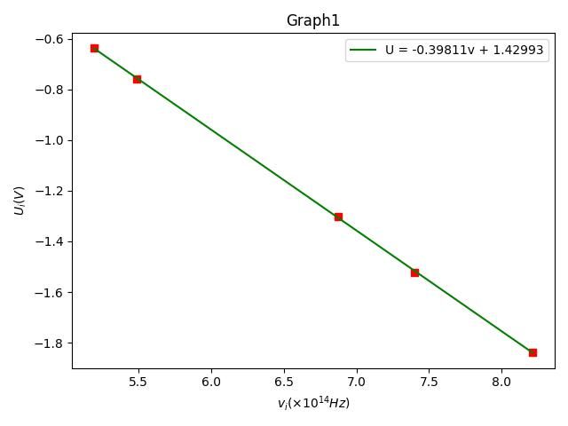
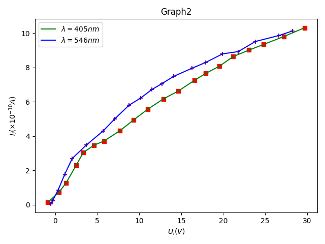
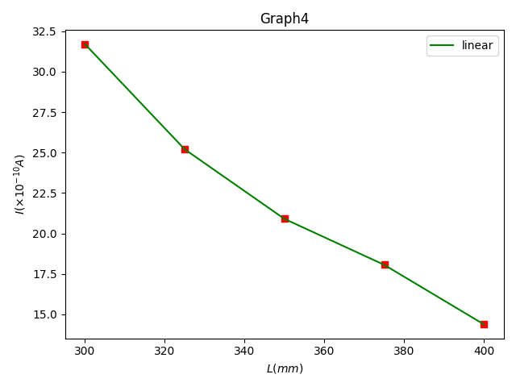

# 数据处理与分析

---

## 表1：$U_a\sim v$关系

|序号|1|2|3|4|5|
| :-: | :-: | :-: | :-: | :-: | :-: |
|波长$\lambda_i(nm)$|365|405|436|546|577|
|频率$v_i(\times10^{14}Hz)$|8.214|7.408|6.879|5.490|5.196|
|截止电压$U_{ai}(V)$|-1.839|-1.523|-1.301|-0.758|-0.638|

由作图，得$|k| = 0.3981120180682774$
$\therefore h = 6.378\times10^{-34}J\cdot s$
$E = \dfrac{h-h_0}{h_0}\times100\%=3.737\%$

---

## 表2：$I\sim U_{AK}$关系

### $\lambda = 405 nm$

|No.|1|2|3|4|5|6|7|8|9|10|
| :-: | :-: | :-: | :-: | :-: | :-: | :-: | :-: | :-: | :-: | :-: |
|$U_{AK}(V)$|-0.88| 0.44| 1.31| 2.50| 3.36| 4.61| 5.80| 7.72| 9.32| 11.02|
|$I(\times10^{-10}A)$|0.14| 0.72| 1.28| 2.31| 3.05| 3.47| 3.71| 4.32| 4.94| 5.57|
|$U_{AK}(V)$| 12.87| 14.66| 16.60| 17.92| 19.55| 21.19| 23.08| 24.82| 27.22| 29.69|
|$I(\times10^{-10}A)$| 6.17| 6.63| 7.26| 7.66| 8.08| 8.64| 9.02| 9.35| 9.81| 10.32|

### $\lambda = 546 nm$

|No.|1|2|3|4|5|6|7|8|9|10|
| :-: | :-: | :-: | :-: | :-: | :-: | :-: | :-: | :-: | :-: | :-: |
|$U_{AK}(V)$|-0.55| -0.31| 0.35| 1.14| 2.03| 3.71| 5.70| 7.08| 8.78| 10.17|
|$I(\times10^{-10}A)$|0.05| 0.23| 0.86| 1.78| 2.70| 3.48| 4.30| 5.00| 5.80| 6.22
|$U_{AK}(V)$| 11.48| 12.70| 14.12| 16.29| 17.92| 19.94| 21.79| 23.83| 26.65| 28.23|
|$I(\times10^{-10}A)$| 6.71| 7.06| 7.49| 7.96| 8.30| 8.80| 8.93| 9.52| 9.87| 10.13|

---

## 表3：$I_M\sim P$关系

$U_{AK} = 25.14V, \lambda = 436nm, L = 400mm$

|No.|1|2|3|
| :-: | :-: | :-: | :-: |
|$\phi(mm)$|2|4|8|
|$I(\times10^{-10}A)$|14.58|53.60|187.2|

推测：$I\propto\phi$

---

## 表4：$I_M\sim P$关系

$U_{AK} = 25.15V, \lambda = 436nm, \phi = 2mm$

|No.|1|2|3|4|5|
| :-: | :-: | :-: | :-: | :-: | :-: |
|$L(mm)$|300|325|350|375|400|
|$I(\times10^{-10}A)$|31.7|25.2|20.9|18.06|14.38|

推测：$I\propto L$